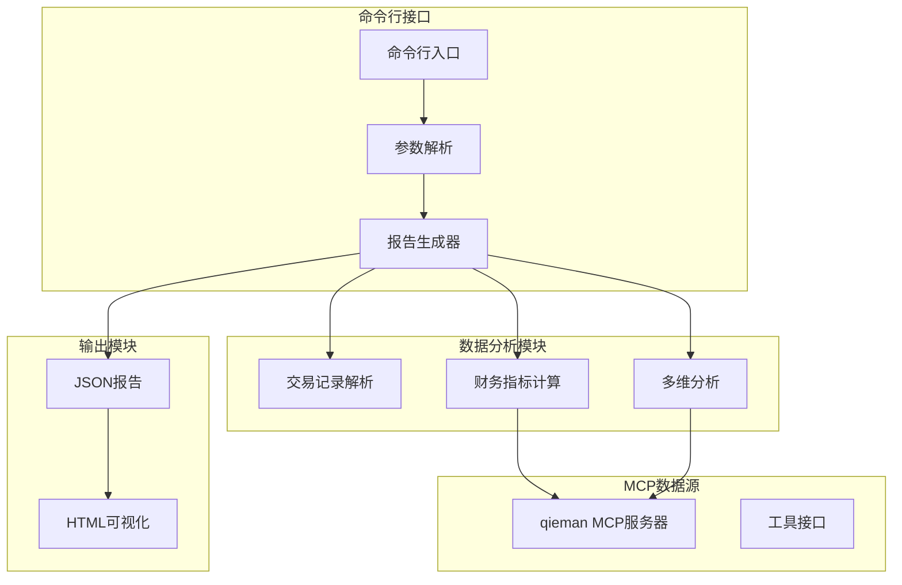
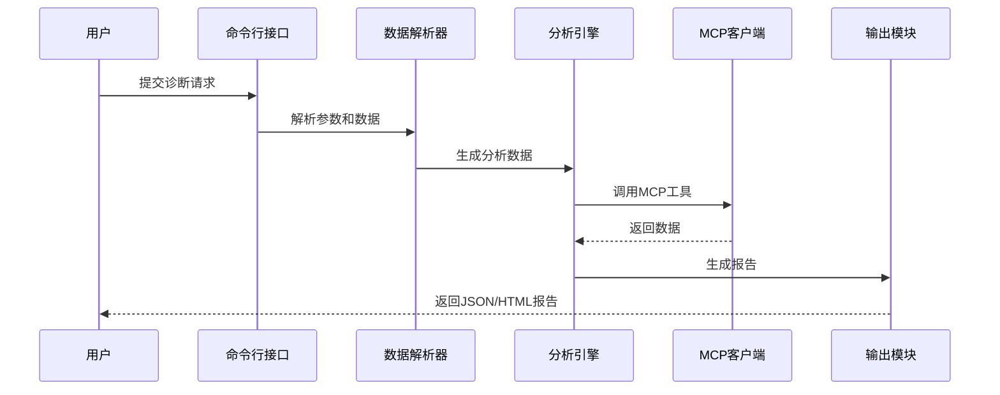
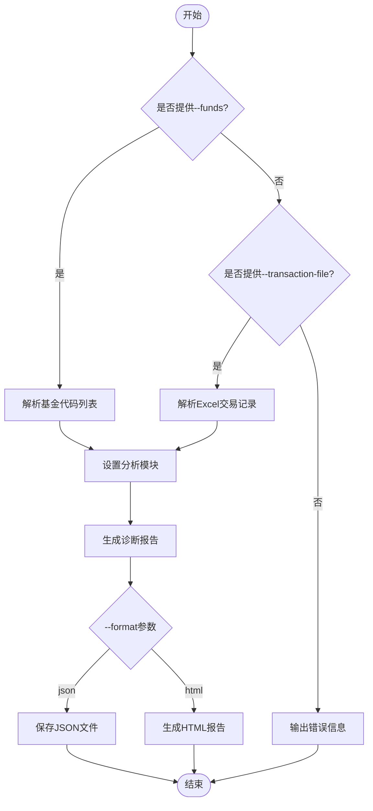
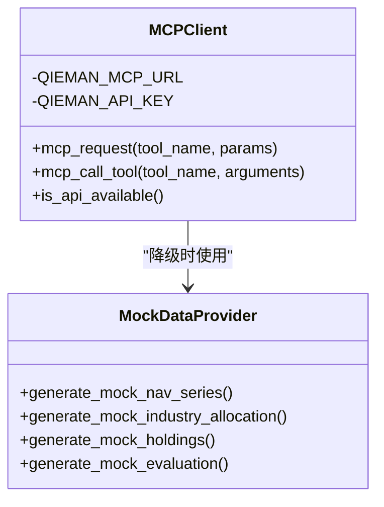
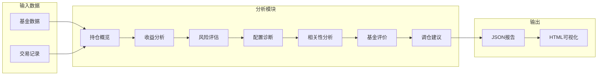
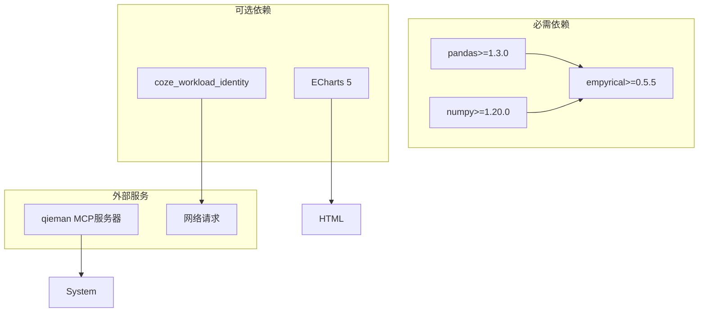

# API参考文档

<cite>
**本文档引用的文件**
- [SKILL.md](file://fund-account-diagnostic/SKILL.md)
- [output_format.md](file://fund-account-diagnostic/references/output_format.md)
- [diagnostic_report.py](file://fund-account-diagnostic/scripts/diagnostic_report.py)
- [generate_html_report.py](file://fund-account-diagnostic/scripts/generate_html_report.py)
</cite>

## 目录
1. [简介](#简介)
2. [项目结构](#项目结构)
3. [核心组件](#核心组件)
4. [架构概览](#架构概览)
5. [详细组件分析](#详细组件分析)
6. [依赖分析](#依赖分析)
7. [性能考虑](#性能考虑)
8. [故障排除指南](#故障排除指南)
9. [结论](#结论)
10. [附录](#附录)

## 简介
本项目提供基金账户诊断技能的完整API参考文档，涵盖命令行接口参数、MCP工具接口规范、JSON报告格式以及HTML可视化报告生成。系统支持两种数据输入方式：直接提供基金代码列表或上传交易记录Excel文件，自动解析持仓并生成包含诊断总览、收益风险、配置诊断、相关性分析、调仓建议、风险提示等模块的综合报告。

## 项目结构
项目采用脚本驱动的模块化设计，主要包含三个核心文件：
- 命令行入口：解析参数并协调各分析模块
- MCP客户端：封装qieman MCP服务器的数据获取接口
- HTML报告生成器：将JSON报告转换为交互式可视化HTML



**图表来源**
- [generators.py](file://fund-account-diagnostic/scripts/generators.py)
- [generate_html_report.py:1436-1453](file://fund-account-diagnostic/scripts/generate_html_report.py#L1436-L1453)

**章节来源**
- [SKILL.md:1-347](file://fund-account-diagnostic/SKILL.md#L1-L347)
- [constants.py](file://fund-account-diagnostic/scripts/constants.py)

## 核心组件

### 命令行接口参数详解

#### 基础参数
| 参数 | 类型 | 必需 | 默认值 | 描述 | 示例 |
|------|------|------|--------|------|------|
| --funds | 字符串 | 否 | 无 | 基金代码列表，逗号分隔 | `--funds 000001,000002,000003` |
| --transaction-file | 字符串 | 否 | 无 | 交易记录Excel文件路径 | `--transaction-file ./transactions.xlsx` |

#### 输出控制参数
| 参数 | 类型 | 默认值 | 描述 | 选项 |
|------|------|--------|------|------|
| --output | 字符串 | 无 | 输出文件路径 | 任意有效文件路径 |
| --format | 字符串 | json | 输出格式 | json, html |
| --modules | 字符串 | all | 分析模块列表 | diagnosis,overview,performance,risk,allocation,correlation,evaluation,rebalance |

#### 辅助参数
| 参数 | 类型 | 描述 | 行为 |
|------|------|------|------|
| --show-stats | 标志 | 显示交易统计摘要 | 仅在交易记录模式下有效 |

**章节来源**
- [generators.py](file://fund-account-diagnostic/scripts/generators.py)
- [SKILL.md:30-116](file://fund-account-diagnostic/SKILL.md#L30-L116)

### MCP工具接口规范

#### 可用工具列表
系统支持以下MCP工具接口：

| 工具名称 | 用途 | 参数 | 返回值 |
|----------|------|------|--------|
| fund_info | 基金基础信息 | fund_code | 基金代码、名称、类型、净值、经理等 |
| fund_nav | 基金净值数据 | fund_code, start_date, end_date | 净值序列、日期数组 |
| fund_industry_allocation | 行业配置 | fund_code | 行业权重分配 |
| fund_holdings | 重仓股数据 | fund_code | 股票持仓明细 |
| fund_evaluate | 基金评价 | fund_code, type | 综合评分、风险评分、建议 |
| index_nav | 指数净值数据 | index_code, days | 指数净值序列 |
| fund_manager_rating | 基金经理评分 | fund_code | 综合评分、历史表现 |
| fund_subscores | 评分子维度 | fund_code | 创新高、择股、择时、规模得分 |
| fund_announcement | 基金公告/舆情 | fund_code | 负面事件、摘要信息 |

#### 请求格式
```json
{
  "jsonrpc": "2.0",
  "id": 1,
  "method": "tools/call",
  "params": {
    "name": "<tool_name>",
    "arguments": {}
  }
}
```

**章节来源**
- [SKILL.md:226-258](file://fund-account-diagnostic/SKILL.md#L226-L258)
- [calculations.py](file://fund-account-diagnostic/scripts/calculations.py)

### JSON API端点规范

#### 报告生成端点
- **端点**: `/api/report`
- **方法**: POST
- **请求头**: `Content-Type: application/json`
- **认证**: `x-api-key: <API密钥>`

#### 请求体格式
```json
{
  "funds": ["000001", "000002"],
  "modules": ["overview", "performance"],
  "output": "diagnostic_report.json"
}
```

#### 响应格式
标准JSON报告包含以下模块：
- report_header: 报告元数据
- overview: 持仓概览
- performance: 收益风险表现
- diagnosis: 账户诊断总览
- allocation: 组合配置诊断
- correlation: 相关性分析
- evaluation: 单只基金评价
- rebalance: 调仓建议
- risk: 风险提示
- summary: 报告总结

**章节来源**
- [output_format.md:9-25](file://fund-account-diagnostic/references/output_format.md#L9-L25)
- [generators.py](file://fund-account-diagnostic/scripts/generators.py)

## 架构概览

系统采用分层架构设计，从底层数据获取到上层报告生成形成清晰的职责分离：



**图表来源**
- [generators.py](file://fund-account-diagnostic/scripts/generators.py)
- [generators.py](file://fund-account-diagnostic/scripts/generators.py)

## 详细组件分析

### 命令行接口组件

#### 参数解析流程


**图表来源**
- [generators.py](file://fund-account-diagnostic/scripts/generators.py)

#### 参数验证规则
- 基金代码必须为6位数字格式
- Excel文件必须包含有效的交易记录
- 模块参数必须为预定义的有效值
- 输出路径必须具有写权限

**章节来源**
- [generators.py](file://fund-account-diagnostic/scripts/generators.py)

### MCP客户端组件

#### 数据获取策略
系统采用智能降级策略，当MCP API不可用时自动切换到模拟数据：



**图表来源**
- [calculations.py](file://fund-account-diagnostic/scripts/calculations.py)
- [calculations.py](file://fund-account-diagnostic/scripts/calculations.py)

#### 错误处理机制
- HTTP请求超时处理（30秒超时）
- API响应格式验证
- 降级数据生成和缓存
- 异常信息记录和传播

**章节来源**
- [calculations.py](file://fund-account-diagnostic/scripts/calculations.py)

### 报告生成组件

#### 模块化生成流程


**图表来源**
- [generators.py](file://fund-account-diagnostic/scripts/generators.py)

#### 指标计算算法
系统实现了多种金融指标的计算算法，包括：
- 组合净值计算：基于加权平均的净值序列
- 收益率计算：日收益率、多期收益率
- 风险指标：波动率、最大回撤、夏普比率
- 相关性分析：皮尔逊相关系数、平均两两相关性

**章节来源**
- [calculations.py](file://fund-account-diagnostic/scripts/calculations.py)
- [generators.py](file://fund-account-diagnostic/scripts/generators.py)

### HTML报告生成组件

#### 可视化图表类型
HTML报告集成了13种交互式图表：
- 组合净值曲线图
- 基金收益排名柱状图
- 资产配置饼图
- 行业配置热力图
- 重仓股矩形树图
- 基金评分雷达图
- 相关系数热力图
- 风险情景分析图
- 经理评分仪表盘
- 调仓建议对比图
- 报告总结卡片
- 交易统计仪表板
- 集中度分析图表

**章节来源**
- [generate_html_report.py:1436-1453](file://fund-account-diagnostic/scripts/generate_html_report.py#L1436-L1453)

## 依赖分析

### 外部依赖
系统依赖以下外部库和资源：



**图表来源**
- [SKILL.md:21-26](file://fund-account-diagnostic/SKILL.md#L21-L26)
- [constants.py](file://fund-account-diagnostic/scripts/constants.py)

### 内部模块依赖
- 命令行接口依赖所有分析模块
- 分析模块依赖MCP客户端
- 报告生成器依赖数据格式化模块
- HTML生成器依赖JSON报告数据

**章节来源**
- [constants.py](file://fund-account-diagnostic/scripts/constants.py)

## 性能考虑

### 计算复杂度
- **净值计算**: O(n*m)，其中n为交易日数，m为基金数量
- **相关性分析**: O(m²*n)，适用于m≤15的组合
- **风险指标**: O(n)，线性复杂度
- **多期收益**: O(k*n)，k为回溯期数量

### 优化策略
- 使用向量化计算（pandas/numpy）
- 缓存MCP API响应数据
- 智能降级机制
- 内存友好的数据流处理

## 故障排除指南

### 常见问题及解决方案

#### MCP API连接问题
- **症状**: 报告显示模拟数据
- **原因**: API密钥缺失或网络连接失败
- **解决**: 设置环境变量 `COZE_QIEMAN_API_{SKILL_ID}`

#### Excel文件解析错误
- **症状**: 文件读取失败或解析异常
- **原因**: 列名不匹配或数据格式错误
- **解决**: 检查Excel列名映射和数据格式

#### 性能问题
- **症状**: 处理大型组合耗时过长
- **原因**: 缺少pandas/numpy库
- **解决**: 安装推荐的依赖库

**章节来源**
- [SKILL.md:340-347](file://fund-account-diagnostic/SKILL.md#L340-L347)
- [calculations.py](file://fund-account-diagnostic/scripts/calculations.py)

## 结论
本API参考文档提供了基金账户诊断技能项目的完整技术规范，涵盖了命令行接口、MCP工具接口、JSON报告格式和HTML可视化生成的详细说明。系统设计遵循模块化原则，具备良好的扩展性和容错能力，能够满足不同用户场景下的基金账户分析需求。

## 附录

### 使用示例

#### 基础使用
```bash
# 从基金代码生成报告
python scripts/diagnostic_report.py --funds 000001,000002,000003

# 从交易记录生成报告
python scripts/diagnostic_report.py --transaction-file ./transactions.xlsx

# 指定模块和输出
python scripts/diagnostic_report.py --funds 000001,000002 --modules overview,performance --output report.json
```

#### 高级功能
```bash
# 显示交易统计
python scripts/diagnostic_report.py --transaction-file ./transactions.xlsx --show-stats

# 生成HTML报告
python scripts/diagnostic_report.py --funds 000001,000002 --format html --output report.html

# 从JSON生成HTML
python scripts/generate_html_report.py --input report.json --output report.html
```

### 版本兼容性
- **1.5.0**: 新增基金经理评分、评分子维度、公告舆情等17项指标
- **1.4.0**: HTML可视化报告功能
- **1.3.0**: 报告结构优化和指标改进
- **1.2.0**: 新增多期收益和相关性分析

**章节来源**
- [SKILL.md:273-347](file://fund-account-diagnostic/SKILL.md#L273-L347)