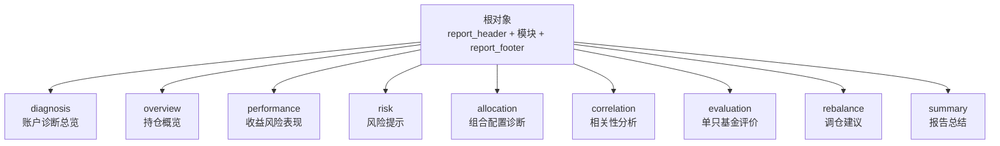
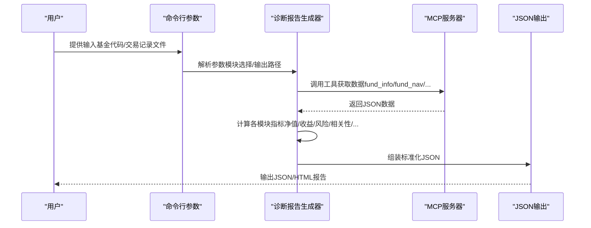
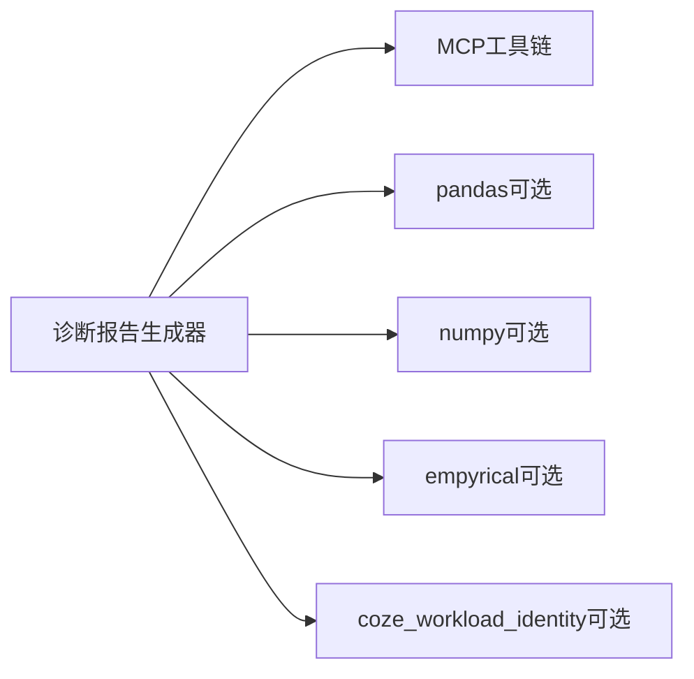

# JSON API规范

<cite>
**本文引用的文件**
- [output_format.md](file://fund-account-diagnostic/references/output_format.md)
- [diagnostic_report.py](file://fund-account-diagnostic/scripts/diagnostic_report.py)
- [generate_html_report.py](file://fund-account-diagnostic/scripts/generate_html_report.py)
- [SKILL.md](file://fund-account-diagnostic/SKILL.md)
</cite>

## 目录
1. [简介](#简介)
2. [项目结构](#项目结构)
3. [核心组件](#核心组件)
4. [架构总览](#架构总览)
5. [详细组件分析](#详细组件分析)
6. [依赖分析](#依赖分析)
7. [性能考虑](#性能考虑)
8. [故障排查指南](#故障排查指南)
9. [结论](#结论)
10. [附录](#附录)

## 简介
本规范基于仓库中的输出格式定义文件，系统化地阐述标准化诊断报告的JSON结构规范。报告采用统一的根对象结构，包含报告头、各分析模块与报告尾，覆盖账户诊断、持仓概览、收益风险表现、配置诊断、相关性分析、单只基金评价、调仓建议、风险提示与报告总结等模块。本文逐项解释各模块字段定义、数据类型、取值范围与业务含义，并给出字段间关联关系、计算逻辑、版本演进与兼容性说明、数据验证与错误处理指南，同时提供完整的JSON Schema定义与示例数据路径。

## 项目结构
- 根目录包含参考文档与脚本实现：
  - references/output_format.md：标准化JSON输出格式定义与字段说明
  - scripts/diagnostic_report.py：诊断报告生成器（核心逻辑）
  - scripts/generate_html_report.py：JSON到HTML可视化报告生成器
  - SKILL.md：技能说明与使用指南

**图表来源**
- [output_format.md:11-25](file://fund-account-diagnostic/references/output_format.md#L11-L25)

**章节来源**
- [output_format.md:1-25](file://fund-account-diagnostic/references/output_format.md#L1-L25)
- [SKILL.md:1-30](file://fund-account-diagnostic/SKILL.md#L1-L30)

## 核心组件
- 根对象字段
  - report_header：报告头部信息（生成时间、数据来源、API可用性、MCP地址、工具版本、分析基准期）
  - 各分析模块：diagnosis、overview、performance、risk、allocation、correlation、evaluation、rebalance、summary
  - report_footer：免责声明与本次输出的模块列表

- 数据来源与降级机制
  - 默认通过qieman MCP API获取数据；若未配置凭证或API不可用，则降级为模拟数据模式，并在报告头部标注API可用性与数据来源说明

- 输出控制
  - 支持通过命令行参数选择输出模块集合（默认输出全部模块），并可指定输出文件路径

**章节来源**
- [output_format.md:9-25](file://fund-account-diagnostic/references/output_format.md#L9-L25)
- [SKILL.md:76-98](file://fund-account-diagnostic/SKILL.md#L76-L98)

## 架构总览
诊断报告生成流程分为数据获取、模块计算与报告组装三个阶段，最终输出标准化JSON结构。

**图表来源**
- [calculations.py](file://fund-account-diagnostic/scripts/calculations.py)
- [SKILL.md:258-290](file://fund-account-diagnostic/SKILL.md#L258-L290)

## 详细组件分析

### 报告头部（report_header）
- 字段定义
  - generate_time：字符串，格式YYYY-MM-DD HH:MM:SS
  - data_source：字符串，固定为"qieman MCP API"
  - api_available：布尔值，API是否可用
  - mcp_url：字符串，MCP服务器地址
  - tool_version：字符串，工具版本号
  - analysis_period：字符串，分析基准期

- 业务含义
  - 标识报告生成时间、数据来源、API可用性、工具版本与分析基准期

- 示例
  - [示例路径:42-52](file://fund-account-diagnostic/references/output_format.md#L42-L52)

**章节来源**
- [output_format.md:29-52](file://fund-account-diagnostic/references/output_format.md#L29-L52)

### 模块一：账户诊断总览（diagnosis）
- 综合评分
  - comprehensive_score：整数，0-100
  - grade：字符串，等级（A+/A/B+/B/C）

- 基金得分明细
  - code/name：字符串
  - return_score/risk_score/comprehensive_score：整数，0-100
  - grade：字符串

- 配置偏离度
  - 键为资产类型（如equity/fixed_income/cash），值包含current/target/deviation（小数0-1）

- 诊断建议
  - 字符串，根据偏离度动态生成

- 新增字段
  - manager_rating：近1/2/3年加权经理评分
  - manager_ratings_detail：各基金经理评分明细
  - correlation_level：组合相关性水平（低/中/高）
  - stock_concentration：穿透后个股集中度（最高股票、权重、Top5、等级）
  - fund_subscores_detail：各基金评分子维度（创新高/择股/择时/规模）

- 示例
  - [示例路径:450-472](file://fund-account-diagnostic/references/output_format.md#L450-L472)

**章节来源**
- [output_format.md:359-472](file://fund-account-diagnostic/references/output_format.md#L359-L472)

### 模块二：持仓概览（overview）
- 基本信息（basic_info）
  - fund_count：整数，基金数量
  - total_market_value：浮点，总市值（元）
  - total_cost：浮点，总成本（元）
  - profit/profit_rate：浮点，盈亏金额与比例

- 持仓明细（holdings_detail）
  - index/code/name：序号、基金代码、名称
  - fund_type/manager：类型、基金经理
  - weight/market_value/cost/profit/profit_rate：权重、市值、成本、盈亏、盈亏比例
  - comprehensive_score：整数或"N/A"
  - suggestion：建议

- 集中度预警（concentration_alerts）
  - code/name/weight/message：当任意基金权重超过20%时生成

- 已清仓基金（liquidated_funds）
  - code/name/last_transaction_date/reason：清仓原因（赎回/转出）

- 示例
  - [示例路径:111-139](file://fund-account-diagnostic/references/output_format.md#L111-L139)

**章节来源**
- [output_format.md:56-139](file://fund-account-diagnostic/references/output_format.md#L56-L139)

### 模块三：收益风险表现（performance）
- 新增字段
  - data_source_note：字符串，数据来源说明（全部/部分/全部来自模拟/Excel导入）

- 组合与基准对比（comparison_table）
  - portfolio：组合收益指标（total_return/cagr）
  - benchmark：基准收益指标（total_return）
  - excess_return：超额收益

- 绩效指标汇总（performance_metrics）
  - 累计收益率、年化CAGR、年化波动率、最大回撤、95%VaR/95%CVaR、夏普比率
  - 新增：Sortino比率、卡玛比率、下行风险、尾部比率、Alpha、Beta（empyrical可选）

- 最大回撤详情（max_drawdown_detail）
  - max_drawdown/peak_value/trough_value/start_index/end_index/start_date/end_date

- 归因分析摘要（attribution_summary）
  - outperform_reason/underperform_reason

- 单基金收益排名（fund_return_ranking）
  - code/name/return/data_source + 多期收益（1m/3m/6m/1y/2y/3y/since_inception）

- 组合与基准净值曲线（portfolio_nav_curve/benchmark_nav_curve）
  - dates/nav_series/normalized

- 基准对比指标（benchmark_metrics）
  - name/cumulative_return/cagr/max_drawdown

- 超额收益对比（excess_vs_benchmark）
  - return_diff/cagr_diff/mdd_diff

- 多期收益（multi_period_returns）
  - 1m/3m/6m/1y/2y/3y/since_inception；数据不足时字段为null并附带data_insufficient_periods

- 示例
  - [示例路径:309-355](file://fund-account-diagnostic/references/output_format.md#L309-L355)

**章节来源**
- [output_format.md:143-355](file://fund-account-diagnostic/references/output_format.md#L143-L355)

### 模块四：组合配置诊断（allocation）
- 大类资产分布（asset_allocation）
  - type/weight

- 国家/地区分布（country_allocation）
  - region/weight

- 行业穿透（industry_allocation，Top15）
  - industry/weight/change

- 重仓股穿透（top_holdings，Top15）
  - stock/weight/style

- 基金经理穿透（fund_managers）
  - name/weight/funds

- 行业集中度风险（concentration_risk）
  - hhi/level/warning

- 重仓股风格分布（holding_style_tags）
  - 风格类型到权重的映射

- 示例
  - [示例路径:540-572](file://fund-account-diagnostic/references/output_format.md#L540-L572)

**章节来源**
- [output_format.md:476-572](file://fund-account-diagnostic/references/output_format.md#L476-L572)

### 模块五：相关性分析（correlation）
- 相关系数矩阵（correlation_matrix）
  - funds/matrix

- 平均两两相关系数（average_pairwise_correlation）
  - float

- 高相关基金组（groups）
  - funds/fund_names/average_correlation/high_correlation_pairs

- 高相关基金对（high_correlation_pairs）
  - fund1/fund1_name/fund2/fund2_name/correlation

- 调仓建议（rebalancing_suggestion）
  - 字符串

- 示例
  - [示例路径:623-650](file://fund-account-diagnostic/references/output_format.md#L623-L650)

**章节来源**
- [output_format.md:577-650](file://fund-account-diagnostic/references/output_format.md#L577-L650)

### 模块六：单只基金评价（evaluation）
- 主动型基金评价（fund_evaluations）
  - code/name/fund_type/manager/evaluation_path/comprehensive_score/grade/suggestion
  - max_drawdown/max_drawdown_period/volatility/sharpe_ratio
  - multi_period_returns/top_5_holdings/subscores/manager_rating/announcement/recommendation/recommendation_reason/fund_nav_vs_benchmark

- 指数型基金估值（index_fund_valuations）
  - code/name/fund_type/manager/evaluation_path/excess_return/pe_percentile/valuation/suggestion
  - max_drawdown/max_drawdown_period/volatility/sharpe_ratio/multi_period_returns/top_5_holdings/track_index/fund_nav_vs_benchmark

- 示例
  - [示例路径:707-750](file://fund-account-diagnostic/references/output_format.md#L707-L750)

**章节来源**
- [output_format.md:654-750](file://fund-account-diagnostic/references/output_format.md#L654-L750)

### 模块七：调仓建议（rebalance）
- 配置对比（allocation_comparison）
  - asset/current/target/deviation/status

- 减仓建议（reduce_suggestions）
  - asset/overweight/suggested_action/funds_to_reduce

- 加仓建议（increase_suggestions）
  - asset/underweight/target_weight/suggested_action/funds_to_increase

- 预期改善（expected_improvement）
  - 字符串

- 新增字段
  - fund_replacement_suggestions：替换建议列表
  - recommended_funds：推荐核心持仓列表
  - batch_schedule：替换批次安排列表
  - post_rebalance：调仓后预期改善

- 示例
  - [示例路径:840-865](file://fund-account-diagnostic/references/output_format.md#L840-L865)

**章节来源**
- [output_format.md:754-865](file://fund-account-diagnostic/references/output_format.md#L754-L865)

### 模块八：风险提示（risk）
- 情景分析（scenario_analysis）
  - scenario/expected_return/expected_drawdown/probability

- 市场风险/流动性风险
  - 字符串列表

- 最大回撤时间区间（max_drawdown_period）
  - start_date/end_date（仅当performance模块提供max_drawdown_detail时包含）

- 示例
  - [示例路径:899-918](file://fund-account-diagnostic/references/output_format.md#L899-L918)

**章节来源**
- [output_format.md:869-918](file://fund-account-diagnostic/references/output_format.md#L869-L918)

### 模块九：报告总结（summary）
- 核心发现（core_findings）
  - 字符串列表（最多5条）

- 关键风险（key_risks）
  - 字符串列表（最多5条）

- 优化建议（optimization_suggestions）
  - 字符串列表（最多5条）

- 总体评价（overall_assessment）
  - 字符串

- 示例
  - [示例路径:940-958](file://fund-account-diagnostic/references/output_format.md#L940-L958)

**章节来源**
- [output_format.md:922-958](file://fund-account-diagnostic/references/output_format.md#L922-L958)

### 报告尾部（report_footer）
- 字段定义
  - disclaimer：字符串，免责声明
  - modules：数组，本次输出的分析模块列表

- 示例
  - [示例路径:971-977](file://fund-account-diagnostic/references/output_format.md#L971-L977)

**章节来源**
- [output_format.md:962-977](file://fund-account-diagnostic/references/output_format.md#L962-L977)

## 依赖分析
- 外部依赖
  - pandas/numpy：向量化统计与计算（可选）
  - empyrical：金融指标计算（可选）
  - coze_workload_identity：HTTP请求封装（可选）

- MCP工具链
  - fund_info、fund_nav、fund_industry_allocation、fund_holdings、fund_evaluate、index_nav、fund_manager_rating、fund_subscores、fund_announcement

- 数据降级与API可用性
  - 通过report_header.api_available与data_source_note标识数据来源与可用性

**图表来源**
- [constants.py](file://fund-account-diagnostic/scripts/constants.py)
- [SKILL.md:258-290](file://fund-account-diagnostic/SKILL.md#L258-L290)

**章节来源**
- [constants.py](file://fund-account-diagnostic/scripts/constants.py)
- [SKILL.md:258-290](file://fund-account-diagnostic/SKILL.md#L258-L290)

## 性能考虑
- 向量化计算
  - 优先使用pandas/numpy进行统计与相关性计算，回退到纯Python实现
- 指标计算
  - 夏普比率、VaR/ES、最大回撤等指标在empyrical可用时优先使用，否则回退到numpy或纯Python
- 内存与IO
  - 净值序列与相关性矩阵可能占用较多内存，建议在大规模数据时启用分批处理与缓存策略

[本节为通用指导，不直接分析具体文件]

## 故障排查指南
- 错误响应格式
  - 当发生错误时，返回包含error与可选traceback的JSON对象

- 常见错误场景与处理
  - API超时：自动重试一次，失败则降级为模拟数据
  - API认证失败：输出警告并降级
  - Excel解析失败：输出详细错误（行号、列名），终止执行
  - 列名不匹配：尝试模糊匹配，失败则输出可用列名列表
  - 基金代码无效：跳过该基金并在报告中标注

- 数据可用性检测
  - 通过report_header.api_available判断数据来源（真实API或模拟数据）

**章节来源**
- [output_format.md:981-990](file://fund-account-diagnostic/references/output_format.md#L981-L990)
- [SKILL.md:90-99](file://fund-account-diagnostic/SKILL.md#L90-L99)

## 结论
本规范系统化定义了诊断报告的JSON输出格式，覆盖从报告头到各分析模块的完整结构。通过对字段类型、取值范围、业务含义与计算逻辑的说明，以及版本演进与兼容性、数据验证与错误处理的指引，为前端渲染与后端解析提供了清晰的契约。建议在生产环境中严格遵循字段可选性与类型规范，确保跨模块数据一致性与可扩展性。

[本节为总结性内容，不直接分析具体文件]

## 附录

### JSON Schema定义（概述）
- 根对象
  - 必填：report_header、diagnosis、overview、performance、risk、allocation、correlation、evaluation、rebalance、summary、report_footer
- report_header
  - 必填：generate_time、data_source、api_available、mcp_url、tool_version、analysis_period
- diagnosis
  - 必填：comprehensive_score、grade、fund_score_details、allocation_deviation
  - 可选：manager_rating、manager_ratings_detail、correlation_level、stock_concentration、fund_subscores_detail
- overview
  - 必填：basic_info、holdings_detail
  - 可选：concentration_alerts、liquidated_funds
- performance
  - 必填：multi_period_returns、comparison_table、performance_metrics、max_drawdown_detail、attribution_summary、fund_return_ranking
  - 可选：portfolio_nav_curve、benchmark_nav_curve、benchmark_metrics、excess_vs_benchmark、data_source_note
- allocation
  - 必填：asset_allocation、country_allocation、industry_allocation、top_holdings、fund_managers、concentration_risk、holding_style_tags
- correlation
  - 必填：correlation_matrix、high_correlation_pairs、rebalancing_suggestion
  - 可选：average_pairwise_correlation、groups
- evaluation
  - 必填：fund_evaluations、index_fund_valuations
- rebalance
  - 必填：allocation_comparison、reduce_suggestions、increase_suggestions、expected_improvement
  - 可选：fund_replacement_suggestions、recommended_funds、batch_schedule、post_rebalance
- risk
  - 必填：scenario_analysis、market_risks、liquidity_risks
  - 可选：max_drawdown_period
- summary
  - 必填：core_findings、key_risks、optimization_suggestions、overall_assessment
- report_footer
  - 必填：disclaimer、modules

**章节来源**
- [output_format.md:9-25](file://fund-account-diagnostic/references/output_format.md#L9-L25)
- [output_format.md:29-1104](file://fund-account-diagnostic/references/output_format.md#L29-L1104)

### 字段类型与取值范围
- 权重（weight）：小数，0-1
- 收益率（return）：小数，-1至10
- 得分（score）：整数或小数，0-100
- 相关系数（correlation）：小数，-1至1
- HHI指数：小数，0-1
- 金额（market_value/cost）：非负数
- 日期（date）：字符串，ISO 8601格式YYYY-MM-DD
- 基金代码：字符串，6位，保留前导零
- 百分比值：数字，已乘以100用于展示

**章节来源**
- [output_format.md:1060-1074](file://fund-account-diagnostic/references/output_format.md#L1060-L1074)

### 字段可选性与兼容性
- 可选字段处理规则
  - 标记为“可选”的字段，数据不可用时保留但值为null，不应省略
  - 标记为“新增”的字段为向后兼容而新增，客户端应做存在性检查
  - 条件字段仅在满足特定条件时出现（如多期收益中部分期间数据不足时）
- 版本演进
  - v1.2.0：新增多期收益、平均两两相关系数、最大回撤时间区间等
  - v1.3.0：模块顺序与字段顺序优化、新增风险等级、更多统计指标
  - v1.4.0：HTML可视化报告脚本与参数扩展
  - v1.5.0：补充17项缺失指标，新增基准对比、经理评分、公告舆情、报告总结等

**章节来源**
- [output_format.md:1077-1090](file://fund-account-diagnostic/references/output_format.md#L1077-L1090)
- [SKILL.md:325-377](file://fund-account-diagnostic/SKILL.md#L325-L377)

### 数据验证规则
- 权重：0 ≤ value ≤ 1
- 收益率：-1 ≤ value ≤ 10
- 得分：0 ≤ value ≤ 100
- 相关系数：-1 ≤ value ≤ 1
- HHI指数：0 ≤ value ≤ 1
- 金额：≥ 0
- 成本：≥ 0

**章节来源**
- [output_format.md:1093-1104](file://fund-account-diagnostic/references/output_format.md#L1093-L1104)

### 示例数据路径
- overview示例
  - [示例路径:111-139](file://fund-account-diagnostic/references/output_format.md#L111-L139)
- performance示例
  - [示例路径:309-355](file://fund-account-diagnostic/references/output_format.md#L309-L355)
- diagnosis示例
  - [示例路径:450-472](file://fund-account-diagnostic/references/output_format.md#L450-L472)
- allocation示例
  - [示例路径:540-572](file://fund-account-diagnostic/references/output_format.md#L540-L572)
- correlation示例
  - [示例路径:623-650](file://fund-account-diagnostic/references/output_format.md#L623-L650)
- evaluation示例
  - [示例路径:707-750](file://fund-account-diagnostic/references/output_format.md#L707-L750)
- rebalance示例
  - [示例路径:840-865](file://fund-account-diagnostic/references/output_format.md#L840-L865)
- risk示例
  - [示例路径:899-918](file://fund-account-diagnostic/references/output_format.md#L899-L918)
- summary示例
  - [示例路径:940-958](file://fund-account-diagnostic/references/output_format.md#L940-L958)