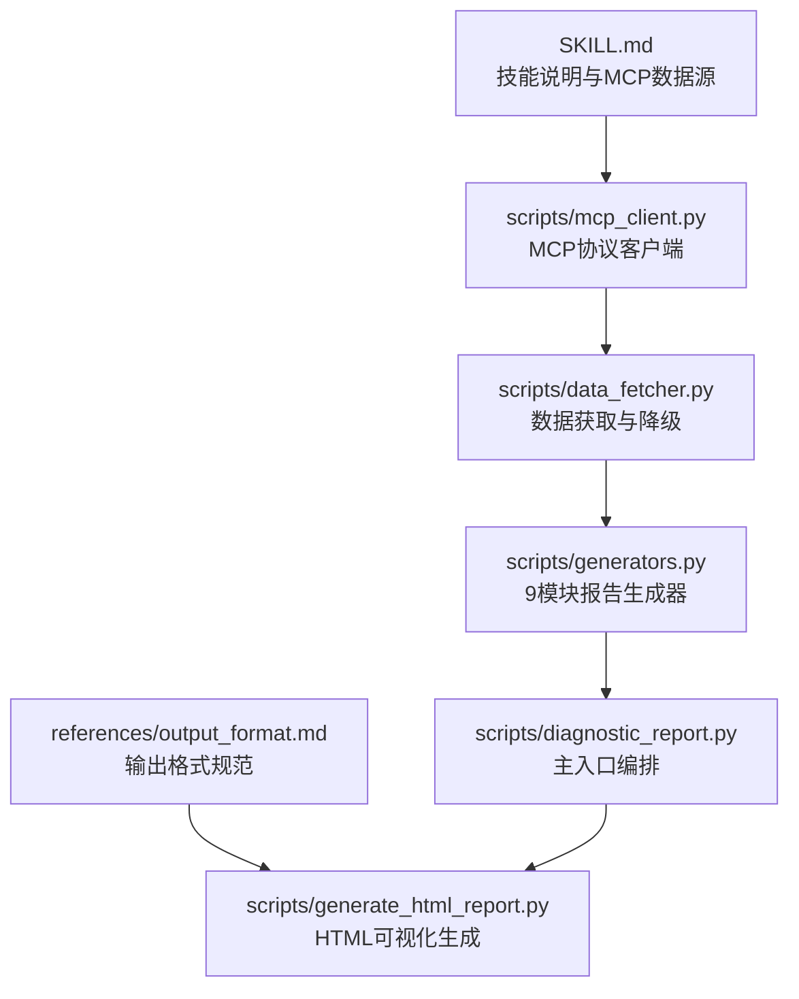
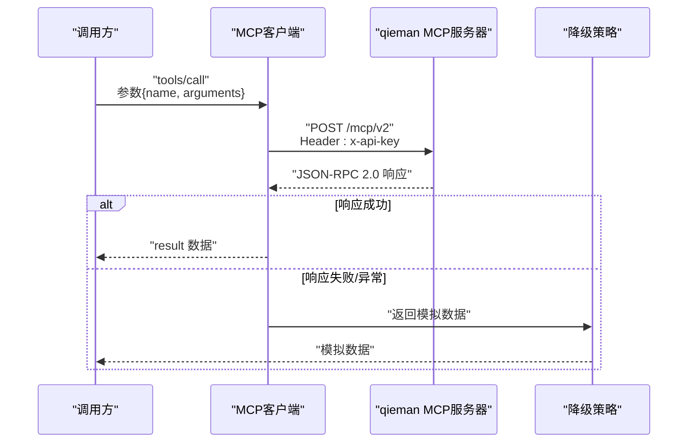
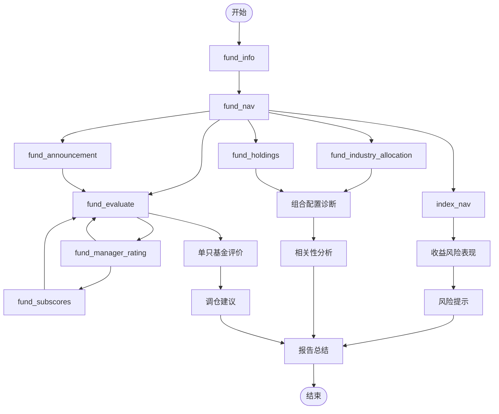

# MCP工具接口

<cite>
**本文引用的文件**
- [SKILL.md](file://fund-account-diagnostic/SKILL.md)
- [output_format.md](file://fund-account-diagnostic/references/output_format.md)
- [diagnostic_report.py](file://fund-account-diagnostic/scripts/diagnostic_report.py)
- [generate_html_report.py](file://fund-account-diagnostic/scripts/generate_html_report.py)
</cite>

## 目录
1. [简介](#简介)
2. [项目结构](#项目结构)
3. [核心组件](#核心组件)
4. [架构总览](#架构总览)
5. [详细组件分析](#详细组件分析)
6. [依赖关系分析](#依赖关系分析)
7. [性能考量](#性能考量)
8. [故障排查指南](#故障排查指南)
9. [结论](#结论)
10. [附录](#附录)

## 简介
本文件面向MCP（Model Context Protocol）工具接口的完整API文档，聚焦于“基金账户诊断”技能所使用的MCP工具集合。内容涵盖：
- JSON-RPC 2.0请求格式与响应结构
- 可用工具清单与参数/返回规范
- 认证机制与凭证配置
- 请求/响应示例与错误码说明
- 工具调用时序与依赖关系
- API版本兼容性与迁移指南
- 调试与监控方法

## 项目结构
本仓库包含技能说明文档、输出格式参考与核心脚本：
- SKILL.md：技能角色、前置准备、MCP数据源、使用示例与版本演进
- references/output_format.md：诊断报告的标准化JSON输出格式
- scripts/mcp_client.py：MCP协议客户端（JSON-RPC 2.0）
- scripts/data_fetcher.py：数据获取与模拟降级
- scripts/generators.py：9模块报告生成器
- scripts/calculations.py：纯计算函数
- scripts/diagnostic_report.py：主入口，编排模块调用
- scripts/generate_html_report.py：将JSON报告转为HTML可视化报告

**图表来源**
- [SKILL.md:258-296](file://fund-account-diagnostic/SKILL.md#L258-L296)
- [calculations.py](file://fund-account-diagnostic/scripts/calculations.py)
- [output_format.md:1-25](file://fund-account-diagnostic/references/output_format.md#L1-L25)
- [generate_html_report.py:1-20](file://fund-account-diagnostic/scripts/generate_html_report.py#L1-L20)

**章节来源**
- [SKILL.md:1-385](file://fund-account-diagnostic/SKILL.md#L1-L385)
- [output_format.md:1-1104](file://fund-account-diagnostic/references/output_format.md#L1-L1104)
- [constants.py](file://fund-account-diagnostic/scripts/constants.py)
- [generate_html_report.py:1-1895](file://fund-account-diagnostic/scripts/generate_html_report.py#L1-L1895)

## 核心组件
- MCP客户端与工具封装：封装JSON-RPC 2.0请求、工具调用、错误处理与降级策略
- 工具函数族：按工具名称封装调用，统一返回“数据字典 + 是否真实数据”的二元组
- 报告生成器：整合MCP数据与本地计算，生成标准化JSON报告
- HTML可视化：将JSON报告渲染为交互式HTML报告

**章节来源**
- [calculations.py](file://fund-account-diagnostic/scripts/calculations.py)
- [generators.py](file://fund-account-diagnostic/scripts/generators.py)
- [generators.py](file://fund-account-diagnostic/scripts/generators.py)
- [generate_html_report.py:1-120](file://fund-account-diagnostic/scripts/generate_html_report.py#L1-L120)

## 架构总览
MCP工具接口采用JSON-RPC 2.0协议，通过HTTP POST访问qieman MCP服务器。工具调用链路如下：

**图表来源**
- [calculations.py](file://fund-account-diagnostic/scripts/calculations.py)
- [generators.py](file://fund-account-diagnostic/scripts/generators.py)
- [SKILL.md:76-88](file://fund-account-diagnostic/SKILL.md#L76-L88)

## 详细组件分析

### JSON-RPC 2.0请求与响应
- 请求方法
  - 直接调用工具：method为工具名称（如fund_info）
  - 统一调用入口：method为tools/call，params包含name与arguments
- 请求头
  - Content-Type: application/json
  - x-api-key: 通过环境变量COZE_QIEMAN_API_{SKILL_ID}配置
- 响应结构
  - 成功：包含result字段
  - 失败：result中isError为true或无result字段
  - SSE兼容：若响应以data:开头，取其JSON内容

**章节来源**
- [SKILL.md:264-275](file://fund-account-diagnostic/SKILL.md#L264-L275)
- [calculations.py](file://fund-account-diagnostic/scripts/calculations.py)

### 可用MCP工具与参数/返回规范
以下工具均由统一封装函数调用，失败时返回模拟数据。返回值均为字典，包含工具所需字段；第二返回值标识是否来自真实API。

- fund_info（基金基础信息）
  - 参数：fund_code
  - 返回：code、name、type、nav、total_nav、manager等
  - 降级：模拟名称、类型、净值与基金经理
- fund_nav（基金净值数据）
  - 参数：fund_code、start_date、end_date
  - 返回：code、nav_series、dates
  - 降级：生成确定性模拟净值序列与日期
- fund_industry_allocation（行业配置）
  - 参数：fund_code
  - 返回：code、allocation（industry、weight、change）
  - 降级：随机生成行业权重与环比变化
- fund_holdings（重仓股数据）
  - 参数：fund_code
  - 返回：code、holdings（stock、weight、style）
  - 降级：随机生成重仓股与风格
- fund_evaluate（基金评价）
  - 参数：fund_code、type（active/index）
  - 返回：主动型包含score、return_score、risk_score、grade、suggestion；指数型包含excess_return、pe_percentile、valuation、suggestion
  - 降级：随机生成评分与建议
- index_nav（指数净值数据）
  - 参数：index_code、days
  - 返回：index_code、nav_series、dates
  - 降级：基于指数代码生成模拟序列
- fund_manager_rating（基金经理评分）
  - 参数：fund_code
  - 返回：overall_1y、overall_2y、overall_3y、rank_1y、rank_2y、ret_1y、mdd_1y、sca_1y等
  - 降级：随机生成评分与排名
- fund_subscores（基金评分子维度）
  - 参数：fund_code
  - 返回：rank_1y、rank_2y、nhi_1y/sec_1y/tim_1y/sca_1y等
  - 降级：随机生成子维度得分
- fund_announcement（基金公告/舆情）
  - 参数：fund_code
  - 返回：code、negative_events、has_negative、summary
  - 降级：默认无负面事件

**章节来源**
- [generators.py](file://fund-account-diagnostic/scripts/generators.py)

### 认证机制与凭证配置
- 认证方式：HTTP Header中携带x-api-key
- 凭证来源：环境变量COZE_QIEMAN_API_{SKILL_ID}，其中SKILL_ID为固定值
- 未配置时行为：API不可用，系统自动降级为模拟数据

**章节来源**
- [SKILL.md:291-296](file://fund-account-diagnostic/SKILL.md#L291-L296)
- [constants.py](file://fund-account-diagnostic/scripts/constants.py)

### 请求/响应示例
- 请求（tools/call）
  - method: "tools/call"
  - params: {name: "fund_info", arguments: {fund_code: "000001"}}
- 响应（成功）
  - result: {code, name, type, nav, total_nav, manager, ...}
- 响应（失败/降级）
  - result: null 或 result.isError为true
  - 行为：返回模拟数据

**章节来源**
- [SKILL.md:264-275](file://fund-account-diagnostic/SKILL.md#L264-L275)
- [calculations.py](file://fund-account-diagnostic/scripts/calculations.py)

### 错误码与错误处理
- API超时：自动重试1次，仍失败则降级
- 认证失败：输出警告并降级
- Excel解析失败：输出详细错误（行号、列名），终止执行
- 列名不匹配：尝试模糊匹配，失败则输出可用列名列表
- 基金代码无效：跳过该基金并在报告中标注，继续处理其他基金
- MCP调用失败：统一返回None，工具层返回模拟数据

**章节来源**
- [SKILL.md:90-99](file://fund-account-diagnostic/SKILL.md#L90-L99)
- [generators.py](file://fund-account-diagnostic/scripts/generators.py)

### 工具调用时序与依赖关系
- 基础信息与净值：fund_info、fund_nav
- 行业配置与重仓股：fund_industry_allocation、fund_holdings
- 评价与评分：fund_evaluate、fund_manager_rating、fund_subscores
- 基准与公告：index_nav、fund_announcement
- 报告生成：按模块顺序组装，依赖前述工具数据

**图表来源**
- [generators.py](file://fund-account-diagnostic/scripts/generators.py)
- [generators.py](file://fund-account-diagnostic/scripts/generators.py)

## 依赖关系分析
- MCP客户端依赖：HTTP库（coze_workload_identity或urllib），JSON解析
- 工具封装：统一调用mcp_call_tool，内部处理isError与异常
- 降级策略：统一返回模拟数据，保证报告完整性
- 报告生成：依赖输出格式规范，按模块顺序组装

**图表来源**
- [calculations.py](file://fund-account-diagnostic/scripts/calculations.py)
- [generators.py](file://fund-account-diagnostic/scripts/generators.py)
- [generators.py](file://fund-account-diagnostic/scripts/generators.py)
- [generate_html_report.py:1-120](file://fund-account-diagnostic/scripts/generate_html_report.py#L1-L120)

**章节来源**
- [constants.py](file://fund-account-diagnostic/scripts/constants.py)
- [generate_html_report.py:1-1895](file://fund-account-diagnostic/scripts/generate_html_report.py#L1-L1895)

## 性能考量
- 降级策略：API不可用时使用模拟数据，避免长时间等待
- 向量化计算：优先使用pandas/numpy进行统计与相关性计算
- 内存与IO：Excel解析与报告生成尽量避免重复计算，缓存中间结果
- 可选依赖：empyrical用于高级指标，未安装时不影响基础指标

[本节为通用指导，不直接分析具体文件]

## 故障排查指南
- 确认凭证：检查环境变量COZE_QIEMAN_API_{SKILL_ID}是否正确设置
- 网络连通：确认能够访问https://stargate.yingmi.com/mcp/v2
- 工具返回：若result为空或isError为true，检查参数与权限
- 降级验证：报告头部api_available为false时，确认为模拟数据
- 日志与错误：命令行输出包含错误信息与堆栈，便于定位问题

**章节来源**
- [SKILL.md:76-99](file://fund-account-diagnostic/SKILL.md#L76-L99)
- [generators.py](file://fund-account-diagnostic/scripts/generators.py)

## 结论
MCP工具接口通过统一的JSON-RPC 2.0协议与工具封装，实现了对qieman MCP服务器的稳定访问，并在API不可用时提供可靠的降级策略。结合标准化的报告输出格式与HTML可视化，为用户提供全面的基金账户诊断能力。

[本节为总结性内容，不直接分析具体文件]

## 附录

### API版本兼容性与迁移指南
- 版本演进：技能版本从1.0.0逐步升级至1.5.0，新增多项指标与模块
- 兼容性：工具名称与参数保持稳定；新增字段在旧版本中可忽略
- 迁移建议：升级至最新版本以获得完整指标与可视化能力

**章节来源**
- [SKILL.md:311-377](file://fund-account-diagnostic/SKILL.md#L311-L377)

### 调试与监控方法
- 命令行参数：支持--modules、--output、--format、--show-stats等
- 输出格式：JSON或HTML；HTML报告包含交互式图表
- 报告字段：包含report_header、各分析模块与report_footer

**章节来源**
- [SKILL.md:100-170](file://fund-account-diagnostic/SKILL.md#L100-L170)
- [output_format.md:1-1104](file://fund-account-diagnostic/references/output_format.md#L1-L1104)
- [generate_html_report.py:1-120](file://fund-account-diagnostic/scripts/generate_html_report.py#L1-L120)