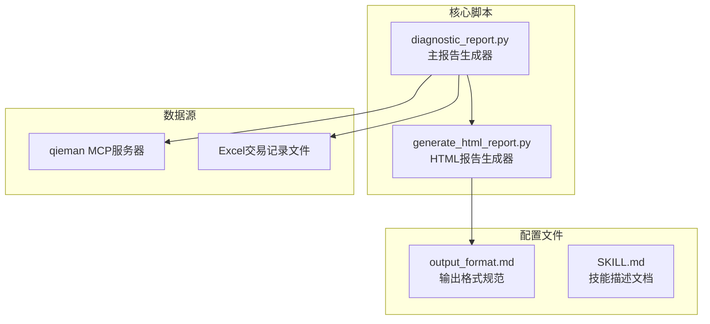
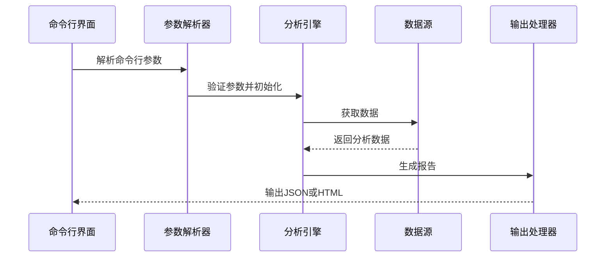
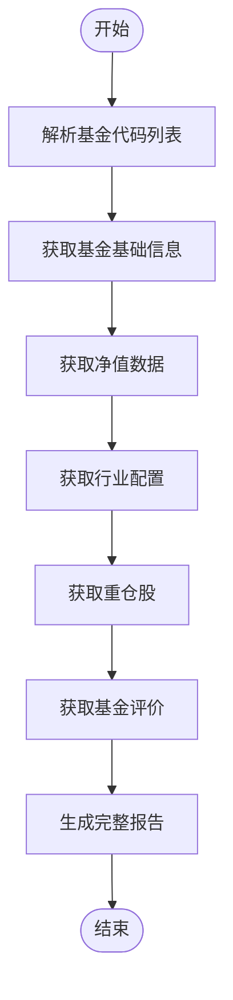
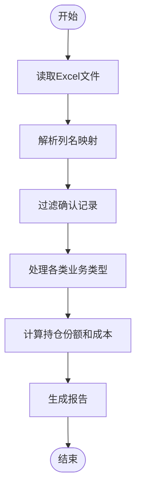
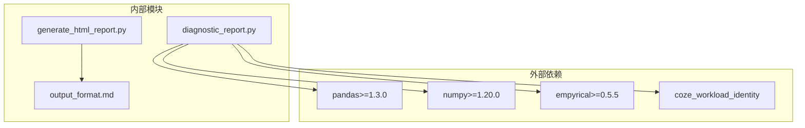

# 命令行接口

<cite>
**本文档引用的文件**
- [diagnostic_report.py](file://fund-account-diagnostic/scripts/diagnostic_report.py)
- [generate_html_report.py](file://fund-account-diagnostic/scripts/generate_html_report.py)
- [output_format.md](file://fund-account-diagnostic/references/output_format.md)
- [SKILL.md](file://fund-account-diagnostic/SKILL.md)
</cite>

## 目录
1. [简介](#简介)
2. [项目结构](#项目结构)
3. [核心组件](#核心组件)
4. [架构概览](#架构概览)
5. [详细组件分析](#详细组件分析)
6. [依赖关系分析](#依赖关系分析)
7. [性能考虑](#性能考虑)
8. [故障排除指南](#故障排除指南)
9. [结论](#结论)

## 简介

本文档详细说明了基金账户诊断报告生成器的命令行接口。该工具支持两种数据输入方式：直接使用基金代码列表或通过交易记录Excel文件进行分析。系统提供完整的投资组合诊断报告，包括持仓概览、收益风险分析、配置诊断、相关性分析、调仓建议等功能模块。

## 项目结构

**图表来源**
- [generators.py](file://fund-account-diagnostic/scripts/generators.py)
- [generate_html_report.py:1-100](file://fund-account-diagnostic/scripts/generate_html_report.py#L1-L100)

**章节来源**
- [constants.py](file://fund-account-diagnostic/scripts/constants.py)
- [SKILL.md:1-50](file://fund-account-diagnostic/SKILL.md#L1-L50)

## 核心组件

### 命令行参数定义

系统提供以下命令行参数：

| 参数 | 类型 | 必需 | 默认值 | 描述 |
|------|------|------|--------|------|
| `--funds` | 字符串 | 否 | 无 | 基金代码列表，逗号分隔，如: 000001,000002 |
| `--transaction-file` | 字符串 | 否 | 无 | 交易记录Excel文件路径 |
| `--output` | 字符串 | 否 | 无 | 输出文件路径 |
| `--modules` | 字符串 | 否 | "all" | 分析模块，逗号分隔 |
| `--show-stats` | 标志 | 否 | False | 显示交易记录统计 |
| `--format` | 字符串 | 否 | "json" | 输出格式: json 或 html |

**章节来源**
- [generators.py](file://fund-account-diagnostic/scripts/generators.py)

### 参数验证规则

系统实现了严格的参数验证机制：

1. **互斥参数验证**：必须提供 `--funds` 或 `--transaction-file` 参数之一
2. **模块参数验证**：`--modules` 参数必须是有效的模块名称组合
3. **文件路径验证**：Excel文件路径必须存在且可读
4. **格式参数验证**：`--format` 参数只能是 "json" 或 "html"

**章节来源**
- [generators.py](file://fund-account-diagnostic/scripts/generators.py)
- [generators.py](file://fund-account-diagnostic/scripts/generators.py)

## 架构概览

**图表来源**
- [generators.py](file://fund-account-diagnostic/scripts/generators.py)

## 详细组件分析

### 基金代码模式

当使用 `--funds` 参数时，系统通过qieman MCP服务器获取基金数据：

**图表来源**
- [generators.py](file://fund-account-diagnostic/scripts/generators.py)

**章节来源**
- [generators.py](file://fund-account-diagnostic/scripts/generators.py)

### 交易记录模式

当使用 `--transaction-file` 参数时，系统解析Excel文件并计算持仓：

**图表来源**
- [generators.py](file://fund-account-diagnostic/scripts/generators.py)

**章节来源**
- [generators.py](file://fund-account-diagnostic/scripts/generators.py)

### 模块过滤功能

系统支持灵活的模块过滤机制：

| 模块名称 | 描述 | 关键指标 |
|----------|------|----------|
| diagnosis | 账户诊断总览 | 综合得分、等级、配置偏离度 |
| overview | 持仓概览 | 基金数量、总市值、总成本、盈亏 |
| performance | 收益风险表现 | 累计收益、CAGR、波动率、最大回撤 |
| risk | 风险提示 | 情景分析、市场风险、流动性风险 |
| allocation | 组合配置诊断 | 大类资产、国家地区、行业穿透 |
| correlation | 相关性分析 | 相关系数矩阵、高相关对、分组分析 |
| evaluation | 单只基金评价 | 主动型/指数型双轨评价 |
| rebalance | 调仓建议 | 超配/低配资产、加减仓建议 |
| summary | 报告总结 | 核心发现、关键风险、优化建议 |

**章节来源**
- [generators.py](file://fund-account-diagnostic/scripts/generators.py)

### 输出格式控制

系统支持两种输出格式：

1. **JSON格式**（默认）
   - 标准化的JSON报告结构
   - 包含报告头部、各分析模块和报告尾部
   - 适用于程序化处理和进一步分析

2. **HTML格式**
   - ECharts 5交互式图表
   - 品牌色 #0052D9，现代亮色设计
   - 响应式布局：桌面/平板/手机自适应
   - 自包含HTML文件，无需额外依赖

**章节来源**
- [generators.py](file://fund-account-diagnostic/scripts/generators.py)
- [generate_html_report.py:1-100](file://fund-account-diagnostic/scripts/generate_html_report.py#L1-L100)

## 依赖关系分析

**图表来源**
- [SKILL.md:4-10](file://fund-account-diagnostic/SKILL.md#L4-L10)

**章节来源**
- [SKILL.md:4-10](file://fund-account-diagnostic/SKILL.md#L4-L10)

## 性能考虑

### 数据获取策略

系统采用智能降级机制：

1. **优先使用真实数据**：当MCP API可用时，优先获取真实数据
2. **模拟数据降级**：API不可用时自动降级为模拟数据
3. **向量化计算**：优先使用pandas/numpy进行向量化计算
4. **回退机制**：缺少依赖时使用纯Python实现

### 内存优化

- 分批处理大型数据集
- 及时释放不再使用的中间结果
- 使用生成器处理大数据流

## 故障排除指南

### 常见错误及解决方案

| 错误类型 | 错误信息 | 解决方案 |
|----------|----------|----------|
| 参数错误 | "请提供 --funds 或 --transaction-file 参数" | 确保至少提供一个必需参数 |
| 文件不存在 | "文件不存在: [路径]" | 检查Excel文件路径是否正确 |
| Excel解析失败 | "读取Excel文件失败: [错误详情]" | 检查文件格式和权限 |
| API超时 | "MCP API请求超时" | 检查网络连接和API密钥配置 |
| 模块无效 | "模块名称无效" | 确保模块名称拼写正确 |

### 调试技巧

1. **启用详细日志**：添加 `--show-stats` 参数查看交易统计
2. **检查依赖**：运行 `pip list | grep -E "(pandas|numpy|empyrical)"` 验证依赖安装
3. **验证数据源**：检查 `report_header.api_available` 字段确认数据源状态
4. **逐步测试**：先运行基本命令，再添加参数进行测试

**章节来源**
- [SKILL.md:90-99](file://fund-account-diagnostic/SKILL.md#L90-L99)

## 结论

该命令行接口提供了完整的基金账户诊断分析功能，具有以下特点：

1. **灵活的数据输入**：支持基金代码和交易记录两种输入方式
2. **模块化设计**：可选择性地生成特定模块的报告
3. **强大的输出格式**：支持JSON和HTML两种格式
4. **智能降级机制**：确保在各种环境下都能正常工作
5. **完善的错误处理**：提供详细的错误信息和恢复建议

通过合理的参数组合，用户可以快速获得专业的投资组合诊断报告，为投资决策提供有力支持。