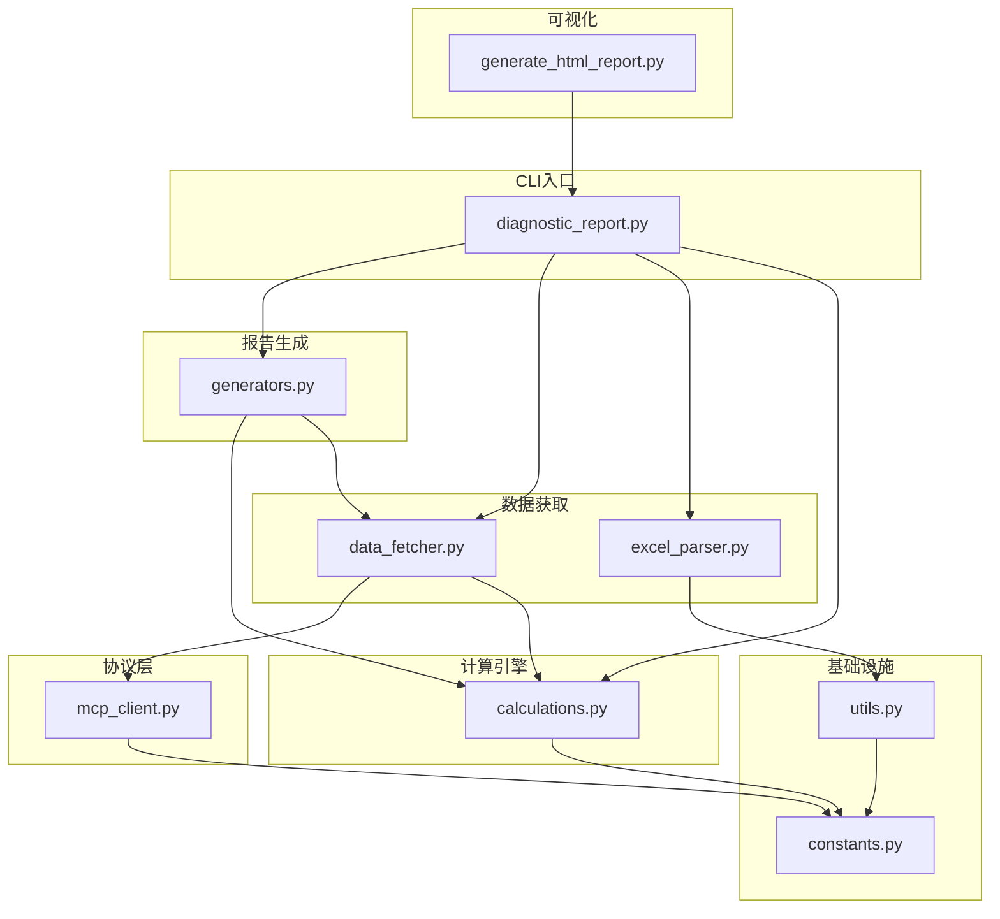

# 代码结构说明

<cite>
**本文档引用的文件**
- [diagnostic_report.py](file://fund-account-diagnostic/scripts/diagnostic_report.py) — 主入口（341行）
- [generators.py](file://fund-account-diagnostic/scripts/generators.py) — 9模块报告生成器（1573行）
- [calculations.py](file://fund-account-diagnostic/scripts/calculations.py) — 纯计算函数（790行）
- [data_fetcher.py](file://fund-account-diagnostic/scripts/data_fetcher.py) — MCP数据获取+降级（373行）
- [excel_parser.py](file://fund-account-diagnostic/scripts/excel_parser.py) — Excel交易解析（418行）
- [generate_html_report.py](file://fund-account-diagnostic/scripts/generate_html_report.py) — HTML可视化（1902行）
- [constants.py](file://fund-account-diagnostic/scripts/constants.py) — 常量/配置（88行）
- [utils.py](file://fund-account-diagnostic/scripts/utils.py) — 工具函数（78行）
- [mcp_client.py](file://fund-account-diagnostic/scripts/mcp_client.py) — MCP协议客户端（104行）
- [SKILL.md](file://fund-account-diagnostic/SKILL.md)
- [output_format.md](file://fund-account-diagnostic/references/output_format.md)
</cite>

## 目录
1. [项目概述](#项目概述)
2. [文件清单与行数](#文件清单与行数)
3. [模块职责划分](#模块职责划分)
4. [依赖关系图](#依赖关系图)
5. [数据流详解](#数据流详解)
6. [关键设计模式](#关键设计模式)
7. [结论](#结论)

## 项目概述
本项目是一个基金账户诊断技能系统（v1.5.0），提供从交易记录或基金代码出发的全方位投资组合分析。系统已拆分为8个独立的Python模块脚本+1个HTML生成器，遵循职责单一原则。

## 文件清单与行数

### 核心脚本（scripts/目录）

| 文件 | 行数 | 职责 |
|------|------|------|
| `diagnostic_report.py` | 341 | 主入口CLI，编排9模块报告生成流程 |
| `generators.py` | 1573 | 9个模块生成器函数（最大文件） |
| `calculations.py` | 790 | 纯计算函数（收益率/回撤/夏普/相关性/HHI等） |
| `data_fetcher.py` | 373 | 9个MCP数据获取函数 + 模拟降级 |
| `excel_parser.py` | 418 | 交易记录Excel解析，含基金转换双端处理 |
| `generate_html_report.py` | 1902 | JSON→HTML可视化转换，13种ECharts图表 |
| `constants.py` | 88 | 全局常量、可选依赖检测、环境变量配置 |
| `utils.py` | 78 | 金额解析、业务类型标准化、列名查找 |
| `mcp_client.py` | 104 | JSON-RPC 2.0 MCP协议客户端 |

### 辅助文件

| 文件 | 职责 |
|------|------|
| `references/output_format.md` (1104行) | 报告JSON输出格式详细定义 |
| `references/indicator_spec.md` (567行) | 全量指标规格说明书 |
| `requirements.txt` | Python依赖声明 |
| `SKILL.md` (385行) | 技能说明文档 |
| `tests/test_calculations.py` (563行) | 计算引擎单元测试 |
| `tests/test_utils.py` (207行) | 工具函数单元测试 |

## 模块职责划分

### constants.py — 配置层
负责全局常量与环境变量配置：
- **可选依赖检测**：pandas/numpy/empyrical/coze_workload_identity的HAS_*标志
- **MCP配置**：SKILL_ID、QIEMAN_MCP_URL、QIEMAN_API_KEY
- **投资参数**：TARGET_ALLOCATION（目标配置70/15/15）、BENCHMARK_ALLOCATION、DEFAULT_ANALYSIS_PERIOD_DAYS
- **Excel映射**：EXCEL_COLUMN_MAPPING（9个字段的列名映射表）
- **业务类型**：OPERATION_TYPES（subscribe/redeem/convert/dividend/convert_in/convert_out/ignore）

### mcp_client.py — 协议层
封装MCP JSON-RPC 2.0通信：
- `mcp_request(tool_name, params)` — 底层请求，支持SSE格式解析
- `mcp_call_tool(tool_name, arguments)` — tools/call封装，含isError检测
- `is_api_available()` — API可用性检查
- 支持coze_workload_identity和urllib两种HTTP后端

### data_fetcher.py — 数据获取层
9个数据获取函数，每个都遵循「真实API→模拟降级」模式：

| 函数 | MCP工具 | 返回数据 |
|------|---------|----------|
| `get_fund_info(code)` | fund_info | 基金名称/类型/净值/经理/公司 |
| `get_fund_nav(code, start, end)` | fund_nav | 净值序列+日期序列 |
| `get_fund_industry_allocation(code)` | fund_industry_allocation | 行业配置列表 |
| `get_fund_holdings(code)` | fund_holdings | 重仓股列表 |
| `get_fund_evaluation(code, type)` | fund_evaluate | 主动型/指数型评价 |
| `get_index_nav(code, days)` | index_nav | 指数净值序列 |
| `get_fund_manager_rating(code)` | fund_manager_rating | 经理1Y/2Y/3Y评分 |
| `get_fund_subscores(code)` | fund_subscores | 子维度(NHI/SEC/TIM/SCA)评分 |
| `get_fund_announcement(code)` | fund_announcement | 公告/舆情信息 |

模拟数据特点：基于fund_code哈希的确定性随机种子，保证可重复性。

### excel_parser.py — 数据解析层
`parse_transaction_excel(file_path)` 是唯一入口函数：
- 支持多Sheet合并解析
- 自动识别列名（精确匹配→模糊匹配）
- 过滤非确认成功记录
- 处理7种业务类型（申购/赎回/基金转换/分红/转入/转出/忽略）
- 基金转换双端处理：转出方减少份额+成本，目标基金增加份额+成本
- 浮点精度阈值 SHARES_DUST_THRESHOLD=1e-6 防止清仓误判
- 已清仓基金追踪（区分赎回清仓/转换清仓/强行赎回清仓）
- 返回 (持仓列表, 交易统计) 元组

### calculations.py — 纯计算层
所有函数为纯函数，无副作用，支持三层降级：

| 函数 | 功能 | 降级路径 |
|------|------|----------|
| `calculate_returns_stats` | 均值/标准差/VaR/CVaR | pandas→numpy→纯Python |
| `calculate_max_drawdown` | 最大回撤+起止日期 | pandas→numpy→纯Python |
| `calculate_sharpe_ratio` | 年化夏普比率 | empyrical→numpy→纯Python |
| `calculate_correlation` | Pearson相关系数 | numpy→纯Python |
| `calculate_hhi` | 行业集中度指数 | numpy→纯Python |
| `nav_to_returns` | 净值→收益率序列 | pandas→numpy→纯Python |
| `calculate_portfolio_nav` | 组合净值序列 | pandas→numpy→纯Python |
| `calculate_multi_period_returns` | 1M/3M/6M/1Y/2Y/3Y收益 | 统一实现 |
| `calculate_per_fund_risk_metrics` | 单基金风险指标 | 统一调用 |
| `compute_stock_concentration` | 穿透后个股集中度Top5 | 统一实现 |
| `select_benchmark_index` | 自动选择对比指数 | 基于名称关键词 |
| `compute_sub_dimension_scores` | 创新高/择股/择时/规模 | 从净值序列推导 |
| `generate_operational_recommendation` | 操作建议(保留/观察/替换) | 规则引擎 |

### generators.py — 报告生成层
9个模块生成器函数，每个对应一个报告模块：

| 函数 | 模块 | 关键输出字段 |
|------|------|-------------|
| `generate_overview` | overview | basic_info, holdings_detail, concentration_alerts, transaction_summary, liquidated_funds |
| `generate_performance` | performance | multi_period_returns, performance_metrics, nav_curve, benchmark_metrics, excess_vs_benchmark |
| `generate_diagnosis` | diagnosis | comprehensive_score, grade, allocation_deviation, manager_rating, stock_concentration, fund_subscores_detail |
| `generate_allocation` | allocation | asset_allocation, country_allocation, industry_allocation, qdii_industry_allocation, top_holdings, fund_companies |
| `generate_correlation` | correlation | correlation_matrix, average_pairwise_correlation, high_correlation_pairs, groups |
| `generate_evaluation` | evaluation | fund_evaluations(主动型), index_fund_valuations(指数型), subscores, manager_rating, announcement, recommendation |
| `generate_rebalance` | rebalance | allocation_comparison, fund_replacement_suggestions, recommended_funds, batch_schedule, post_rebalance |
| `generate_risk` | risk | risk_level, scenario_analysis, market_risks, liquidity_risks, max_drawdown_period |
| `generate_summary` | summary | core_findings, key_risks, optimization_suggestions, overall_assessment |

### diagnostic_report.py — 主入口
`generate_full_report(funds, options, transaction_stats)` 是核心函数：
1. 批量获取所有基金数据（info/nav/industry/holdings/evaluation/manager_rating/subscores/announcement）
2. 计算权重、市值、基准指数、穿透集中度
3. 按顺序生成9个模块数据
4. 组装完整报告JSON（header + 9模块 + footer）

CLI参数：--funds / --transaction-file / --modules / --output / --show-stats / --format(json|html)

### generate_html_report.py — HTML可视化
1902行的自包含HTML生成器：
- 品牌色 #0052D9，红涨绿跌（中国市场惯例）
- 13种ECharts 5交互图表
- 响应式布局（桌面/平板/手机）
- 仅需网络加载ECharts CDN

## 依赖关系图



## 数据流详解

### 基金代码模式
```
用户输入基金代码 → diagnostic_report.py
  → data_fetcher.py (逐基金获取9类数据)
    → mcp_client.py (调用qieman MCP)
  → calculations.py (组合净值/基准/集中度)
  → generators.py (9模块报告生成)
  → JSON报告 / HTML报告
```

### 交易记录模式
```
用户上传Excel → diagnostic_report.py
  → excel_parser.py (解析交易记录→持仓+统计)
    → utils.py (金额解析/业务类型标准化)
    → constants.py (列名映射/业务类型字典)
  → data_fetcher.py (获取净值/行业/重仓股等)
  → generators.py (9模块报告生成)
  → JSON报告 / HTML报告
```

## 关键设计模式

### 三层向量化降级
所有计算函数实现三层降级路径：pandas（最优）→ numpy → 纯Python（兜底）
- constants.py 中通过 HAS_PANDAS/HAS_NUMPY/HAS_EMPYRICAL 标志控制
- 确保在任何环境下都可运行

### 确定性模拟数据
- data_fetcher.py 使用 `random.seed(hash(fund_code) % (2**31))` 确保相同基金代码产生相同模拟数据
- 组合净值计算中，各基金净值序列长度不一致时使用前向填充对齐

### 基金转换双端处理
- excel_parser.py 同时处理转出方（减少份额+成本）和转入方（增加份额+成本）
- 通过目标基金代码列判断转出/转入方向
- 清仓原因区分：赎回清仓/转换清仓/强行赎回清仓

### QDII行业穿透
- generators.py 中 `generate_allocation` 实现Wind全球行业11分类关键词匹配
- 基于基金名称关键词推断QDII基金的底层行业分布

## 结论
项目采用8+1模块的清晰架构，每个文件职责明确：
- 配置层(constants) → 协议层(mcp_client) → 数据获取(data_fetcher) → 数据解析(excel_parser) → 计算引擎(calculations) → 报告生成(generators) → 主入口(diagnostic_report) → 可视化(generate_html_report)
- 工具函数(utils)被数据解析层和计算引擎共同使用
- 测试覆盖核心计算函数和工具函数，共约770行测试代码
