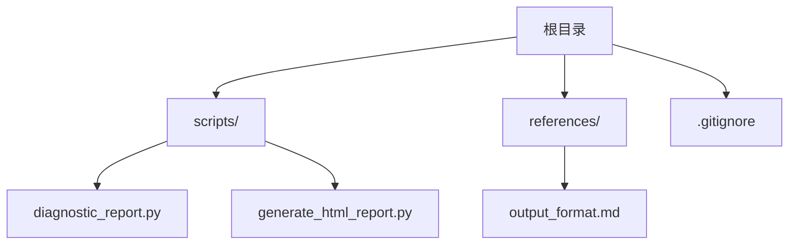
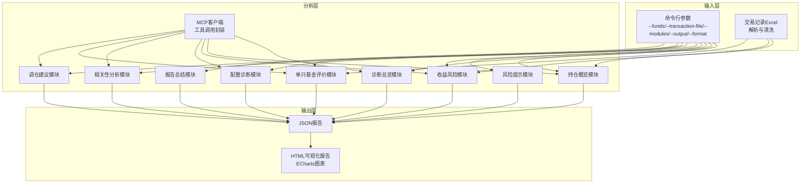
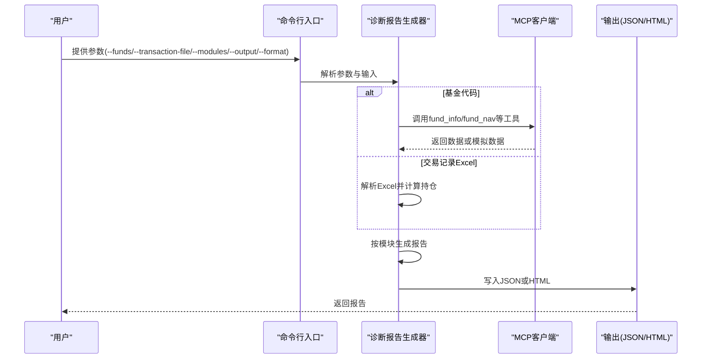
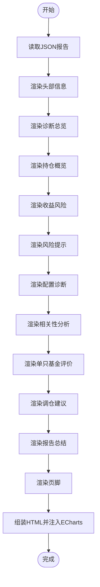
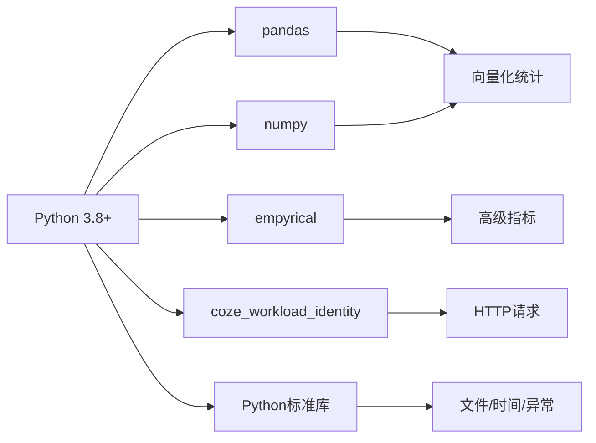

# 开发者指南

<cite>
**本文档引用的文件**
- [SKILL.md](file://fund-account-diagnostic/SKILL.md)
- [diagnostic_report.py](file://fund-account-diagnostic/scripts/diagnostic_report.py)
- [generate_html_report.py](file://fund-account-diagnostic/scripts/generate_html_report.py)
- [output_format.md](file://fund-account-diagnostic/references/output_format.md)
- [.gitignore](file://fund-account-diagnostic/.gitignore)
</cite>

## 目录
1. [简介](#简介)
2. [项目结构](#项目结构)
3. [核心组件](#核心组件)
4. [架构总览](#架构总览)
5. [详细组件分析](#详细组件分析)
6. [依赖分析](#依赖分析)
7. [性能考量](#性能考量)
8. [故障排查指南](#故障排查指南)
9. [结论](#结论)
10. [附录](#附录)

## 简介
本指南面向开发者，帮助您快速搭建开发环境、理解项目结构与模块职责、掌握代码贡献规范、扩展新功能模块、定制HTML报告生成器，并提供调试与性能分析方法。项目围绕“基金账户诊断”主题，提供从交易记录解析到多维度分析、再到可视化报告生成的完整链路。

## 项目结构
项目采用脚本驱动的模块化组织方式，核心位于 scripts 目录，参考文档位于 references 目录，另有技能描述与使用说明文件 SKILL.md。

**图表来源**
- [diagnostic_report.py](file://fund-account-diagnostic/scripts/diagnostic_report.py)
- [generate_html_report.py](file://fund-account-diagnostic/scripts/generate_html_report.py)
- [output_format.md](file://fund-account-diagnostic/references/output_format.md)
- [.gitignore](file://fund-account-diagnostic/.gitignore)

**章节来源**
- [SKILL.md](file://fund-account-diagnostic/SKILL.md)
- [diagnostic_report.py](file://fund-account-diagnostic/scripts/diagnostic_report.py)
- [generate_html_report.py](file://fund-account-diagnostic/scripts/generate_html_report.py)
- [output_format.md](file://fund-account-diagnostic/references/output_format.md)
- [.gitignore](file://fund-account-diagnostic/.gitignore)

## 核心组件
- 诊断报告生成器：负责解析输入（基金代码或交易记录Excel）、调用数据源（MCP API或模拟数据）、执行多模块分析、生成JSON报告。
- HTML报告生成器：将JSON报告渲染为自包含HTML，内置13种ECharts图表，支持品牌色与响应式布局。
- 输出格式参考：定义了报告JSON结构、字段含义与版本演进，是前后端对接与扩展的重要契约。

**章节来源**
- [diagnostic_report.py](file://fund-account-diagnostic/scripts/diagnostic_report.py)
- [generate_html_report.py](file://fund-account-diagnostic/scripts/generate_html_report.py)
- [output_format.md](file://fund-account-diagnostic/references/output_format.md)

## 架构总览
系统分为三层：输入层（命令行参数与Excel）、分析层（MCP数据获取与指标计算）、输出层（JSON与HTML）。分析层内部按模块解耦，便于按需启用与扩展。

**图表来源**
- [diagnostic_report.py](file://fund-account-diagnostic/scripts/diagnostic_report.py)
- [generate_html_report.py](file://fund-account-diagnostic/scripts/generate_html_report.py)

## 详细组件分析

### 诊断报告生成器（diagnostic_report.py）
- 职责：接收用户输入，解析Excel或解析基金代码，调用MCP工具获取数据，按模块生成报告，支持JSON与HTML两种输出。
- 关键能力：
  - MCP客户端：封装JSON-RPC调用，支持SSE响应与错误处理。
  - 数据降级：API不可用时自动切换模拟数据，保证功能可用。
  - 指标计算：支持多期收益、最大回撤、夏普比率、相关系数、HHI集中度等。
  - 模块化：按模块生成，支持按需启用。
  - 交易记录解析：支持多列名映射、业务类型识别、份额与成本计算、清仓识别。
- 模块顺序：diagnosis → overview → performance → risk → allocation → correlation → evaluation → rebalance → summary。

**图表来源**
- [diagnostic_report.py](file://fund-account-diagnostic/scripts/diagnostic_report.py)

**章节来源**
- [diagnostic_report.py](file://fund-account-diagnostic/scripts/diagnostic_report.py)

### HTML报告生成器（generate_html_report.py）
- 职责：将JSON报告渲染为自包含HTML，内置13种ECharts图表，使用品牌色与响应式布局。
- 关键能力：
  - 模块化渲染：每个报告模块对应一个渲染函数，最终组装为完整HTML。
  - 图表定制：饼图、柱状图、仪表盘、热力图、矩形树图等。
  - 样式系统：CSS变量、卡片布局、侧边导航、移动端适配。
  - 数据格式化：货币、百分比、颜色类、等级徽章等。
- 依赖：ECharts CDN（仅运行时加载）。

**图表来源**
- [generate_html_report.py](file://fund-account-diagnostic/scripts/generate_html_report.py)

**章节来源**
- [generate_html_report.py](file://fund-account-diagnostic/scripts/generate_html_report.py)

### 输出格式参考（output_format.md）
- 职责：定义报告JSON结构、字段含义、版本演进与字段约束，是前后端对接与扩展的重要契约。
- 关键点：
  - 报告结构：report_header → 各分析模块 → report_footer。
  - 字段命名与类型：明确每个字段的语义与取值范围。
  - 版本演进：记录新增字段与变更说明，便于兼容与升级。

**章节来源**
- [output_format.md](file://fund-account-diagnostic/references/output_format.md)

## 依赖分析
- 必需依赖：Python 3.8+。
- 可选依赖（提升指标质量与性能）：
  - pandas：向量化计算与DataFrame处理。
  - numpy：向量化统计与相关系数计算。
  - empyrical：高级风险指标（索提诺比率、卡玛比率、下行风险、尾部比率、Alpha、Beta）。
  - coze_workload_identity：HTTP请求封装（优先使用，否则回退urllib）。
- 环境变量：
  - COZE_QIEMAN_API_{SKILL_ID}：MCP API密钥。
  - FUND_DIAG_TARGET_*：目标配置与分析期等可调参数（见SKILL.md）。

**图表来源**
- [SKILL.md](file://fund-account-diagnostic/SKILL.md)
- [diagnostic_report.py](file://fund-account-diagnostic/scripts/diagnostic_report.py)

**章节来源**
- [SKILL.md](file://fund-account-diagnostic/SKILL.md)
- [diagnostic_report.py](file://fund-account-diagnostic/scripts/diagnostic_report.py)

## 性能考量
- 向量化优先：优先使用pandas/numpy进行向量化计算，回退到纯Python实现。
- 缓存与复用：对重复计算（如相关系数矩阵）进行缓存，避免重复调用MCP。
- 数据对齐：在计算组合净值与相关性时，确保序列长度一致与对齐策略正确。
- I/O优化：Excel解析尽量一次性读取，避免多次磁盘访问；HTML生成器将数据序列化为JSON字符串，减少模板渲染开销。
- 指标计算：对于高级指标（empyrical），仅在依赖可用时启用，避免不必要的开销。

[本节为通用指导，无需列出具体文件来源]

## 故障排查指南
- API不可用：
  - 现象：报告头部标记API不可用，使用模拟数据。
  - 处理：检查环境变量COZE_QIEMAN_API_{SKILL_ID}是否配置；确认MCP服务可达。
- Excel解析失败：
  - 现象：列名不匹配或数据为空。
  - 处理：核对列名映射；确保确认结果列为“确认成功”；检查文件是否存在。
- 基金代码无效：
  - 现象：跳过该基金并在报告中标注。
  - 处理：修正代码格式；确认是否为6位数字。
- 性能问题：
  - 现象：计算耗时较长。
  - 处理：安装pandas/numpy/empyrical；检查数据长度与对齐；避免重复计算。

**章节来源**
- [diagnostic_report.py](file://fund-account-diagnostic/scripts/diagnostic_report.py)
- [SKILL.md](file://fund-account-diagnostic/SKILL.md)

## 结论
本项目通过清晰的模块划分与可选依赖设计，在保证功能完整性的同时兼顾性能与可扩展性。开发者可基于现有框架快速扩展新模块、新增指标与定制可视化样式，满足多样化的诊断需求。

[本节为总结性内容，无需列出具体文件来源]

## 附录

### 开发环境搭建
- 创建并激活虚拟环境（推荐Python 3.8+）。
- 安装可选依赖以启用高级指标与性能优化。
- 配置MCP API密钥（可选，未配置时使用模拟数据）。
- 使用.gitignore忽略本地缓存与虚拟环境目录。

**章节来源**
- [.gitignore](file://fund-account-diagnostic/.gitignore)
- [SKILL.md](file://fund-account-diagnostic/SKILL.md)

### 代码贡献指南
- 编码规范：
  - 使用类型注解与清晰的函数签名。
  - 对外接口遵循output_format.md约定，避免破坏字段兼容性。
  - 模块内职责单一，避免跨模块强耦合。
- 注释标准：
  - 公共函数与类提供中文文档字符串，说明输入、输出与异常。
  - 关键计算步骤添加注释，解释公式与边界处理。
- 测试要求：
  - 单元测试：针对核心指标计算函数（如最大回撤、相关系数、夏普比率）编写测试。
  - 集成测试：覆盖Excel解析、MCP调用与完整报告生成流程。
- 提交流程：
  - 分支命名：feature/模块名、fix/问题描述、docs/文档更新。
  - 提交信息：简述变更内容与影响范围，引用相关issue或模块。

[本节为通用规范，无需列出具体文件来源]

### 扩展新功能模块
- 新增分析模块：
  - 在diagnostic_report.py中新增模块函数，遵循现有模块结构与命名。
  - 在generate_full_report中按阅读顺序插入模块数据。
  - 在output_format.md中补充字段定义与版本说明。
- 新增指标：
  - 在相应模块函数中实现计算逻辑，优先使用向量化实现。
  - 为empyrical指标提供条件启用分支，确保无依赖时可用。
- 界面定制：
  - 在generate_html_report.py中新增渲染函数，使用现有样式与颜色体系。
  - 为新图表选择合适的ECharts类型与配置，保持品牌色一致。

**章节来源**
- [diagnostic_report.py](file://fund-account-diagnostic/scripts/diagnostic_report.py)
- [generate_html_report.py](file://fund-account-diagnostic/scripts/generate_html_report.py)
- [output_format.md](file://fund-account-diagnostic/references/output_format.md)

### HTML报告生成器开发
- ECharts图表定制：
  - 使用现有映射字典与颜色体系，保持视觉一致性。
  - 为新图表提供数据序列化与option配置，注意响应式与移动端适配。
- 样式系统修改：
  - 修改CSS变量与类名，确保品牌色与等级徽章统一。
  - 侧边导航与卡片布局保持一致间距与阴影效果。

**章节来源**
- [generate_html_report.py](file://fund-account-diagnostic/scripts/generate_html_report.py)

### 调试技巧与性能分析
- 调试技巧：
  - 使用最小化输入（少量基金或简短序列）快速定位问题。
  - 分模块输出中间结果，验证数据对齐与权重计算。
  - 利用模拟数据隔离API问题，聚焦业务逻辑。
- 性能分析：
  - 使用time与memory profile测量关键函数耗时。
  - 对热点路径（相关系数矩阵、组合净值计算）进行向量化优化。
  - 缓存重复计算结果，减少MCP调用次数。

[本节为通用指导，无需列出具体文件来源]