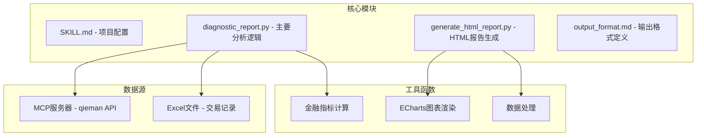
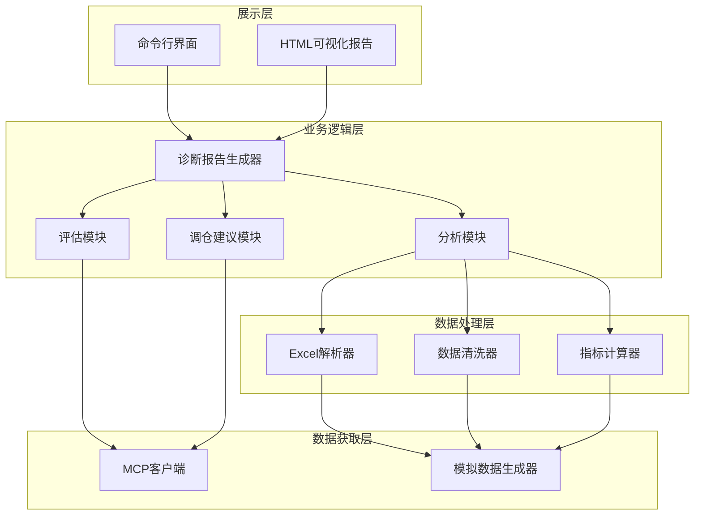
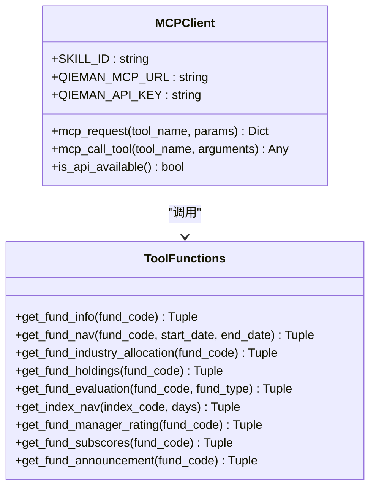
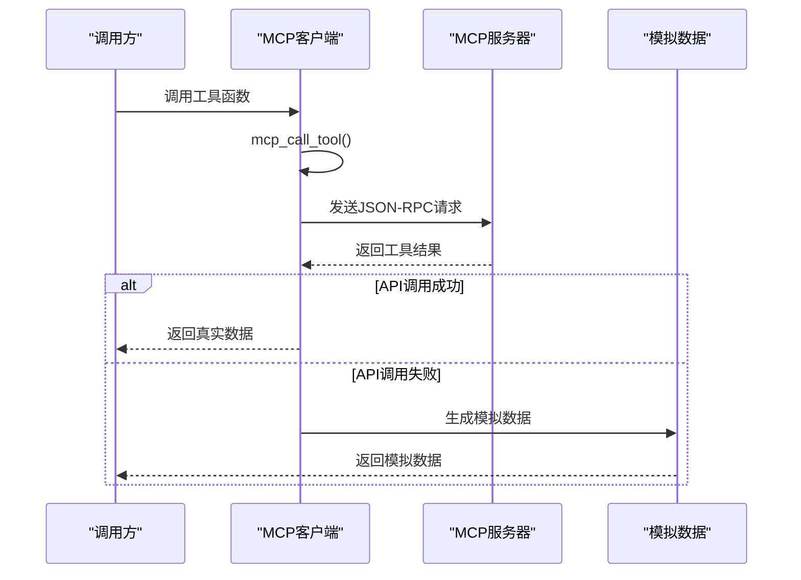
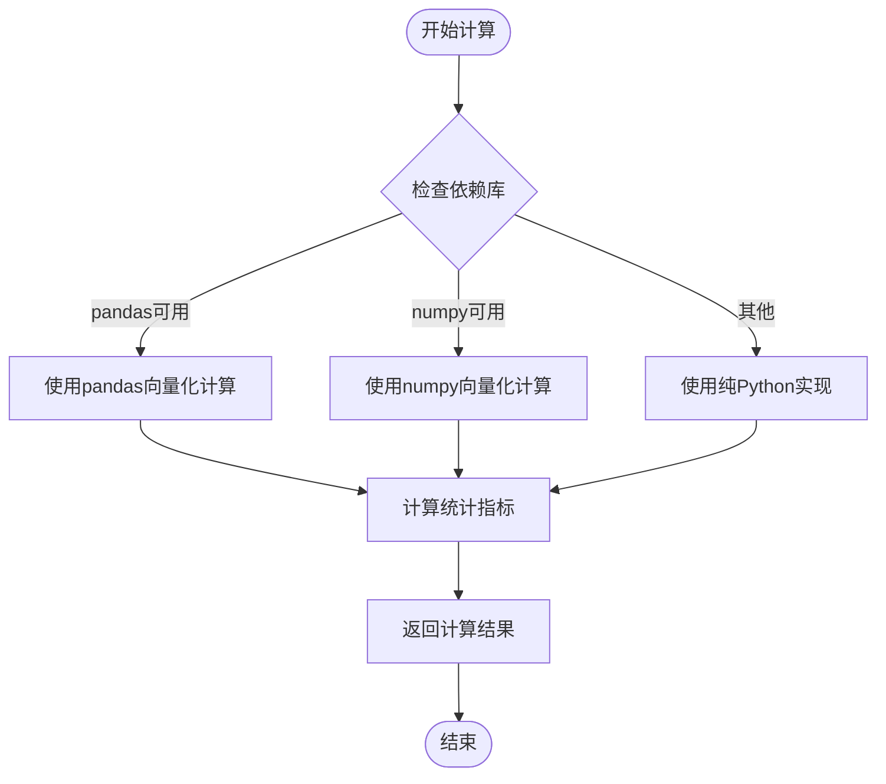
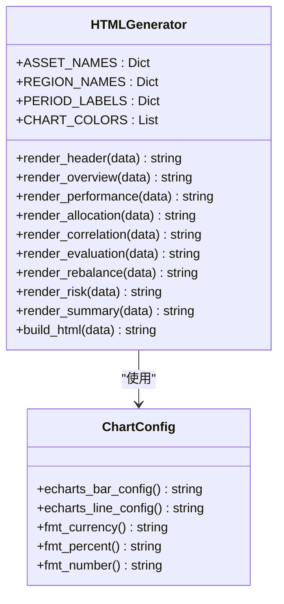
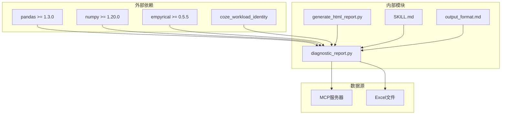
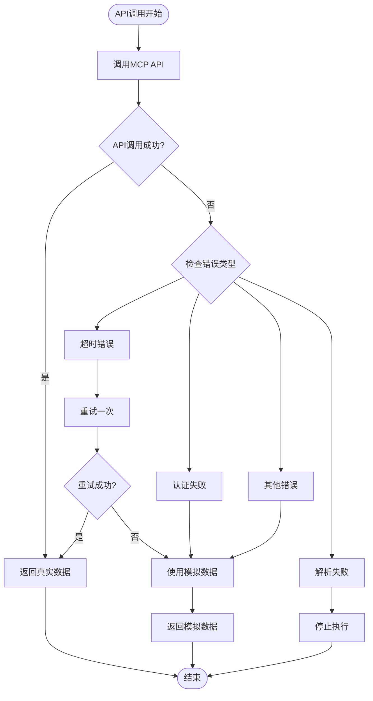

# 扩展开发指南

<cite>
**本文档引用的文件**
- [SKILL.md](file://fund-account-diagnostic/SKILL.md)
- [diagnostic_report.py](file://fund-account-diagnostic/scripts/diagnostic_report.py)
- [generate_html_report.py](file://fund-account-diagnostic/scripts/generate_html_report.py)
- [output_format.md](file://fund-account-diagnostic/references/output_format.md)
</cite>

## 目录
1. [项目概述](#项目概述)
2. [项目结构](#项目结构)
3. [核心组件](#核心组件)
4. [架构概览](#架构概览)
5. [详细组件分析](#详细组件分析)
6. [依赖关系分析](#依赖关系分析)
7. [性能考虑](#性能考虑)
8. [故障排查指南](#故障排查指南)
9. [结论](#结论)
10. [附录](#附录)

## 项目概述
本项目是一个基金账户诊断分析系统，提供持仓概览、收益风险分析、配置诊断、相关性分析、调仓建议和风险提示等功能。系统支持通过基金代码或交易记录Excel文件生成诊断报告，并提供HTML可视化报告生成功能。

## 项目结构
项目采用模块化设计，主要包含以下核心文件：

**图表来源**
- [constants.py](file://fund-account-diagnostic/scripts/constants.py)
- [generate_html_report.py:1-100](file://fund-account-diagnostic/scripts/generate_html_report.py#L1-L100)

**章节来源**
- [SKILL.md:1-50](file://fund-account-diagnostic/SKILL.md#L1-L50)
- [constants.py](file://fund-account-diagnostic/scripts/constants.py)

## 核心组件
系统包含以下核心组件：

### 1. MCP客户端组件
负责与qieman MCP服务器通信，获取基金数据：
- 基础信息查询：`fund_info`
- 净值数据查询：`fund_nav`
- 行业配置查询：`fund_industry_allocation`
- 重仓股查询：`fund_holdings`
- 基金评价查询：`fund_evaluate`
- 指数净值查询：`index_nav`
- 基金经理评分：`fund_manager_rating`
- 评分子维度：`fund_subscores`
- 公告舆情：`fund_announcement`

### 2. 金融指标计算组件
提供多种金融指标计算函数：
- 收益率统计：`calculate_returns_stats`
- 最大回撤计算：`calculate_max_drawdown`
- 夏普比率计算：`calculate_sharpe_ratio`
- 相关系数计算：`calculate_correlation`
- 行业集中度指数：`calculate_hhi`
- 组合净值计算：`calculate_portfolio_nav`

### 3. HTML报告生成组件
基于ECharts 5提供13种交互式图表：
- 饼图：持仓分布、资产配置、国家/地区分布
- 柱状图：多期收益、基金得分、配置偏离对比
- 折线图：净值曲线、基准对比
- 热力图：相关系数矩阵
- 仪表盘：综合评分
- 矩形树图：重仓股穿透
- 进度条：风险场景分析

**章节来源**
- [generators.py](file://fund-account-diagnostic/scripts/generators.py)
- [generate_html_report.py:99-280](file://fund-account-diagnostic/scripts/generate_html_report.py#L99-L280)

## 架构概览
系统采用分层架构设计，包含数据获取层、业务逻辑层、数据处理层和展示层：

**图表来源**
- [calculations.py](file://fund-account-diagnostic/scripts/calculations.py)
- [generate_html_report.py:1514-1542](file://fund-account-diagnostic/scripts/generate_html_report.py#L1514-L1542)

## 详细组件分析

### MCP客户端组件分析
MCP客户端采用统一的请求接口，支持多种工具调用：

**图表来源**
- [calculations.py](file://fund-account-diagnostic/scripts/calculations.py)
- [generators.py](file://fund-account-diagnostic/scripts/generators.py)

#### MCP工具调用流程

**图表来源**
- [calculations.py](file://fund-account-diagnostic/scripts/calculations.py)
- [generators.py](file://fund-account-diagnostic/scripts/generators.py)

**章节来源**
- [calculations.py](file://fund-account-diagnostic/scripts/calculations.py)
- [generators.py](file://fund-account-diagnostic/scripts/generators.py)

### 金融指标计算组件分析
系统提供多种金融指标计算函数，采用多路径优化策略：

**图表来源**
- [calculations.py](file://fund-account-diagnostic/scripts/calculations.py)
- [calculations.py](file://fund-account-diagnostic/scripts/calculations.py)

#### 指标计算函数实现
系统实现了以下核心指标计算函数：

| 指标类型 | 函数名称 | 实现特点 |
|---------|---------|---------|
| 收益率统计 | `calculate_returns_stats` | 支持VaR/CVaR计算 |
| 最大回撤 | `calculate_max_drawdown` | 支持起止日期标记 |
| 夏普比率 | `calculate_sharpe_ratio` | 支持empyrical库 |
| 相关系数 | `calculate_correlation` | 支持Pearson相关系数 |
| 行业集中度 | `calculate_hhi` | HHI指数计算 |
| 组合净值 | `calculate_portfolio_nav` | 加权净值计算 |

**章节来源**
- [calculations.py](file://fund-account-diagnostic/scripts/calculations.py)

### HTML报告生成组件分析
HTML报告生成器基于ECharts 5提供丰富的可视化图表：

**图表来源**
- [generate_html_report.py:17-45](file://fund-account-diagnostic/scripts/generate_html_report.py#L17-L45)
- [generate_html_report.py:99-280](file://fund-account-diagnostic/scripts/generate_html_report.py#L99-L280)

#### 图表类型支持
系统支持以下13种ECharts图表类型：

| 图表类型 | 函数名称 | 用途 |
|---------|---------|------|
| 饼图 | `echarts_pie_config` | 持仓分布、资产配置、国家/地区分布 |
| 柱状图 | `echarts_bar_config` | 多期收益、基金得分、配置偏离对比 |
| 折线图 | `echarts_line_config` | 净值曲线、基准对比 |
| 热力图 | `echarts_heatmap_config` | 相关系数矩阵 |
| 仪表盘 | `echarts_gauge_config` | 综合评分 |
| 矩形树图 | `echarts_treemap_config` | 重仓股穿透 |
| 进度条 | `echarts_progress_config` | 风险场景分析 |

**章节来源**
- [generate_html_report.py:99-280](file://fund-account-diagnostic/scripts/generate_html_report.py#L99-L280)
- [generate_html_report.py:800-935](file://fund-account-diagnostic/scripts/generate_html_report.py#L800-L935)

## 依赖关系分析

**图表来源**
- [SKILL.md:4-10](file://fund-account-diagnostic/SKILL.md#L4-L10)
- [constants.py](file://fund-account-diagnostic/scripts/constants.py)

### 外部依赖分析
系统对外部依赖采用可选加载策略：

| 依赖库 | 版本要求 | 用途 | 降级策略 |
|-------|---------|------|---------|
| pandas | >= 1.3.0 | 数据处理、向量化计算 | 使用numpy替代 |
| numpy | >= 1.20.0 | 数值计算、向量化操作 | 使用纯Python实现 |
| empyrical | >= 0.5.5 | 专业金融指标计算 | 使用自定义实现 |
| coze_workload_identity | - | HTTP请求封装 | 使用urllib替代 |

**章节来源**
- [SKILL.md:41-47](file://fund-account-diagnostic/SKILL.md#L41-L47)
- [constants.py](file://fund-account-diagnostic/scripts/constants.py)

## 性能考虑
系统在性能方面采用了多项优化策略：

### 1. 多路径计算优化
- **pandas路径**：使用向量化操作，性能最优
- **numpy路径**：使用数组操作，性能良好  
- **手动路径**：使用纯Python循环，兼容性最好

### 2. 内存管理优化
- 使用生成器模式处理大数据集
- 及时释放中间计算结果
- 避免重复计算相同数据

### 3. 缓存机制
- MCP API响应缓存
- 计算结果缓存
- 模拟数据种子固定

## 故障排查指南

### 1. MCP API错误处理
系统提供完善的错误恢复机制：

**图表来源**
- [calculations.py](file://fund-account-diagnostic/scripts/calculations.py)
- [constants.py](file://fund-account-diagnostic/scripts/constants.py)

### 2. 常见问题诊断
- **API不可用**：检查环境变量配置和网络连接
- **Excel解析失败**：验证文件格式和列名映射
- **数据不一致**：检查时间序列对齐和权重计算
- **图表显示异常**：确认ECharts CDN可访问性和浏览器兼容性

**章节来源**
- [constants.py](file://fund-account-diagnostic/scripts/constants.py)
- [generate_html_report.py:1549-1559](file://fund-account-diagnostic/scripts/generate_html_report.py#L1549-L1559)

## 结论
本项目提供了一个完整的基金账户诊断分析解决方案，具有以下特点：

1. **模块化设计**：清晰的组件分离和职责划分
2. **可扩展性**：支持新分析模块和指标的添加
3. **可视化丰富**：基于ECharts 5提供13种图表类型
4. **容错性强**：完善的错误处理和降级机制
5. **性能优化**：多路径计算和内存管理策略

## 附录

### 扩展开发指南

#### 1. 新增分析模块步骤
1. **定义模块接口**：在`diagnostic_report.py`中添加新的分析函数
2. **实现核心逻辑**：编写具体的计算和分析算法
3. **更新报告结构**：在输出格式定义中添加新模块字段
4. **集成到主流程**：在主分析函数中调用新模块
5. **添加HTML渲染**：在`generate_html_report.py`中添加相应图表

#### 2. 新增金融指标计算函数
1. **选择计算路径**：根据性能需求选择pandas/numpy/手动实现
2. **实现计算逻辑**：编写核心计算函数
3. **添加类型检查**：确保输入参数的类型和格式正确
4. **实现降级处理**：为不同依赖环境提供备选实现
5. **添加文档注释**：详细说明函数用途和参数含义

#### 3. HTML报告生成器扩展
1. **添加图表配置**：在`generate_html_report.py`中添加新的图表配置函数
2. **实现数据转换**：将分析结果转换为ECharts可接受的格式
3. **定制样式**：根据需要调整颜色、布局和交互行为
4. **添加响应式支持**：确保图表在不同设备上的显示效果
5. **测试可视化效果**：验证图表在不同数据下的显示效果

#### 4. MCP工具扩展
1. **定义工具接口**：在`diagnostic_report.py`中添加新的工具调用函数
2. **实现数据获取**：编写具体的MCP工具调用逻辑
3. **添加降级处理**：为API不可用情况提供模拟数据
4. **更新工具列表**：在SKILL配置中添加新工具的描述
5. **测试工具集成**：验证新工具在完整流程中的工作效果

#### 5. 测试方法和调试技巧
1. **单元测试编写**：
   - 为每个核心函数编写独立的测试用例
   - 使用mock对象模拟外部依赖
   - 测试边界条件和异常情况
   - 验证数值精度和格式要求

2. **集成测试执行**：
   - 测试完整分析流程的端到端效果
   - 验证不同输入数据格式的兼容性
   - 测试错误处理和降级机制
   - 验证HTML报告生成的正确性

3. **调试技巧**：
   - 使用日志记录关键执行路径
   - 利用断点调试复杂计算逻辑
   - 检查数据类型和格式转换
   - 验证性能瓶颈和内存使用情况

#### 6. 代码贡献流程和最佳实践
1. **开发流程**：
   - Fork项目并创建功能分支
   - 编写代码和相应的测试用例
   - 运行所有测试确保功能正确
   - 提交PR并等待代码审查

2. **代码规范**：
   - 遵循PEP 8编码规范
   - 编写清晰的函数文档和注释
   - 保持函数单一职责原则
   - 使用有意义的变量和函数命名

3. **质量保证**：
   - 代码覆盖率至少达到80%
   - 性能基准测试确保不引入性能退化
   - 兼容性测试验证多平台支持
   - 文档更新确保API文档完整性

**章节来源**
- [SKILL.md:100-170](file://fund-account-diagnostic/SKILL.md#L100-L170)
- [output_format.md:1-50](file://fund-account-diagnostic/references/output_format.md#L1-L50)