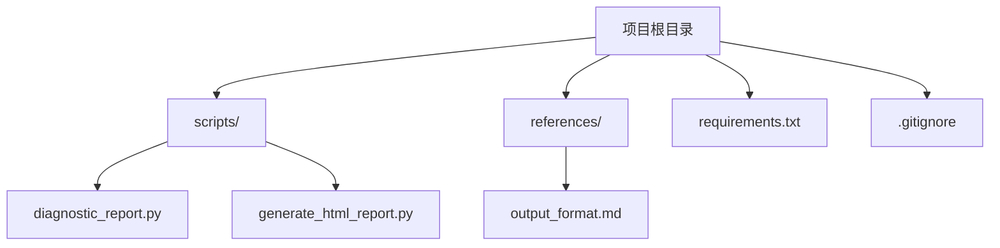
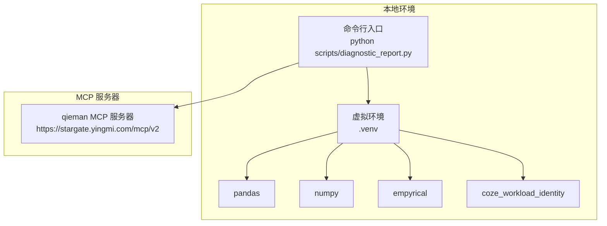
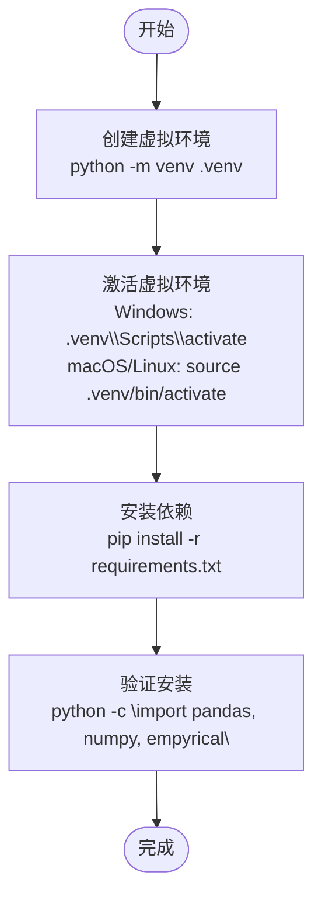
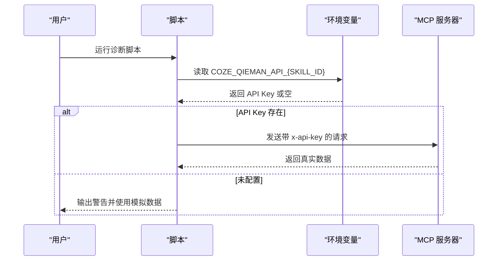
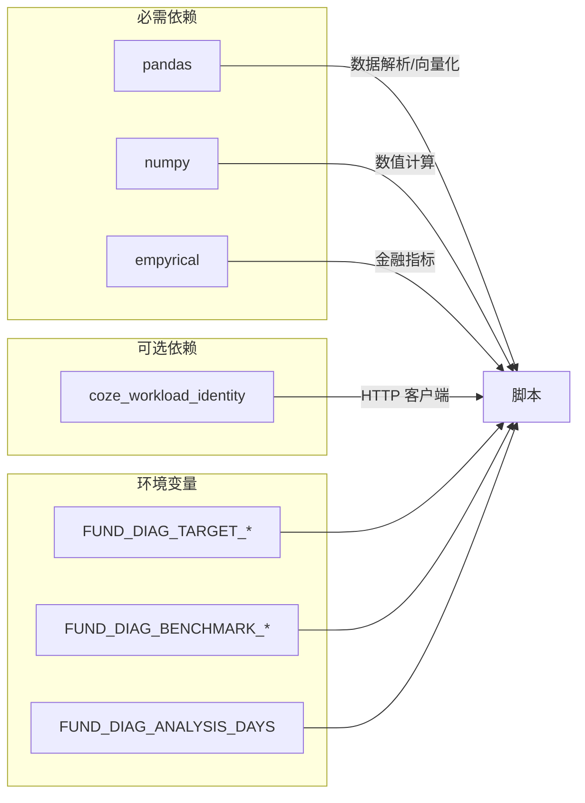

# 环境搭建

<cite>
**本文引用的文件**
- [SKILL.md](file://fund-account-diagnostic/SKILL.md)
- [requirements.txt](file://fund-account-diagnostic/requirements.txt)
- [diagnostic_report.py](file://fund-account-diagnostic/scripts/diagnostic_report.py)
- [generate_html_report.py](file://fund-account-diagnostic/scripts/generate_html_report.py)
- [.gitignore](file://fund-account-diagnostic/.gitignore)
- [output_format.md](file://fund-account-diagnostic/references/output_format.md)
</cite>

## 目录
1. [简介](#简介)
2. [项目结构](#项目结构)
3. [核心组件](#核心组件)
4. [架构总览](#架构总览)
5. [详细组件分析](#详细组件分析)
6. [依赖分析](#依赖分析)
7. [性能考虑](#性能考虑)
8. [故障排除指南](#故障排除指南)
9. [结论](#结论)
10. [附录](#附录)

## 简介
本指南面向开发者与使用者，提供“基金账户诊断技能”项目的完整环境搭建与运行说明。内容涵盖：
- Python 3.8+ 的安装与版本兼容性
- 虚拟环境的创建与激活（使用内置 venv 模块）
- 必需依赖与可选依赖的安装方法
- MCP 服务器配置与 API 密钥设置
- 开发工具推荐（IDE、代码格式化、调试）
- 常见环境问题排查与解决方案

## 项目结构
项目采用脚本驱动的单仓库结构，核心入口位于 scripts 目录，依赖声明集中在根目录的 requirements.txt 文件中。

**图表来源**
- [requirements.txt](file://fund-account-diagnostic/requirements.txt)
- [diagnostic_report.py](file://fund-account-diagnostic/scripts/diagnostic_report.py)
- [generate_html_report.py](file://fund-account-diagnostic/scripts/generate_html_report.py)
- [.gitignore](file://fund-account-diagnostic/.gitignore)
- [output_format.md](file://fund-account-diagnostic/references/output_format.md)

**章节来源**
- [requirements.txt](file://fund-account-diagnostic/requirements.txt)
- [diagnostic_report.py](file://fund-account-diagnostic/scripts/diagnostic_report.py)
- [generate_html_report.py](file://fund-account-diagnostic/scripts/generate_html_report.py)
- [.gitignore](file://fund-account-diagnostic/.gitignore)

## 核心组件
- 诊断报告生成器：负责解析输入（基金代码或交易记录 Excel）、调用 MCP 服务、计算指标、生成 JSON 报告。
- HTML 报告生成器：将 JSON 报告转换为自包含的 HTML 文件，内置 ECharts 图表。
- 依赖管理：通过 requirements.txt 声明必需与可选依赖。

**章节来源**
- [diagnostic_report.py](file://fund-account-diagnostic/scripts/diagnostic_report.py)
- [generate_html_report.py](file://fund-account-diagnostic/scripts/generate_html_report.py)
- [requirements.txt](file://fund-account-diagnostic/requirements.txt)

## 架构总览
系统以本地脚本为核心，通过 MCP 协议访问 qieman 服务器获取实时数据；若 API 不可用，则自动降级为模拟数据模式。

**图表来源**
- [diagnostic_report.py](file://fund-account-diagnostic/scripts/diagnostic_report.py)
- [requirements.txt](file://fund-account-diagnostic/requirements.txt)

## 详细组件分析

### Python 3.8+ 安装与版本兼容性
- 项目明确要求 Python 3.8+。
- 依赖声明中 pandas 和 numpy 限制了主版本上限，确保与较新版本的兼容性与稳定性。

**章节来源**
- [SKILL.md](file://fund-account-diagnostic/SKILL.md)
- [requirements.txt](file://fund-account-diagnostic/requirements.txt)

### 虚拟环境创建与激活（venv）
- 使用 Python 内置 venv 模块创建隔离环境。
- 创建后激活环境，再安装依赖，避免污染系统 Python 环境。
- 仓库根目录已包含 .venv/，可直接使用或重新创建。

**图表来源**
- [requirements.txt](file://fund-account-diagnostic/requirements.txt)
- [.gitignore](file://fund-account-diagnostic/.gitignore)

**章节来源**
- [.gitignore](file://fund-account-diagnostic/.gitignore)

### 依赖安装
- 必需依赖
  - pandas>=1.3.0,<3.0.0：解析 Excel 交易记录与进行向量化计算
  - numpy>=1.20.0,<2.0.0：数值计算
  - empyrical>=0.5.5：金融指标计算
- 可选依赖
  - coze_workload_identity：用于 HTTP 请求（平台集成）

安装方式
- 在已激活的虚拟环境中执行 pip install -r requirements.txt
- 若需要手动安装，可分别执行：
  - pip install pandas>=1.3.0,<3.0.0
  - pip install numpy>=1.20.0,<2.0.0
  - pip install empyrical>=0.5.5
  - pip install coze_workload_identity

**章节来源**
- [requirements.txt](file://fund-account-diagnostic/requirements.txt)
- [diagnostic_report.py](file://fund-account-diagnostic/scripts/diagnostic_report.py)

### MCP 服务器配置与 API 密钥设置
- 服务器地址与认证方式
  - URL: https://stargate.yingmi.com/mcp/v2
  - 认证头: x-api-key
- 环境变量配置
  - 环境变量名: COZE_QIEMAN_API_{SKILL_ID}
  - SKILL_ID: 7639232449859534882
- 设置步骤
  - 在系统环境变量中设置 COZE_QIEMAN_API_7639232449859534882 为你的 API Key
  - 重启终端或重新加载 shell 配置后生效
- 降级机制
  - 未配置 API Key 时，脚本会自动使用模拟数据模式运行

**图表来源**
- [diagnostic_report.py](file://fund-account-diagnostic/scripts/diagnostic_report.py)
- [SKILL.md](file://fund-account-diagnostic/SKILL.md)

**章节来源**
- [diagnostic_report.py](file://fund-account-diagnostic/scripts/diagnostic_report.py)
- [SKILL.md](file://fund-account-diagnostic/SKILL.md)

### 开发工具推荐
- IDE
  - VS Code：插件推荐 Python、Pylance、Black、flake8、pytest
  - PyCharm：专业版或社区版均可
- 代码格式化与检查
  - Black：统一代码风格
  - flake8：基础语法与风格检查
  - isort：导入排序
- 调试工具
  - 断点调试：IDE 内置调试器
  - pytest：单元测试与集成测试
- 依赖管理
  - requirements.txt：集中声明依赖
  - 如需锁定版本，可配合 pip-tools 或 Poetry

[本节为通用实践建议，不直接分析具体文件]

### 使用示例与参数说明
- 基于基金代码列表生成报告
  - python scripts/diagnostic_report.py --funds 000001,000002,000003
- 基于交易记录 Excel 生成报告
  - python scripts/diagnostic_report.py --transaction-file ./transactions.xlsx
- 显示交易统计摘要
  - python scripts/diagnostic_report.py --transaction-file ./transactions.xlsx --show-stats
- 指定模块诊断
  - python scripts/diagnostic_report.py --funds 000001,000002 --modules overview,performance,risk
- 保存 JSON 报告
  - python scripts/diagnostic_report.py --funds 000001,000002 --output diagnostic_report.json
- 生成 HTML 可视化报告
  - python scripts/diagnostic_report.py --funds 000001,000002 --format html --output diagnostic_report.html
  - 或从已有 JSON 生成 HTML：python scripts/generate_html_report.py --input diagnostic_report.json --output diagnostic_report.html

**章节来源**
- [SKILL.md](file://fund-account-diagnostic/SKILL.md)
- [diagnostic_report.py](file://fund-account-diagnostic/scripts/diagnostic_report.py)
- [generate_html_report.py](file://fund-account-diagnostic/scripts/generate_html_report.py)

## 依赖分析
- 必需依赖
  - pandas：数据解析与向量化计算
  - numpy：数值计算与统计
  - empyrical：金融指标计算（可选路径）
- 可选依赖
  - coze_workload_identity：HTTP 客户端（平台集成）
- 环境变量
  - FUND_DIAG_TARGET_EQUITY、FUND_DIAG_TARGET_FIXED_INCOME、FUND_DIAG_TARGET_CASH：目标配置比例
  - FUND_DIAG_BENCHMARK_EQUITY、FUND_DIAG_BENCHMARK_FIXED_INCOME：基准配置
  - FUND_DIAG_ANALYSIS_DAYS：分析基准期（天）

**图表来源**
- [requirements.txt](file://fund-account-diagnostic/requirements.txt)
- [diagnostic_report.py](file://fund-account-diagnostic/scripts/diagnostic_report.py)

**章节来源**
- [requirements.txt](file://fund-account-diagnostic/requirements.txt)
- [diagnostic_report.py](file://fund-account-diagnostic/scripts/diagnostic_report.py)

## 性能考虑
- pandas/numpy/empyrical 的优先级路径：在具备相应库时，脚本会使用向量化实现，显著提升性能。
- 缺失依赖时的回退策略：脚本保留纯 Python 实现，确保在无依赖环境下仍可运行。
- MCP 请求超时与重试：脚本对 API 超时进行一次自动重试，失败则降级为模拟数据。

[本节为通用性能讨论，不直接分析具体文件]

## 故障排除指南
- 依赖冲突
  - 症状：pip 安装时报错或运行时报错
  - 处理：使用虚拟环境隔离依赖；核对 requirements.txt 中版本范围；必要时使用 pip-tools 锁定版本
- 路径配置问题
  - 症状：找不到模块或脚本无法运行
  - 处理：确认已在虚拟环境中激活；使用绝对路径或在项目根目录执行命令
- API 密钥未配置
  - 症状：脚本输出警告并使用模拟数据
  - 处理：设置环境变量 COZE_QIEMAN_API_7639232449859534882 为有效 API Key
- Excel 列名不匹配
  - 症状：解析失败或列名映射错误
  - 处理：参考交易记录 Excel 格式说明，确保列名与支持的映射一致
- MCP 请求失败
  - 症状：API 超时、认证失败
  - 处理：检查网络连通性、API Key 是否正确；脚本会自动重试一次并降级为模拟数据

**章节来源**
- [SKILL.md](file://fund-account-diagnostic/SKILL.md)
- [diagnostic_report.py](file://fund-account-diagnostic/scripts/diagnostic_report.py)

## 结论
通过本指南，您可以在本地快速搭建“基金账户诊断技能”的运行环境，正确安装依赖、配置 MCP API 密钥，并使用脚本生成 JSON 或 HTML 报告。遇到问题时，可依据故障排除指南逐项排查。

[本节为总结性内容，不直接分析具体文件]

## 附录

### 附录A：常用命令速查
- 创建虚拟环境：python -m venv .venv
- 激活虚拟环境：Windows: .venv\Scripts\activate；macOS/Linux: source .venv/bin/activate
- 安装依赖：pip install -r requirements.txt
- 运行诊断脚本：python scripts/diagnostic_report.py --funds 000001,000002
- 生成 HTML 报告：python scripts/generate_html_report.py --input report.json --output report.html

**章节来源**
- [requirements.txt](file://fund-account-diagnostic/requirements.txt)
- [SKILL.md](file://fund-account-diagnostic/SKILL.md)