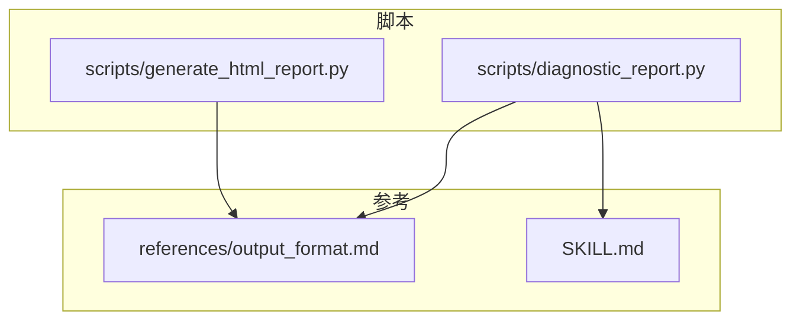
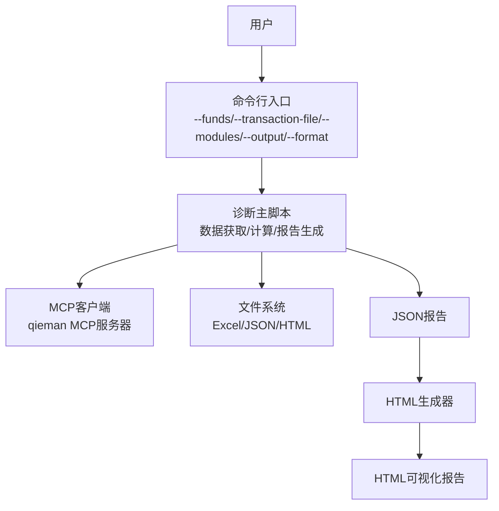
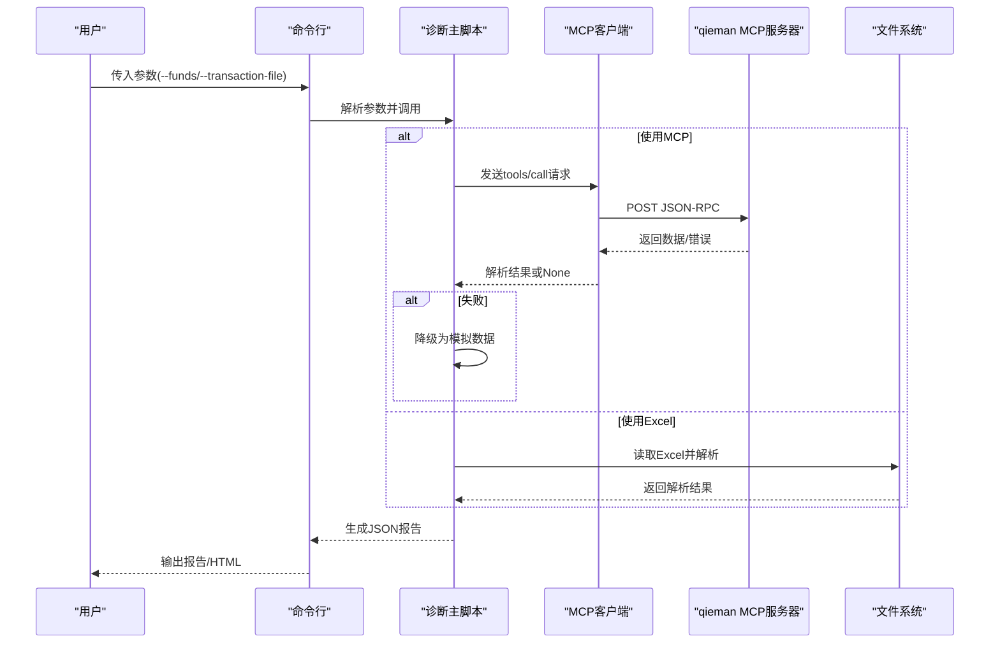
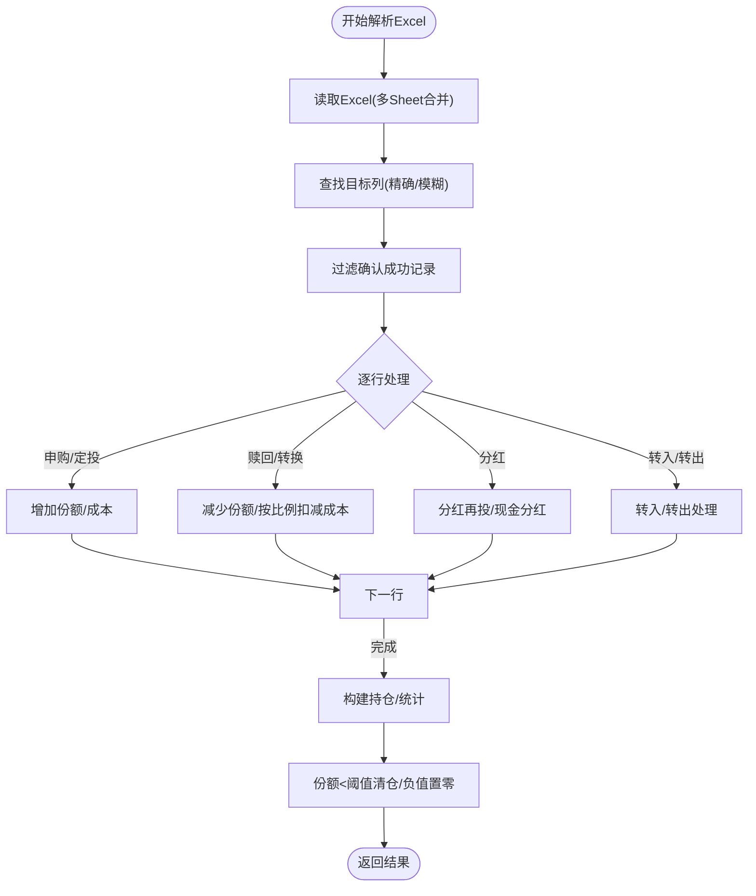
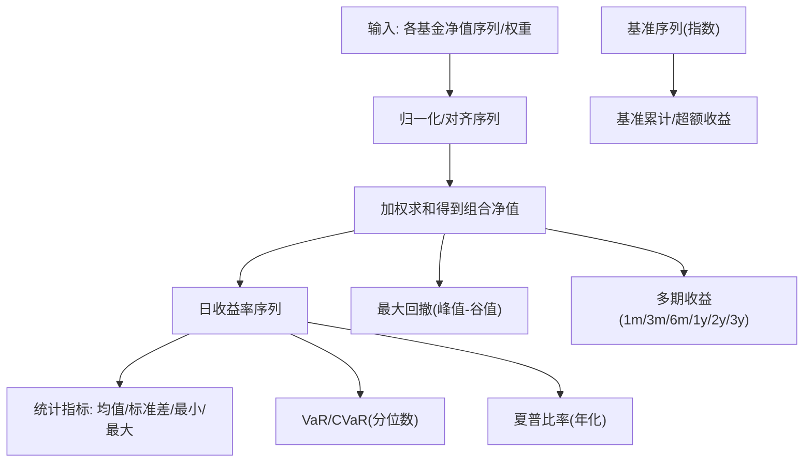
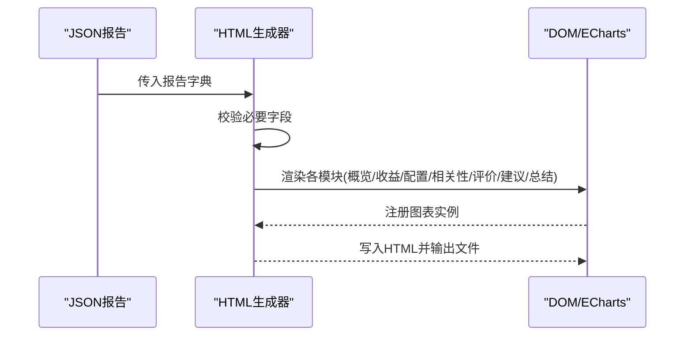
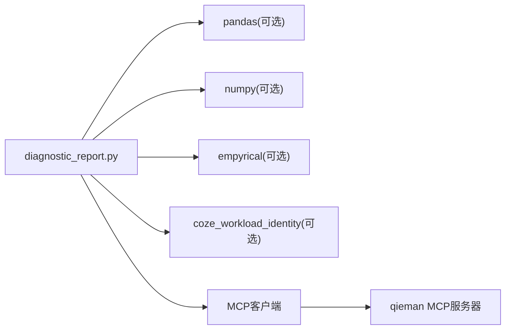

# 调试与性能优化

<cite>
**本文引用的文件**
- [SKILL.md](file://fund-account-diagnostic/SKILL.md)
- [diagnostic_report.py](file://fund-account-diagnostic/scripts/diagnostic_report.py)
- [generate_html_report.py](file://fund-account-diagnostic/scripts/generate_html_report.py)
- [output_format.md](file://fund-account-diagnostic/references/output_format.md)
</cite>

## 目录
1. [简介](#简介)
2. [项目结构](#项目结构)
3. [核心组件](#核心组件)
4. [架构总览](#架构总览)
5. [详细组件分析](#详细组件分析)
6. [依赖分析](#依赖分析)
7. [性能考虑](#性能考虑)
8. [故障排查指南](#故障排查指南)
9. [结论](#结论)
10. [附录](#附录)

## 简介
本指南面向“基金账户诊断技能”项目，聚焦调试与性能优化主题，帮助开发者与使用者在遇到数据获取失败、计算错误、内存泄漏、性能瓶颈等问题时，快速定位与解决。文档涵盖：
- 调试技巧与方法：日志记录、错误追踪、性能分析工具使用
- 常见问题排查：数据源异常、Excel解析失败、API不可用、计算异常等
- 性能优化建议：向量化计算、内存管理、大数据处理策略
- pandas/numpy向量化优化技巧
- 代码性能分析与瓶颈识别
- 测试策略与最佳实践（单元测试、集成测试）

## 项目结构
项目采用脚本驱动的命令行工具模式，核心文件包括：
- 诊断主脚本：负责数据获取、计算、报告生成
- HTML可视化脚本：将JSON报告转为交互式HTML
- 参考文档：输出格式规范，便于调试与验证

**图表来源**
- [diagnostic_report.py](file://fund-account-diagnostic/scripts/diagnostic_report.py)
- [generate_html_report.py](file://fund-account-diagnostic/scripts/generate_html_report.py)
- [output_format.md](file://fund-account-diagnostic/references/output_format.md)
- [SKILL.md](file://fund-account-diagnostic/SKILL.md)

**章节来源**
- [SKILL.md: 1-385:1-385](file://fund-account-diagnostic/SKILL.md#L1-L385)

## 核心组件
- 诊断主脚本（diagnostic_report.py）
  - 提供MCP客户端封装、Excel解析、组合净值与风险指标计算、多模块报告生成等能力
  - 支持降级模式（模拟数据）以保障API不可用时的可用性
- HTML可视化脚本（generate_html_report.py）
  - 将JSON报告渲染为自包含HTML，内置ECharts交互图表
- 输出格式参考（output_format.md）
  - 规范化报告字段与层级，便于调试与自动化校验

**章节来源**
- [diagnostic_report.py: 1-120:1-120](file://fund-account-diagnostic/scripts/constants.py)
- [generate_html_report.py: 1-60:1-60](file://fund-account-diagnostic/scripts/generate_html_report.py#L1-L60)
- [output_format.md: 1-60:1-60](file://fund-account-diagnostic/references/output_format.md#L1-L60)

## 架构总览
系统分为三层：
- 数据层：MCP API（qieman）或Excel文件
- 计算层：组合净值、收益风险、相关性、诊断与建议等模块
- 展示层：JSON报告与HTML可视化

**图表来源**
- [diagnostic_report.py: 170-247:170-247](file://fund-account-diagnostic/scripts/calculations.py)
- [generate_html_report.py: 1514-1541:1514-1541](file://fund-account-diagnostic/scripts/generate_html_report.py#L1514-L1541)

## 详细组件分析

### 数据获取与降级机制
- MCP客户端封装：统一请求格式与错误处理，支持SSE响应解析
- 降级策略：API失败或未配置密钥时，自动切换模拟数据，确保报告可用
- 降级标识：报告头包含API可用性标记，便于前端/用户识别

**图表来源**
- [diagnostic_report.py: 170-247:170-247](file://fund-account-diagnostic/scripts/calculations.py)
- [diagnostic_report.py: 1108-1175:1108-1175](file://fund-account-diagnostic/scripts/generators.py)
- [diagnostic_report.py: 1455-1782:1455-1782](file://fund-account-diagnostic/scripts/generators.py)

**章节来源**
- [diagnostic_report.py: 253-256:253-256](file://fund-account-diagnostic/scripts/calculations.py)
- [diagnostic_report.py: 1108-1175:1108-1175](file://fund-account-diagnostic/scripts/generators.py)
- [diagnostic_report.py: 1455-1782:1455-1782](file://fund-account-diagnostic/scripts/generators.py)

### Excel解析与数据清洗
- 列名映射与模糊匹配：支持多种列名变体，提升容错性
- 业务类型识别：标准化交易类型，避免误判
- 金额/净值解析：处理带千分位逗号与NaN
- 份额与成本计算：支持赎回按比例扣减成本、转换等复杂场景

**图表来源**
- [diagnostic_report.py: 1455-1782:1455-1782](file://fund-account-diagnostic/scripts/generators.py)

**章节来源**
- [diagnostic_report.py: 141-163:141-163](file://fund-account-diagnostic/scripts/calculations.py)
- [diagnostic_report.py: 100-121:100-121](file://fund-account-diagnostic/scripts/calculations.py)
- [diagnostic_report.py: 1644-1753:1644-1753](file://fund-account-diagnostic/scripts/excel_parser.py)

### 组合净值与风险指标计算
- 组合净值：对齐多只基金净值序列，归一化后加权
- 收益率：日收益率序列，支持多期回溯
- 风险指标：波动率、最大回撤、夏普比率、VaR/CVaR、Sortino等
- 基准对比：自动选择指数并计算超额收益

**图表来源**
- [diagnostic_report.py: 879-972:879-972](file://fund-account-diagnostic/scripts/calculations.py)
- [diagnostic_report.py: 1077-1101:1077-1101](file://fund-account-diagnostic/scripts/calculations.py)
- [diagnostic_report.py: 268-334:268-334](file://fund-account-diagnostic/scripts/calculations.py)
- [diagnostic_report.py: 337-437:337-437](file://fund-account-diagnostic/scripts/calculations.py)
- [diagnostic_report.py: 440-495:440-495](file://fund-account-diagnostic/scripts/calculations.py)
- [diagnostic_report.py: 975-1014:975-1014](file://fund-account-diagnostic/scripts/calculations.py)

**章节来源**
- [diagnostic_report.py: 879-972:879-972](file://fund-account-diagnostic/scripts/calculations.py)
- [diagnostic_report.py: 1077-1101:1077-1101](file://fund-account-diagnostic/scripts/calculations.py)
- [diagnostic_report.py: 268-334:268-334](file://fund-account-diagnostic/scripts/calculations.py)
- [diagnostic_report.py: 337-437:337-437](file://fund-account-diagnostic/scripts/calculations.py)
- [diagnostic_report.py: 440-495:440-495](file://fund-account-diagnostic/scripts/calculations.py)
- [diagnostic_report.py: 975-1014:975-1014](file://fund-account-diagnostic/scripts/calculations.py)

### HTML可视化与报告渲染
- 模块化渲染：按模块生成HTML片段，最终拼装为完整页面
- ECharts集成：净值曲线、相关性热力图、配置饼图、雷达/堆叠图等
- 响应式布局：移动端自适应，侧边导航与菜单开关

**图表来源**
- [generate_html_report.py: 1514-1541:1514-1541](file://fund-account-diagnostic/scripts/generate_html_report.py#L1514-L1541)
- [generate_html_report.py: 286-426:286-426](file://fund-account-diagnostic/scripts/generate_html_report.py#L286-L426)
- [generate_html_report.py: 624-755:624-755](file://fund-account-diagnostic/scripts/generate_html_report.py#L624-L755)
- [generate_html_report.py: 1514-1841:1514-1841](file://fund-account-diagnostic/scripts/generate_html_report.py#L1514-L1841)

**章节来源**
- [generate_html_report.py: 1514-1841:1514-1841](file://fund-account-diagnostic/scripts/generate_html_report.py#L1514-L1841)

## 依赖分析
- 可选依赖：pandas、numpy、empyrical、coze_workload_identity
- 降级策略：若缺失依赖，使用纯Python实现与模拟数据
- 环境变量：COZE_QIEMAN_API_{SKILL_ID}用于配置MCP认证

**图表来源**
- [diagnostic_report.py: 17-42:17-42](file://fund-account-diagnostic/scripts/constants.py)
- [diagnostic_report.py: 47-54:47-54](file://fund-account-diagnostic/scripts/constants.py)

**章节来源**
- [diagnostic_report.py: 17-42:17-42](file://fund-account-diagnostic/scripts/constants.py)
- [diagnostic_report.py: 47-54:47-54](file://fund-account-diagnostic/scripts/constants.py)

## 性能考虑
- 向量化优先：优先使用pandas/numpy进行向量化计算，显著降低循环开销
- 内存对齐与填充：多序列对齐时采用前向填充，避免频繁重建数组
- 降级路径：在无依赖或API失败时，使用确定性模拟数据，避免阻塞
- I/O优化：Excel读取合并多Sheet，减少重复扫描
- 可视化优化：HTML生成器按需渲染图表，避免冗余初始化

**章节来源**
- [diagnostic_report.py: 898-924:898-924](file://fund-account-diagnostic/scripts/calculations.py)
- [diagnostic_report.py: 926-949:926-949](file://fund-account-diagnostic/scripts/calculations.py)
- [diagnostic_report.py: 1108-1175:1108-1175](file://fund-account-diagnostic/scripts/generators.py)
- [diagnostic_report.py: 1476-1491:1476-1491](file://fund-account-diagnostic/scripts/excel_parser.py)

## 故障排查指南

### 常见问题与诊断
- API不可用/认证失败
  - 现象：报告头显示API不可用，使用模拟数据
  - 排查：检查环境变量COZE_QIEMAN_API_{SKILL_ID}是否正确设置
  - 处理：自动降级，不影响Excel模式
- Excel解析失败
  - 现象：列名不匹配、文件为空、无确认成功记录
  - 排查：核对列名映射、确认结果列、文件是否存在
  - 处理：提供可用列名列表，或修正列名
- 数据不足导致指标缺失
  - 现象：多期收益字段可能为null或省略
  - 排查：检查历史数据长度是否满足回溯期
  - 处理：关注data_insufficient_periods标记
- 计算异常（NaN/Inf）
  - 现象：夏普比率/波动率为0或异常
  - 排查：检查序列长度、零值、负值
  - 处理：添加保护分支与边界检查

**章节来源**
- [diagnostic_report.py: 253-256:253-256](file://fund-account-diagnostic/scripts/calculations.py)
- [diagnostic_report.py: 1490-1494:1490-1494](file://fund-account-diagnostic/scripts/excel_parser.py)
- [diagnostic_report.py: 298-334:298-334](file://fund-account-diagnostic/scripts/calculations.py)
- [diagnostic_report.py: 440-495:440-495](file://fund-account-diagnostic/scripts/calculations.py)
- [diagnostic_report.py: 1010-1014:1010-1014](file://fund-account-diagnostic/scripts/calculations.py)

### 调试技巧与工具
- 日志记录
  - 使用标准库日志或打印到stderr，标注关键阶段与参数
  - 建议：在MCP请求前后输出URL、请求体、状态码
- 错误追踪
  - 包裹关键函数为try/except，捕获异常并返回安全默认值
  - 建议：在Excel解析处记录行号与列名，便于定位
- 性能分析
  - 使用cProfile/line_profiler定位热点函数
  - 建议：对组合净值、相关性矩阵、多期收益等进行单独剖析
- 可视化辅助
  - 使用matplotlib/seaborn绘制中间结果（净值曲线、相关系数矩阵热力图）
  - 建议：在HTML生成前输出关键图表，验证数据正确性

**章节来源**
- [diagnostic_report.py: 170-247:170-247](file://fund-account-diagnostic/scripts/calculations.py)
- [diagnostic_report.py: 1455-1782:1455-1782](file://fund-account-diagnostic/scripts/generators.py)

### 性能优化建议
- 向量化计算
  - pandas：Series.pct_change、cummax、quantile、std等
  - numpy：np.diff、np.corrcoef、np.maximum.accumulate、np.std等
- 内存管理
  - 避免重复创建大型数组，复用中间结果
  - 对齐序列时使用就地填充或前向填充
- 大数据处理
  - 分块处理：将长序列分块计算，减少峰值内存
  - 缓存：对重复计算的结果进行缓存（如相关系数矩阵）
- 计算效率提升
  - 预分配：预先分配数组大小，避免动态增长
  - 向量化优先：尽量避免纯Python循环，使用向量化API

**章节来源**
- [diagnostic_report.py: 284-298:284-298](file://fund-account-diagnostic/scripts/calculations.py)
- [diagnostic_report.py: 300-315:300-315](file://fund-account-diagnostic/scripts/calculations.py)
- [diagnostic_report.py: 354-384:354-384](file://fund-account-diagnostic/scripts/calculations.py)
- [diagnostic_report.py: 386-406:386-406](file://fund-account-diagnostic/scripts/calculations.py)
- [diagnostic_report.py: 456-466:456-466](file://fund-account-diagnostic/scripts/calculations.py)
- [diagnostic_report.py: 468-478:468-478](file://fund-account-diagnostic/scripts/calculations.py)
- [diagnostic_report.py: 514-523:514-523](file://fund-account-diagnostic/scripts/calculations.py)
- [diagnostic_report.py: 556-558:556-558](file://fund-account-diagnostic/scripts/calculations.py)

### 测试策略与最佳实践
- 单元测试
  - 针对核心函数：parse_amount、normalize_operation、calculate_*、nav_to_returns
  - 使用mock模拟MCP返回，覆盖真实/失败/降级三种场景
- 集成测试
  - Excel解析：构造不同列名、金额格式、业务类型，验证解析正确性
  - 报告生成：对比JSON输出字段与output_format规范，确保完整性
- 性能测试
  - 生成不同规模的净值序列，测量组合净值与相关性计算耗时
  - 对比pandas/numpy与纯Python实现的性能差异
- 回归测试
  - 保存典型输入与期望输出，防止依赖升级导致行为变化

**章节来源**
- [output_format.md: 9-25:9-25](file://fund-account-diagnostic/references/output_format.md#L9-L25)
- [diagnostic_report.py: 100-121:100-121](file://fund-account-diagnostic/scripts/calculations.py)
- [diagnostic_report.py: 123-138:123-138](file://fund-account-diagnostic/scripts/calculations.py)
- [diagnostic_report.py: 268-334:268-334](file://fund-account-diagnostic/scripts/calculations.py)
- [diagnostic_report.py: 1077-1101:1077-1101](file://fund-account-diagnostic/scripts/calculations.py)

## 结论
本指南围绕“基金账户诊断技能”的调试与性能优化，给出了从架构、组件到工具与测试的完整方案。通过合理的降级策略、向量化计算、内存管理与可视化辅助，可在保证稳定性的同时显著提升性能与用户体验。建议在开发与运维过程中持续关注：
- 依赖缺失与API异常的降级路径
- 大数据场景下的向量化与分块策略
- 报告输出与可视化的一致性校验
- 单元/集成/性能测试的自动化与回归

## 附录
- 输出格式参考：用于校验报告字段完整性与一致性
- 使用示例：命令行参数与Excel格式要求

**章节来源**
- [output_format.md: 1-800:1-800](file://fund-account-diagnostic/references/output_format.md#L1-L800)
- [SKILL.md: 50-146:50-146](file://fund-account-diagnostic/SKILL.md#L50-L146)