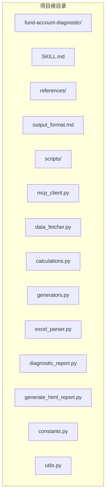
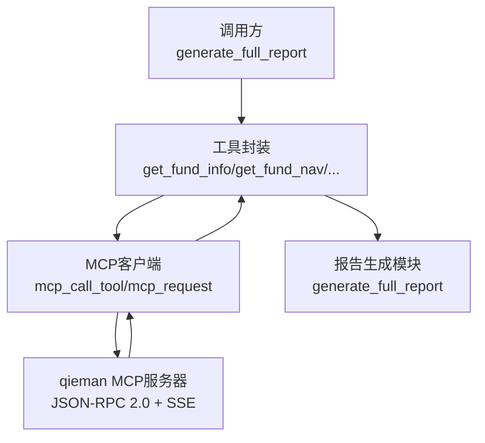
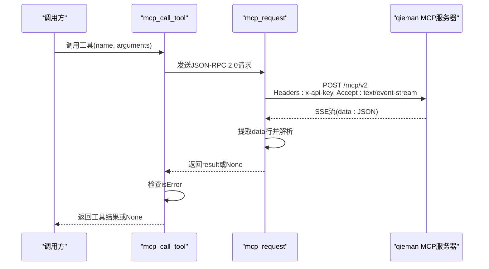
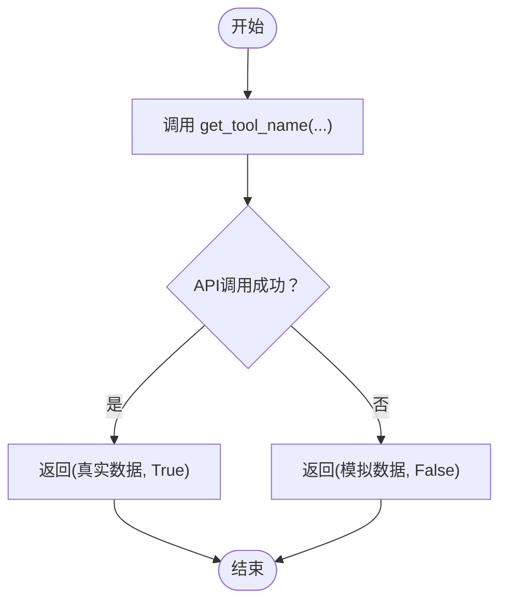
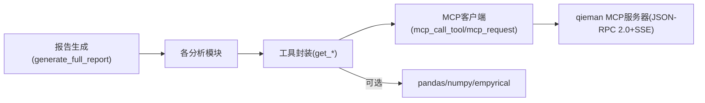

# MCP协议集成

<cite>
**本文引用的文件**
- [SKILL.md](file://fund-account-diagnostic/SKILL.md)
- [output_format.md](file://fund-account-diagnostic/references/output_format.md)
- [diagnostic_report.py](file://fund-account-diagnostic/scripts/diagnostic_report.py)
- [generate_html_report.py](file://fund-account-diagnostic/scripts/generate_html_report.py)
</cite>

## 目录
1. [简介](#简介)
2. [项目结构](#项目结构)
3. [核心组件](#核心组件)
4. [架构总览](#架构总览)
5. [详细组件分析](#详细组件分析)
6. [依赖关系分析](#依赖关系分析)
7. [性能考量](#性能考量)
8. [故障排查指南](#故障排查指南)
9. [结论](#结论)
10. [附录](#附录)

## 简介
本技术文档围绕MCP（Model Context Protocol）协议在基金账户诊断系统中的集成展开，重点解释qieman MCP服务器的调用机制、JSON-RPC 2.0协议实现、认证方式（x-api-key头部）、SSE格式响应处理，以及工具函数封装模式。文档还涵盖API密钥管理、环境变量配置、错误处理与降级策略、调用流程图、性能优化建议与最佳实践。

## 项目结构
项目采用“技能”（Skill）形式组织，核心逻辑集中在Python脚本中，配合参考文档定义报告输出格式。关键目录与文件如下：
- fund-account-diagnostic/SKILL.md：技能说明、使用方式、MCP数据源与工具清单
- fund-account-diagnostic/references/output_format.md：标准化JSON报告输出格式定义
- fund-account-diagnostic/scripts/mcp_client.py：MCP协议客户端（JSON-RPC 2.0、SSE解析）
- fund-account-diagnostic/scripts/data_fetcher.py：数据获取与模拟降级（9个get_*函数）
- fund-account-diagnostic/scripts/calculations.py：纯计算函数
- fund-account-diagnostic/scripts/generators.py：9模块报告生成器
- fund-account-diagnostic/scripts/diagnostic_report.py：主入口，编排模块调用
- fund-account-diagnostic/scripts/generate_html_report.py：将JSON报告转换为HTML可视化报告

**图表来源**
- [SKILL.md](file://fund-account-diagnostic/SKILL.md)
- [output_format.md](file://fund-account-diagnostic/references/output_format.md)
- [diagnostic_report.py](file://fund-account-diagnostic/scripts/diagnostic_report.py)
- [generate_html_report.py](file://fund-account-diagnostic/scripts/generate_html_report.py)

**章节来源**
- [SKILL.md:1-385](file://fund-account-diagnostic/SKILL.md#L1-L385)

## 核心组件
- MCP客户端与工具封装
  - mcp_request：封装JSON-RPC 2.0请求，支持SSE响应解析，内置超时与异常处理
  - mcp_call_tool：封装tools/call工具调用，统一错误检测与返回值提取
- 工具函数封装模式
  - 以get_*命名的函数封装不同MCP工具调用，统一返回(数据, 是否真实数据)二元组，便于降级策略
- API密钥与环境变量
  - COZE_QIEMAN_API_{SKILL_ID}：MCP认证头x-api-key的来源
  - FUND_DIAG_TARGET_*、FUND_DIAG_BENCHMARK_*、FUND_DIAG_ANALYSIS_DAYS：目标配置、基准与分析期等环境变量
- 报告生成与降级
  - is_api_available：判断API可用性
  - 模拟数据：在API不可用或异常时，生成模拟净值、行业配置、重仓股、评价等数据

**章节来源**
- [calculations.py](file://fund-account-diagnostic/scripts/calculations.py)
- [generators.py](file://fund-account-diagnostic/scripts/generators.py)
- [constants.py](file://fund-account-diagnostic/scripts/constants.py)

## 架构总览
MCP协议集成采用“工具封装 + 统一客户端”的模式，所有外部数据获取通过mcp_call_tool完成，内部模块化封装不同工具，便于扩展与降级。

**图表来源**
- [generators.py](file://fund-account-diagnostic/scripts/generators.py)
- [calculations.py](file://fund-account-diagnostic/scripts/calculations.py)

## 详细组件分析

### MCP客户端与SSE响应处理
- JSON-RPC 2.0请求构建
  - 方法：tools/call 或直接使用工具名（如fund_info）
  - 参数：name与arguments
  - 头部：Content-Type: application/json、x-api-key、Accept: application/json, text/event-stream
- SSE响应解析
  - 服务端返回SSE流，客户端逐行扫描，提取以"data:"开头的行并解析为JSON
- 超时与异常处理
  - 统一timeout=30秒
  - 异常返回None，便于上层降级
- 错误检测
  - result中isError=true视为调用失败，返回None

**图表来源**
- [calculations.py](file://fund-account-diagnostic/scripts/calculations.py)

**章节来源**
- [calculations.py](file://fund-account-diagnostic/scripts/calculations.py)

### 工具函数封装模式
- 统一接口：get_tool_name(fund_code或index_code, ...) -> (数据, 是否真实)
- 典型工具
  - 基础信息：fund_info
  - 净值序列：fund_nav
  - 行业配置：fund_industry_allocation
  - 重仓股：fund_holdings
  - 基金评价：fund_evaluate（主动/指数）
  - 指数净值：index_nav
  - 经理评分：fund_manager_rating
  - 评分子维度：fund_subscores
  - 公告/舆情：fund_announcement
- 降级策略
  - API失败或异常：返回模拟数据，第二返回值为False，标记为模拟数据

**图表来源**
- [generators.py](file://fund-account-diagnostic/scripts/generators.py)

**章节来源**
- [generators.py](file://fund-account-diagnostic/scripts/generators.py)

### API密钥管理与环境变量
- 认证头
  - x-api-key来自环境变量COZE_QIEMAN_API_{SKILL_ID}
  - SKILL_ID固定为"7639232449859534882"
- 环境变量
  - FUND_DIAG_TARGET_EQUITY、FUND_DIAG_TARGET_FIXED_INCOME、FUND_DIAG_TARGET_CASH：目标配置
  - FUND_DIAG_BENCHMARK_EQUITY、FUND_DIAG_BENCHMARK_FIXED_INCOME：基准配置
  - FUND_DIAG_ANALYSIS_DAYS：分析期（交易日）

**章节来源**
- [constants.py](file://fund-account-diagnostic/scripts/constants.py)

### 报告生成与模块化流程
- 模块顺序：diagnosis → overview → performance → risk → allocation → correlation → evaluation → rebalance → summary
- 模块依赖：部分模块依赖其他模块的中间结果（如performance依赖allocation、correlation依赖performance）
- 降级标记：report_header.api_available与data_source字段反映数据来源（真实API或模拟）

**章节来源**
- [generators.py](file://fund-account-diagnostic/scripts/generators.py)

## 依赖关系分析
- 内部依赖
  - 工具封装依赖MCP客户端
  - 报告生成模块依赖各分析模块（overview/performance/risk/allocation/correlation/evaluation/rebalance）
- 外部依赖
  - qieman MCP服务器（JSON-RPC 2.0 + SSE）
  - 可选库：pandas、numpy、empyrical（用于高效计算与高级指标）
  - HTTP客户端：coze_workload_identity.requests（优先）或标准库urllib

**图表来源**
- [generators.py](file://fund-account-diagnostic/scripts/generators.py)
- [generators.py](file://fund-account-diagnostic/scripts/generators.py)

**章节来源**
- [generators.py](file://fund-account-diagnostic/scripts/generators.py)
- [generators.py](file://fund-account-diagnostic/scripts/generators.py)

## 性能考量
- 向量化与库依赖
  - 优先使用pandas/numpy进行向量化计算（如收益率、相关系数、最大回撤、夏普比率等），显著提升性能
  - empyrical用于高级指标（Sortino、Calmar、Alpha、Beta等），在可用时启用
- 计算复杂度
  - 相关性矩阵：O(n^2·T)，其中n为基金数，T为交易日数；建议控制基金数量或使用pandas加速
  - 组合净值：O(T·n)，建议对齐序列长度并前向填充
- I/O与网络
  - MCP调用默认超时30秒；建议在批量调用时注意并发与重试策略（当前实现为同步调用）
- 内存与缓存
  - 对重复使用的净值序列与中间结果进行缓存（例如在批量处理时复用）

[本节为通用性能讨论，不直接分析具体文件]

## 故障排查指南
- API不可用或超时
  - 现象：report_header.api_available为false，数据来源标注为模拟
  - 处理：检查COZE_QIEMAN_API_{SKILL_ID}是否正确配置；确认网络可达；必要时手动重试
- 认证失败
  - 现象：HTTP 401/403或返回错误对象
  - 处理：核对API密钥有效性；确认SKILL_ID与密钥匹配
- 工具调用失败
  - 现象：mcp_call_tool返回None或result中isError=true
  - 处理：检查工具名与参数；查看降级数据是否满足需求
- Excel解析失败
  - 现象：列名不匹配、数据格式异常
  - 处理：参考列名映射与业务类型识别规则；修正Excel格式或列名
- 数据不足导致指标缺失
  - 现象：多期收益、相关性等字段可能为空或省略
  - 处理：延长分析期或接受部分字段缺失

**章节来源**
- [SKILL.md:82-99](file://fund-account-diagnostic/SKILL.md#L82-L99)
- [calculations.py](file://fund-account-diagnostic/scripts/calculations.py)

## 结论
本项目通过清晰的MCP客户端与工具封装，实现了对qieman MCP服务器的稳定集成。统一的SSE响应解析、完善的降级策略与环境变量配置，使得系统在API不可用时仍能生成高质量的模拟报告。模块化设计与向量化计算提升了性能与可维护性。建议在生产环境中结合并发与重试策略进一步优化网络调用稳定性。

[本节为总结性内容，不直接分析具体文件]

## 附录

### MCP工具清单与参数
- fund_info：获取基金基础信息（fund_code）
- fund_nav：获取净值序列（fund_code, start_date, end_date）
- fund_industry_allocation：行业配置（fund_code）
- fund_holdings：重仓股（fund_code）
- fund_evaluate：基金评价（fund_code, type）
- index_nav：指数净值（index_code, days）
- fund_manager_rating：基金经理评分（fund_code）
- fund_subscores：评分子维度（fund_code）
- fund_announcement：公告/舆情（fund_code）

**章节来源**
- [SKILL.md:277-290](file://fund-account-diagnostic/SKILL.md#L277-L290)

### 报告输出格式要点
- 报告头部：包含生成时间、数据来源、API可用性、MCP地址、工具版本、分析期等
- 模块字段：diagnosis、overview、performance、risk、allocation、correlation、evaluation、rebalance、summary
- 数据来源标注：data_source_note用于区分真实净值与模拟数据

**章节来源**
- [output_format.md:9-25](file://fund-account-diagnostic/references/output_format.md#L9-L25)
- [output_format.md:29-52](file://fund-account-diagnostic/references/output_format.md#L29-L52)