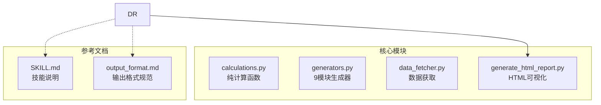
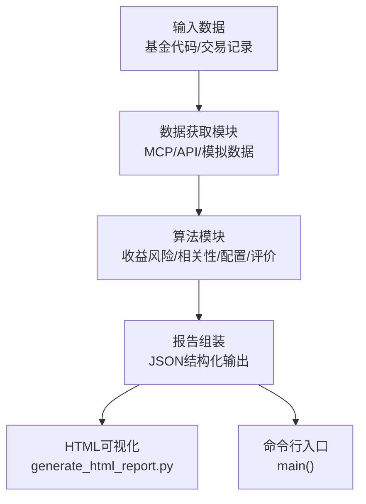
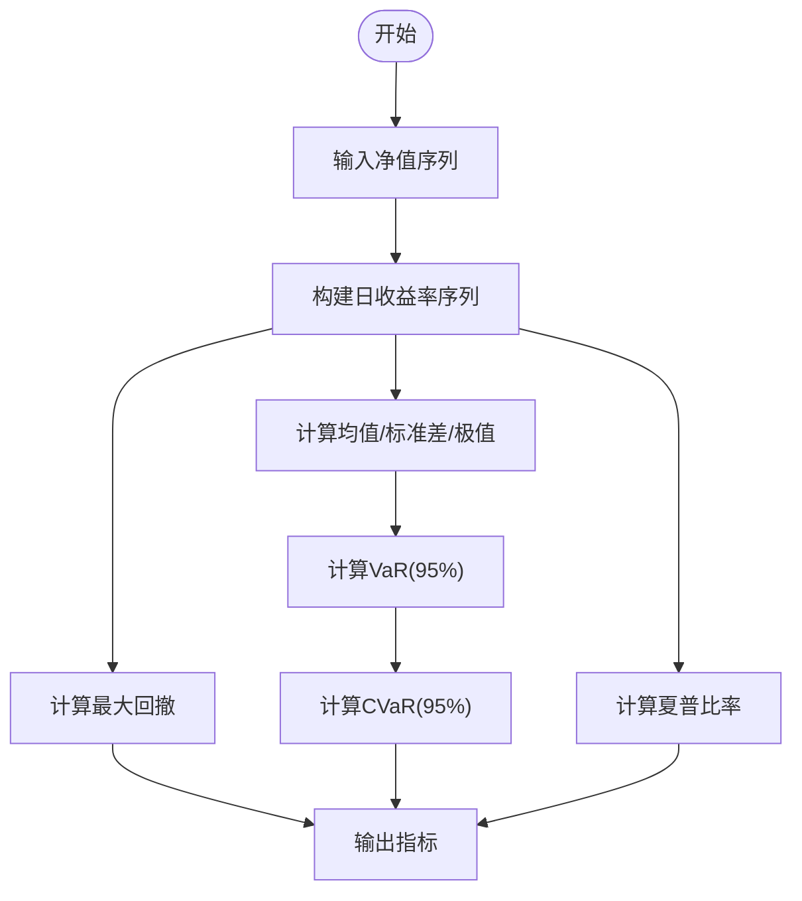
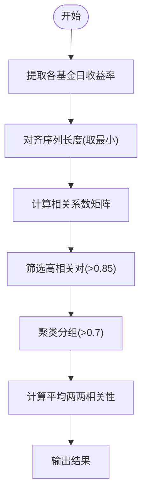
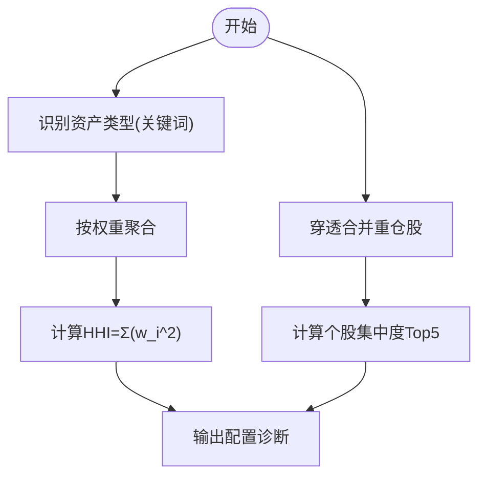
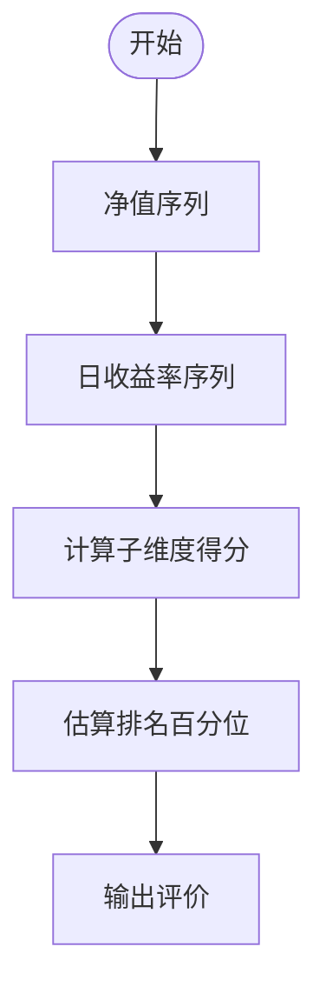
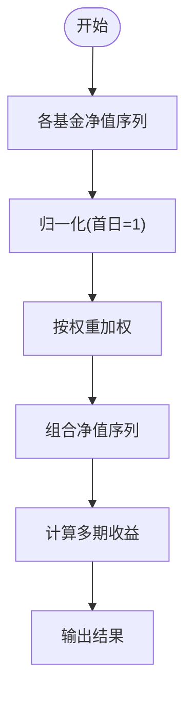
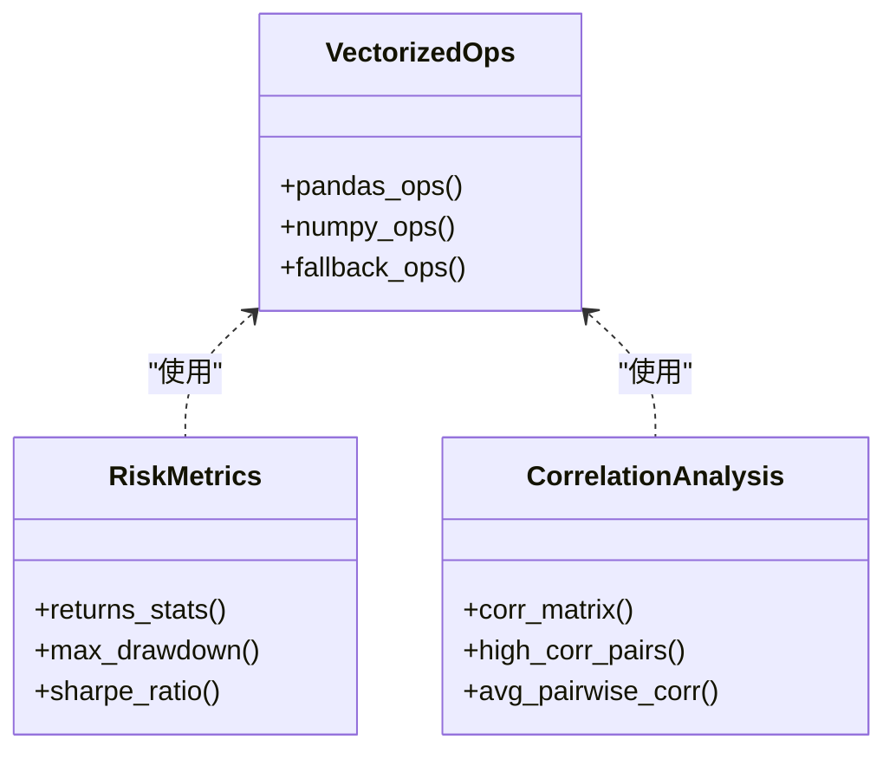
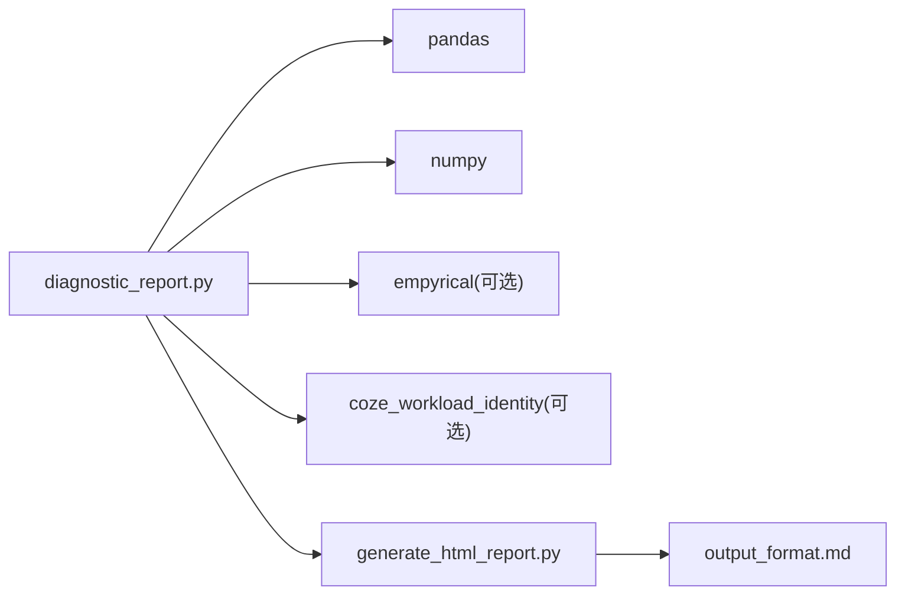

# 分析算法实现

<cite>
**本文档引用的文件**
- [diagnostic_report.py](file://fund-account-diagnostic/scripts/diagnostic_report.py)
- [generate_html_report.py](file://fund-account-diagnostic/scripts/generate_html_report.py)
- [SKILL.md](file://fund-account-diagnostic/SKILL.md)
- [output_format.md](file://fund-account-diagnostic/references/output_format.md)
</cite>

## 目录
1. [简介](#简介)
2. [项目结构](#项目结构)
3. [核心组件](#核心组件)
4. [架构总览](#架构总览)
5. [详细组件分析](#详细组件分析)
6. [依赖分析](#依赖分析)
7. [性能考量](#性能考量)
8. [故障排查指南](#故障排查指南)
9. [结论](#结论)

## 简介
本技术文档聚焦于“分析算法实现”，围绕收益风险计算、相关性分析、配置诊断、基金评价与向量化优化策略展开，结合项目中的实际实现，解释算法原理、数据流、边界条件与精度控制，并提供可视化与报告生成的衔接说明。

## 项目结构
- 核心脚本
  - 诊断与分析主程序：scripts/diagnostic_report.py
  - HTML可视化报告生成：scripts/generate_html_report.py
- 参考文档
  - 技能说明：SKILL.md
  - 报告输出格式：references/output_format.md

**图表来源**
- [constants.py](file://fund-account-diagnostic/scripts/constants.py)
- [generate_html_report.py:1-120](file://fund-account-diagnostic/scripts/generate_html_report.py#L1-L120)
- [SKILL.md:1-120](file://fund-account-diagnostic/SKILL.md#L1-L120)
- [output_format.md:1-120](file://fund-account-diagnostic/references/output_format.md#L1-L120)

**章节来源**
- [constants.py](file://fund-account-diagnostic/scripts/constants.py)
- [generate_html_report.py:1-120](file://fund-account-diagnostic/scripts/generate_html_report.py#L1-L120)
- [SKILL.md:1-120](file://fund-account-diagnostic/SKILL.md#L1-L120)
- [output_format.md:1-120](file://fund-account-diagnostic/references/output_format.md#L1-L120)

## 核心组件
- 收益风险计算
  - 收益率统计指标：均值、标准差、最小/最大值、VaR(95%)、CVaR(95%)
  - 最大回撤：峰值/谷值、起止索引与日期
  - 夏普比率：年化夏普比率，支持empyrical/pandas/numpy/纯Python回退
- 相关性分析
  - 相关系数矩阵：基于pandas/numpy或手动实现
  - 高相关对识别：阈值筛选与分组聚类
  - 平均两两相关性：上三角均值
- 配置诊断
  - 资产配置分析：权益/固收/现金/海外/商品等
  - 行业集中度指数(HHI)：Σ(w_i^2)
  - 穿透式个股集中度：按组合权重合并重仓股
- 基金评价
  - 评分子维度：创新高、择股、择时、规模
  - 排名百分位估算：基于评分分位映射
- 向量化优化
  - pandas/numpy向量化：Series/DataFrame、quantile/percentile、corr/corrcoef、cummax/maximum.accumulate
  - 纯Python回退：保持兼容性与可移植性
- 精度控制与边界条件
  - NaN/Inf保护、分母为0处理、空序列保护、日期对齐与前向填充

**章节来源**
- [calculations.py](file://fund-account-diagnostic/scripts/calculations.py)
- [calculations.py](file://fund-account-diagnostic/scripts/calculations.py)
- [calculations.py](file://fund-account-diagnostic/scripts/calculations.py)
- [calculations.py](file://fund-account-diagnostic/scripts/calculations.py)
- [calculations.py](file://fund-account-diagnostic/scripts/calculations.py)
- [calculations.py](file://fund-account-diagnostic/scripts/calculations.py)
- [generators.py](file://fund-account-diagnostic/scripts/generators.py)

## 架构总览
整体采用“模块化算法 + 统一报告生成”的架构，主程序负责数据获取、算法计算与模块组装，HTML生成器负责将JSON报告渲染为可视化页面。

**图表来源**
- [generators.py](file://fund-account-diagnostic/scripts/generators.py)
- [generate_html_report.py:1-120](file://fund-account-diagnostic/scripts/generate_html_report.py#L1-L120)

**章节来源**
- [generators.py](file://fund-account-diagnostic/scripts/generators.py)
- [generate_html_report.py:1-120](file://fund-account-diagnostic/scripts/generate_html_report.py#L1-L120)

## 详细组件分析

### 收益风险计算算法
- 日收益率序列构建
  - 使用净值序列的连续日变化率，支持pandas/numpy向量化与纯Python回退
- 收益率统计指标
  - 均值、标准差、最小/最大值、VaR(95%)、CVaR(95%)
  - VaR通过分位数计算，CVaR为尾部均值（VaR以下样本的均值）
- 最大回撤
  - 通过滚动峰值与回撤计算，定位最大回撤的起止索引与日期
- 夏普比率
  - 年化夏普比率，优先使用empyrical库，回退到numpy/pandas或纯Python实现

**图表来源**
- [calculations.py](file://fund-account-diagnostic/scripts/calculations.py)
- [calculations.py](file://fund-account-diagnostic/scripts/calculations.py)
- [calculations.py](file://fund-account-diagnostic/scripts/calculations.py)
- [calculations.py](file://fund-account-diagnostic/scripts/calculations.py)

**章节来源**
- [calculations.py](file://fund-account-diagnostic/scripts/calculations.py)
- [calculations.py](file://fund-account-diagnostic/scripts/calculations.py)
- [calculations.py](file://fund-account-diagnostic/scripts/calculations.py)
- [calculations.py](file://fund-account-diagnostic/scripts/calculations.py)

### 相关性分析算法
- 相关系数矩阵
  - 优先使用pandas DataFrame.corr()，回退到逐对计算
  - 对齐不同长度的收益率序列，取最小长度
- 高相关对识别
  - 阈值>0.85的高相关对
  - 基于阈值>0.7的分组聚类，计算组内平均相关性
- 平均两两相关性
  - 上三角非对角线元素均值，用于整体相关性水平评估

**图表来源**
- [generators.py](file://fund-account-diagnostic/scripts/generators.py)

**章节来源**
- [generators.py](file://fund-account-diagnostic/scripts/generators.py)

### 配置诊断算法
- 资产配置分析
  - 基于基金名称/类型关键词识别权益/固收/货币/QDII等
  - 按组合权重聚合，归一化输出
- 行业集中度指数(HHI)
  - Σ(w_i^2)，用于衡量行业集中程度
- 穿透式个股集中度
  - 按组合权重合并各基金重仓股，输出最高集中度个股与Top5

**图表来源**
- [generators.py](file://fund-account-diagnostic/scripts/generators.py)
- [calculations.py](file://fund-account-diagnostic/scripts/calculations.py)
- [calculations.py](file://fund-account-diagnostic/scripts/calculations.py)

**章节来源**
- [generators.py](file://fund-account-diagnostic/scripts/generators.py)
- [calculations.py](file://fund-account-diagnostic/scripts/calculations.py)
- [calculations.py](file://fund-account-diagnostic/scripts/calculations.py)

### 基金评价算法
- 评分子维度
  - 创新高：近期创新高次数占比
  - 择股：基于累计收益与年化收益
  - 择时：基于正负收益日占比与盈亏比
  - 规模：中性默认（无法从净值推断）
- 排名百分位估算
  - 基于评分分位映射估算同类排名百分位

**图表来源**
- [calculations.py](file://fund-account-diagnostic/scripts/calculations.py)
- [calculations.py](file://fund-account-diagnostic/scripts/calculations.py)

**章节来源**
- [calculations.py](file://fund-account-diagnostic/scripts/calculations.py)
- [calculations.py](file://fund-account-diagnostic/scripts/calculations.py)

### 组合净值与多期收益
- 组合净值计算
  - 各基金净值归一化后按权重加权求和，支持pandas/numpy向量化与纯Python回退
- 多期收益
  - 基于组合净值序列按回溯窗口计算1M/3M/6M/1Y/2Y/3Y/成立以来等多期收益

**图表来源**
- [calculations.py](file://fund-account-diagnostic/scripts/calculations.py)
- [calculations.py](file://fund-account-diagnostic/scripts/calculations.py)

**章节来源**
- [calculations.py](file://fund-account-diagnostic/scripts/calculations.py)
- [calculations.py](file://fund-account-diagnostic/scripts/calculations.py)

### 向量化计算优化策略
- pandas路径
  - Series.quantile/percentile、pct_change、cummax、DataFrame.corr
- numpy路径
  - np.std/mean/percentile/corrcoef/maximum.accumulate
- 纯Python回退
  - 保持在无依赖环境下的可运行性

**图表来源**
- [calculations.py](file://fund-account-diagnostic/scripts/calculations.py)
- [calculations.py](file://fund-account-diagnostic/scripts/calculations.py)
- [calculations.py](file://fund-account-diagnostic/scripts/calculations.py)
- [generators.py](file://fund-account-diagnostic/scripts/generators.py)

**章节来源**
- [calculations.py](file://fund-account-diagnostic/scripts/calculations.py)
- [calculations.py](file://fund-account-diagnostic/scripts/calculations.py)
- [calculations.py](file://fund-account-diagnostic/scripts/calculations.py)
- [generators.py](file://fund-account-diagnostic/scripts/generators.py)

## 依赖分析
- 外部依赖
  - pandas/numpy：向量化计算与统计
  - empyrical：高级金融指标（可选）
  - coze_workload_identity：HTTP请求封装（可选）
- 内部模块耦合
  - 算法模块相互独立，通过统一的报告组装接口集成
  - HTML生成器依赖JSON输出格式规范

**图表来源**
- [constants.py](file://fund-account-diagnostic/scripts/constants.py)
- [generate_html_report.py:1-20](file://fund-account-diagnostic/scripts/generate_html_report.py#L1-L20)
- [SKILL.md:4-10](file://fund-account-diagnostic/SKILL.md#L4-L10)

**章节来源**
- [constants.py](file://fund-account-diagnostic/scripts/constants.py)
- [generate_html_report.py:1-20](file://fund-account-diagnostic/scripts/generate_html_report.py#L1-L20)
- [SKILL.md:4-10](file://fund-account-diagnostic/SKILL.md#L4-L10)

## 性能考量
- 向量化优先：pandas/numpy显著提升统计与矩阵运算效率
- 内存对齐：相关性分析中对齐序列长度，避免重复计算
- 缓存与复用：组合净值与多期收益在多个模块中复用
- 降级策略：empyrical缺失时回退到numpy/pandas或纯Python实现

[本节为通用指导，无需特定文件引用]

## 故障排查指南
- API不可用
  - 现象：报告头标注API不可用，使用模拟数据
  - 处理：检查环境变量COZE_QIEMAN_API_{SKILL_ID}，确认网络连通
- Excel解析失败
  - 现象：列名不匹配或数据为空
  - 处理：确认列名映射、Sheet合并与过滤条件
- 数值异常
  - 现象：NaN/Inf、分母为0
  - 处理：检查空序列、零净值、空权重等边界条件

**章节来源**
- [SKILL.md:82-99](file://fund-account-diagnostic/SKILL.md#L82-L99)
- [generators.py](file://fund-account-diagnostic/scripts/generators.py)

## 结论
本项目在收益风险、相关性、配置诊断与基金评价等方面实现了完整的算法闭环，通过pandas/numpy向量化优化与多级回退策略，兼顾了性能与可移植性。报告结构遵循统一的JSON规范并通过HTML可视化增强用户体验。建议在生产环境中优先启用empyrical以获得更稳健的金融指标计算，并注意边界条件与数据质量控制。