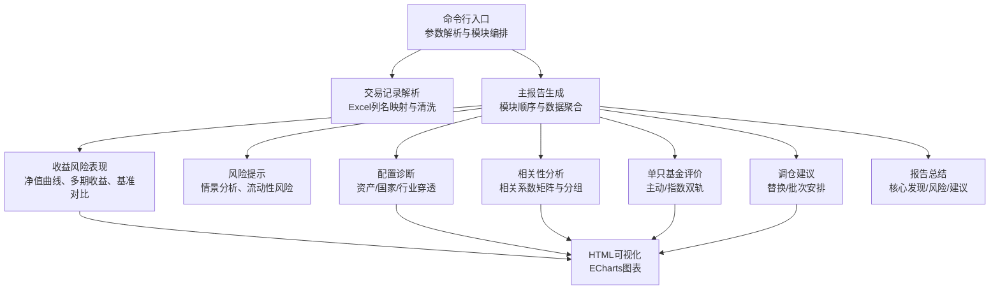
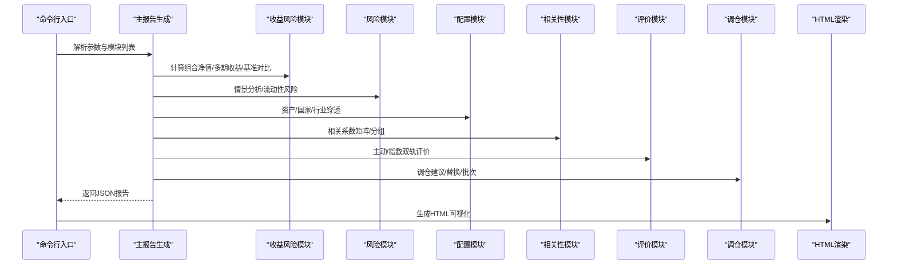
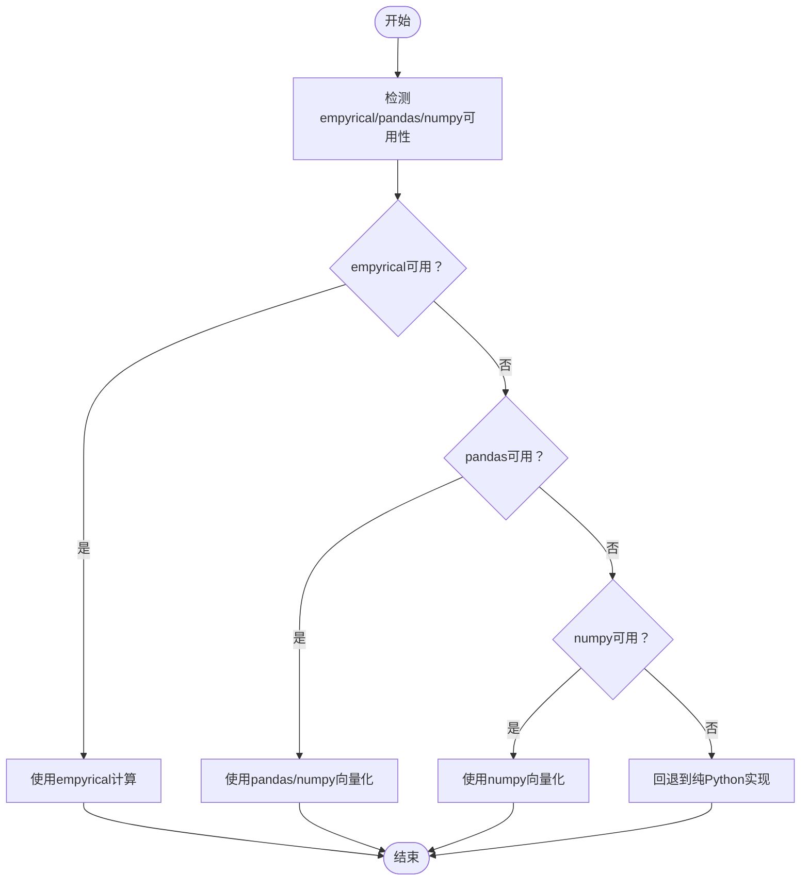
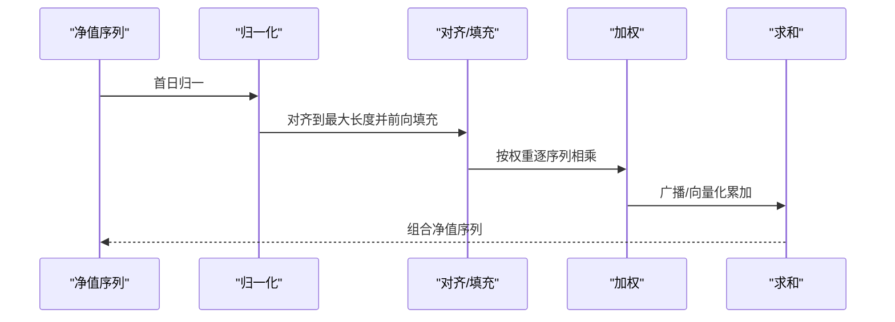
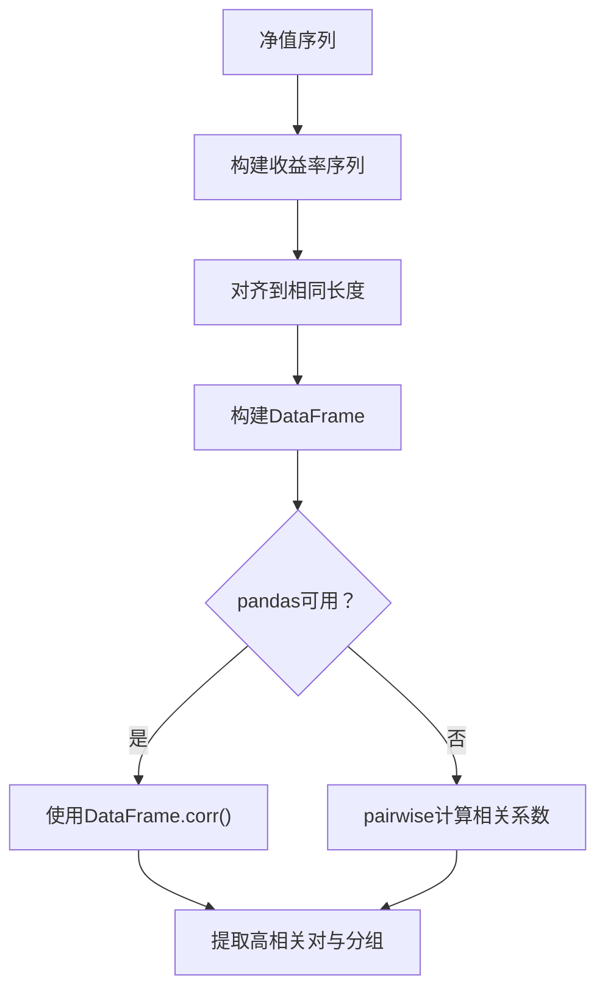
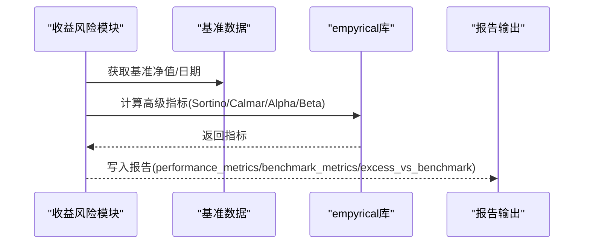
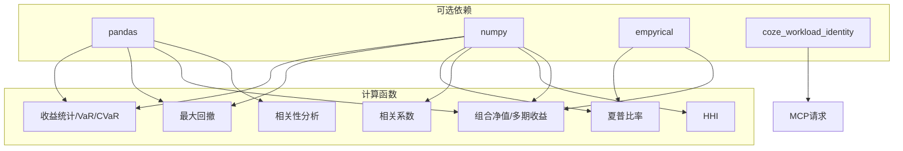

# 向量化计算优化

<cite>
**本文引用的文件**
- [SKILL.md](file://fund-account-diagnostic/SKILL.md)
- [diagnostic_report.py](file://fund-account-diagnostic/scripts/diagnostic_report.py)
- [generate_html_report.py](file://fund-account-diagnostic/scripts/generate_html_report.py)
- [output_format.md](file://fund-account-diagnostic/references/output_format.md)
</cite>

## 目录
1. [简介](#简介)
2. [项目结构](#项目结构)
3. [核心组件](#核心组件)
4. [架构总览](#架构总览)
5. [详细组件分析](#详细组件分析)
6. [依赖关系分析](#依赖关系分析)
7. [性能考量](#性能考量)
8. [故障排查指南](#故障排查指南)
9. [结论](#结论)
10. [附录](#附录)

## 简介
本技术文档聚焦于向量化计算优化，围绕pandas与numpy在金融计算中的应用策略展开，结合本项目的实际实现，系统阐述：
- Series与Array的数据结构优势与向量化操作的性能提升与内存效率
- 多路径计算实现：empyrical、numpy、pandas、手动实现的降级策略
- 并行与批量处理优化技巧（大数据集处理与内存管理）
- 性能测试与基准测试方法论
- 计算精度控制、数值稳定性保障与异常处理机制
- 具体代码示例路径与性能对比思路

## 项目结构
该项目是一个“基金账户诊断”工具链，核心由以下部分组成：
- 命令行入口与主流程：负责参数解析、模块编排与报告生成
- 金融计算模块：涵盖净值归一化、收益率序列、风险指标、相关性分析、组合构建等
- 可视化模块：将JSON报告转换为HTML可视化报告
- 输出规范：标准化JSON输出格式，明确各模块字段与含义

图表来源
- [generators.py](file://fund-account-diagnostic/scripts/generators.py)
- [generate_html_report.py:1-120](file://fund-account-diagnostic/scripts/generate_html_report.py#L1-L120)

章节来源
- [SKILL.md:12-385](file://fund-account-diagnostic/SKILL.md#L12-L385)
- [constants.py](file://fund-account-diagnostic/scripts/constants.py)

## 核心组件
- 金融计算引擎：封装了多处向量化计算函数，优先使用pandas/numpy，回退到纯Python实现，确保在不同依赖环境下稳定运行
- 数据获取层：基于MCP协议调用外部API，失败时自动降级为模拟数据，保障可用性
- 报告生成器：按模块顺序组装报告，支持JSON与HTML两种输出
- 可视化渲染器：将JSON报告转换为交互式HTML，使用ECharts展示净值曲线、基准对比、评分与调仓建议等

章节来源
- [calculations.py](file://fund-account-diagnostic/scripts/calculations.py)
- [calculations.py](file://fund-account-diagnostic/scripts/calculations.py)
- [calculations.py](file://fund-account-diagnostic/scripts/calculations.py)
- [generators.py](file://fund-account-diagnostic/scripts/generators.py)
- [generate_html_report.py:1-120](file://fund-account-diagnostic/scripts/generate_html_report.py#L1-L120)

## 架构总览
系统采用“模块化+多路径计算”的架构：
- 模块化：按诊断、概览、收益、风险、配置、相关性、评价、调仓、总结顺序组织
- 多路径计算：在每个计算函数内部，优先尝试pandas/numpy/empyrical，若不可用则回退到NumPy或纯Python实现
- 降级策略：API不可用时自动切换到模拟数据，保证报告可用性与一致性

图表来源
- [generators.py](file://fund-account-diagnostic/scripts/generators.py)
- [generate_html_report.py:1-120](file://fund-account-diagnostic/scripts/generate_html_report.py#L1-L120)

## 详细组件分析

### 向量化计算与数据结构优势
- Series与Array的优势
  - 归一化与加权：在组合净值计算中，使用pandas Series进行对齐与广播，显著减少循环开销；numpy数组在pad/累积运算中具备高效向量化能力
  - 时间序列处理：pandas的pct_change、cummax、quantile等原语，避免显式循环与中间变量，降低内存占用
- 性能与内存效率
  - 向量化操作避免Python循环，减少GIL竞争与对象创建
  - 使用dtype=float与就地运算（如reindex/ffill）减少拷贝

章节来源
- [calculations.py](file://fund-account-diagnostic/scripts/calculations.py)
- [calculations.py](file://fund-account-diagnostic/scripts/calculations.py)
- [calculations.py](file://fund-account-diagnostic/scripts/calculations.py)

### 多路径计算实现策略
- 收益统计与VaR/CVaR
  - 优先pandas：Series.mean/std/quantile，回退numpy：np.mean/std/percentile，最终回退纯Python实现
- 最大回撤
  - 优先pandas：Series.cummax与idxmax定位峰值，回退numpy：np.maximum.accumulate与where，最终回退纯Python
- 夏普比率
  - 优先empyrical：battle-tested annualized Sharpe，回退numpy：自行计算年化收益与波动率，最终回退纯Python
- 相关系数
  - 优先numpy：np.corrcoef，回退纯Python实现
- 行业集中度(HHI)
  - 优先numpy：np.sum(w**2)，回退纯Python：sum(w**2)

图表来源
- [calculations.py](file://fund-account-diagnostic/scripts/calculations.py)
- [calculations.py](file://fund-account-diagnostic/scripts/calculations.py)
- [calculations.py](file://fund-account-diagnostic/scripts/calculations.py)
- [calculations.py](file://fund-account-diagnostic/scripts/calculations.py)
- [calculations.py](file://fund-account-diagnostic/scripts/calculations.py)

章节来源
- [calculations.py](file://fund-account-diagnostic/scripts/calculations.py)
- [calculations.py](file://fund-account-diagnostic/scripts/calculations.py)
- [calculations.py](file://fund-account-diagnostic/scripts/calculations.py)
- [calculations.py](file://fund-account-diagnostic/scripts/calculations.py)
- [calculations.py](file://fund-account-diagnostic/scripts/calculations.py)

### 组合净值与多期收益计算
- 组合净值计算
  - 归一化：各基金净值首日归一
  - 对齐与填充：pandas按最大长度reindex并前向填充，numpy使用full+切片
  - 加权求和：pandas广播相乘后累加，numpy逐数组相乘后累加
- 多期收益
  - 基于净值序列按回溯窗口计算，支持1m/3m/6m/1y/2y/3y/since_inception
  - 缺失数据时省略对应期间，避免错误传播

图表来源
- [calculations.py](file://fund-account-diagnostic/scripts/calculations.py)

章节来源
- [calculations.py](file://fund-account-diagnostic/scripts/calculations.py)
- [calculations.py](file://fund-account-diagnostic/scripts/calculations.py)

### 相关性分析与分组
- 收益率序列构建：使用nav_to_returns，优先pandas的pct_change，回退numpy的diff，最终回退纯Python
- 相关系数矩阵：优先pandas DataFrame.corr，回退pairwise计算
- 分组与高相关对：基于阈值(0.85/0.7)聚类形成组，计算组内平均相关性

图表来源
- [generators.py](file://fund-account-diagnostic/scripts/generators.py)
- [calculations.py](file://fund-account-diagnostic/scripts/calculations.py)

章节来源
- [generators.py](file://fund-account-diagnostic/scripts/generators.py)
- [calculations.py](file://fund-account-diagnostic/scripts/calculations.py)

### 风险指标与基准对比
- 风险指标：最大回撤、波动率、夏普比率、Sortino、Calmar、下行风险、尾部比率、Alpha/Beta
- 基准对比：支持真实指数数据与虚拟基准，组合净值与基准净值同步标准化
- 情景分析：基于年化波动率构建牛市/基准/熊市预期收益与回撤

图表来源
- [generators.py](file://fund-account-diagnostic/scripts/generators.py)

章节来源
- [generators.py](file://fund-account-diagnostic/scripts/generators.py)

### 可视化与报告输出
- HTML报告：使用ECharts绘制净值曲线、基准对比、评分与调仓建议等图表
- JSON输出：严格遵循输出格式规范，字段命名与层级清晰，便于前端渲染与二次加工

章节来源
- [generate_html_report.py:1-120](file://fund-account-diagnostic/scripts/generate_html_report.py#L1-L120)
- [output_format.md:1-120](file://fund-account-diagnostic/references/output_format.md#L1-L120)

## 依赖关系分析
- 可选依赖检测：在模块顶部通过try/except检测pandas、numpy、empyrical、coze_workload_identity是否存在
- 降级策略：API不可用时自动切换到模拟数据；计算函数内部按路径回退
- 模块耦合：主流程按模块顺序编排，模块间通过共享数据结构（如净值序列、权重、日期）进行解耦

图表来源
- [constants.py](file://fund-account-diagnostic/scripts/constants.py)
- [calculations.py](file://fund-account-diagnostic/scripts/calculations.py)
- [calculations.py](file://fund-account-diagnostic/scripts/calculations.py)
- [calculations.py](file://fund-account-diagnostic/scripts/calculations.py)
- [calculations.py](file://fund-account-diagnostic/scripts/calculations.py)
- [calculations.py](file://fund-account-diagnostic/scripts/calculations.py)
- [calculations.py](file://fund-account-diagnostic/scripts/calculations.py)
- [generators.py](file://fund-account-diagnostic/scripts/generators.py)

章节来源
- [constants.py](file://fund-account-diagnostic/scripts/constants.py)
- [calculations.py](file://fund-account-diagnostic/scripts/calculations.py)
- [generators.py](file://fund-account-diagnostic/scripts/generators.py)

## 性能考量
- 向量化优先：pandas/numpy在大规模序列上的性能远优于纯Python循环
- 内存管理：使用reindex/ffill与切片填充，避免重复构造中间列表；在组合净值计算中，尽量复用Series/Array
- 数值稳定性：在除法与log等操作中加入0值保护与异常分支；在相关系数计算中处理NaN
- 并行与批量：当前实现为串行模块化流程；在数据获取阶段可并发调用MCP工具（需扩展），但需注意线程安全与依赖检测
- 基准测试方法论
  - 使用timeit或pytest-benchmark测量关键函数（如组合净值、相关系数、夏普比率）在不同数据规模下的耗时
  - 对比empyrical、numpy、pandas与纯Python实现的性能差异
  - 通过profile或memory_profiler监控内存峰值与分配热点

[本节为通用指导，不直接分析具体文件]

## 故障排查指南
- API不可用
  - 现象：报告头标记api_available为False，数据来源note提示模拟数据
  - 处理：检查COZE_QIEMAN_API_{SKILL_ID}环境变量；确认网络连通性；查看错误恢复流程
- Excel解析失败
  - 现象：列名不匹配或文件为空
  - 处理：启用模糊匹配与列名映射；必要时打印可用列名列表辅助修复
- 计算异常
  - 现象：夏普比率返回0、相关系数NaN、最大回撤异常
  - 处理：检查输入序列长度与首日归一化；在empyrical路径失败时自动回退到numpy或纯Python

章节来源
- [SKILL.md:82-98](file://fund-account-diagnostic/SKILL.md#L82-L98)
- [generators.py](file://fund-account-diagnostic/scripts/generators.py)
- [calculations.py](file://fund-account-diagnostic/scripts/calculations.py)
- [calculations.py](file://fund-account-diagnostic/scripts/calculations.py)
- [generators.py](file://fund-account-diagnostic/scripts/generators.py)

## 结论
本项目在金融计算中系统实践了多路径向量化策略：以pandas/numpy/empyrical为首选，纯Python为兜底，既保证了性能与精度，又提升了可用性与鲁棒性。通过模块化与标准化输出，实现了从数据获取、计算、报告生成到可视化的完整链路。建议在后续迭代中引入并发数据获取与更完善的基准测试体系，进一步提升吞吐与可观测性。

[本节为总结性内容，不直接分析具体文件]

## 附录
- 输出格式参考：详见输出规范文档，明确各模块字段与数据类型
- 命令行参数：支持模块选择、输出格式、交易记录统计展示等

章节来源
- [output_format.md:1-120](file://fund-account-diagnostic/references/output_format.md#L1-L120)
- [generators.py](file://fund-account-diagnostic/scripts/generators.py)