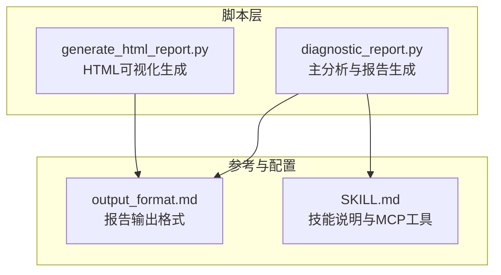
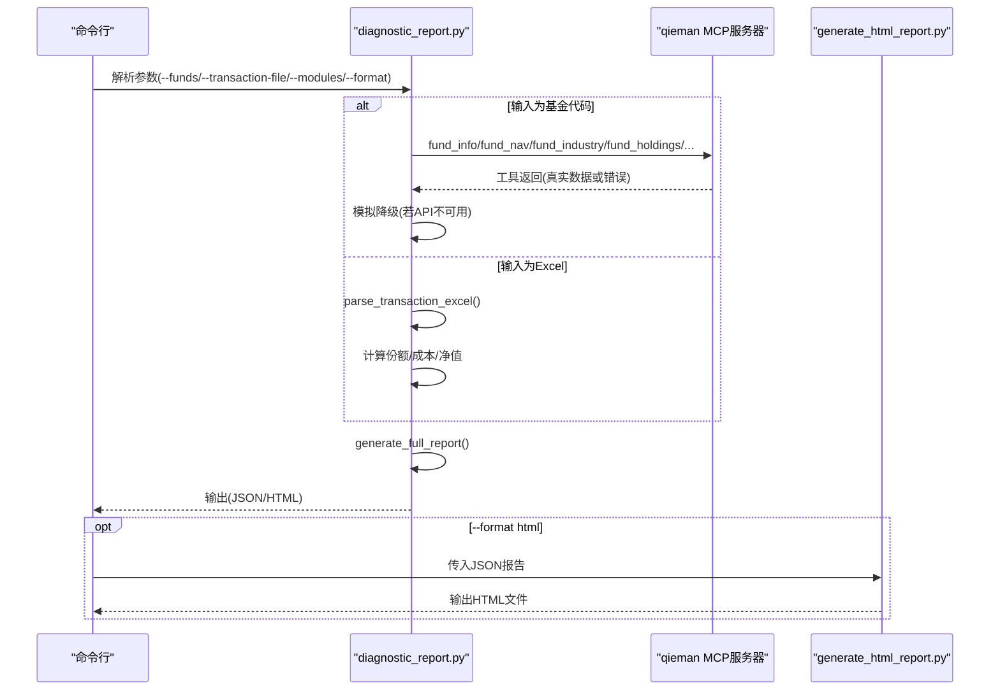
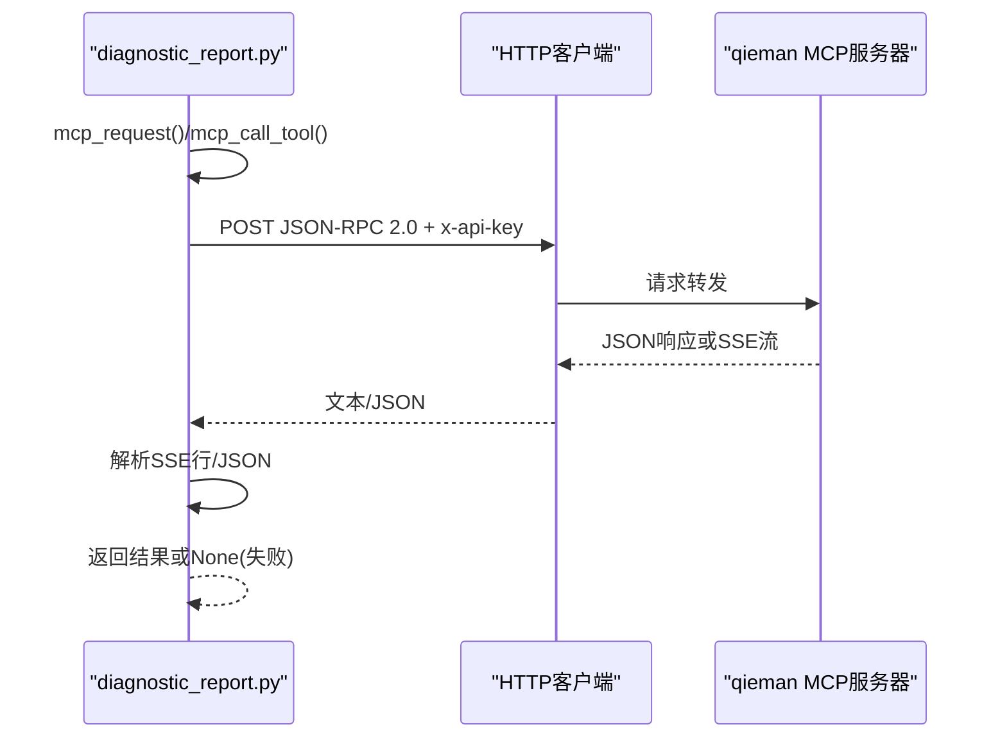
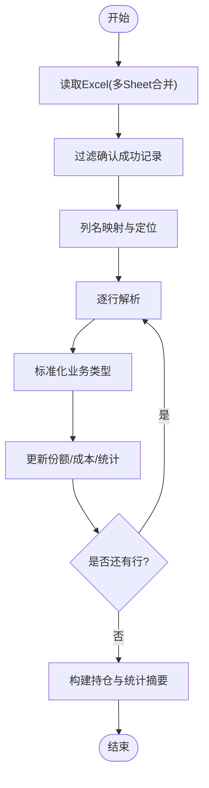
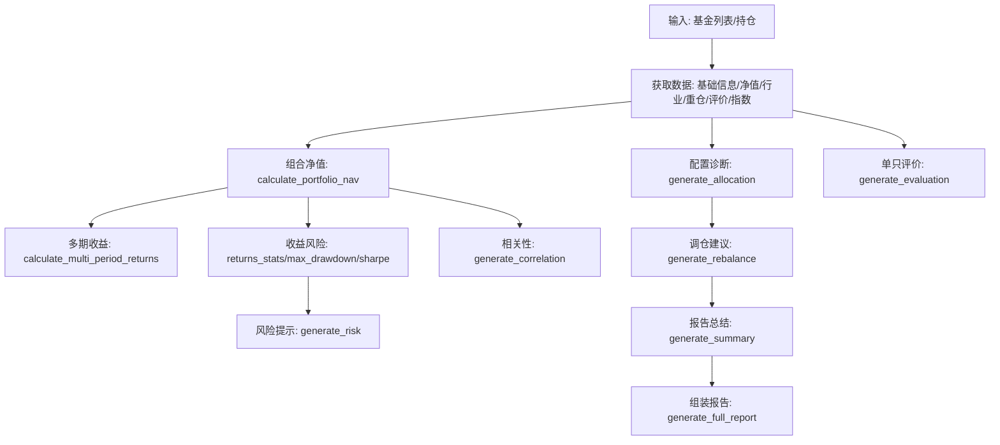
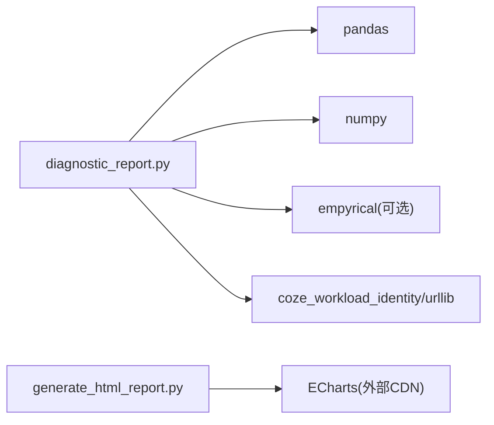

# 技术实现细节

<cite>
**本文引用的文件**
- [SKILL.md](file://fund-account-diagnostic/SKILL.md)
- [diagnostic_report.py](file://fund-account-diagnostic/scripts/diagnostic_report.py)
- [generate_html_report.py](file://fund-account-diagnostic/scripts/generate_html_report.py)
- [output_format.md](file://fund-account-diagnostic/references/output_format.md)
</cite>

## 目录
1. [简介](#简介)
2. [项目结构](#项目结构)
3. [核心组件](#核心组件)
4. [架构总览](#架构总览)
5. [详细组件分析](#详细组件分析)
6. [依赖分析](#依赖分析)
7. [性能考量](#性能考量)
8. [故障排查指南](#故障排查指南)
9. [结论](#结论)
10. [附录](#附录)

## 简介
本项目为“基金账户诊断技能”提供完整的技术实现细节，围绕以下目标展开：
- 集成 qieman MCP 服务器，实现认证与调用机制、错误处理与模拟降级
- 实现数据获取的完整流程：实时数据获取、模拟数据降级、缓存策略
- 核心分析算法：收益风险计算、相关性分析、配置诊断等
- Excel 交易记录解析：列名映射、数据验证、异常处理
- 向量化计算优化：pandas/numpy 提升性能
- 模块化架构与插件式扩展机制
- 代码结构与关键类设计模式
- 性能优化与内存管理策略

## 项目结构
项目采用脚本驱动的模块化组织，核心文件如下：
- scripts/diagnostic_report.py：主入口，编排模块调用
- scripts/mcp_client.py：MCP协议客户端
- scripts/data_fetcher.py：数据获取与模拟降级
- scripts/calculations.py：收益/风险/相关性等纯计算函数
- scripts/generators.py：9模块报告生成器
- scripts/excel_parser.py：交易记录Excel解析
- scripts/generate_html_report.py：将JSON报告渲染为HTML可视化报告
- references/output_format.md：标准化报告输出格式定义
- SKILL.md：技能说明、使用方式、MCP工具清单、核心计算逻辑

**图表来源**
- [diagnostic_report.py](file://fund-account-diagnostic/scripts/diagnostic_report.py)
- [generate_html_report.py](file://fund-account-diagnostic/scripts/generate_html_report.py)
- [output_format.md](file://fund-account-diagnostic/references/output_format.md)
- [SKILL.md](file://fund-account-diagnostic/SKILL.md)

**章节来源**
- [SKILL.md](file://fund-account-diagnostic/SKILL.md)
- [diagnostic_report.py](file://fund-account-diagnostic/scripts/diagnostic_report.py)
- [generate_html_report.py](file://fund-account-diagnostic/scripts/generate_html_report.py)
- [output_format.md](file://fund-account-diagnostic/references/output_format.md)

## 核心组件
- MCP 客户端与工具调用：封装 JSON-RPC 请求、认证头、SSE 响应处理、工具调用包装
- 数据获取模块：按工具维度拉取基础信息、净值、行业配置、重仓股、评价、指数、经理评分、子维度、公告等，并支持模拟降级
- 交易记录解析：Excel 列名映射、业务类型识别、份额与成本计算、统计摘要
- 分析算法模块：组合净值计算、多期收益、收益风险指标、最大回撤、相关性分析、配置诊断、穿透集中度、调仓建议、风险提示、报告总结
- 向量化计算：pandas/numpy 优化统计、协方差、相关系数、滚动/对齐等
- 报告生成：模块化组装、顺序控制、HTML 渲染

**章节来源**
- [diagnostic_report.py](file://fund-account-diagnostic/scripts/diagnostic_report.py)
- [SKILL.md](file://fund-account-diagnostic/SKILL.md)

## 架构总览
系统以命令行为入口，支持两种数据输入：
- 基金代码列表：直接调用MCP工具获取数据
- 交易记录Excel：解析持仓、计算当前净值、生成报告

**图表来源**
- [diagnostic_report.py](file://fund-account-diagnostic/scripts/diagnostic_report.py)
- [generate_html_report.py](file://fund-account-diagnostic/scripts/generate_html_report.py)
- [SKILL.md](file://fund-account-diagnostic/SKILL.md)

## 详细组件分析

### MCP 协议集成与调用机制
- 认证方式：x-api-key 头，来自环境变量 COZE_QIEMAN_API_{SKILL_ID}
- 请求格式：JSON-RPC 2.0，方法名支持 tools/call 与具体工具名
- SSE 响应处理：兼容 coze_workload_identity 与标准 urllib，提取 data: 行
- 错误处理：HTTP 4xx/5xx 返回None；MCP isError 标记视为失败；API不可用时降级为模拟数据

**图表来源**
- [diagnostic_report.py](file://fund-account-diagnostic/scripts/diagnostic_report.py)

**章节来源**
- [diagnostic_report.py](file://fund-account-diagnostic/scripts/diagnostic_report.py)
- [SKILL.md](file://fund-account-diagnostic/SKILL.md)

### 数据获取与模拟降级策略
- 基础信息：fund_info
- 净值序列：fund_nav（支持 start_date/end_date）
- 行业配置：fund_industry_allocation
- 重仓股：fund_holdings
- 基金评价：fund_evaluate(active/index)
- 指数净值：index_nav
- 经理评分：fund_manager_rating
- 评分子维度：fund_subscores
- 公告/舆情：fund_announcement
- 组合净值：portfolio_nav（由各基金净值加权合成）

降级策略：任一工具调用失败或API不可用时，返回模拟数据（确定性随机生成），保证报告完整性。

**章节来源**
- [diagnostic_report.py](file://fund-account-diagnostic/scripts/diagnostic_report.py)
- [SKILL.md](file://fund-account-diagnostic/SKILL.md)

### Excel 交易记录解析
- 列名映射：EXCEL_COLUMN_MAPPING 支持多列名别名
- 业务类型识别：normalize_operation，优先精确匹配 ignore 类型
- 份额与成本：申购/赎回/分红/转换/转入/转出的会计处理
- 日期格式：YYYYMMDD 转 YYYY-MM-DD
- 统计摘要：交易次数、金额、费用、清仓基金追踪、换手率、投资年限等

**图表来源**
- [diagnostic_report.py](file://fund-account-diagnostic/scripts/diagnostic_report.py)

**章节来源**
- [diagnostic_report.py](file://fund-account-diagnostic/scripts/diagnostic_report.py)

### 核心分析算法实现
- 组合净值计算：calculate_portfolio_nav，支持pandas/numpy向量化与回填补齐
- 多期收益：calculate_multi_period_returns，基于回溯窗口
- 收益风险指标：calculate_returns_stats、calculate_max_drawdown、calculate_sharpe_ratio
- 相关系数：calculate_correlation，优先NumPy corrcoef，回退手动实现
- 行业集中度：calculate_hhi
- 评分子维度：compute_sub_dimension_scores（创新高/择股/择时/规模）
- 穿透集中度：compute_stock_concentration（按组合权重穿透）
- 基准选择：select_benchmark_index（基于基金类型关键词）
- 调仓建议：generate_rebalance（基于偏离度与评分）
- 风险提示：generate_risk（情景分析、市场/流动性风险、最大回撤区间）
- 报告总结：generate_summary（核心发现/关键风险/优化建议）

**图表来源**
- [diagnostic_report.py](file://fund-account-diagnostic/scripts/diagnostic_report.py)

**章节来源**
- [diagnostic_report.py](file://fund-account-diagnostic/scripts/diagnostic_report.py)
- [SKILL.md](file://fund-account-diagnostic/SKILL.md)

### 向量化计算优化
- pandas：Series/DataFrame 对齐、pct_change、corr、reindex、ffill
- numpy：数组化运算、std/variance/percentile、corrcoef、maximum.accumulate、where
- 降级路径：原生循环，保证在无依赖环境下可用
- 性能收益：显著减少循环开销，提升统计与矩阵运算速度

**章节来源**
- [diagnostic_report.py](file://fund-account-diagnostic/scripts/diagnostic_report.py)

### 模块化架构与插件式扩展
- 模块顺序：diagnosis → overview → performance → risk → allocation → correlation → evaluation → rebalance → summary
- 按需加载：--modules 控制启用模块，避免不必要的计算
- 扩展点：
  - 新增MCP工具：在数据获取模块添加新工具函数，遵循统一返回(数据, 是否真实)
  - 新增分析模块：在 generate_full_report 中按顺序插入
  - 新增HTML模块：在 generate_html_report.py 中新增渲染函数并加入 build_html

**章节来源**
- [diagnostic_report.py](file://fund-account-diagnostic/scripts/diagnostic_report.py)
- [generate_html_report.py](file://fund-account-diagnostic/scripts/generate_html_report.py)

### 关键类与设计模式
- 工具函数类：parse_amount、normalize_operation、find_column 等，纯函数风格，便于测试与复用
- 模块化函数族：generate_* 与 calculate_*，职责单一，接口清晰
- 降级策略：统一的模拟数据生成器，保证在API不可用时仍可运行
- 配置中心：常量区（SKILL_ID、MCP URL、API KEY、目标配置、分析期等）

**章节来源**
- [diagnostic_report.py](file://fund-account-diagnostic/scripts/diagnostic_report.py)

## 依赖分析
- 必要依赖：pandas、numpy、empyrical（可选）
- HTTP 客户端：coze_workload_identity（预装）或标准库 urllib
- 输出格式：JSON（标准输出/文件），HTML（ECharts可视化）

**图表来源**
- [diagnostic_report.py](file://fund-account-diagnostic/scripts/diagnostic_report.py)
- [generate_html_report.py](file://fund-account-diagnostic/scripts/generate_html_report.py)

**章节来源**
- [SKILL.md](file://fund-account-diagnostic/SKILL.md)
- [diagnostic_report.py](file://fund-account-diagnostic/scripts/diagnostic_report.py)
- [generate_html_report.py](file://fund-account-diagnostic/scripts/generate_html_report.py)

## 性能考量
- 向量化优先：pandas/numpy 优先，回退原生实现
- 数据对齐与补齐：pandas reindex + ffill，避免显式循环
- 相关系数：优先 NumPy corrcoef，避免重复计算
- 内存管理：逐模块生成，避免一次性加载全部数据；HTML生成器按需拼装
- I/O 优化：Excel 读取一次，多处复用；MCP 工具批量调用

[本节为通用指导，不直接分析具体文件]

## 故障排查指南
- API 不可用：检查 x-api-key 环境变量；确认 MCP URL 可访问；查看 report_header.api_available
- Excel 解析失败：确认列名映射、日期格式、确认结果列；检查 sheet 合并逻辑
- 数据为空：检查 MCP 工具返回结构；确认模拟降级是否生效
- 性能问题：确保安装 pandas/numpy/empyrical；检查是否强制走回退路径

**章节来源**
- [diagnostic_report.py](file://fund-account-diagnostic/scripts/diagnostic_report.py)
- [SKILL.md](file://fund-account-diagnostic/SKILL.md)

## 结论
本项目通过模块化设计与向量化计算，实现了从数据获取、分析计算到报告生成的完整闭环。MCP 集成具备完善的认证与降级策略，Excel 解析支持灵活列名与严格校验，HTML 报告提供丰富的可视化图表。整体架构易于扩展，适合进一步引入更多分析维度与可视化组件。

[本节为总结性内容，不直接分析具体文件]

## 附录
- 报告输出格式：见 references/output_format.md
- 使用示例与参数：见 SKILL.md

**章节来源**
- [output_format.md](file://fund-account-diagnostic/references/output_format.md)
- [SKILL.md](file://fund-account-diagnostic/SKILL.md)