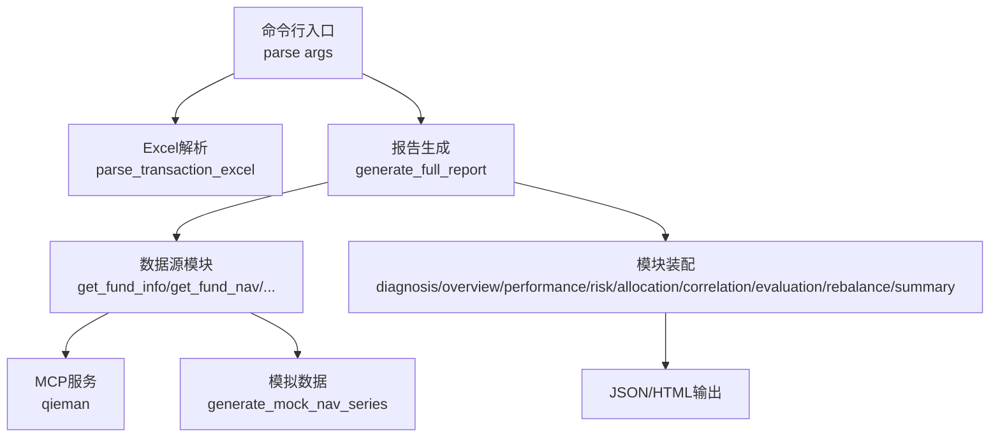
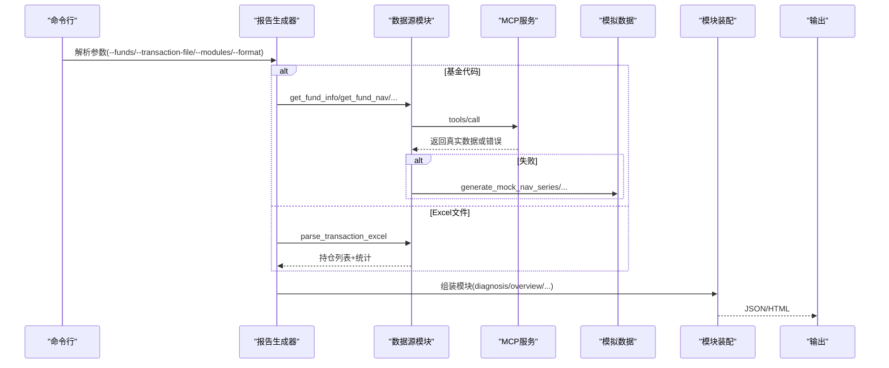
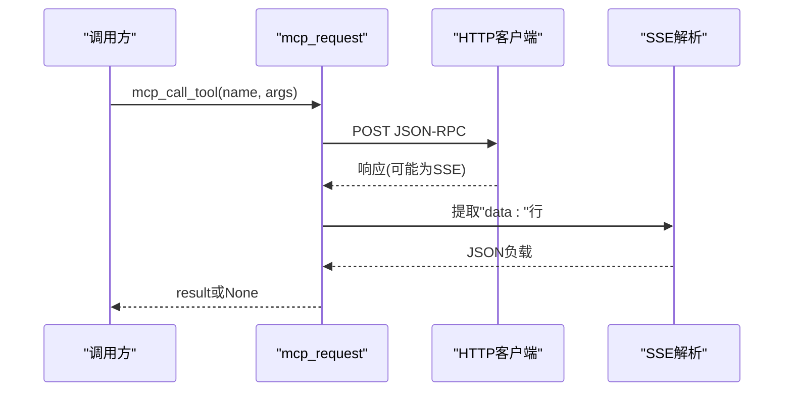
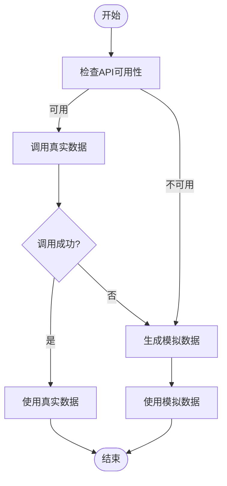
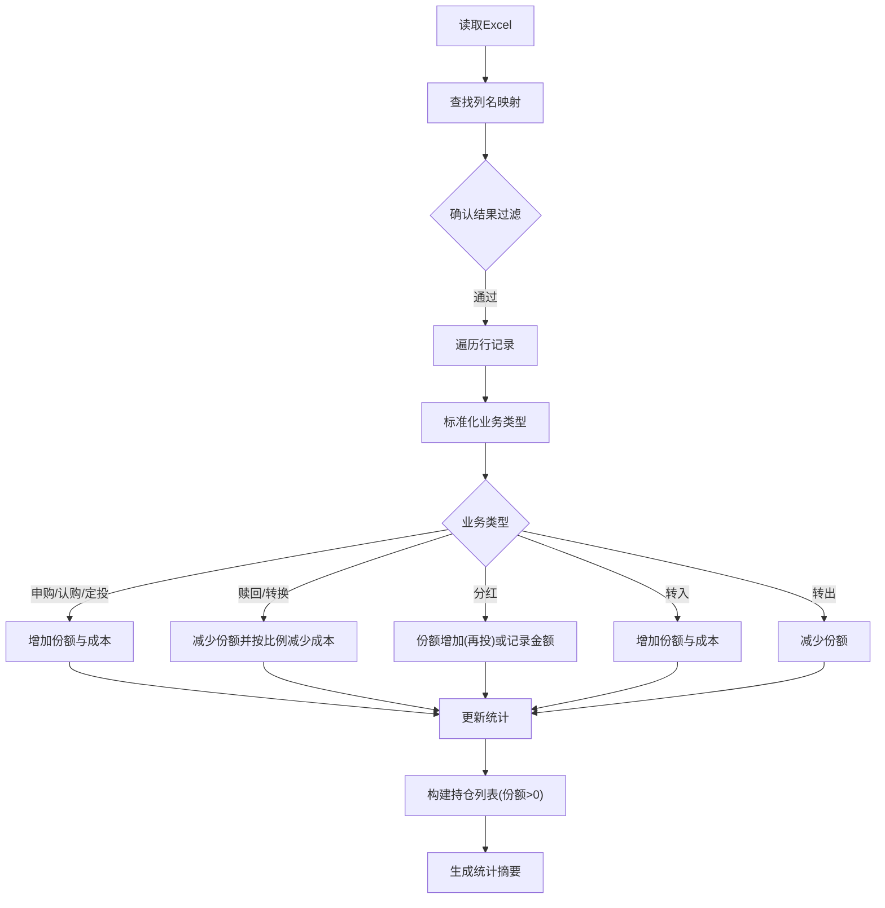
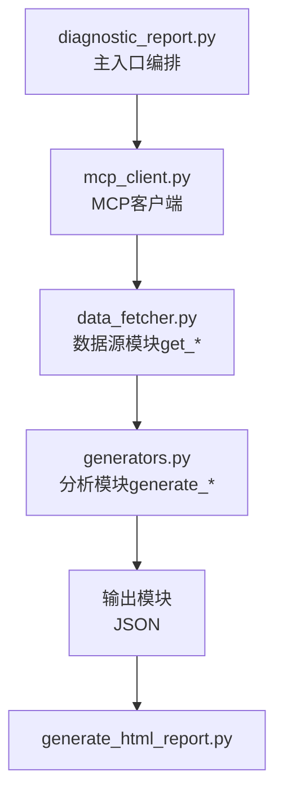

# 数据获取机制

<cite>
**本文引用的文件**
- [SKILL.md](file://fund-account-diagnostic/SKILL.md)
- [diagnostic_report.py](file://fund-account-diagnostic/scripts/diagnostic_report.py)
- [generate_html_report.py](file://fund-account-diagnostic/scripts/generate_html_report.py)
- [output_format.md](file://fund-account-diagnostic/references/output_format.md)
</cite>

## 目录
1. [简介](#简介)
2. [项目结构](#项目结构)
3. [核心组件](#核心组件)
4. [架构总览](#架构总览)
5. [详细组件分析](#详细组件分析)
6. [依赖关系分析](#依赖关系分析)
7. [性能考量](#性能考量)
8. [故障排查指南](#故障排查指南)
9. [结论](#结论)
10. [附录](#附录)

## 简介
本文件围绕“数据获取机制”展开，系统性阐述实时数据获取、模拟数据降级、缓存策略、Excel交易记录解析、API可用性检查、错误恢复与性能优化等关键技术点。文档面向不同技术背景读者，既提供高层概览，也给出代码级的结构与流程图示，帮助快速定位实现细节与扩展点。

## 项目结构
- 主入口：scripts/diagnostic_report.py，负责命令行参数解析与模块编排
- 数据获取：scripts/data_fetcher.py，封装MCP工具调用与模拟降级
- MCP客户端：scripts/mcp_client.py，JSON-RPC 2.0协议
- 报告生成：scripts/generators.py，9模块报告生成器
- HTML渲染：scripts/generate_html_report.py
- HTML可视化报告生成器 scripts/generate_html_report.py 负责将JSON报告渲染为交互式HTML。
- 参考文档 references/output_format.md 定义了报告输出格式与字段规范。
- SKILL.md 提供技能说明、数据源、降级机制、错误恢复流程等高层说明。

图表来源
- [generators.py](file://fund-account-diagnostic/scripts/generators.py)
- [generators.py](file://fund-account-diagnostic/scripts/generators.py)
- [generators.py](file://fund-account-diagnostic/scripts/generators.py)

章节来源
- [SKILL.md:1-385](file://fund-account-diagnostic/SKILL.md#L1-L385)
- [constants.py](file://fund-account-diagnostic/scripts/constants.py)

## 核心组件
- HTTP请求与MCP客户端：封装MCP协议调用，支持coze_workload_identity或标准urllib，统一处理SSE与JSON-RPC响应。
- 模拟数据降级：在API不可用或失败时，使用确定性随机生成的净值、行业配置、重仓股、评价等数据。
- 缓存策略：通过环境变量控制目标配置、基准配置与分析期，避免重复初始化开销；对已解析Excel数据采用内存缓存。
- Excel交易记录解析：列名映射、业务类型识别、份额与成本计算、异常处理与统计汇总。
- API可用性检查：通过环境变量检测与is_api_available判断，决定是否启用真实数据。
- 报告生成与模块装配：按用户指定顺序组装模块，注入数据源状态与降级标记。

章节来源
- [calculations.py](file://fund-account-diagnostic/scripts/calculations.py)
- [calculations.py](file://fund-account-diagnostic/scripts/calculations.py)
- [generators.py](file://fund-account-diagnostic/scripts/generators.py)
- [generators.py](file://fund-account-diagnostic/scripts/generators.py)
- [generators.py](file://fund-account-diagnostic/scripts/generators.py)

## 架构总览
数据流从命令行开始，解析输入后进入报告生成器。报告生成器根据输入类型（基金代码列表或Excel文件）选择不同的数据路径：前者走MCP真实数据或模拟降级；后者直接解析Excel并生成报告。模块装配阶段将诊断、概览、收益、风险、配置、相关性、评价、调仓与总结等模块按顺序拼装，最终输出JSON或HTML。

图表来源
- [generators.py](file://fund-account-diagnostic/scripts/generators.py)
- [generators.py](file://fund-account-diagnostic/scripts/generators.py)
- [generators.py](file://fund-account-diagnostic/scripts/generators.py)
- [generators.py](file://fund-account-diagnostic/scripts/generators.py)

## 详细组件分析

### HTTP请求处理与MCP客户端
- JSON-RPC封装：构造jsonrpc 2.0请求，携带x-api-key头，支持SSE响应解析。
- 工具调用：mcp_call_tool统一封装tools/call，自动处理isError字段与返回结构。
- 依赖注入：优先使用coze_workload_identity的requests，否则回退到标准urllib，确保在不同运行环境下可用。

图表来源
- [calculations.py](file://fund-account-diagnostic/scripts/calculations.py)

章节来源
- [calculations.py](file://fund-account-diagnostic/scripts/calculations.py)

### 响应解析与数据验证
- 错误处理：捕获异常并返回None，调用方据此判定降级。
- 结果校验：检查result字段与isError标志，避免错误响应被误用。
- SSE兼容：对SSE响应逐行扫描，提取"data:"行后解析为JSON。

章节来源
- [calculations.py](file://fund-account-diagnostic/scripts/calculations.py)

### 模拟数据降级机制
- 降级触发：API不可用或调用失败时，使用模拟数据替代。
- 确定性随机：generate_mock_nav_series以基金代码哈希为种子，保证相同输入产生一致序列。
- 降级范围：净值、行业配置、重仓股、评价、基金经理评分、公告/舆情等均可降级。
- 降级标识：报告头部包含api_available字段，HTML头部显示API状态。

图表来源
- [calculations.py](file://fund-account-diagnostic/scripts/calculations.py)
- [generators.py](file://fund-account-diagnostic/scripts/generators.py)

章节来源
- [calculations.py](file://fund-account-diagnostic/scripts/calculations.py)
- [generators.py](file://fund-account-diagnostic/scripts/generators.py)

### 缓存策略设计与实现
- 环境变量缓存：目标配置、基准配置、分析期等通过环境变量注入，避免重复计算与初始化。
- 内存缓存：Excel解析结果在内存中复用，避免重复I/O。
- 依赖库缓存：pandas/numpy/empyrical等可选依赖按需加载，提升启动效率。

章节来源
- [constants.py](file://fund-account-diagnostic/scripts/constants.py)
- [constants.py](file://fund-account-diagnostic/scripts/constants.py)

### Excel交易记录解析全流程
- 列名映射：支持多列名别名，先精确匹配，再模糊匹配，最后回退到默认列名。
- 业务类型识别：normalize_operation将原始业务名称标准化为subscribe/redeem/dividend等。
- 份额与成本计算：按业务类型累加份额与成本，处理赎回时按比例减少成本，支持基金转换双向处理。
- 异常处理：缺失列、空文件、无确认记录、日期格式异常等情况抛出明确错误。
- 数据清洗：份额为负或极小值（浮点误差）视为清仓；NaN净值默认为1.0；金额支持带逗号格式。
- 统计汇总：记录申购/赎回/分红次数与金额、手续费、首次/末次交易日期、清仓基金等。

图表来源
- [generators.py](file://fund-account-diagnostic/scripts/generators.py)

章节来源
- [generators.py](file://fund-account-diagnostic/scripts/generators.py)
- [SKILL.md:232-257](file://fund-account-diagnostic/SKILL.md#L232-L257)

### API可用性检查机制
- 环境变量检测：COZE_QIEMAN_API_{SKILL_ID}存在即认为API可用。
- is_api_available：返回布尔值，驱动后续降级逻辑。
- 报告头部：report_header包含api_available与data_source字段，HTML头部显示API状态。

章节来源
- [constants.py](file://fund-account-diagnostic/scripts/constants.py)
- [calculations.py](file://fund-account-diagnostic/scripts/calculations.py)
- [generators.py](file://fund-account-diagnostic/scripts/generators.py)

### 报告输出格式与降级标注
- 输出格式：JSON结构包含report_header、各分析模块与report_footer。
- 降级标注：performance.data_source_note字段指示数据来源（真实/模拟/Excel）。
- HTML报告：generate_html_report.py读取JSON，生成ECharts可视化图表。

章节来源
- [output_format.md:11-25](file://fund-account-diagnostic/references/output_format.md#L11-L25)
- [output_format.md:145-156](file://fund-account-diagnostic/references/output_format.md#L145-L156)
- [generate_html_report.py:286-304](file://fund-account-diagnostic/scripts/generate_html_report.py#L286-L304)

## 依赖关系分析
- 外部依赖：coze_workload_identity（HTTP客户端）、pandas/numpy/empyrical（可选）、ECharts（HTML可视化）。
- 内部依赖：数据源模块依赖MCP客户端；报告生成器依赖各分析模块；HTML生成器依赖JSON报告。

图表来源
- [calculations.py](file://fund-account-diagnostic/scripts/calculations.py)
- [generators.py](file://fund-account-diagnostic/scripts/generators.py)
- [generators.py](file://fund-account-diagnostic/scripts/generators.py)
- [generate_html_report.py:1-120](file://fund-account-diagnostic/scripts/generate_html_report.py#L1-L120)

章节来源
- [constants.py](file://fund-account-diagnostic/scripts/constants.py)
- [generate_html_report.py:1-120](file://fund-account-diagnostic/scripts/generate_html_report.py#L1-L120)

## 性能考量
- 向量化计算：优先使用pandas/numpy/empyrical进行向量化统计与指标计算，显著降低循环开销。
- 早停与短路：列名查找、业务类型识别、相关性矩阵计算均在满足条件时提前退出。
- 内存复用：Excel解析结果与中间序列在内存中复用，避免重复I/O。
- 降级策略：API失败时立即切换模拟数据，避免长时间等待与阻塞。
- 可选依赖：按需加载可选库，减少启动时间与内存占用。

章节来源
- [calculations.py](file://fund-account-diagnostic/scripts/calculations.py)
- [calculations.py](file://fund-account-diagnostic/scripts/calculations.py)
- [calculations.py](file://fund-account-diagnostic/scripts/calculations.py)
- [generators.py](file://fund-account-diagnostic/scripts/generators.py)

## 故障排查指南
- API不可用：检查COZE_QIEMAN_API_{SKILL_ID}环境变量是否配置；查看report_header.api_available与HTML头部状态。
- Excel解析失败：确认列名是否符合映射；检查确认结果列是否为“确认成功”；核对日期格式（YYYYMMDD或YYYY-MM-DD）。
- 基金代码无效：单只基金API失败不会中断整体流程，报告会标注部分数据使用模拟。
- 业务类型识别问题：normalize_operation优先精确匹配忽略类型，再按关键字模糊匹配，必要时调整映射表。
- 性能问题：启用pandas/numpy/empyrical可显著提升计算性能；避免不必要的模块组合。

章节来源
- [SKILL.md:90-99](file://fund-account-diagnostic/SKILL.md#L90-L99)
- [generators.py](file://fund-account-diagnostic/scripts/generators.py)
- [generators.py](file://fund-account-diagnostic/scripts/generators.py)

## 结论
本项目通过清晰的模块划分与完善的降级机制，实现了稳定可靠的数据获取与报告生成。HTTP请求采用统一的MCP封装，模拟数据以确定性随机保障一致性；Excel解析具备强健的列名映射与异常处理；报告生成遵循模块化装配，支持灵活输出。结合向量化计算与可选依赖，整体在准确性与性能之间取得良好平衡。

## 附录
- 报告输出字段参考：见references/output_format.md。
- HTML可视化特性：见generate_html_report.py与SKILL.md。