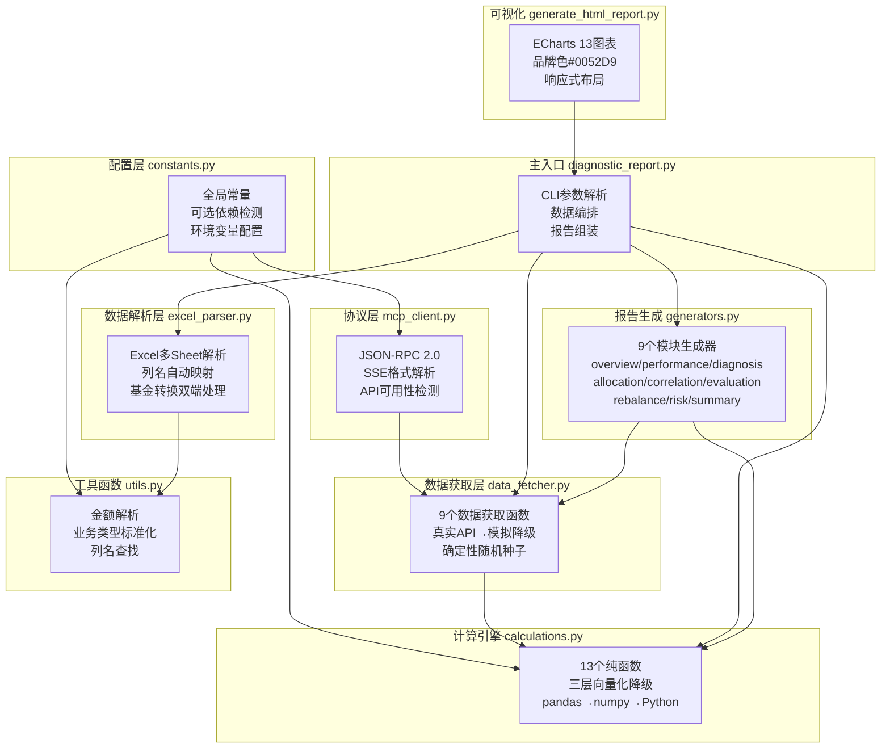

# 模块化架构设计

<cite>
**本文档引用的文件**
- [diagnostic_report.py](file://fund-account-diagnostic/scripts/diagnostic_report.py) — 主入口
- [generators.py](file://fund-account-diagnostic/scripts/generators.py) — 报告生成模块
- [calculations.py](file://fund-account-diagnostic/scripts/calculations.py) — 计算引擎
- [data_fetcher.py](file://fund-account-diagnostic/scripts/data_fetcher.py) — 数据获取
- [excel_parser.py](file://fund-account-diagnostic/scripts/excel_parser.py) — Excel解析
- [mcp_client.py](file://fund-account-diagnostic/scripts/mcp_client.py) — MCP客户端
- [constants.py](file://fund-account-diagnostic/scripts/constants.py) — 常量配置
- [utils.py](file://fund-account-diagnostic/scripts/utils.py) — 工具函数
- [generate_html_report.py](file://fund-account-diagnostic/scripts/generate_html_report.py) — HTML生成器
- [SKILL.md](file://fund-account-diagnostic/SKILL.md)
- [output_format.md](file://fund-account-diagnostic/references/output_format.md)
</cite>

## 目录
1. [简介](#简介)
2. [分层架构](#分层架构)
3. [模块间通信协议](#模块间通信协议)
4. [扩展机制](#扩展机制)
5. [降级策略](#降级策略)
6. [配置驱动设计](#配置驱动设计)
7. [结论](#结论)

## 简介
本项目是一个面向基金账户的综合诊断分析系统（v1.5.0），采用8+1模块的分层架构。每个Python文件职责明确、相互独立，通过标准化数据结构进行通信。系统通过MCP协议对接外部数据源，具备完善的降级机制。

## 分层架构



## 模块间通信协议

### 标准化数据结构
各模块间通过Python字典进行数据传递，遵循以下约定：

1. **持仓数据格式**：每个基金以字典形式传递，包含 code、name、shares、cost、market_value、weight 字段
2. **交易统计格式**：由 excel_parser 产出，包含各类型交易次数/金额、手续费、日期范围、已清仓基金列表
3. **MCP数据格式**：由 data_fetcher 产出，每个函数返回 (data_dict, is_real_data) 元组
4. **报告JSON格式**：最终输出遵循 references/output_format.md 定义的严格JSON结构

### 模块调用顺序
diagnostic_report.py 中 generate_full_report 的模块生成顺序：
1. allocation（配置诊断，其他模块依赖其 asset_allocation 数据）
2. performance（收益表现，risk模块依赖其 max_drawdown_detail）
3. correlation（相关性分析，diagnosis模块依赖其 correlation_level）
4. diagnosis → overview → risk → allocation → correlation → evaluation → rebalance → summary

### 数据共享方式
- _alloc_data：allocation模块的输出被 diagnosis/risk/rebalance 三个模块共享使用
- _perf_data：performance模块的 max_drawdown_detail 被 risk 模块使用
- _corr_data：correlation模块的输出被 diagnosis/rebalance 两个模块共享使用
- benchmark_data：基准指数数据被 performance/evaluation 模块共享使用
- stock_concentration：穿透集中度被 diagnosis 模块使用

## 扩展机制

### 新增分析模块
1. 在 generators.py 中新增 generate_xxx 函数
2. 在 diagnostic_report.py 的 generate_full_report 中添加调用逻辑
3. 在 CLI 的 --modules 参数中添加模块名
4. 更新 references/output_format.md 添加输出格式定义

### 新增MCP数据源
1. 在 data_fetcher.py 中新增 get_xxx 函数，遵循「真实API→模拟降级」模式
2. 在 mcp_client.py 中无需修改（已通用化）
3. 在 diagnostic_report.py 的 generate_full_report 中添加数据获取调用
4. 将数据传递给需要的目标 generators 函数

### 新增Excel字段映射
1. 在 constants.py 的 EXCEL_COLUMN_MAPPING 字典中添加新字段
2. 在 excel_parser.py 的 parse_transaction_excel 中添加字段读取逻辑

## 降级策略

### 依赖降级（三层向量化）
所有 calculations.py 中的函数实现三层降级：
```
pandas可用 → 使用 pandas Series/DataFrame（最优性能）
  ↓ pandas不可用
numpy可用 → 使用 numpy ndarray（良好性能）
  ↓ numpy不可用
纯Python → 使用 list/sum/math（兜底，功能完整）
```

### 数据降级（真实API→模拟数据）
所有 data_fetcher.py 中的函数实现数据降级：
```
MCP API可用 → 调用 qieman 服务器获取真实数据
  ↓ MCP API不可用/超时/认证失败
确定性模拟数据 → 基于基金代码哈希的随机种子生成
```

### HTTP后端降级
mcp_client.py 实现HTTP后端降级：
```
coze_workload_identity 可用 → 使用其 requests 模块
  ↓ coze_workload_identity 不可用
urllib标准库 → 使用 urllib.request（零依赖兜底）
```

## 配置驱动设计

### 环境变量覆盖
| 环境变量 | 默认值 | 说明 |
|----------|--------|------|
| FUND_DIAG_TARGET_EQUITY | 0.70 | 目标权益配置比例 |
| FUND_DIAG_TARGET_FIXED_INCOME | 0.15 | 目标固收配置比例 |
| FUND_DIAG_TARGET_CASH | 0.15 | 目标现金配置比例 |
| FUND_DIAG_BENCHMARK_EQUITY | 0.60 | 基准权益比例 |
| FUND_DIAG_BENCHMARK_FIXED_INCOME | 0.40 | 基准固收比例 |
| FUND_DIAG_ANALYSIS_DAYS | 252 | 分析基准期（交易日） |
| COZE_QIEMAN_API_{SKILL_ID} | 内置默认key | qieman MCP API密钥 |

### 运行时检测
constants.py 在导入时自动检测四个可选依赖的可用性：
- HAS_PANDAS、HAS_NUMPY、HAS_EMPYRICAL、HAS_COZE_HTTP
- 所有后续模块通过这些标志选择执行路径

## 结论
项目采用8+1模块的清晰分层架构，通过标准化数据结构和明确的模块间依赖关系实现了高内聚低耦合。三层降级策略确保了在任何环境下都能正常运行，配置驱动设计提供了灵活的参数定制能力。新功能扩展只需在对应层添加代码并遵循既有模式即可。
