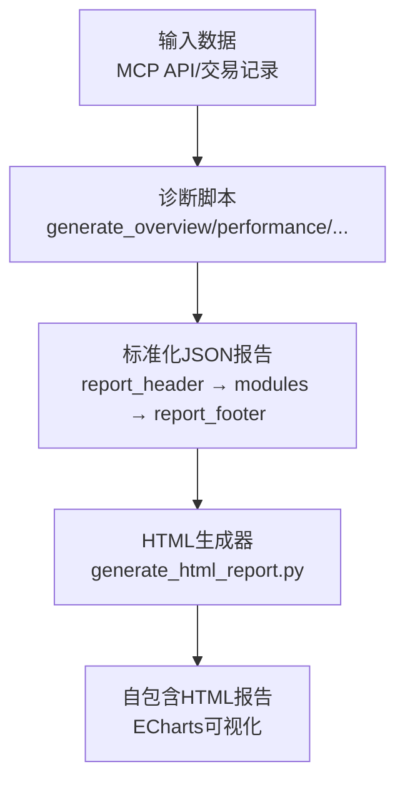
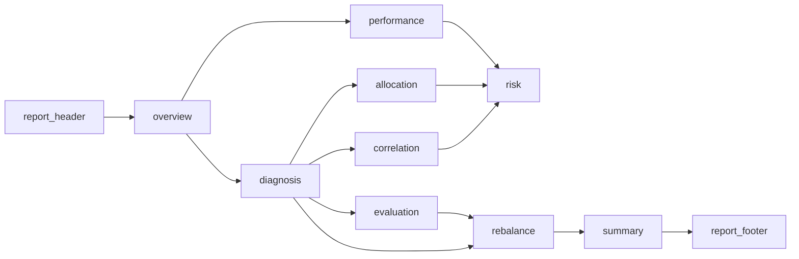
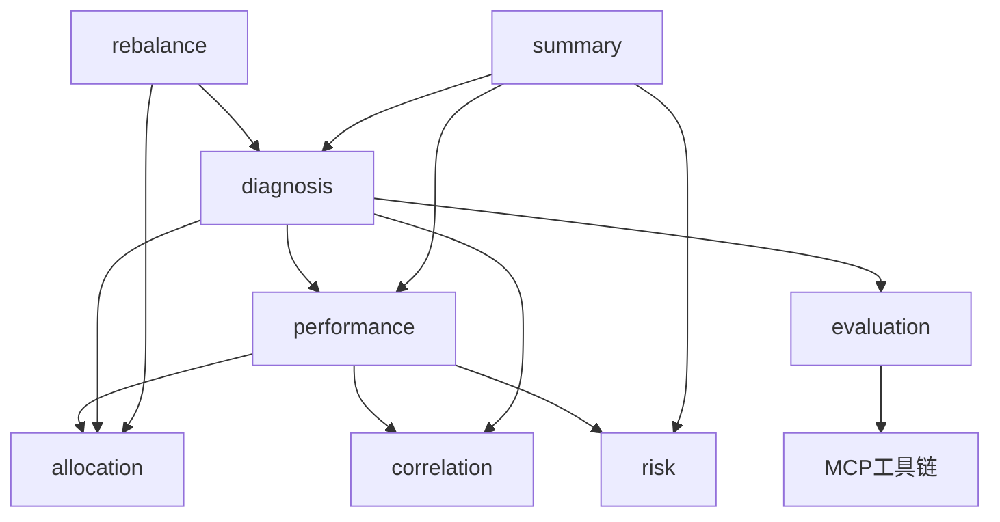

# 报告输出格式

<cite>
**本文引用的文件**
- [output_format.md](file://fund-account-diagnostic/references/output_format.md)
- [diagnostic_report.py](file://fund-account-diagnostic/scripts/diagnostic_report.py)
- [generate_html_report.py](file://fund-account-diagnostic/scripts/generate_html_report.py)
- [SKILL.md](file://fund-account-diagnostic/SKILL.md)
</cite>

## 目录
1. [简介](#简介)
2. [项目结构](#项目结构)
3. [核心组件](#核心组件)
4. [架构总览](#架构总览)
5. [详细组件分析](#详细组件分析)
6. [依赖分析](#依赖分析)
7. [性能考虑](#性能考虑)
8. [故障排查指南](#故障排查指南)
9. [结论](#结论)
10. [附录](#附录)

## 简介
本文件系统化阐述“基金账户诊断报告”的标准化JSON输出格式与生成机制，覆盖从报告头部、各分析模块到报告尾部的完整结构，明确字段语义、数据类型、取值范围与业务逻辑，并说明HTML可视化报告的生成与ECharts配置。同时给出模块顺序、依赖关系、关键指标计算方法、数据来源标注、JSON Schema约束与二次开发指引，帮助使用者准确理解与复用报告数据。

## 项目结构
- 报告生成与解析：核心逻辑位于诊断脚本，负责从MCP API或交易记录解析数据，计算指标，组装标准化JSON报告。
- HTML可视化：独立脚本将JSON报告渲染为自包含HTML，内置13个ECharts图表，使用品牌色与响应式布局。
- 参考文档：输出格式规范与字段定义以Markdown形式维护，便于查阅与版本演进。

图表来源
- [excel_parser.py](file://fund-account-diagnostic/scripts/excel_parser.py)
- [generators.py](file://fund-account-diagnostic/scripts/generators.py)
- [generate_html_report.py:1436-1560](file://fund-account-diagnostic/scripts/generate_html_report.py#L1436-L1560)

章节来源
- [SKILL.md:119-132](file://fund-account-diagnostic/SKILL.md#L119-L132)

## 核心组件
- 报告头部（report_header）：包含生成时间、数据来源、API可用性、MCP地址、工具版本、分析基准期等。
- 模块集合：overview、performance、diagnosis、allocation、correlation、evaluation、rebalance、risk、summary。
- 报告尾部（report_footer）：免责声明与本次输出的模块清单。

章节来源
- [output_format.md:11-25](file://fund-account-diagnostic/references/output_format.md#L11-L25)
- [output_format.md:938-953](file://fund-account-diagnostic/references/output_format.md#L938-L953)

## 架构总览
标准化JSON报告采用“头部-模块-尾部”三层结构，模块间存在依赖关系：例如performance依赖于各基金净值与权重；diagnosis依赖performance与allocation；evaluation依赖MCP工具；rebalance依赖diagnosis/allocation；risk依赖performance与配置；summary汇总前述模块。

图表来源
- [output_format.md:11-25](file://fund-account-diagnostic/references/output_format.md#L11-L25)
- [SKILL.md:119-132](file://fund-account-diagnostic/SKILL.md#L119-L132)

## 详细组件分析

### 报告头部（report_header）
- 字段
  - generate_time：字符串，YYYY-MM-DD HH:MM:SS
  - data_source：字符串，固定为“qieman MCP API”
  - api_available：布尔，API是否可用
  - mcp_url：字符串，MCP服务器地址
  - tool_version：字符串，工具版本号
  - analysis_period：字符串，分析基准期
- 业务逻辑
  - 由生成器在运行时填充，API不可用时仍输出头部，但api_available为false。
- 数据来源
  - 由MCP工具链或模拟数据决定是否可用。

章节来源
- [output_format.md:29-52](file://fund-account-diagnostic/references/output_format.md#L29-L52)
- [excel_parser.py](file://fund-account-diagnostic/scripts/excel_parser.py)

### 模块一：overview（持仓概览）
- 模块职责
  - 基础信息：基金数量、总市值、总成本、盈亏、盈亏比例
  - 持仓明细：逐只基金的权重、市值、成本、盈亏、盈亏比例、综合得分、建议
  - 集中度预警：权重>20%或基金数量>12的提示
  - 交易统计：申购/赎回/分红次数、金额、手续费、费用率、已实现盈亏、换手率、投资年限
  - 已清仓基金：仅在交易记录模式可用
- 关键字段
  - basic_info.fund_count、total_market_value、total_cost、profit、profit_rate
  - holdings_detail[].index/code/name/type/manager/weight/market_value/cost/profit/profit_rate/comprehensive_score/suggestion
  - concentration_alerts[].code/name/weight/message
  - transaction_summary.*、realized_pnl、turnover_ratio、investment_years、liquidated_funds[]
- 计算与来源
  - 市值=份额×最新净值；盈亏=市值-成本；权重=市值/总市值；集中度预警阈值20%；交易统计来自交易记录解析。
- 业务逻辑
  - 过度分散预警：当基金数量>12时提示精简。

章节来源
- [output_format.md:56-139](file://fund-account-diagnostic/references/output_format.md#L56-L139)
- [excel_parser.py](file://fund-account-diagnostic/scripts/excel_parser.py)

### 模块二：performance（收益风险表现）
- 模块职责
  - 多期收益：1M/3M/6M/1Y/2Y/3Y/since_inception
  - 组合净值曲线与基准净值曲线
  - 组合与基准对比表（累计收益、CAGR、超额收益）
  - 绩效指标：累计收益、CAGR、年化波动率、最大回撤、VaR/CVaR、夏普比率、Sortino、Calmar、下行风险、尾部比率、Alpha、Beta
  - 最大回撤详情：幅度、峰值/谷值、起止索引与日期
  - 归因摘要：跑赢/跑输原因
  - 单只基金收益排名：含多期收益
- 关键字段
  - multi_period_returns.{1m|3m|6m|1y|2y|3y|since_inception}
  - portfolio_nav_curve/dates/nav_series/normalized
  - benchmark_nav_curve.name/dates/nav_series/normalized
  - comparison_table.portfolio.total_return/cagr、benchmark.total_return、excess_return
  - performance_metrics.*（含advanced指标）
  - max_drawdown_detail.max_drawdown/peak_value/trough_value/start_index/end_index/start_date/end_date
  - attribution_summary.outperform_reason/underperform_reason
  - fund_return_ranking[].{code|name|return|data_source|returns_*}
- 计算与来源
  - 组合净值：基于各基金净值与权重加权；若无API数据则生成模拟序列
  - 多期收益：基于净值序列按回溯窗口切片计算
  - 基准：自动选择指数或虚拟构造
  - advanced指标：依赖empyrical库，否则默认0.0
- 业务逻辑
  - 仅在有基准数据时包含benchmark字段；advanced指标仅在可用时输出。

章节来源
- [output_format.md:143-331](file://fund-account-diagnostic/references/output_format.md#L143-L331)
- [generators.py](file://fund-account-diagnostic/scripts/generators.py)

### 模块三：diagnosis（账户诊断总览）
- 模块职责
  - 综合评分与等级
  - 基金得分明细：收益/风险/综合评分与等级
  - 配置偏离度：权益/固收/现金的当前/目标/偏离度
  - 诊断建议：基于偏离度生成
  - 经理评分：加权评分（1Y/2Y/3Y）与明细
  - 相关性水平：低/中/高
  - 穿透后个股集中度：最高个股、Top5、等级
  - 评分子维度：创新高/择股/择时/规模（近1年）
- 关键字段
  - comprehensive_score、grade
  - fund_score_details[].{code|name|return_score|risk_score|comprehensive_score|grade}
  - allocation_deviation.{equity|fixed_income|cash}.{current|target|deviation}
  - diagnosis_suggestion
  - manager_rating.{weighted_score_1y|weighted_score_2y|weighted_score_3y}
  - manager_ratings_detail[].{code|name|overall_1y|rank_1y|ret_1y|mdd_1y|sca_1y}
  - correlation_level
  - stock_concentration.{max_stock|max_weight|top5[].{name|weight}|level}
  - fund_subscores_detail[].{code|name|rank_1y|nhi_1y|sec_1y|tim_1y|sca_1y}
- 计算与来源
  - 评分与等级：综合评分0-100，等级A+/A/B+/B/C
  - 偏离度：deviation=current-target
  - 经理评分：加权聚合
  - 穿透集中度：按基金权重合并个股权重
  - 子维度：基于净值序列推导

章节来源
- [output_format.md:335-448](file://fund-account-diagnostic/references/output_format.md#L335-L448)
- [generators.py](file://fund-account-diagnostic/scripts/generators.py)

### 模块四：allocation（组合配置诊断）
- 模块职责
  - 大类资产分布、国家/地区分布、行业穿透（Top15）、重仓股穿透（Top15）、基金经理穿透、行业集中度风险（HHI）、重仓股风格分布
- 关键字段
  - asset_allocation[].{type|weight}
  - country_allocation[].{region|weight}
  - industry_allocation[].{industry|weight|change}
  - top_holdings[].{stock|weight|style}
  - fund_managers[].{name|weight|funds[]}
  - concentration_risk.{hhii|level|warning}
  - holding_style_tags.{value权重}
- 计算与来源
  - HHI指数：权重平方和
  - 风险等级：基于HHI阈值划分
  - 穿透：按基金权重合并个股权重

章节来源
- [output_format.md:452-549](file://fund-account-diagnostic/references/output_format.md#L452-L549)
- [generators.py](file://fund-account-diagnostic/scripts/generators.py)

### 模块五：correlation（相关性分析）
- 模块职责
  - 相关系数矩阵、平均两两相关系数、高相关基金组与高相关对、调仓建议
- 关键字段
  - correlation_matrix.{funds[]|matrix[][]}
  - average_pairwise_correlation
  - groups[].{funds[]|fund_names[]|average_correlation|high_correlation_pairs[]}
  - high_correlation_pairs[].{fund1|fund1_name|fund2|fund2_name|correlation}
  - rebalancing_suggestion
- 计算与来源
  - 相关系数：基于收益率序列计算
  - 平均两两相关系数：取上三角非对角线元素均值
  - 组与对：聚类/阈值筛选

章节来源
- [output_format.md:553-626](file://fund-account-diagnostic/references/output_format.md#L553-L626)
- [generators.py](file://fund-account-diagnostic/scripts/generators.py)

### 模块六：evaluation（单只基金评价）
- 模块职责
  - 主动型/指数型双轨评价：综合得分、等级、建议、最大回撤、波动率、夏普比率、多期收益、前5大重仓股、子维度、经理评分、公告/舆情、操作建议与理由、基金净值vs基准净值
- 关键字段
  - fund_evaluations[].{code|name|fund_type|manager|evaluation_path|comprehensive_score|grade|suggestion|max_drawdown|max_drawdown_period|volatility|sharpe_ratio|multi_period_returns|top_5_holdings[]|subscores|manager_rating|announcement|recommendation|recommendation_reason|fund_nav_vs_benchmark}
  - index_fund_valuations[].{code|name|fund_type|manager|evaluation_path|excess_return|pe_percentile|valuation|suggestion|max_drawdown|max_drawdown_period|volatility|sharpe_ratio|multi_period_returns|top_5_holdings[]|track_index|fund_nav_vs_benchmark}
- 计算与来源
  - 评分与建议：综合得分与规则生成
  - 指标：基于净值序列与empyrical计算
  - 公告/舆情：MCP工具集成

章节来源
- [output_format.md:630-726](file://fund-account-diagnostic/references/output_format.md#L630-L726)
- [generators.py](file://fund-account-diagnostic/scripts/generators.py)

### 模块七：rebalance（调仓建议）
- 模块职责
  - 超配/低配资产对比、减仓/加仓建议、预期改善说明、基金替换建议、推荐核心持仓、批次安排、调仓后预期改善
- 关键字段
  - allocation_comparison[].{asset|current|target|deviation|status}
  - reduce_suggestions[].{asset|overweight|suggested_action|funds_to_reduce[]}
  - increase_suggestions[].{asset|underweight|target_weight|suggested_action|funds_to_increase[]}
  - expected_improvement
  - fund_replacement_suggestions[].{code|name|reason|action|score}
  - recommended_funds[].{name|code|score|manager_score|brief}
  - batch_schedule[].{batch|time|funds[]|amount}
  - post_rebalance.{allocation[]|correlation_improvement|expected_improvement}
- 计算与来源
  - 建议：基于偏离度与相关性分析
  - 批次：按替换计划生成

章节来源
- [output_format.md:730-841](file://fund-account-diagnostic/references/output_format.md#L730-L841)
- [generators.py](file://fund-account-diagnostic/scripts/generators.py)

### 模块八：risk（风险提示）
- 模块职责
  - 情景分析（牛市/基准/熊市）、市场风险、流动性风险、最大回撤时间区间
- 关键字段
  - scenario_analysis[].{scenario|expected_return|expected_drawdown|probability}
  - market_risks[]、liquidity_risks[]
  - max_drawdown_period.{start_date|end_date}
- 计算与来源
  - 情景：基于正态分布假设与组合收益统计
  - 风险：基于配置与回撤分析

章节来源
- [output_format.md:845-894](file://fund-account-diagnostic/references/output_format.md#L845-L894)
- [generators.py](file://fund-account-diagnostic/scripts/generators.py)

### 模块九：summary（报告总结）
- 模块职责
  - 核心发现、关键风险、优化建议、总体评价
- 关键字段
  - core_findings[]、key_risks[]、optimization_suggestions[]、overall_assessment
- 计算与来源
  - 自动生成：汇总各模块关键信息

章节来源
- [output_format.md:898-934](file://fund-account-diagnostic/references/output_format.md#L898-L934)
- [calculations.py](file://fund-account-diagnostic/scripts/calculations.py)

### 报告尾部（report_footer）
- 字段
  - disclaimer：免责声明
  - modules：本次输出的模块列表
- 业务逻辑
  - 用于说明报告范围与责任边界

章节来源
- [output_format.md:938-953](file://fund-account-diagnostic/references/output_format.md#L938-L953)

## 依赖分析
- 模块耦合
  - performance依赖allocation（净值与权重）、correlation（相关性）、risk（回撤与波动）
  - diagnosis依赖performance（收益/风险指标）、allocation（配置偏离）、correlation（相关性水平）、evaluation（子维度/经理评分）
  - evaluation依赖MCP工具链（基金评价、子维度、公告/舆情、经理评分）
  - rebalance依赖diagnosis/allocation，summary汇总前述模块
- 外部依赖
  - MCP API（可选）：用于真实净值与评价数据
  - empyrical（可选）：高级金融指标
  - pandas/numpy：向量化计算与统计
  - ECharts（HTML生成）：13个图表可视化

图表来源
- [SKILL.md:119-132](file://fund-account-diagnostic/SKILL.md#L119-L132)
- [generators.py](file://fund-account-diagnostic/scripts/generators.py)

## 性能考虑
- 向量化计算：优先使用pandas/numpy进行统计与相关性计算，降低循环开销
- 可选依赖：empyrical提供高性能指标，缺失时使用降级路径
- 模拟数据：API不可用时生成确定性模拟序列，保证报告可用性
- 内存与IO：交易记录解析采用流式处理，避免大文件内存溢出

[本节为通用指导，不直接分析具体文件]

## 故障排查指南
- API不可用
  - 现象：report_header.api_available=false，performance使用模拟数据
  - 处理：检查环境变量COZE_QIEMAN_API_{SKILL_ID}与网络连通性
- 缺失empyrical
  - 现象：advanced指标（Sortino/Calmar/Downside/Tail/Alpha/Beta）默认为0.0
  - 处理：安装empyrical>=0.5.5
- 交易记录解析异常
  - 现象：列名不匹配、金额格式异常
  - 处理：确保列名包含映射关键词，金额去除逗号与空格
- HTML生成失败
  - 现象：ECharts CDN加载失败
  - 处理：确保网络可访问CDN，或离线部署ECharts资源

章节来源
- [calculations.py](file://fund-account-diagnostic/scripts/calculations.py)
- [constants.py](file://fund-account-diagnostic/scripts/constants.py)
- [SKILL.md:220-258](file://fund-account-diagnostic/SKILL.md#L220-L258)

## 结论
本标准化JSON报告体系以模块化设计贯穿全生命周期：从数据采集、指标计算、模块装配到可视化呈现，既满足专业分析需求，又便于二次开发与扩展。通过明确字段定义、计算方法与可视化配置，用户可快速理解报告内容并进行定制化应用。

[本节为总结性内容，不直接分析具体文件]

## 附录

### JSON Schema定义与字段约束
- 字段类型与约束
  - 权重(weight)：0 ≤ value ≤ 1
  - 收益率(return)：-1 ≤ value ≤ 10
  - 得分(score)：0 ≤ value ≤ 100
  - 相关系数(correlation)：-1 ≤ value ≤ 1
  - HHI指数：0 ≤ value ≤ 1
  - 市值(market_value)/成本(cost)：≥ 0
- 数据来源标注
  - report_header.data_source固定为“qieman MCP API”，api_available标识API可用性
  - 各模块数据来源见“数据来源标注”章节

章节来源
- [output_format.md:1035-1046](file://fund-account-diagnostic/references/output_format.md#L1035-L1046)
- [output_format.md:970-1008](file://fund-account-diagnostic/references/output_format.md#L970-L1008)

### HTML可视化与ECharts配置
- 图表类型与用途
  - 饼图：持仓分布、资产配置、国家/地区分布
  - 柱状图：多期收益、基金收益排名、子维度评分堆叠图
  - 折线图：净值曲线（组合vs基准）
  - 仪表盘：综合评分
  - 矩形树图：重仓股穿透
  - 交互：tooltip、legend、颜色分级、响应式布局
- 品牌与配色
  - 主色调：#0052D9
  - 红涨绿跌（中国市场惯例）
  - 响应式布局，移动端友好
- 生成流程
  - 读取JSON → 渲染各模块片段 → 注入ECharts配置 → 输出自包含HTML

章节来源
- [generate_html_report.py:1436-1560](file://fund-account-diagnostic/scripts/generate_html_report.py#L1436-L1560)
- [SKILL.md:110-116](file://fund-account-diagnostic/SKILL.md#L110-L116)

### 报告示例与字段解释
- 示例位置
  - overview示例：[output_format.md:111-139](file://fund-account-diagnostic/references/output_format.md#L111-L139)
  - performance示例：[output_format.md:285-331](file://fund-account-diagnostic/references/output_format.md#L285-L331)
  - diagnosis示例：[output_format.md:426-448](file://fund-account-diagnostic/references/output_format.md#L426-L448)
  - allocation示例：[output_format.md:516-549](file://fund-account-diagnostic/references/output_format.md#L516-L549)
  - correlation示例：[output_format.md:599-626](file://fund-account-diagnostic/references/output_format.md#L599-L626)
  - evaluation示例：[output_format.md:683-726](file://fund-account-diagnostic/references/output_format.md#L683-L726)
  - rebalance示例：[output_format.md:816-841](file://fund-account-diagnostic/references/output_format.md#L816-L841)
  - risk示例：[output_format.md:875-894](file://fund-account-diagnostic/references/output_format.md#L875-L894)
  - summary示例：[output_format.md:916-934](file://fund-account-diagnostic/references/output_format.md#L916-L934)
- 字段解释
  - 参考各模块“字段定义”与“示例”部分，结合业务逻辑理解含义与取值范围

章节来源
- [output_format.md:56-139](file://fund-account-diagnostic/references/output_format.md#L56-L139)
- [output_format.md:143-331](file://fund-account-diagnostic/references/output_format.md#L143-L331)
- [output_format.md:335-448](file://fund-account-diagnostic/references/output_format.md#L335-L448)
- [output_format.md:452-549](file://fund-account-diagnostic/references/output_format.md#L452-L549)
- [output_format.md:553-626](file://fund-account-diagnostic/references/output_format.md#L553-L626)
- [output_format.md:630-726](file://fund-account-diagnostic/references/output_format.md#L630-L726)
- [output_format.md:730-841](file://fund-account-diagnostic/references/output_format.md#L730-L841)
- [output_format.md:845-894](file://fund-account-diagnostic/references/output_format.md#L845-L894)
- [output_format.md:898-934](file://fund-account-diagnostic/references/output_format.md#L898-L934)

### 二次开发指引
- 解析与使用
  - JSON结构稳定，模块顺序与字段定义清晰，适合二次开发与集成
  - 建议按模块粒度封装解析器，分别处理数据来源与计算逻辑
- 扩展建议
  - 新增模块：遵循现有命名与层级，补充字段定义与HTML渲染
  - 指标扩展：在现有计算函数基础上添加新指标，注意可选依赖与降级策略
  - 可视化扩展：在HTML生成器中新增图表片段，保持品牌与布局一致

章节来源
- [SKILL.md:274-286](file://fund-account-diagnostic/SKILL.md#L274-L286)
- [excel_parser.py](file://fund-account-diagnostic/scripts/excel_parser.py)