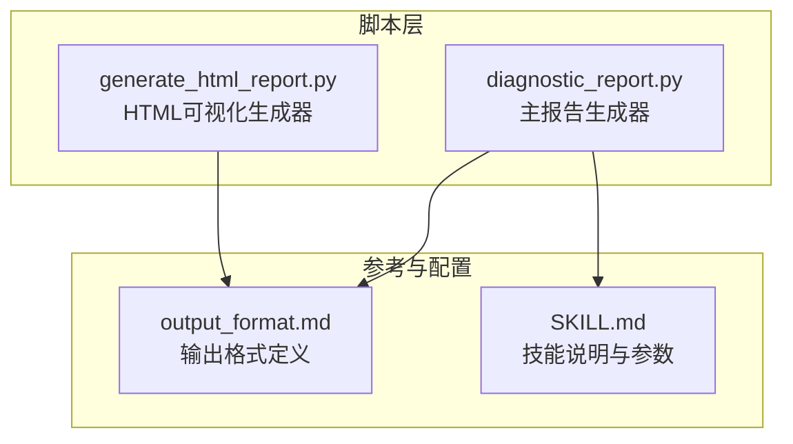
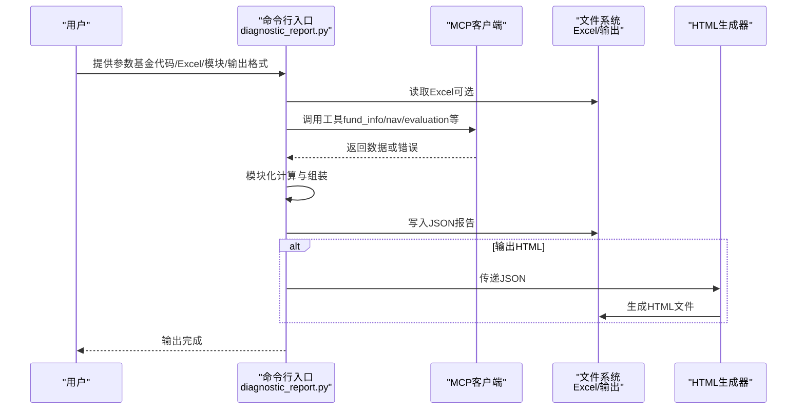
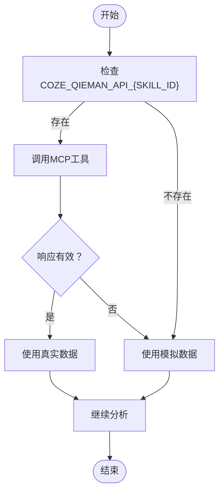
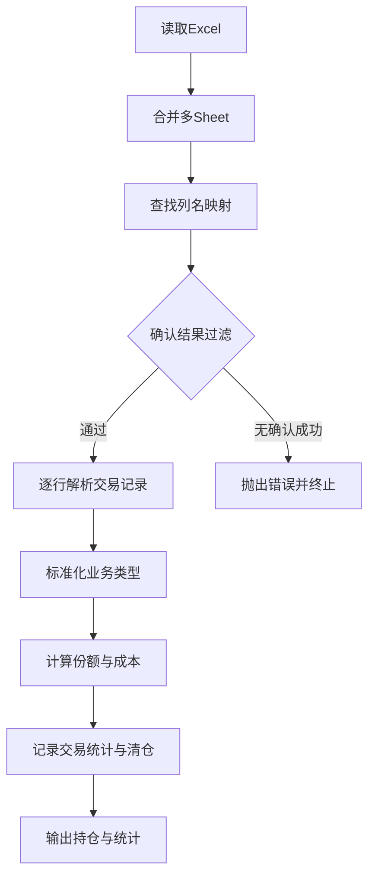
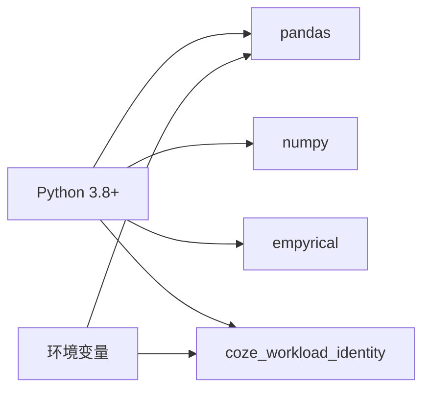

# 故障排除

<cite>
**本文引用的文件**
- [SKILL.md](file://fund-account-diagnostic/SKILL.md)
- [diagnostic_report.py](file://fund-account-diagnostic/scripts/diagnostic_report.py)
- [generate_html_report.py](file://fund-account-diagnostic/scripts/generate_html_report.py)
- [output_format.md](file://fund-account-diagnostic/references/output_format.md)
</cite>

## 目录
1. [简介](#简介)
2. [项目结构](#项目结构)
3. [核心组件](#核心组件)
4. [架构总览](#架构总览)
5. [详细组件分析](#详细组件分析)
6. [依赖分析](#依赖分析)
7. [性能考量](#性能考量)
8. [故障排除指南](#故障排除指南)
9. [结论](#结论)
10. [附录](#附录)

## 简介
本指南面向“基金账户诊断技能”项目使用者与维护者，系统化梳理常见问题与解决方案，覆盖环境配置、数据获取失败、性能问题、权限错误、MCP数据源连接问题、Excel文件解析失败、内存与超时、数据格式不兼容与字段缺失、错误代码对照与解决步骤、以及预防性维护与最佳实践。文档以仓库中的技能说明、脚本实现与输出格式定义为依据，提供可操作的调试方法与工具使用技巧。

## 项目结构
项目采用脚本驱动的命令行工具，核心文件组织如下：
- scripts/diagnostic_report.py：主报告生成器，负责参数解析、数据获取（MCP或Excel）、模块化分析与JSON报告输出。
- scripts/generate_html_report.py：将JSON报告转换为HTML可视化报告。
- references/output_format.md：标准化JSON输出格式定义。
- SKILL.md：技能说明与使用指引，包含MCP数据源、错误恢复流程、模块与参数等。

**图表来源**
- [diagnostic_report.py](file://fund-account-diagnostic/scripts/diagnostic_report.py)
- [generate_html_report.py](file://fund-account-diagnostic/scripts/generate_html_report.py)
- [output_format.md](file://fund-account-diagnostic/references/output_format.md)
- [SKILL.md](file://fund-account-diagnostic/SKILL.md)

**章节来源**
- [SKILL.md:1-385](file://fund-account-diagnostic/SKILL.md#L1-L385)

## 核心组件
- 命令行入口与参数解析：支持基金代码列表、交易记录Excel、模块选择、输出格式（JSON/HTML）、显示统计等。
- MCP客户端：封装qieman MCP服务器请求，支持工具调用与降级策略。
- 数据解析与计算：Excel列名映射、业务类型识别、净值序列与收益指标计算、组合净值与相关性分析、风险指标与调仓建议等。
- 报告生成：按模块组装JSON报告，包含诊断总览、持仓概览、收益风险、风险提示、配置诊断、相关性分析、单只基金评价、调仓建议与报告总结。
- HTML可视化：基于ECharts的交互式图表渲染。

**章节来源**
- [constants.py](file://fund-account-diagnostic/scripts/constants.py)
- [calculations.py](file://fund-account-diagnostic/scripts/calculations.py)
- [excel_parser.py](file://fund-account-diagnostic/scripts/excel_parser.py)
- [generators.py](file://fund-account-diagnostic/scripts/generators.py)
- [generators.py](file://fund-account-diagnostic/scripts/generators.py)
- [generate_html_report.py:1-800](file://fund-account-diagnostic/scripts/generate_html_report.py#L1-L800)
- [generate_html_report.py:800-1599](file://fund-account-diagnostic/scripts/generate_html_report.py#L800-L1599)
- [output_format.md:1-800](file://fund-account-diagnostic/references/output_format.md#L1-L800)

## 架构总览
系统采用“命令行入口 → 数据获取 → 模块化分析 → 报告生成”的流水线式架构。MCP数据源为可选，若不可用则自动降级为模拟数据；Excel模式下完全离线解析。

**图表来源**
- [generators.py](file://fund-account-diagnostic/scripts/generators.py)
- [generators.py](file://fund-account-diagnostic/scripts/generators.py)
- [generate_html_report.py:1436-1453](file://fund-account-diagnostic/scripts/generate_html_report.py#L1436-L1453)

## 详细组件分析

### MCP客户端与数据降级机制
- 认证与请求：通过x-api-key头访问qieman MCP服务器；支持coze_workload_identity或标准urllib两种HTTP实现。
- 降级策略：API不可用或认证失败时，自动切换为模拟数据；报告头部包含api_available与data_source_note，明确数据来源。
- 工具集：fund_info、fund_nav、fund_industry_allocation、fund_holdings、fund_evaluate、index_nav、fund_manager_rating、fund_subscores、fund_announcement等。

**图表来源**
- [constants.py](file://fund-account-diagnostic/scripts/constants.py)
- [calculations.py](file://fund-account-diagnostic/scripts/calculations.py)
- [generators.py](file://fund-account-diagnostic/scripts/generators.py)
- [generators.py](file://fund-account-diagnostic/scripts/generators.py)
- [generators.py](file://fund-account-diagnostic/scripts/generators.py)
- [generators.py](file://fund-account-diagnostic/scripts/generators.py)
- [generators.py](file://fund-account-diagnostic/scripts/generators.py)
- [generators.py](file://fund-account-diagnostic/scripts/generators.py)
- [generators.py](file://fund-account-diagnostic/scripts/generators.py)
- [generators.py](file://fund-account-diagnostic/scripts/generators.py)

**章节来源**
- [constants.py](file://fund-account-diagnostic/scripts/constants.py)
- [calculations.py](file://fund-account-diagnostic/scripts/calculations.py)
- [generators.py](file://fund-account-diagnostic/scripts/generators.py)
- [generators.py](file://fund-account-diagnostic/scripts/generators.py)
- [generators.py](file://fund-account-diagnostic/scripts/generators.py)
- [generators.py](file://fund-account-diagnostic/scripts/generators.py)
- [generators.py](file://fund-account-diagnostic/scripts/generators.py)
- [generators.py](file://fund-account-diagnostic/scripts/generators.py)
- [generators.py](file://fund-account-diagnostic/scripts/generators.py)
- [generators.py](file://fund-account-diagnostic/scripts/generators.py)

### Excel交易记录解析
- 列名映射：支持多种列名别名，自动识别并模糊匹配；支持Sheet合并。
- 业务类型：申购/赎回/分红/定投/转换/转入/转出等，按规则累加份额与成本。
- 日期与金额：自动解析YYYYMMDD与YYYY-MM-DD格式，处理带逗号金额；净值为空时默认1.0。
- 统计与清仓：生成交易统计摘要，识别已清仓基金并记录原因与最后交易日期。

**图表来源**
- [generators.py](file://fund-account-diagnostic/scripts/generators.py)
- [excel_parser.py](file://fund-account-diagnostic/scripts/excel_parser.py)

**章节来源**
- [generators.py](file://fund-account-diagnostic/scripts/generators.py)
- [excel_parser.py](file://fund-account-diagnostic/scripts/excel_parser.py)

### 报告模块与JSON输出
- 模块顺序：diagnosis → overview → performance → risk → allocation → correlation → evaluation → rebalance → summary。
- 输出字段：报告头（生成时间、数据来源、API可用性、工具版本、分析期）、各分析模块、报告尾部。
- HTML报告：ECharts图表、品牌色与响应式布局，支持一键生成。

**章节来源**
- [output_format.md:9-25](file://fund-account-diagnostic/references/output_format.md#L9-L25)
- [output_format.md:29-52](file://fund-account-diagnostic/references/output_format.md#L29-L52)
- [generate_html_report.py:1436-1453](file://fund-account-diagnostic/scripts/generate_html_report.py#L1436-L1453)

## 依赖分析
- Python运行时：3.8+。
- 可选依赖：pandas（向量化计算与Excel解析）、numpy（向量化统计）、empyrical（高级风险指标）、coze_workload_identity（HTTP请求）。
- 环境变量：COZE_QIEMAN_API_{SKILL_ID}（MCP认证）、FUND_DIAG_TARGET_*（目标配置与分析期）。

**图表来源**
- [SKILL.md:41-47](file://fund-account-diagnostic/SKILL.md#L41-L47)
- [constants.py](file://fund-account-diagnostic/scripts/constants.py)

**章节来源**
- [SKILL.md:41-47](file://fund-account-diagnostic/SKILL.md#L41-L47)
- [constants.py](file://fund-account-diagnostic/scripts/constants.py)

## 性能考量
- 向量化优先：优先使用pandas/numpy/empyrical进行向量化计算，回退到纯Python实现。
- 内存与超时：默认HTTP超时30秒；组合净值与相关性矩阵计算复杂度随基金数量增长；建议控制单次分析的基金数量。
- 缓存与降级：MCP失败自动降级为模拟数据，避免长时间等待；必要时关闭高级指标以提升速度。

[本节为通用指导，不直接分析具体文件]

## 故障排除指南

### 环境配置问题
- 依赖缺失
  - 现象：导入失败或功能降级。
  - 排查：确认pandas、numpy、empyrical、coze_workload_identity是否安装。
  - 解决：pip安装缺失包；或保持现状使用降级路径。
- 环境变量未配置
  - 现象：API不可用，报告头部api_available为False。
  - 排查：检查COZE_QIEMAN_API_{SKILL_ID}是否设置。
  - 解决：按技能说明配置环境变量。

**章节来源**
- [constants.py](file://fund-account-diagnostic/scripts/constants.py)
- [constants.py](file://fund-account-diagnostic/scripts/constants.py)
- [SKILL.md:291-296](file://fund-account-diagnostic/SKILL.md#L291-L296)

### 数据获取失败（MCP）
- 网络故障
  - 现象：HTTP请求异常、超时或返回错误。
  - 排查：检查网络连通性、代理设置；确认MCP地址可达。
  - 解决：重试或启用降级；确认x-api-key正确。
- 认证失败
  - 现象：返回401/403或工具调用isError=true。
  - 排查：核对COZE_QIEMAN_API_{SKILL_ID}值。
  - 解决：重新配置密钥；确保服务端授权。
- API限制
  - 现象：速率限制或配额耗尽。
  - 排查：查看响应状态码与错误信息。
  - 解决：降低请求频率、分批处理或联系服务端调整配额。
- 降级生效
  - 现象：report_header.api_available为false，performance.data_source_note为模拟数据。
  - 排查：确认MCP工具返回是否为空或错误。
  - 解决：接受模拟数据进行离线分析；后续网络恢复后重试。

**章节来源**
- [calculations.py](file://fund-account-diagnostic/scripts/calculations.py)
- [generators.py](file://fund-account-diagnostic/scripts/generators.py)
- [generators.py](file://fund-account-diagnostic/scripts/generators.py)
- [generators.py](file://fund-account-diagnostic/scripts/generators.py)
- [SKILL.md:90-99](file://fund-account-diagnostic/SKILL.md#L90-L99)

### Excel文件解析失败
- 文件不存在/路径错误
  - 现象：FileNotFoundError。
  - 排查：确认文件路径与权限。
  - 解决：修正路径或复制文件到可访问位置。
- 无数据/空工作表
  - 现象：ValueError提示无数据。
  - 排查：检查Excel是否包含有效行、是否存在Sheet。
  - 解决：清理空Sheet或补充数据。
- 列名不匹配
  - 现象：未找到基金代码列或解析异常。
  - 排查：核对列名是否符合映射表；确认“确认结果”列值为“确认成功”。
  - 解决：按映射表规范命名列；确保筛选条件一致。
- 金额/日期格式异常
  - 现象：解析为0或NaN。
  - 排查：检查金额是否含逗号、日期格式是否为YYYYMMDD或YYYY-MM-DD。
  - 解决：清洗数据格式；确保数值列不含文本。

**章节来源**
- [generators.py](file://fund-account-diagnostic/scripts/generators.py)
- [excel_parser.py](file://fund-account-diagnostic/scripts/excel_parser.py)
- [excel_parser.py](file://fund-account-diagnostic/scripts/excel_parser.py)
- [excel_parser.py](file://fund-account-diagnostic/scripts/excel_parser.py)
- [excel_parser.py](file://fund-account-diagnostic/scripts/excel_parser.py)

### 性能问题（内存不足/计算超时）
- 症状：长时间无响应、内存飙升、进程被杀。
- 原因：组合净值与相关性矩阵计算复杂度高；大量基金或长序列导致内存压力。
- 解决：
  - 控制分析范围：减少基金数量或缩短分析期。
  - 关闭高级指标：避免empyrical依赖；减少相关性矩阵计算。
  - 优化数据：确保Excel列名规范，减少重复与无效记录。
  - 分批处理：拆分为多个子组合分别分析。

**章节来源**
- [calculations.py](file://fund-account-diagnostic/scripts/calculations.py)
- [calculations.py](file://fund-account-diagnostic/scripts/calculations.py)
- [calculations.py](file://fund-account-diagnostic/scripts/calculations.py)
- [generators.py](file://fund-account-diagnostic/scripts/generators.py)

### 权限错误
- 现象：HTTP 401/403、工具调用isError=true。
- 排查：核对x-api-key与服务端授权；确认技能ID与密钥匹配。
- 解决：重新配置COZE_QIEMAN_API_{SKILL_ID}；检查服务端白名单与配额。

**章节来源**
- [calculations.py](file://fund-account-diagnostic/scripts/calculations.py)
- [SKILL.md:291-296](file://fund-account-diagnostic/SKILL.md#L291-L296)

### 数据格式不兼容与字段缺失
- 不兼容格式
  - 金额：支持带逗号格式，自动去除逗号；若仍异常，检查单元格格式。
  - 净值：为空时默认1.0；若为文本或NaN，需修正。
  - 日期：支持YYYYMMDD与YYYY-MM-DD；若为数字日期需转换。
- 字段缺失
  - 必填列：基金代码、业务名称、确认金额/份额、净值。
  - 可选列：手续费、确认日期、确认结果、目标基金列（转换场景）。
- 建议：在Excel中使用“数据验证”限制输入格式；提供模板列名与示例。

**章节来源**
- [calculations.py](file://fund-account-diagnostic/scripts/calculations.py)
- [excel_parser.py](file://fund-account-diagnostic/scripts/excel_parser.py)
- [excel_parser.py](file://fund-account-diagnostic/scripts/excel_parser.py)
- [excel_parser.py](file://fund-account-diagnostic/scripts/excel_parser.py)

### 错误代码对照与解决步骤
- HTTP状态码
  - 401/403：认证失败，检查x-api-key与授权。
  - 429：速率限制，降低频率或申请配额。
  - 5xx：服务端错误，稍后重试或联系支持。
- MCP工具错误
  - isError=true：工具调用失败，检查参数与网络。
- Excel解析错误
  - FileNotFoundError：文件路径错误。
  - ValueError：无数据、列名不匹配、确认结果过滤后为空。
- 解决步骤
  - 核对环境变量与网络连通性。
  - 检查Excel列名与数据格式。
  - 降级为模拟数据继续分析。
  - 分析报告头部api_available与data_source_note定位问题来源。

**章节来源**
- [calculations.py](file://fund-account-diagnostic/scripts/calculations.py)
- [generators.py](file://fund-account-diagnostic/scripts/generators.py)
- [generators.py](file://fund-account-diagnostic/scripts/generators.py)
- [SKILL.md:90-99](file://fund-account-diagnostic/SKILL.md#L90-L99)

### 调试方法与工具使用技巧
- 日志与输出
  - 查看报告头部：api_available、data_source、tool_version、analysis_period。
  - JSON输出：使用jq或在线JSON校验工具检查结构完整性。
- 错误追踪
  - 定位模块：根据模块顺序逐步排查（diagnosis → overview → performance → risk → allocation → correlation → evaluation → rebalance）。
  - Excel问题：先用最小样本Excel验证列名与数据；再扩展到完整文件。
- 性能分析
  - 关闭高级指标（empyrical）观察性能变化。
  - 减少基金数量或缩短序列长度进行压测。

**章节来源**
- [output_format.md:29-52](file://fund-account-diagnostic/references/output_format.md#L29-L52)
- [generators.py](file://fund-account-diagnostic/scripts/generators.py)

### 预防性维护与最佳实践
- 依赖管理：定期更新pandas、numpy、empyrical；在虚拟环境中隔离依赖。
- 配置管理：通过环境变量统一管理MCP密钥与目标配置；避免硬编码。
- 数据治理：提供Excel模板与字段说明；建立数据质量检查清单。
- 监控与告警：监控MCP可用性与响应时间；对高频错误建立告警。
- 文档与培训：维护技能说明与FAQ；对使用者进行基础培训。

**章节来源**
- [SKILL.md:41-47](file://fund-account-diagnostic/SKILL.md#L41-L47)
- [SKILL.md:291-296](file://fund-account-diagnostic/SKILL.md#L291-L296)

## 结论
本指南基于仓库中的技能说明、脚本实现与输出格式定义，构建了从环境配置、数据获取、Excel解析到性能与权限问题的系统化故障排除流程。通过明确的降级策略、模块化分析与可视化输出，用户可在不同环境下稳定地生成诊断报告。建议结合最佳实践持续优化数据质量与运行环境，以获得更高效、可靠的诊断体验。

[本节为总结性内容，不直接分析具体文件]

## 附录
- 常用命令
  - 基金代码诊断：python scripts/diagnostic_report.py --funds 000001,000002,000003
  - Excel诊断：python scripts/diagnostic_report.py --transaction-file ./transactions.xlsx
  - 显示统计：python scripts/diagnostic_report.py --transaction-file ./transactions.xlsx --show-stats
  - 指定模块：python scripts/diagnostic_report.py --funds 000001,000002 --modules overview,performance,risk
  - 保存JSON：python scripts/diagnostic_report.py --funds 000001,000002 --output diagnostic_report.json
  - 生成HTML：python scripts/diagnostic_report.py --funds 000001,000002 --format html --output diagnostic_report.html
  - 从JSON生成HTML：python scripts/generate_html_report.py --input diagnostic_report.json --output diagnostic_report.html

**章节来源**
- [SKILL.md:100-146](file://fund-account-diagnostic/SKILL.md#L100-L146)