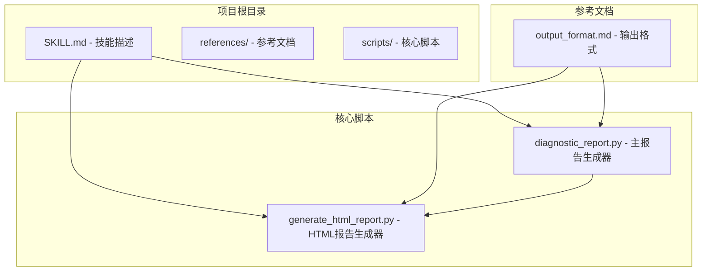
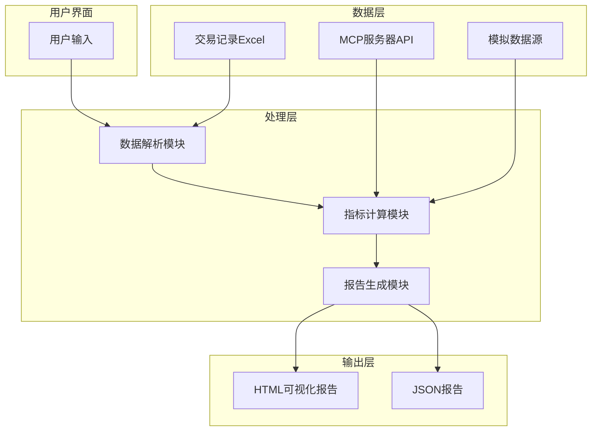
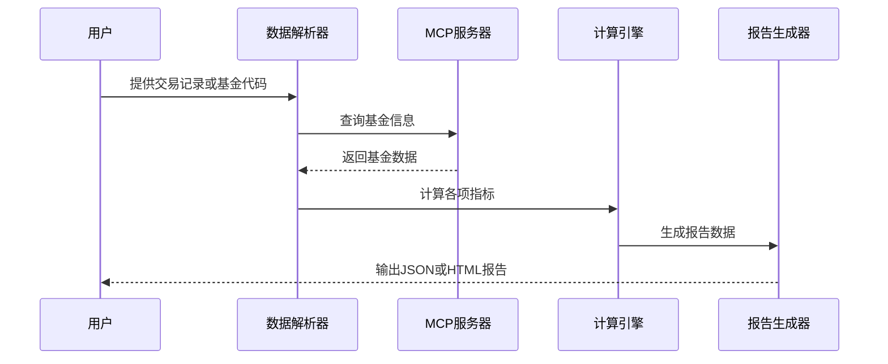
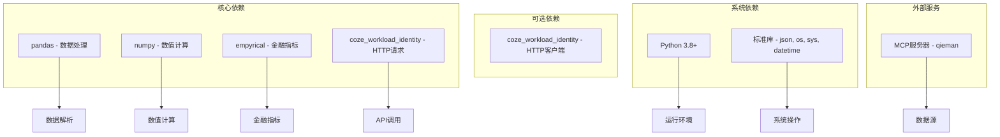
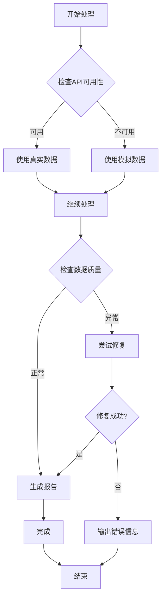

# 基金账户诊断技能项目最佳实践指南

<cite>
**本文档引用的文件**
- [SKILL.md](file://fund-account-diagnostic/SKILL.md)
- [output_format.md](file://fund-account-diagnostic/references/output_format.md)
- [diagnostic_report.py](file://fund-account-diagnostic/scripts/diagnostic_report.py)
- [generate_html_report.py](file://fund-account-diagnostic/scripts/generate_html_report.py)
</cite>

## 目录
1. [项目概述](#项目概述)
2. [项目结构](#项目结构)
3. [核心组件](#核心组件)
4. [架构概览](#架构概览)
5. [详细组件分析](#详细组件分析)
6. [依赖关系分析](#依赖关系分析)
7. [性能考虑](#性能考虑)
8. [故障排查指南](#故障排查指南)
9. [结论](#结论)
10. [附录](#附录)

## 项目概述

基金账户诊断技能项目是一个专业的基金投资顾问助手，能够对基金持仓账户进行全面的诊断分析。该项目提供结构化的诊断报告，用通俗易懂的语言解释专业的投资指标和分析结果，并基于诊断数据提供客观的投资建议参考。

### 主要功能特性
- **多维度诊断分析**：涵盖持仓概览、收益风险、配置诊断、相关性分析、调仓建议、风险提示等
- **灵活的数据输入**：支持基金代码列表或交易记录Excel文件
- **实时数据集成**：通过qieman MCP服务器获取基金数据，支持模拟数据降级
- **可视化报告**：生成包含13种ECharts图表的HTML可视化报告
- **专业指标体系**：提供17项缺失指标的补充分析

## 项目结构

**图表来源**
- [SKILL.md:1-385](file://fund-account-diagnostic/SKILL.md#L1-L385)
- [output_format.md:1-800](file://fund-account-diagnostic/references/output_format.md#L1-L800)
- [constants.py](file://fund-account-diagnostic/scripts/constants.py)
- [generate_html_report.py:1-800](file://fund-account-diagnostic/scripts/generate_html_report.py#L1-L800)

**章节来源**
- [SKILL.md:12-385](file://fund-account-diagnostic/SKILL.md#L12-L385)

## 核心组件

### 报告生成器 (diagnostic_report.py)

报告生成器是整个系统的核心，负责：
- **数据获取**：从MCP服务器或模拟数据源获取基金信息
- **计算分析**：执行各种财务指标计算和风险评估
- **报告构建**：组织各分析模块的数据结构
- **模块化设计**：支持按需生成特定模块的报告

### HTML报告生成器 (generate_html_report.py)

HTML报告生成器负责：
- **可视化转换**：将JSON报告转换为交互式HTML页面
- **图表渲染**：使用ECharts创建13种不同类型的图表
- **响应式设计**：支持桌面、平板和手机设备
- **品牌设计**：采用#0052D9品牌色和红涨绿跌的金融配色

**章节来源**
- [constants.py](file://fund-account-diagnostic/scripts/constants.py)
- [generate_html_report.py:1-800](file://fund-account-diagnostic/scripts/generate_html_report.py#L1-L800)

## 架构概览

**图表来源**
- [generators.py](file://fund-account-diagnostic/scripts/generators.py)
- [generate_html_report.py:1594-1927](file://fund-account-diagnostic/scripts/generate_html_report.py#L1594-L1927)

### 数据流处理

**图表来源**
- [generators.py](file://fund-account-diagnostic/scripts/generators.py)
- [generators.py](file://fund-account-diagnostic/scripts/generators.py)

## 详细组件分析

### 数据解析模块

数据解析模块负责处理用户提供的数据输入：

#### Excel文件解析
- **列名映射**：支持多种列名格式的自动识别
- **业务类型处理**：自动识别申购、赎回、分红、转换等操作
- **数据清洗**：处理金额格式、净值缺失、份额为负等情况
- **统计汇总**：自动生成交易统计摘要

#### 基金代码解析
- **格式兼容**：支持整数、浮点、字符串等多种格式
- **批量处理**：支持多个基金代码的批量分析
- **实时查询**：通过MCP API获取最新的基金数据

**章节来源**
- [generators.py](file://fund-account-diagnostic/scripts/generators.py)
- [calculations.py](file://fund-account-diagnostic/scripts/calculations.py)

### 指标计算模块

指标计算模块实现了完整的财务分析算法：

#### 收益率计算
- **净值序列转换**：从净值序列计算日收益率
- **多期收益**：计算1个月、3个月、6个月、1年等多期收益率
- **复合年化**：提供CAGR（复合年化增长率）计算

#### 风险评估
- **最大回撤**：计算最大回撤幅度和持续时间
- **波动率分析**：计算年化波动率和相关风险指标
- **夏普比率**：基于empyrical库的精确计算

#### 相关性分析
- **相关系数矩阵**：计算基金间的相关性
- **平均相关性**：计算所有基金对的平均相关系数
- **高相关性检测**：识别高度相关的基金组合

**章节来源**
- [calculations.py](file://fund-account-diagnostic/scripts/calculations.py)
- [calculations.py](file://fund-account-diagnostic/scripts/calculations.py)

### 报告生成模块

报告生成模块负责组织和呈现分析结果：

#### 模块化结构
- **诊断总览**：综合评分和等级评估
- **持仓概览**：当前持仓情况和基本统计
- **收益风险**：详细的收益和风险指标
- **配置诊断**：资产配置和行业分布分析
- **相关性分析**：基金间相关性评估
- **单只基金评价**：每只基金的详细分析
- **调仓建议**：基于分析结果的投资建议
- **风险提示**：潜在风险和情景分析

#### 数据降级机制
- **API可用性检测**：自动检测MCP API的可用性
- **模拟数据生成**：在API不可用时生成模拟数据
- **降级标识**：明确标注数据来源和准确性

**章节来源**
- [calculations.py](file://fund-account-diagnostic/scripts/calculations.py)
- [generators.py](file://fund-account-diagnostic/scripts/generators.py)

### HTML可视化模块

HTML可视化模块提供了丰富的交互式图表：

#### 图表类型
- **饼图**：持仓分布、资产配置、国家/地区分布
- **柱状图**：多期收益对比、基金得分、配置对比
- **折线图**：净值曲线、基准对比
- **热力图**：相关系数矩阵
- **仪表盘**：综合评分展示
- **矩形树图**：重仓股穿透分析
- **进度条**：风险等级和情景分析

#### 响应式设计
- **自适应布局**：支持不同屏幕尺寸
- **交互功能**：支持缩放、悬停显示详细信息
- **品牌色彩**：采用#0052D9主色调和金融配色方案

**章节来源**
- [generate_html_report.py:1-800](file://fund-account-diagnostic/scripts/generate_html_report.py#L1-L800)
- [generate_html_report.py:817-1599](file://fund-account-diagnostic/scripts/generate_html_report.py#L817-L1599)

## 依赖关系分析

**图表来源**
- [constants.py](file://fund-account-diagnostic/scripts/constants.py)
- [SKILL.md:41-46](file://fund-account-diagnostic/SKILL.md#L41-L46)

### 依赖管理策略

#### 必需依赖
- **pandas**：用于Excel文件解析和数据处理
- **numpy**：用于高效的数值计算
- **empyrical**：用于专业的金融指标计算

#### 可选依赖
- **coze_workload_identity**：提供更好的HTTP请求支持
- **empyrical**：增强风险指标计算能力

#### 降级策略
当可选依赖不可用时，系统会自动使用纯Python实现：
- 使用内置的数学函数替代numpy
- 使用标准库实现替代pandas功能
- 降级到基础的金融计算逻辑

**章节来源**
- [constants.py](file://fund-account-diagnostic/scripts/constants.py)
- [calculations.py](file://fund-account-diagnostic/scripts/calculations.py)

## 性能考虑

### 大数据处理优化

#### 向量化计算
系统充分利用了pandas和numpy的向量化特性：
- **pandas路径**：使用Series和DataFrame的内置方法
- **numpy路径**：使用数组操作和广播机制
- **纯Python回退**：在缺乏依赖时使用高效循环

#### 内存管理
- **延迟计算**：只在需要时计算中间结果
- **数据类型优化**：使用合适的数据类型减少内存占用
- **垃圾回收**：及时释放不再使用的大型对象

#### 缓存策略
- **API响应缓存**：避免重复的网络请求
- **计算结果缓存**：缓存复杂的计算结果
- **文件系统缓存**：利用操作系统缓存机制

### 计算效率提升

#### 算法优化
- **相关系数计算**：使用numpy.corrcoef进行高效计算
- **最大回撤计算**：使用向量化cummax操作
- **多期收益计算**：使用切片操作避免重复计算

#### 并行处理
- **批量API调用**：支持同时获取多个基金的数据
- **异步处理**：在网络请求时允许其他操作继续

**章节来源**
- [calculations.py](file://fund-account-diagnostic/scripts/calculations.py)
- [calculations.py](file://fund-account-diagnostic/scripts/calculations.py)

## 故障排查指南

### 常见问题及解决方案

#### API连接问题
- **症状**：报告显示API不可用
- **原因**：缺少COZE_QIEMAN_API_环境变量
- **解决**：配置正确的API密钥或使用模拟数据模式

#### Excel文件解析失败
- **症状**：报错显示找不到指定列
- **原因**：Excel列名与期望格式不匹配
- **解决**：检查列名是否符合支持的格式列表

#### 数据质量异常
- **症状**：某些指标显示为0或异常值
- **原因**：数据源质量问题或计算过程中的异常
- **解决**：检查原始数据质量和网络连接稳定性

#### 性能问题
- **症状**：报告生成耗时过长
- **原因**：数据量过大或缺少必要的依赖库
- **解决**：安装numpy和pandas依赖，或减少分析的数据范围

### 错误恢复流程

**图表来源**
- [SKILL.md:90-99](file://fund-account-diagnostic/SKILL.md#L90-L99)

**章节来源**
- [SKILL.md:90-99](file://fund-account-diagnostic/SKILL.md#L90-L99)
- [generators.py](file://fund-account-diagnostic/scripts/generators.py)

## 结论

基金账户诊断技能项目是一个功能完整、架构清晰的金融分析工具。其最佳实践体现在以下几个方面：

### 技术优势
- **模块化设计**：清晰的组件分离和职责划分
- **数据降级机制**：确保系统在各种条件下都能正常运行
- **性能优化**：充分利用向量化计算和内存管理技术
- **可视化呈现**：提供直观易懂的交互式报告

### 实践价值
- **专业指标体系**：涵盖了基金分析的核心指标
- **灵活的数据输入**：支持多种数据源和格式
- **可扩展架构**：便于添加新的分析模块和指标
- **用户体验**：提供从技术到通俗的双重表达

### 发展方向
- **机器学习集成**：可以考虑加入预测模型和智能建议
- **实时监控**：实现持仓变化的实时跟踪和提醒
- **多市场支持**：扩展到其他投资品种和市场
- **移动端优化**：进一步优化移动设备上的使用体验

## 附录

### 使用场景和注意事项

#### 适用场景
- **个人投资者**：帮助理解自己的投资组合状况
- **理财顾问**：为客户提供专业的投资建议
- **研究分析师**：进行投资组合的深度分析
- **风险管理**：监控投资组合的风险暴露

#### 报告更新频率
- **日常监控**：建议每周查看一次
- **季度回顾**：建议每个季度进行深入分析
- **年度评估**：建议每年进行全面的组合评估

#### 结果验证方法
- **交叉验证**：使用不同的数据源进行对比
- **趋势分析**：观察指标的变化趋势而非单一时刻
- **基准对比**：与市场基准进行对比分析
- **专家咨询**：必要时寻求专业投资顾问的意见

### 团队协作和知识分享

#### 最佳实践
- **标准化流程**：建立统一的数据收集和分析流程
- **文档维护**：保持技术文档和使用指南的更新
- **培训体系**：为团队成员提供充分的技能培训
- **知识传承**：建立有效的知识分享和传承机制

#### 持续学习建议
- **行业动态**：关注基金行业的最新发展和监管变化
- **技术进步**：学习新的数据分析技术和工具
- **专业认证**：鼓励团队成员获得相关的专业认证
- **学术研究**：关注金融学和投资学的最新研究成果