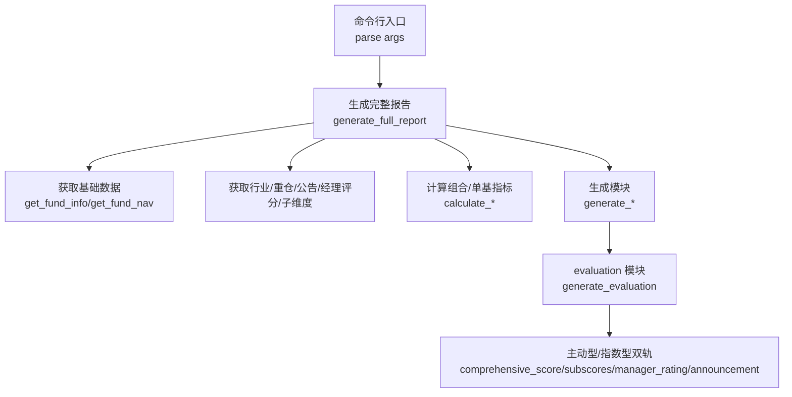
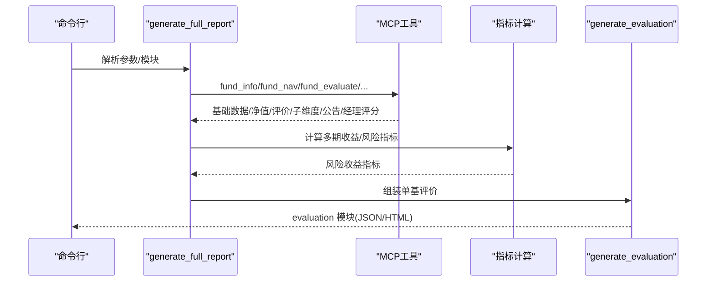
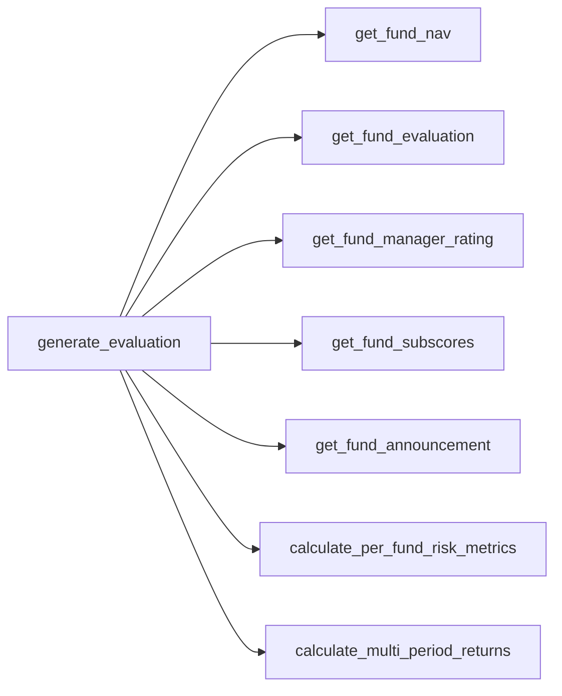

# 单只基金评价

<cite>
**本文引用的文件**
- [SKILL.md](file://fund-account-diagnostic/SKILL.md)
- [diagnostic_report.py](file://fund-account-diagnostic/scripts/diagnostic_report.py)
- [generate_html_report.py](file://fund-account-diagnostic/scripts/generate_html_report.py)
- [output_format.md](file://fund-account-diagnostic/references/output_format.md)
</cite>

## 目录
1. [简介](#简介)
2. [项目结构](#项目结构)
3. [核心组件](#核心组件)
4. [架构总览](#架构总览)
5. [详细组件分析](#详细组件分析)
6. [依赖关系分析](#依赖关系分析)
7. [性能考量](#性能考量)
8. [故障排查指南](#故障排查指南)
9. [结论](#结论)
10. [附录](#附录)

## 简介
本文件围绕“单只基金评价”功能，系统阐述基金评价体系的设计理念、评分维度与算法、结果等级划分、主动型与被动型基金的差异、投资指导价值、基金经理评分方法与参考价值，以及评价的时效性与更新频率。文档以仓库内的脚本与参考规范为依据，结合代码实现细节，帮助读者理解从净值序列到最终评价结果的完整流程。

## 项目结构
- 脚本入口与核心逻辑位于 scripts/diagnostic_report.py，负责解析输入、调用MCP数据源、计算指标、生成报告。
- HTML可视化报告生成位于 scripts/generate_html_report.py，将JSON报告渲染为交互式HTML。
- 参考规范 output_format.md 定义了报告输出的结构与字段，是理解评价结果的关键依据。
- SKILL.md 提供角色定位、输出约束、免责声明、使用方式与数据源说明，有助于把握整体语境。

图表来源
- [generators.py](file://fund-account-diagnostic/scripts/generators.py)
- [generators.py](file://fund-account-diagnostic/scripts/generators.py)

章节来源
- [SKILL.md:12-385](file://fund-account-diagnostic/SKILL.md#L12-L385)
- [generators.py](file://fund-account-diagnostic/scripts/generators.py)
- [output_format.md:654-750](file://fund-account-diagnostic/references/output_format.md#L654-L750)

## 核心组件
- 数据获取与降级：通过MCP工具族获取基础信息、净值、行业配置、重仓股、基金经理评分、评分子维度、公告/舆情等；若API不可用则降级为模拟数据。
- 评价计算：对净值序列计算多期收益、最大回撤、波动率、夏普比率等风险收益指标；对主动型基金计算综合得分与子维度得分；对指数型基金计算PE分位与估值判断。
- 结果封装：将评价结果按模块组织，包含主动型与指数型两类路径，输出JSON或HTML。

章节来源
- [generators.py](file://fund-account-diagnostic/scripts/generators.py)
- [generators.py](file://fund-account-diagnostic/scripts/generators.py)
- [output_format.md:654-750](file://fund-account-diagnostic/references/output_format.md#L654-L750)

## 架构总览
单只基金评价贯穿“数据获取—指标计算—结果封装”的主线，其中：
- 数据来源：MCP工具族（fund_info、fund_nav、fund_industry_allocation、fund_holdings、fund_evaluate、index_nav、fund_manager_rating、fund_subscores、fund_announcement）。
- 计算引擎：净值序列到多期收益、最大回撤、波动率、夏普比率等；主动型综合得分与子维度得分；指数型估值判断。
- 输出形态：JSON报告与HTML可视化。

图表来源
- [generators.py](file://fund-account-diagnostic/scripts/generators.py)
- [generators.py](file://fund-account-diagnostic/scripts/generators.py)
- [generators.py](file://fund-account-diagnostic/scripts/generators.py)

## 详细组件分析

### 1. 评价体系与评分维度
- 主动型基金评价路径
  - 综合得分：由收益得分与风险得分加权合成，再按组合权重汇总得到账户层面的综合评分。
  - 子维度得分：创新高(NHI)、择股(SEC)、择时(TIM)、规模(SCA)。这些子维度得分来自MCP工具或模拟生成。
  - 经理评分：包含近1/2/3年加权综合评分与分项评分（收益、回撤、规模）。
  - 公告/舆情：负面事件、是否有负面、摘要。
  - 操作建议：基于综合评分、经理评分与等级生成保留/观察/替换/部分替换建议。
- 指数型基金评价路径
  - 超额收益：与基准比较的超额收益。
  - 估值判断：PE分位数与估值水平（偏低/适中/偏高）。
  - 基准对比：净值与基准的对比序列。

章节来源
- [generators.py](file://fund-account-diagnostic/scripts/generators.py)
- [generators.py](file://fund-account-diagnostic/scripts/generators.py)
- [generators.py](file://fund-account-diagnostic/scripts/generators.py)
- [generators.py](file://fund-account-diagnostic/scripts/generators.py)
- [generators.py](file://fund-account-diagnostic/scripts/generators.py)
- [output_format.md:654-750](file://fund-account-diagnostic/references/output_format.md#L654-L750)

### 2. 子维度计算方法与算法
- 创新高(NHI)：基于净值序列计算近期创新高次数占比，映射到0-100分。
- 择股(SEC)：基于累计收益与年化收益，映射到0-100分。
- 择时(TIM)：基于正负收益日占比与盈亏比，映射到0-100分。
- 规模(SCA)：默认中性（无法从净值推断规模）。
- 子维度得分的计算逻辑集中在 compute_sub_dimension_scores，返回字典包含上述四项得分。

章节来源
- [calculations.py](file://fund-account-diagnostic/scripts/calculations.py)

### 3. 评价结果等级划分与业务含义
- 等级映射：综合评分与等级的对应关系，用于描述基金表现所处的等级区间。
- 排名区间：通过估算评分同类排名百分位，给出前5%、前15%、前30%等区间含义，便于横向比较。
- 业务含义：
  - 前5%：极优，建议重点保留。
  - 前15%：优秀，建议保留。
  - 前30%：良好，建议继续持有。
  - 前50%：中等偏上，建议继续持有。
  - 前70%：中等偏下，建议观察或部分替换。
  - 后10%：表现较差，建议替换。

章节来源
- [calculations.py](file://fund-account-diagnostic/scripts/calculations.py)
- [calculations.py](file://fund-account-diagnostic/scripts/calculations.py)

### 4. 主动型与被动型基金的评价侧重点
- 主动型：强调综合得分、子维度得分、经理评分、公告/舆情、操作建议。侧重基金经理能力与组合质量。
- 指数型：强调PE分位与估值判断、超额收益、跟踪标的指数、净值与基准对比。侧重性价比与跟踪误差。

章节来源
- [generators.py](file://fund-account-diagnostic/scripts/generators.py)
- [output_format.md:654-750](file://fund-account-diagnostic/references/output_format.md#L654-L750)

### 5. 基金经理评分的计算方法与参考价值
- 计算方法：对每只基金的经理评分进行加权，权重为该基金在组合中的权重，得到组合层面的加权评分（近1/2/3年）。
- 参考价值：用于衡量基金经理在不同时间维度上的综合表现，辅助判断是否继续持有或替换。

章节来源
- [generators.py](file://fund-account-diagnostic/scripts/generators.py)
- [generators.py](file://fund-account-diagnostic/scripts/generators.py)

### 6. 评价结果的投资指导价值
- 持有建议：根据综合评分与经理评分生成保留/观察/替换/部分替换建议。
- 替换时机：对评分低于阈值的基金提出替换或减仓建议，并给出批次安排。
- 替代基金筛选：从同类型高评分基金中筛选推荐，作为替代候选。

章节来源
- [calculations.py](file://fund-account-diagnostic/scripts/calculations.py)
- [generators.py](file://fund-account-diagnostic/scripts/generators.py)

### 7. 评价的时效性与更新频率
- 数据源：默认使用qieman MCP服务器；若不可用则降级为模拟数据。
- 时效性：报告头包含生成时间、分析基准期、API可用性等信息；净值序列默认取近252个交易日。
- 更新频率：脚本按需调用MCP工具，未内置定时任务；用户可按需重新运行生成最新报告。

章节来源
- [SKILL.md:76-100](file://fund-account-diagnostic/SKILL.md#L76-L100)
- [constants.py](file://fund-account-diagnostic/scripts/constants.py)
- [generators.py](file://fund-account-diagnostic/scripts/generators.py)

## 依赖关系分析
- 模块耦合：generate_evaluation 依赖 get_fund_nav、get_fund_evaluation、get_fund_manager_rating、get_fund_subscores、get_fund_announcement 等工具；同时依赖 calculate_per_fund_risk_metrics、calculate_multi_period_returns 等指标计算函数。
- 外部依赖：MCP工具族、可选库（pandas、numpy、empyrical、coze_workload_identity）。
- 降级策略：API失败时返回模拟数据，保证报告可用性。

图表来源
- [generators.py](file://fund-account-diagnostic/scripts/generators.py)
- [generators.py](file://fund-account-diagnostic/scripts/generators.py)
- [generators.py](file://fund-account-diagnostic/scripts/generators.py)
- [generators.py](file://fund-account-diagnostic/scripts/generators.py)
- [generators.py](file://fund-account-diagnostic/scripts/generators.py)
- [generators.py](file://fund-account-diagnostic/scripts/generators.py)
- [calculations.py](file://fund-account-diagnostic/scripts/calculations.py)
- [calculations.py](file://fund-account-diagnostic/scripts/calculations.py)

章节来源
- [generators.py](file://fund-account-diagnostic/scripts/generators.py)
- [generators.py](file://fund-account-diagnostic/scripts/generators.py)

## 性能考量
- 向量化计算：优先使用pandas/numpy进行向量化统计与相关系数计算，提升性能。
- 降级路径：在无外部依赖或API不可用时，采用模拟数据与回退实现，保证稳定性。
- 内存与时间复杂度：相关性矩阵计算为O(n^2·t)，其中n为基金数，t为交易日数；多期收益与风险指标计算为O(n·t)。

章节来源
- [calculations.py](file://fund-account-diagnostic/scripts/calculations.py)
- [calculations.py](file://fund-account-diagnostic/scripts/calculations.py)
- [generators.py](file://fund-account-diagnostic/scripts/generators.py)

## 故障排查指南
- API不可用：检查环境变量与x-api-key配置；观察报告头的api_available字段；必要时启用降级模式。
- Excel解析失败：核对列名映射与数据格式；查看错误信息中的行号与列名提示。
- 基金代码无效：脚本会跳过无效代码并继续处理其他基金。
- 数据不足：多期收益与风险指标在数据长度不足时会被省略或标记，注意报告中的数据来源说明。

章节来源
- [SKILL.md:82-99](file://fund-account-diagnostic/SKILL.md#L82-L99)
- [generators.py](file://fund-account-diagnostic/scripts/generators.py)

## 结论
单只基金评价功能以净值序列为核心，结合主动型与被动型两类路径，构建了涵盖风险收益、子维度能力、经理评分与公告舆情的综合评价体系。通过明确的等级划分与排名区间，为用户提供清晰的投资指导；通过可选的HTML可视化，提升可读性与交互体验。在API不可用时，系统具备完善的降级机制，确保报告可用性。

## 附录
- 报告输出结构与字段定义详见 output_format.md 的 evaluation 模块。
- 命令行参数与使用方式详见 SKILL.md 的使用说明与示例。

章节来源
- [output_format.md:654-750](file://fund-account-diagnostic/references/output_format.md#L654-L750)
- [SKILL.md:178-231](file://fund-account-diagnostic/SKILL.md#L178-L231)