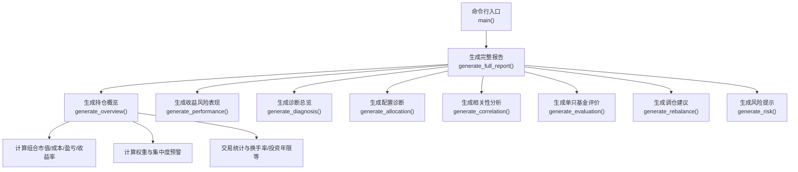
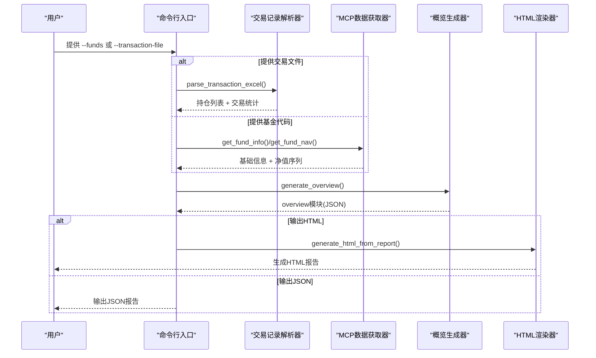
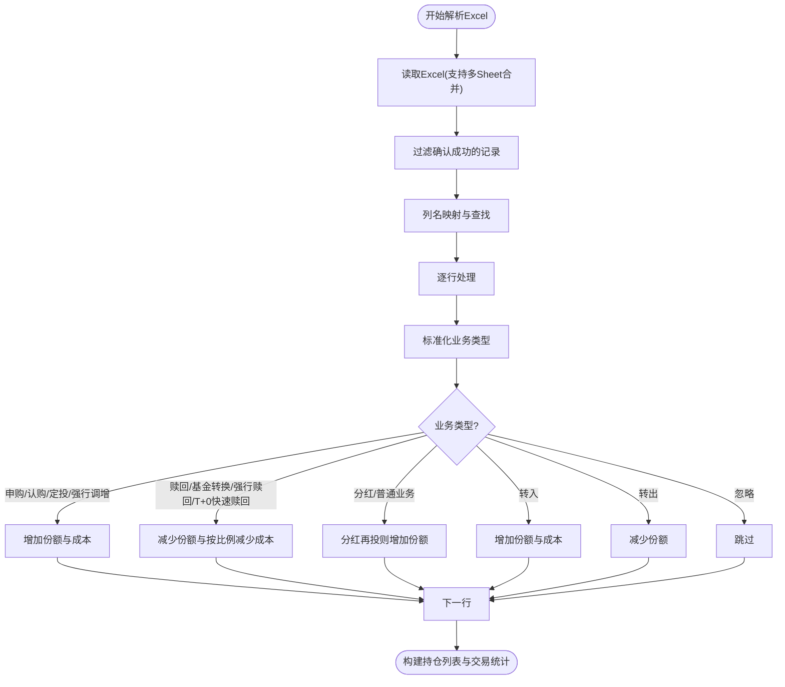
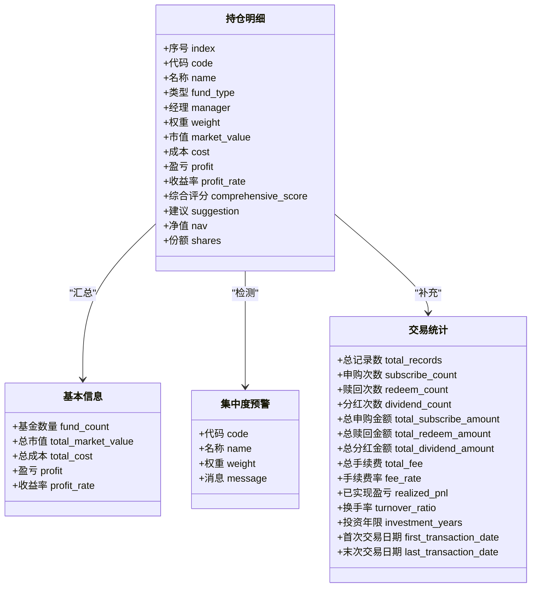
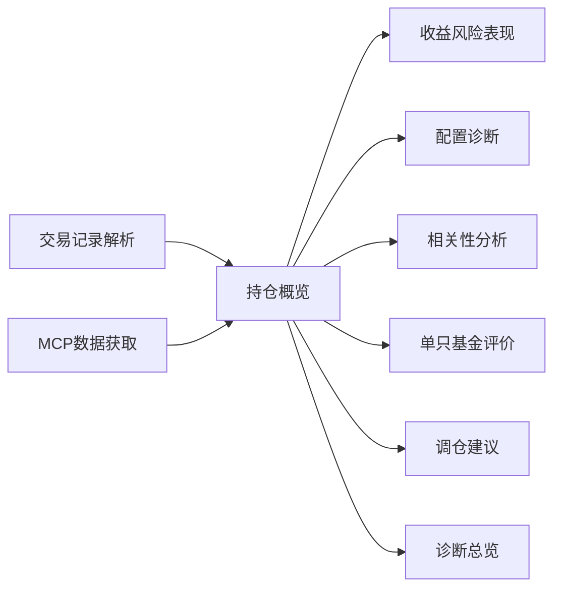

# 持仓概览

<cite>
**本文引用的文件**
- [SKILL.md](file://fund-account-diagnostic/SKILL.md)
- [diagnostic_report.py](file://fund-account-diagnostic/scripts/diagnostic_report.py)
- [generate_html_report.py](file://fund-account-diagnostic/scripts/generate_html_report.py)
- [output_format.md](file://fund-account-diagnostic/references/output_format.md)
</cite>

## 目录
1. [简介](#简介)
2. [项目结构](#项目结构)
3. [核心组件](#核心组件)
4. [架构总览](#架构总览)
5. [详细组件分析](#详细组件分析)
6. [依赖关系分析](#依赖关系分析)
7. [性能考量](#性能考量)
8. [故障排查指南](#故障排查指南)
9. [结论](#结论)
10. [附录](#附录)

## 简介
本章节聚焦“持仓概览”模块，系统阐述其如何从两类数据源采集并展示用户持有的基金基本信息与关键指标，包括：
- 数据源一：通过MCP工具获取实时净值与基础信息（当API可用时）
- 数据源二：通过Excel交易记录解析持仓明细（当用户提供交易文件时）

核心目标是生成结构化JSON报告中的“overview”模块，并在HTML可视化报告中直观呈现。

## 项目结构
- 脚本入口与核心逻辑位于 scripts/diagnostic_report.py
- HTML可视化报告生成位于 scripts/generate_html_report.py
- 报告输出格式规范位于 references/output_format.md
- 项目技能说明与使用方式位于 SKILL.md

图表来源
- [generators.py](file://fund-account-diagnostic/scripts/generators.py)
- [generators.py](file://fund-account-diagnostic/scripts/generators.py)

章节来源
- [SKILL.md:100-170](file://fund-account-diagnostic/SKILL.md#L100-L170)
- [generators.py](file://fund-account-diagnostic/scripts/generators.py)

## 核心组件
- 持仓概览生成器：负责将解析后的持仓、基础信息、当前价格、评分等整合为overview模块
- 交易记录解析器：从Excel中提取并清洗业务类型、金额、份额、净值、日期等字段
- MCP数据获取器：封装qieman MCP工具调用，支持降级为模拟数据
- HTML可视化渲染：将overview模块渲染为饼图、表格、KPI卡片等

章节来源
- [generators.py](file://fund-account-diagnostic/scripts/generators.py)
- [generators.py](file://fund-account-diagnostic/scripts/generators.py)
- [generators.py](file://fund-account-diagnostic/scripts/generators.py)
- [generate_html_report.py:307-427](file://fund-account-diagnostic/scripts/generate_html_report.py#L307-L427)

## 架构总览
持仓概览模块的运行链路如下：
- 输入阶段：用户通过命令行提供基金代码列表或Excel交易文件
- 解析阶段：若为Excel，解析并清洗字段；若为代码列表，直接进入数据获取
- 数据获取阶段：调用MCP工具获取基础信息、净值、行业配置、重仓股、评价、经理评分、公告等
- 指标计算阶段：计算市值、成本、盈亏、收益率、权重、集中度预警、交易统计等
- 报告生成阶段：组装overview模块，支持JSON与HTML输出

图表来源
- [generators.py](file://fund-account-diagnostic/scripts/generators.py)
- [generators.py](file://fund-account-diagnostic/scripts/generators.py)
- [generators.py](file://fund-account-diagnostic/scripts/generators.py)
- [generators.py](file://fund-account-diagnostic/scripts/generators.py)
- [generate_html_report.py:307-427](file://fund-account-diagnostic/scripts/generate_html_report.py#L307-L427)

## 详细组件分析

### 交易记录解析与清洗
- 支持列名映射：自动识别“基金代码/名称/业务名称/申请金额/确认金额/确认份额/单位净值/确认日期/确认结果”等字段
- 业务类型识别：支持“申购/赎回/分红/定投/转换/转入/转出”等，忽略“设置分红方式/定投协议开通”等不影响持仓的操作
- 金额解析：自动处理带逗号的金额字符串，NaN值归零
- 净值处理：默认1.0，异常时降级
- 份额处理：份额为负或极小值（浮点误差）视为清仓
- 日期处理：支持YYYYMMDD格式，自动转换为YYYY-MM-DD
- 基金转换：同时为目标基金增加份额与成本
- 交易统计：统计申购/赎回/分红次数与金额、手续费、首次/末次交易日期、清仓基金等

图表来源
- [generators.py](file://fund-account-diagnostic/scripts/generators.py)

章节来源
- [generators.py](file://fund-account-diagnostic/scripts/generators.py)
- [SKILL.md:232-257](file://fund-account-diagnostic/SKILL.md#L232-L257)

### MCP数据获取与降级策略
- 基础信息：fund_info（名称、类型、经理、净值等）
- 净值序列：fund_nav（用于收益风险分析）
- 行业配置：fund_industry_allocation
- 重仓股：fund_holdings
- 评价：fund_evaluate（主动/指数）
- 指数净值：index_nav（用于基准对比）
- 经理评分：fund_manager_rating
- 评分子维度：fund_subscores
- 公告/舆情：fund_announcement

当API不可用或认证失败时，系统自动降级为模拟数据，报告头部包含“api_available=false”与“data_source_note”。

章节来源
- [generators.py](file://fund-account-diagnostic/scripts/generators.py)
- [SKILL.md:76-98](file://fund-account-diagnostic/SKILL.md#L76-L98)

### 持仓概览指标计算
- 基本信息：基金数量、总市值、总成本、盈亏、收益率
- 明细字段：序号、代码、名称、类型、经理、权重、市值、成本、盈亏、收益率、综合评分、建议
- 集中度预警：任一基金权重>20%或基金数量>12只时生成
- 交易统计：申购/赎回/分红次数与金额、手续费率、已实现盈亏、换手率、投资年限
- 清仓跟踪：记录最后交易日期与原因

图表来源
- [generators.py](file://fund-account-diagnostic/scripts/generators.py)
- [output_format.md:56-139](file://fund-account-diagnostic/references/output_format.md#L56-L139)

章节来源
- [generators.py](file://fund-account-diagnostic/scripts/generators.py)
- [output_format.md:56-139](file://fund-account-diagnostic/references/output_format.md#L56-L139)

### HTML可视化展示
- KPI卡片：总市值、总成本、总盈亏、收益率
- 饼图：前N只基金的市值分布
- 表格：按市值降序的持仓明细
- 集中度预警与交易统计卡片
- 与HTML报告生成器配合，输出自包含HTML文件

章节来源
- [generate_html_report.py:307-427](file://fund-account-diagnostic/scripts/generate_html_report.py#L307-L427)

## 依赖关系分析
- 持仓概览依赖：
  - 交易记录解析（Excel模式）
  - MCP工具调用（API模式）
  - 基础信息与净值序列（用于计算当前市值与盈亏）
  - 交易统计（用于生成KPI与换手率等）
- 与其它模块的耦合：
  - 与“诊断总览”共享集中度预警与评分
  - 与“收益风险表现”共享权重与净值序列
  - 与“配置诊断”共享资产类型推断
  - 与“相关性分析”共享净值序列
  - 与“单只基金评价”共享重仓股与公告等

图表来源
- [generators.py](file://fund-account-diagnostic/scripts/generators.py)
- [generators.py](file://fund-account-diagnostic/scripts/generators.py)

章节来源
- [generators.py](file://fund-account-diagnostic/scripts/generators.py)

## 性能考量
- 向量化计算：优先使用pandas/numpy进行序列运算（净值、收益率、相关系数等），回退到纯Python实现
- 内存友好：Excel解析采用迭代行处理，避免一次性加载大表
- 降级策略：API失败时自动模拟数据，保证报告可用性
- 时间复杂度：
  - 交易记录解析：O(N)（N为记录数）
  - 指标计算：O(M)（M为基金数或序列长度）
  - 相关系数：O(M^2·T)（T为序列长度）

[本节为通用性能讨论，不直接分析具体文件]

## 故障排查指南
- Excel解析失败
  - 检查文件是否存在与可读
  - 确认存在“确认成功”的记录
  - 若列名不匹配，系统尝试模糊匹配；必要时修正列名
- MCP API不可用
  - 检查环境变量COZE_QIEMAN_API_{SKILL_ID}是否配置
  - 报告头部“api_available=false”，数据来源标注为模拟数据
- 基金代码无效
  - 跳过该基金并在报告中标注，继续处理其他基金
- 金额/净值/份额解析异常
  - 系统自动归零或默认值处理，确保流程不中断

章节来源
- [SKILL.md:90-98](file://fund-account-diagnostic/SKILL.md#L90-L98)
- [generators.py](file://fund-account-diagnostic/scripts/generators.py)

## 结论
持仓概览模块通过“交易记录解析 + MCP数据获取”的双通道，实现了对用户持有基金的全面、一致的指标计算与展示。其关键优势在于：
- 强大的列名与业务类型识别，降低用户输入门槛
- 完整的清洗与降级策略，保障稳定性
- 丰富的指标与可视化，便于用户快速掌握组合现状

[本节为总结性内容，不直接分析具体文件]

## 附录

### 使用示例与最佳实践
- 快速诊断：提供基金代码列表，系统自动获取基础信息与净值，生成概览
- 交易记录模式：提供Excel文件，系统解析并生成概览与交易统计
- 仅查看概览：指定模块为overview，减少计算开销
- 生成HTML：直接输出HTML可视化报告，便于分享与展示

章节来源
- [SKILL.md:178-231](file://fund-account-diagnostic/SKILL.md#L178-L231)
- [generators.py](file://fund-account-diagnostic/scripts/generators.py)