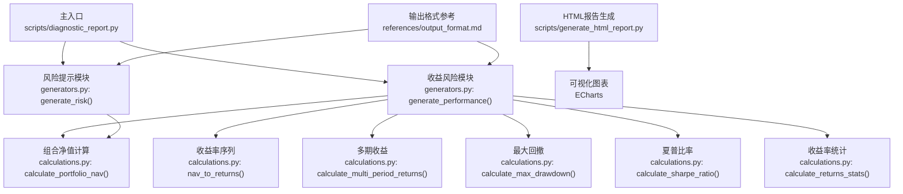
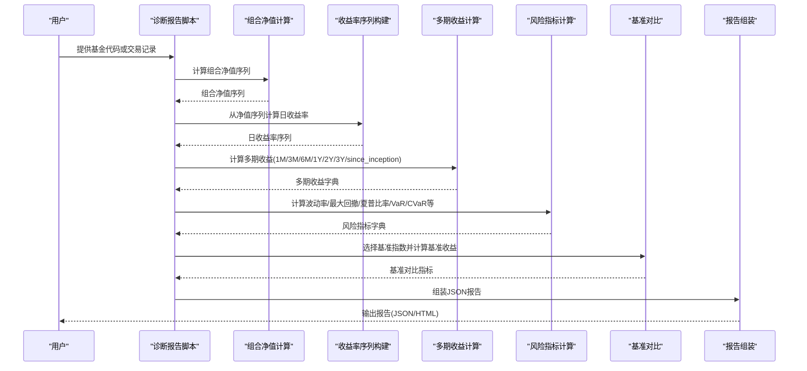
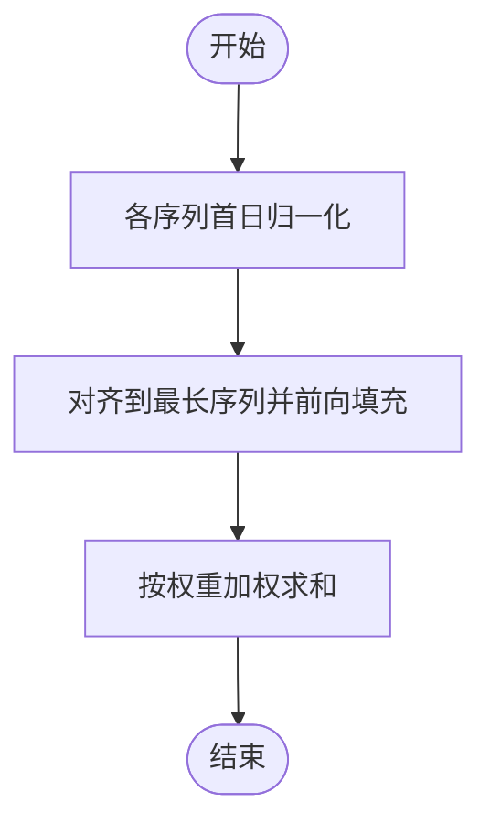
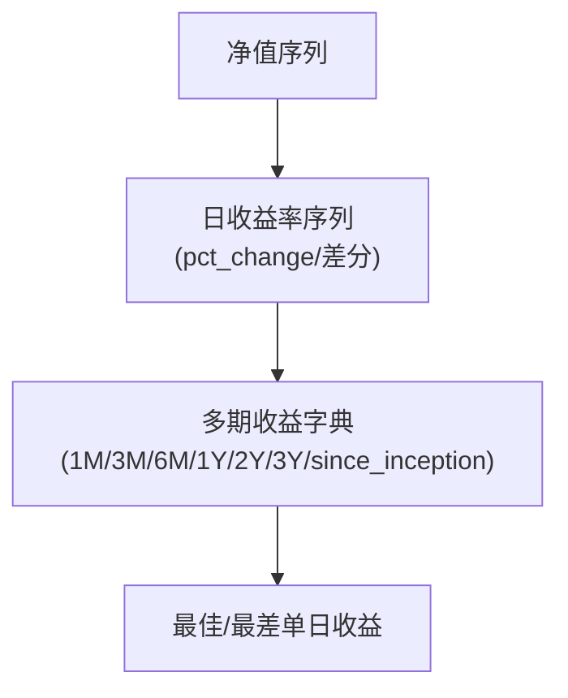
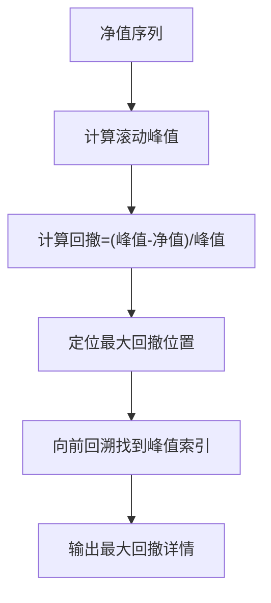
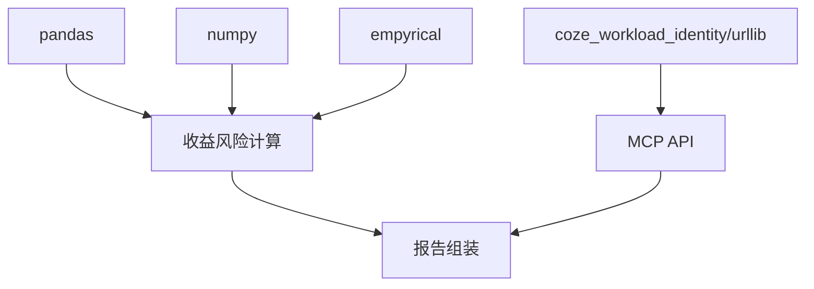

# 收益风险分析

<cite>
**本文引用的文件**
- [SKILL.md](file://fund-account-diagnostic/SKILL.md)
- [diagnostic_report.py](file://fund-account-diagnostic/scripts/diagnostic_report.py)
- [generate_html_report.py](file://fund-account-diagnostic/scripts/generate_html_report.py)
- [output_format.md](file://fund-account-diagnostic/references/output_format.md)
</cite>

## 目录
1. [简介](#简介)
2. [项目结构](#项目结构)
3. [核心组件](#核心组件)
4. [架构总览](#架构总览)
5. [详细组件分析](#详细组件分析)
6. [依赖分析](#依赖分析)
7. [性能考量](#性能考量)
8. [故障排查指南](#故障排查指南)
9. [结论](#结论)
10. [附录](#附录)

## 简介
本文件聚焦“收益风险分析”模块，系统阐述基金账户诊断系统中收益与风险指标的计算逻辑与实现细节，涵盖累计收益、年化收益率(CAGR)、波动率、最大回撤、夏普比率、VaR与CVaR等关键指标，以及收益率序列的构建（日/月/年）。文档还说明了不同计算库(pandas、numpy、empyrical)的使用策略与性能优化方案，并给出业务含义与投资决策指导价值。

## 项目结构
- 主入口：scripts/diagnostic_report.py，编排模块调用
- 计算引擎：scripts/calculations.py，净值归一化、组合净值计算、多期收益、风险指标等纯计算
- 报告生成：scripts/generators.py，收益风险模块生成器(generate_performance/generate_risk)
- HTML可视化报告脚本负责将JSON报告渲染为交互式可视化页面。
- 参考文档定义了报告输出格式与字段语义，便于理解指标含义与展示方式。

图表来源
- [generators.py](file://fund-account-diagnostic/scripts/generators.py)
- [generators.py](file://fund-account-diagnostic/scripts/generators.py)
- [calculations.py](file://fund-account-diagnostic/scripts/calculations.py)
- [calculations.py](file://fund-account-diagnostic/scripts/calculations.py)
- [calculations.py](file://fund-account-diagnostic/scripts/calculations.py)
- [calculations.py](file://fund-account-diagnostic/scripts/calculations.py)
- [calculations.py](file://fund-account-diagnostic/scripts/calculations.py)
- [calculations.py](file://fund-account-diagnostic/scripts/calculations.py)
- [generate_html_report.py:624-755](file://fund-account-diagnostic/scripts/generate_html_report.py#L624-L755)
- [output_format.md:143-355](file://fund-account-diagnostic/references/output_format.md#L143-L355)

章节来源
- [SKILL.md:1-385](file://fund-account-diagnostic/SKILL.md#L1-L385)
- [constants.py](file://fund-account-diagnostic/scripts/constants.py)
- [generate_html_report.py:1-60](file://fund-account-diagnostic/scripts/generate_html_report.py#L1-L60)
- [output_format.md:1-80](file://fund-account-diagnostic/references/output_format.md#L1-L80)

## 核心组件
- 组合净值计算：将各基金净值归一化后按权重加权，得到组合净值序列。
- 收益率序列构建：从净值序列计算日收益率序列。
- 多期收益计算：基于组合净值序列按回溯窗口切片计算1M/3M/6M/1Y/2Y/3Y/since_inception等多期收益。
- 风险指标计算：包括波动率、最大回撤、夏普比率、VaR/95%、CVaR/95%、Sortino、Calmar、Alpha/Beta等。
- 基准对比：自动选择对比指数，计算组合与基准的累计收益、CAGR、最大回撤、超额收益等。
- 报告组装：将上述指标整合为标准化JSON输出，并支持HTML可视化。

章节来源
- [calculations.py](file://fund-account-diagnostic/scripts/calculations.py)
- [calculations.py](file://fund-account-diagnostic/scripts/calculations.py)
- [calculations.py](file://fund-account-diagnostic/scripts/calculations.py)
- [generators.py](file://fund-account-diagnostic/scripts/generators.py)
- [generators.py](file://fund-account-diagnostic/scripts/generators.py)
- [output_format.md:143-355](file://fund-account-diagnostic/references/output_format.md#L143-L355)

## 架构总览
收益风险分析模块围绕“组合净值序列”展开，通过多阶段计算产出各类指标，并与基准进行对比，最终形成报告。

图表来源
- [generators.py](file://fund-account-diagnostic/scripts/generators.py)
- [calculations.py](file://fund-account-diagnostic/scripts/calculations.py)
- [calculations.py](file://fund-account-diagnostic/scripts/calculations.py)
- [calculations.py](file://fund-account-diagnostic/scripts/calculations.py)
- [generators.py](file://fund-account-diagnostic/scripts/generators.py)

## 详细组件分析

### 组合净值计算
- 输入：各基金净值序列与权重。
- 处理：将各序列首日归一化，按权重加权求和，得到组合净值序列。
- 输出：组合净值序列（起始=1）。
- 性能策略：优先使用pandas/numpy向量化运算；回退到纯Python实现。

图表来源
- [calculations.py](file://fund-account-diagnostic/scripts/calculations.py)

章节来源
- [calculations.py](file://fund-account-diagnostic/scripts/calculations.py)

### 收益率序列构建（日/月/年）
- 日收益率：(净值t - 净值t-1) / 净值t-1。
- 月/年序列：通过多期收益函数按交易日窗口切片计算，支持1M/3M/6M/1Y/2Y/3Y/since_inception。
- 输出：日收益率序列与多期收益字典。

图表来源
- [calculations.py](file://fund-account-diagnostic/scripts/calculations.py)
- [calculations.py](file://fund-account-diagnostic/scripts/calculations.py)

章节来源
- [calculations.py](file://fund-account-diagnostic/scripts/calculations.py)
- [calculations.py](file://fund-account-diagnostic/scripts/calculations.py)

### 波动率（年化）
- 定义：日收益率的标准差乘以sqrt(252)。
- 计算路径：优先使用numpy/pandas向量化；回退到纯Python。
- 输出：年化波动率。

章节来源
- [calculations.py](file://fund-account-diagnostic/scripts/calculations.py)

### 最大回撤（最大回撤幅度、峰值/谷值、起止索引/日期）
- 定义：从峰值到谷值的跌幅，以及对应的起止索引与日期。
- 计算路径：优先使用pandas/numpy向量化cummax；回退到纯Python。
- 输出：最大回撤幅度、峰值、谷值、起止索引/日期。

图表来源
- [calculations.py](file://fund-account-diagnostic/scripts/calculations.py)

章节来源
- [calculations.py](file://fund-account-diagnostic/scripts/calculations.py)

### 夏普比率（年化）
- 定义：(年化收益率 - 无风险利率) / 年化波动率。
- 计算路径：优先使用empyrical库；回退到numpy/pandas或纯Python。
- 输出：年化夏普比率。

章节来源
- [calculations.py](file://fund-account-diagnostic/scripts/calculations.py)

### VaR与CVaR（95%）
- VaR/95%：日收益率序列的95%分位数（负值）。
- CVaR/95%：VaR以下尾部分布的均值（负值）。
- 计算路径：优先使用pandas/numpy；回退到纯Python。
- 输出：VaR/95%与CVaR/95%（按年化尺度缩放）。

章节来源
- [calculations.py](file://fund-account-diagnostic/scripts/calculations.py)

### Sortino、Calmar、Alpha/Beta、尾部比率等高级指标
- 通过empyrical库计算，包括下行风险、卡玛比率、尾部比率、Alpha/Beta等。
- 仅在具备empyrical与基准数据时启用，否则保留默认值。

章节来源
- [generators.py](file://fund-account-diagnostic/scripts/generators.py)
- [generators.py](file://fund-account-diagnostic/scripts/generators.py)

### 基准对比与超额收益
- 自动选择对比指数（偏股混合/债券/QDII），计算基准累计收益、CAGR、最大回撤。
- 组合与基准的超额收益（累计/CAGR/最大回撤差值）。

章节来源
- [generators.py](file://fund-account-diagnostic/scripts/generators.py)
- [generators.py](file://fund-account-diagnostic/scripts/generators.py)

### 报告输出与可视化
- JSON输出遵循标准化格式，包含多期收益、性能指标、最大回撤详情、基准对比、净值曲线等。
- HTML报告使用ECharts展示净值曲线、多期收益、组合vs基准对比等。

章节来源
- [output_format.md:143-355](file://fund-account-diagnostic/references/output_format.md#L143-L355)
- [generate_html_report.py:624-755](file://fund-account-diagnostic/scripts/generate_html_report.py#L624-L755)

## 依赖分析
- pandas：向量化构建Series/DataFrame、pct_change、corr、quantile等。
- numpy：向量化数组运算、std/percentile/maximum.accumulate等。
- empyrical：高级风险指标（Sortino、Calmar、Downside Risk、Tail Ratio、Alpha/Beta、Annual Return/Volatility）。
- coze_workload_identity/urllib：HTTP请求封装，支持MCP API调用与降级。

图表来源
- [constants.py](file://fund-account-diagnostic/scripts/constants.py)
- [calculations.py](file://fund-account-diagnostic/scripts/calculations.py)

章节来源
- [constants.py](file://fund-account-diagnostic/scripts/constants.py)

## 性能考量
- 向量化优先：pandas/numpy显著提升计算效率，尤其在大规模序列与相关性矩阵计算中。
- 回退策略：若缺少依赖，采用纯Python实现，保证功能可用但性能下降。
- 内存与对齐：组合净值计算对齐各序列长度并前向填充，避免索引越界与数据丢失。
- 基准数据：优先使用真实指数数据，减少虚拟基准带来的偏差。

章节来源
- [calculations.py](file://fund-account-diagnostic/scripts/calculations.py)
- [generators.py](file://fund-account-diagnostic/scripts/generators.py)

## 故障排查指南
- API不可用：自动降级为模拟数据，报告头部标注数据来源与可用性。
- Excel解析失败：检查列名映射与数据格式，系统提供可用列名列表与错误行号提示。
- 基金代码无效：跳过该基金并在报告中标注，继续处理其他基金。
- 缺少empyrical：高级指标（Sortino/Alpha/Beta等）默认为0，不影响基础指标。
- 依赖缺失：pandas/numpy缺失时，使用纯Python实现，注意性能与精度差异。

章节来源
- [SKILL.md:82-98](file://fund-account-diagnostic/SKILL.md#L82-L98)
- [calculations.py](file://fund-account-diagnostic/scripts/calculations.py)

## 结论
收益风险分析模块以组合净值序列为核心，通过多阶段计算产出全面的风险收益指标，并与基准进行对比，辅以可视化展示，为用户提供清晰、可解释的投资决策参考。在依赖可用的前提下，empyrical进一步提升了指标的专业性与稳定性；在降级模式下，系统仍能提供基础指标与模拟数据，保障诊断能力。

## 附录
- 指标清单与业务含义
  - 累计收益：组合期末净值相较期初的总回报。
  - CAGR：年化复合增长率，衡量长期增长趋势。
  - 波动率：年化标准差，衡量收益不确定性。
  - 最大回撤：从峰值到谷值的最大跌幅，反映潜在损失。
  - 夏普比率：风险调整后收益，衡量单位风险所获收益。
  - VaR/95%：在95%置信度下的最大可能损失。
  - CVaR/95%：超过VaR阈值的平均损失，更关注极端尾部风险。
  - Sortino：仅惩罚下行波动的风险调整指标。
  - Calmar：收益与最大回撤比值，衡量回撤敏感性。
  - Alpha/Beta：相对基准的超额收益与系统性风险。
  - 尾部比率：上/下尾部收益比值，衡量尾部不对称性。

章节来源
- [output_format.md:170-190](file://fund-account-diagnostic/references/output_format.md#L170-L190)
- [generators.py](file://fund-account-diagnostic/scripts/generators.py)