# 核心功能详解

<cite>
**本文引用的文件**
- [SKILL.md](file://fund-account-diagnostic/SKILL.md)
- [diagnostic_report.py](file://fund-account-diagnostic/scripts/diagnostic_report.py)
- [generate_html_report.py](file://fund-account-diagnostic/scripts/generate_html_report.py)
- [output_format.md](file://fund-account-diagnostic/references/output_format.md)
</cite>

## 目录
1. [简介](#简介)
2. [项目结构](#项目结构)
3. [核心组件](#核心组件)
4. [架构总览](#架构总览)
5. [详细组件分析](#详细组件分析)
6. [依赖关系分析](#依赖关系分析)
7. [性能考量](#性能考量)
8. [故障排查指南](#故障排查指南)
9. [结论](#结论)
10. [附录](#附录)

## 简介
本项目为“基金账户诊断技能”提供核心功能文档，围绕八个主要分析模块展开：持仓概览、收益风险表现、账户诊断总览、组合配置诊断、相关性分析、单只基金评价、调仓建议、风险提示。文档详细解释每个模块的输入数据、计算逻辑、输出结果与业务含义，并给出关键金融指标的计算方法、资产配置分析维度、相关性分析算法、调仓建议生成机制以及实际使用示例与最佳实践。

## 项目结构
- 核心脚本
  - 诊断报告生成：scripts/diagnostic_report.py
  - HTML可视化报告生成：scripts/generate_html_report.py
- 参考规范
  - 报告输出格式定义：references/output_format.md
- 技能说明
  - SKILL.md：任务目标、前置条件、数据输入方式、MCP数据源、核心计算逻辑、版本演进与注意事项

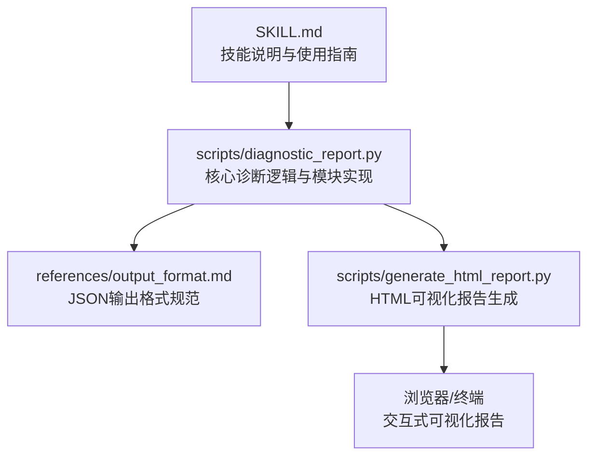

**图表来源**
- [SKILL.md:1-347](file://fund-account-diagnostic/SKILL.md#L1-L347)
- [constants.py](file://fund-account-diagnostic/scripts/constants.py)
- [output_format.md:1-60](file://fund-account-diagnostic/references/output_format.md#L1-L60)
- [generate_html_report.py:1-60](file://fund-account-diagnostic/scripts/generate_html_report.py#L1-L60)

**章节来源**
- [SKILL.md:1-347](file://fund-account-diagnostic/SKILL.md#L1-L347)
- [constants.py](file://fund-account-diagnostic/scripts/constants.py)
- [output_format.md:1-60](file://fund-account-diagnostic/references/output_format.md#L1-L60)
- [generate_html_report.py:1-60](file://fund-account-diagnostic/scripts/generate_html_report.py#L1-L60)

## 核心组件
- 诊断报告生成器：负责解析输入（基金代码或交易记录Excel）、调用MCP数据源、执行各模块计算、生成JSON报告与HTML可视化报告。
- HTML报告渲染器：将JSON报告转换为ECharts交互式可视化HTML页面，包含多类图表与响应式布局。
- 数据获取层：封装MCP工具调用，支持真实数据与模拟数据降级。
- 计算工具层：提供收益率、波动率、最大回撤、夏普比率、相关系数、HHI集中度、多期收益等计算函数。
- 交易记录解析器：支持多列名映射、业务类型识别、份额与成本计算、统计摘要生成。

**章节来源**
- [constants.py](file://fund-account-diagnostic/scripts/constants.py)
- [generate_html_report.py:1-60](file://fund-account-diagnostic/scripts/generate_html_report.py#L1-L60)
- [output_format.md:1-60](file://fund-account-diagnostic/references/output_format.md#L1-L60)

## 架构总览
系统采用“CLI驱动 + 模块化计算 + JSON中间态 + HTML可视化”的架构。核心流程如下：
- 输入解析：命令行参数或Excel文件
- 数据获取：MCP工具调用或模拟数据
- 模块计算：按模块顺序依次执行
- 报告生成：JSON输出 + HTML可视化
- 结果呈现：控制台摘要 + HTML交互式报告

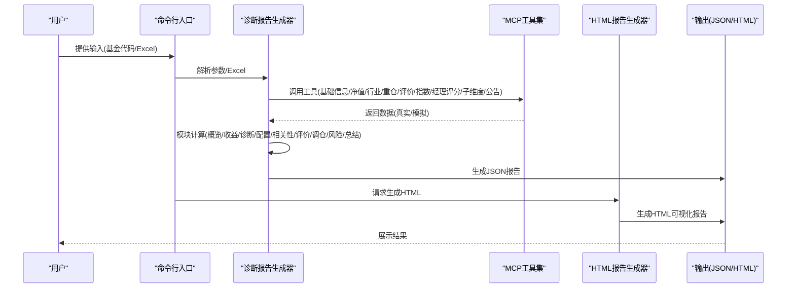

**图表来源**
- [calculations.py](file://fund-account-diagnostic/scripts/calculations.py)
- [generate_html_report.py:1749-1784](file://fund-account-diagnostic/scripts/generate_html_report.py#L1749-L1784)

**章节来源**
- [calculations.py](file://fund-account-diagnostic/scripts/calculations.py)
- [generate_html_report.py:1749-1784](file://fund-account-diagnostic/scripts/generate_html_report.py#L1749-L1784)

## 详细组件分析

### 模块一：持仓概览（overview）
- 输入数据
  - 基金代码列表或交易记录Excel
  - 交易记录解析：业务类型、确认份额、确认金额、单位净值、手续费、确认日期
- 计算逻辑
  - 持仓汇总：按基金聚合份额与成本，计算当前市值、总成本、盈亏与收益率
  - 集中度预警：权重超过阈值（如20%）生成预警
  - 交易统计：申购/赎回/分红次数与金额
  - 已清仓跟踪：基于交易记录识别清仓基金
- 输出结果
  - 基本信息：基金数量、总市值、总成本、盈亏、收益率
  - 持仓明细：权重、市值、成本、盈亏、收益率、综合评分与建议
  - 集中度预警与交易统计摘要
- 业务含义
  - 快速掌握账户整体状况、识别过度集中与清仓情况，为后续诊断提供基础

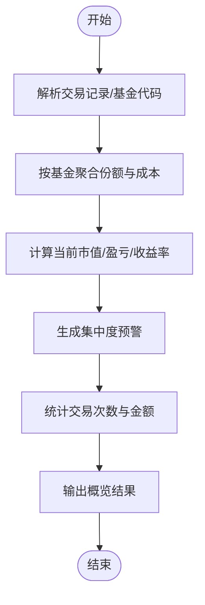

**图表来源**
- [generators.py](file://fund-account-diagnostic/scripts/generators.py)

**章节来源**
- [generators.py](file://fund-account-diagnostic/scripts/generators.py)
- [output_format.md:56-140](file://fund-account-diagnostic/references/output_format.md#L56-L140)

### 模块二：收益风险表现（performance）
- 输入数据
  - 各基金净值序列（按日期升序）
  - 基准指数净值（可选）
- 计算逻辑
  - 组合净值：基于各基金净值与权重加权计算
  - 收益率：日收益率序列（净值差分/前值）
  - 多期收益：1月/3月/6月/1年/2年/3年/成立以来
  - 风险指标：波动率（年化）、最大回撤、VaR/Expected Shortfall、夏普比率、Sortino、Calmar、Alpha/Beta（依赖empyrical）
  - 基准对比：组合与基准的累计收益、CAGR、最大回撤、超额收益
  - 收益排名：单只基金收益排名
- 输出结果
  - 绩效指标汇总、最大回撤详情、多期收益、净值曲线、基准对比、收益排名
- 业务含义
  - 全面评估组合收益与风险，识别超额收益来源与风险暴露

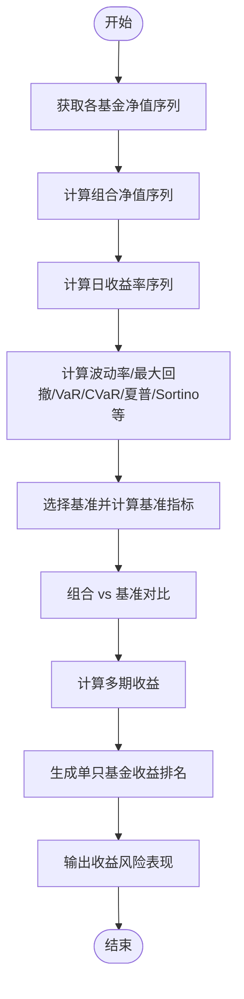

**图表来源**
- [calculations.py](file://fund-account-diagnostic/scripts/calculations.py)
- [calculations.py](file://fund-account-diagnostic/scripts/calculations.py)

**章节来源**
- [calculations.py](file://fund-account-diagnostic/scripts/calculations.py)
- [calculations.py](file://fund-account-diagnostic/scripts/calculations.py)
- [output_format.md:143-331](file://fund-account-diagnostic/references/output_format.md#L143-L331)

### 模块三：账户诊断总览（diagnosis）
- 输入数据
  - 各基金综合评分、收益评分、风险评分、基金经理评分、评分子维度、穿透后个股集中度、相关性水平
- 计算逻辑
  - 综合评分与等级：基于收益与风险评分合成
  - 配置偏离度：当前配置与目标配置的偏差
  - 经理评分：加权近1/2/3年评分与排名
  - 穿透集中度：个股穿透后Top5与集中度等级
  - 子维度评分：创新高/择股/择时/规模
  - 相关性水平：低/中/高
- 输出结果
  - 综合得分与等级、诊断建议、配置偏离对比、经理评分、穿透集中度、子维度堆叠图、相关性等级
- 业务含义
  - 给出账户整体健康度与改进建议，指导资产配置与基金经理选择

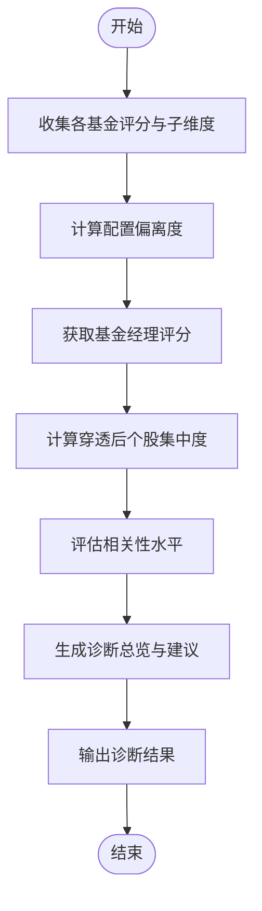

**图表来源**
- [calculations.py](file://fund-account-diagnostic/scripts/calculations.py)
- [calculations.py](file://fund-account-diagnostic/scripts/calculations.py)
- [calculations.py](file://fund-account-diagnostic/scripts/calculations.py)

**章节来源**
- [calculations.py](file://fund-account-diagnostic/scripts/calculations.py)
- [calculations.py](file://fund-account-diagnostic/scripts/calculations.py)
- [calculations.py](file://fund-account-diagnostic/scripts/calculations.py)
- [output_format.md:335-448](file://fund-account-diagnostic/references/output_format.md#L335-L448)

### 模块四：组合配置诊断（allocation）
- 输入数据
  - 各基金行业配置、重仓股、国家/地区分布、风格标签、基金经理穿透
- 计算逻辑
  - 大类资产分布：权益/固收/现金等
  - 国家/地区分布：基于重仓股穿透
  - 行业穿透：Top15行业权重与环比变化
  - 重仓股穿透：Top15个股权重
  - 风险：HHI行业集中度与等级
  - 风格标签：价值/成长/防御
- 输出结果
  - 资产配置饼图、国家/地区分布、行业Top15柱状图、重仓股矩形树图、风格标签、集中度分析
- 业务含义
  - 识别行业与地域集中度风险，评估风格暴露，辅助再平衡

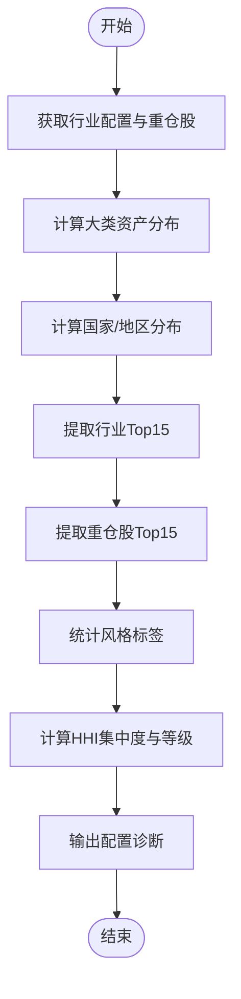

**图表来源**
- [calculations.py](file://fund-account-diagnostic/scripts/calculations.py)
- [generate_html_report.py:659-857](file://fund-account-diagnostic/scripts/generate_html_report.py#L659-L857)

**章节来源**
- [calculations.py](file://fund-account-diagnostic/scripts/calculations.py)
- [generate_html_report.py:659-857](file://fund-account-diagnostic/scripts/generate_html_report.py#L659-L857)
- [output_format.md:452-548](file://fund-account-diagnostic/references/output_format.md#L452-L548)

### 模块五：相关性分析（correlation）
- 输入数据
  - 各基金净值序列（按同一日期对齐）
- 计算逻辑
  - 日收益率序列：净值差分/前值
  - 相关系数矩阵：两两基金日收益相关系数
  - 平均两两相关性：矩阵上三角非对角线均值
  - 高相关对：相关系数高于阈值（如0.85）的基金对
  - 分组分析：基于高相关对进行聚类分组
  - 调仓建议：针对高相关组提出合并或差异化建议
- 输出结果
  - 相关系数矩阵、平均两两相关性、高相关对、分组、调仓建议
- 业务含义
  - 识别组合内同质化风险，指导分散化与调仓

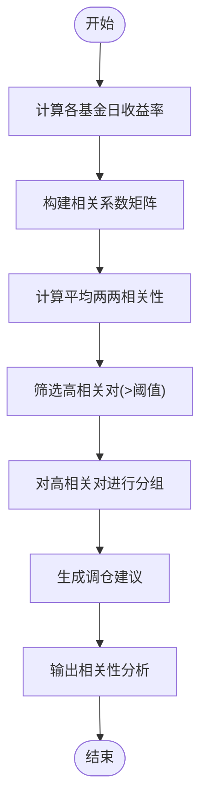

**图表来源**
- [calculations.py](file://fund-account-diagnostic/scripts/calculations.py)
- [calculations.py](file://fund-account-diagnostic/scripts/calculations.py)
- [generate_html_report.py:860-967](file://fund-account-diagnostic/scripts/generate_html_report.py#L860-L967)

**章节来源**
- [calculations.py](file://fund-account-diagnostic/scripts/calculations.py)
- [calculations.py](file://fund-account-diagnostic/scripts/calculations.py)
- [generate_html_report.py:860-967](file://fund-account-diagnostic/scripts/generate_html_report.py#L860-L967)
- [output_format.md:553-626](file://fund-account-diagnostic/references/output_format.md#L553-L626)

### 模块六：单只基金评价（evaluation）
- 输入数据
  - 基金基础信息、净值序列、行业配置、重仓股、基金经理评分、公告/舆情、基准净值
- 计算逻辑
  - 主动型：综合评分、收益/风险评分、等级、建议、最大回撤区间、波动率、夏普比率、多期收益、Top5重仓股、子维度评分、经理评分、公告/舆情、操作建议
  - 指数型：超额收益、PE分位数、估值判断、建议、最大回撤区间、波动率、夏普比率、多期收益、跟踪指数净值
- 输出结果
  - 主动型与指数型评价卡片、估值表
- 业务含义
  - 为每只基金提供多维度评分与建议，支撑择时与替换决策

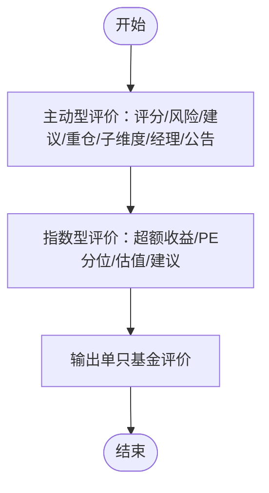

**图表来源**
- [generators.py](file://fund-account-diagnostic/scripts/generators.py)
- [generate_html_report.py:970-1120](file://fund-account-diagnostic/scripts/generate_html_report.py#L970-L1120)

**章节来源**
- [generators.py](file://fund-account-diagnostic/scripts/generators.py)
- [generate_html_report.py:970-1120](file://fund-account-diagnostic/scripts/generate_html_report.py#L970-L1120)
- [output_format.md:630-726](file://fund-account-diagnostic/references/output_format.md#L630-L726)

### 模块七：调仓建议（rebalance）
- 输入数据
  - 配置对比（当前vs目标）、减仓/加仓建议、预期改善、基金替换建议、推荐核心持仓、批次安排
- 计算逻辑
  - 配置对比：资产类别超配/低配幅度与状态
  - 减仓建议：超配幅度与建议操作
  - 加仓建议：低配幅度、目标权重与建议操作
  - 替换建议：评分低或不满足策略的基金替换理由与动作
  - 推荐核心：基于评分与经理评分的核心持仓
  - 批次安排：按时间与数量的替换批次
  - 调仓后预期：相关性改善与预期效果
- 输出结果
  - 配置对比图、建议卡片、替换建议表、推荐核心表、批次安排表、预期改善说明
- 业务含义
  - 提供可执行的再平衡方案，降低集中度与相关性风险

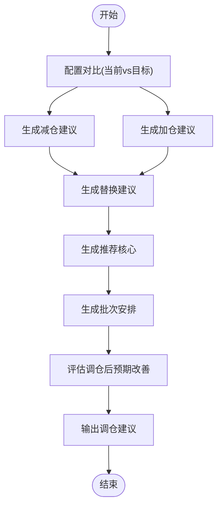

**图表来源**
- [generators.py](file://fund-account-diagnostic/scripts/generators.py)
- [generate_html_report.py:1123-1274](file://fund-account-diagnostic/scripts/generate_html_report.py#L1123-L1274)

**章节来源**
- [generators.py](file://fund-account-diagnostic/scripts/generators.py)
- [generate_html_report.py:1123-1274](file://fund-account-diagnostic/scripts/generate_html_report.py#L1123-L1274)
- [output_format.md:730-805](file://fund-account-diagnostic/references/output_format.md#L730-L805)

### 模块八：风险提示（risk）
- 输入数据
  - 场景分析（牛市/基准/熊市）的预期收益与回撤、市场风险、流动性风险、最大回撤时间区间
- 计算逻辑
  - 风险等级：低/中/高
  - 场景分析：概率、预期收益、预期回撤
  - 风险清单：市场风险与流动性风险
  - 最大回撤区间：起止日期
- 输出结果
  - 风险等级徽章、场景卡片、风险清单、最大回撤区间
- 业务含义
  - 帮助用户理解不同情景下的潜在损失与机会，完善风控策略

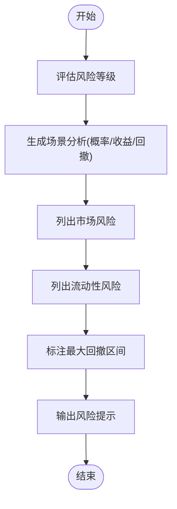

**图表来源**
- [generate_html_report.py:1277-1350](file://fund-account-diagnostic/scripts/generate_html_report.py#L1277-L1350)

**章节来源**
- [generate_html_report.py:1277-1350](file://fund-account-diagnostic/scripts/generate_html_report.py#L1277-L1350)
- [output_format.md:806-847](file://fund-account-diagnostic/references/output_format.md#L806-L847)

## 依赖关系分析
- 外部依赖
  - pandas/numpy/empyrical：向量化计算与金融指标
  - coze_workload_identity/urllib：HTTP请求与MCP调用
- 内部模块耦合
  - 交易记录解析与概览模块强耦合
  - 组合净值计算贯穿收益与诊断模块
  - 相关性分析依赖收益计算结果
  - 评价与调仓建议依赖诊断与相关性分析结果
- 降级策略
  - MCP不可用时，自动降级为模拟数据，保证报告可用性

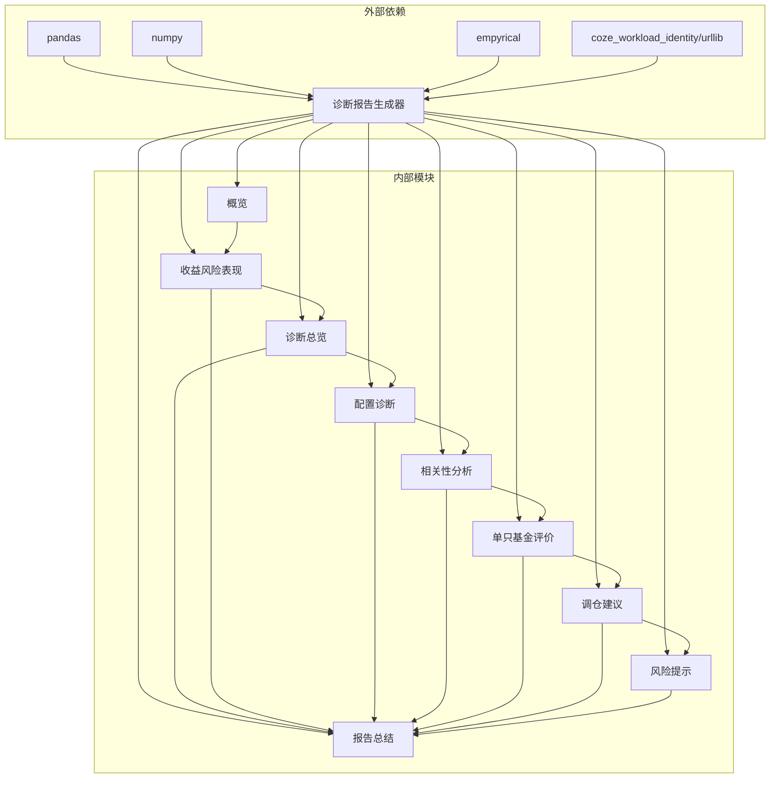

**图表来源**
- [constants.py](file://fund-account-diagnostic/scripts/constants.py)
- [calculations.py](file://fund-account-diagnostic/scripts/calculations.py)

**章节来源**
- [constants.py](file://fund-account-diagnostic/scripts/constants.py)
- [calculations.py](file://fund-account-diagnostic/scripts/calculations.py)

## 性能考量
- 向量化优先：优先使用pandas/numpy进行序列运算，显著提升计算效率
- 缓存与复用：组合净值序列与日收益序列在多个模块复用，避免重复计算
- 降级策略：MCP失败时使用模拟数据，确保稳定性
- 可扩展性：模块化设计便于新增指标与图表

[本节为通用指导，无需具体文件分析]

## 故障排查指南
- MCP不可用
  - 现象：API不可用标记，使用模拟数据
  - 处理：检查环境变量与网络，或等待服务恢复
- Excel解析失败
  - 现象：列名不匹配、无确认成功记录、空文件
  - 处理：确认列名映射、检查确认结果字段、确保数据有效
- 依赖缺失
  - 现象：导入失败或功能受限
  - 处理：安装pandas/numpy/empyrical/coze_workload_identity
- 报告为空或异常
  - 现象：某些模块缺失数据
  - 处理：检查MCP工具返回与模拟降级逻辑

**章节来源**
- [calculations.py](file://fund-account-diagnostic/scripts/calculations.py)
- [generators.py](file://fund-account-diagnostic/scripts/generators.py)
- [SKILL.md:340-347](file://fund-account-diagnostic/SKILL.md#L340-L347)

## 结论
本项目通过模块化设计与稳健的数据获取策略，实现了从交易记录或基金代码出发的全维度诊断分析。八个模块相互衔接，形成闭环：概览提供基础、收益风险表现量化指标、诊断总览整合策略、配置诊断识别风险、相关性分析指导分散化、单只基金评价支撑择时、调仓建议落地执行、风险提示完善风控、报告总结提炼要点。配合HTML可视化报告，用户可直观理解账户健康状况并据此优化投资组合。

[本节为总结性内容，无需具体文件分析]

## 附录
- 使用示例
  - 交易记录诊断：解析Excel，生成完整报告
  - 快速诊断：输入基金代码，生成报告
  - 指定模块：仅生成收益与风险模块
  - 生成HTML：从JSON或直接生成HTML报告
- 最佳实践
  - 使用交易记录Excel可获得更准确的持仓与交易统计
  - 定期运行诊断，结合相关性与集中度指标进行再平衡
  - 关注基金经理评分与公告/舆情，及时调整持仓
  - 借助HTML报告的交互式图表进行深度分析

**章节来源**
- [SKILL.md:140-193](file://fund-account-diagnostic/SKILL.md#L140-L193)
- [generate_html_report.py:1766-1784](file://fund-account-diagnostic/scripts/generate_html_report.py#L1766-L1784)