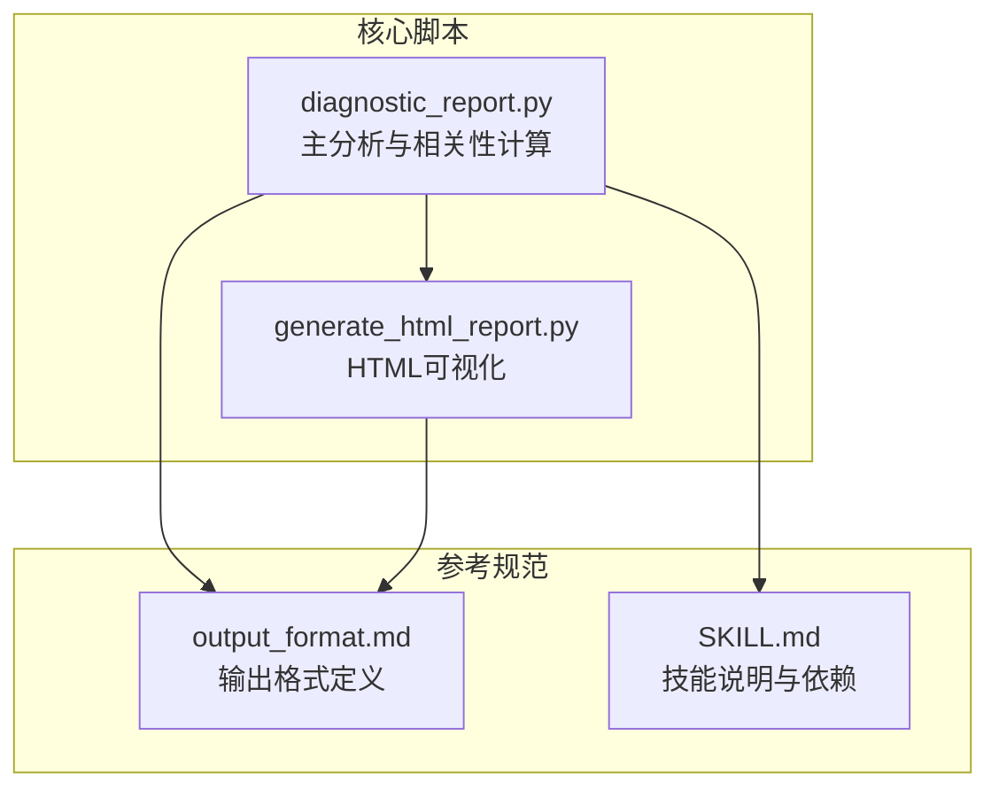
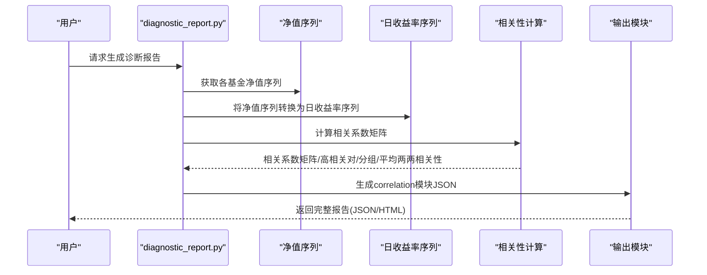
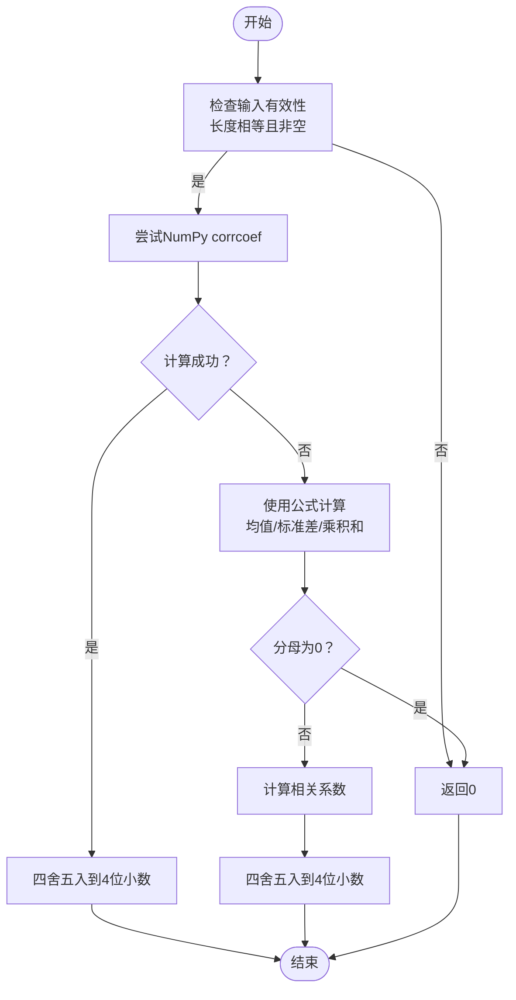
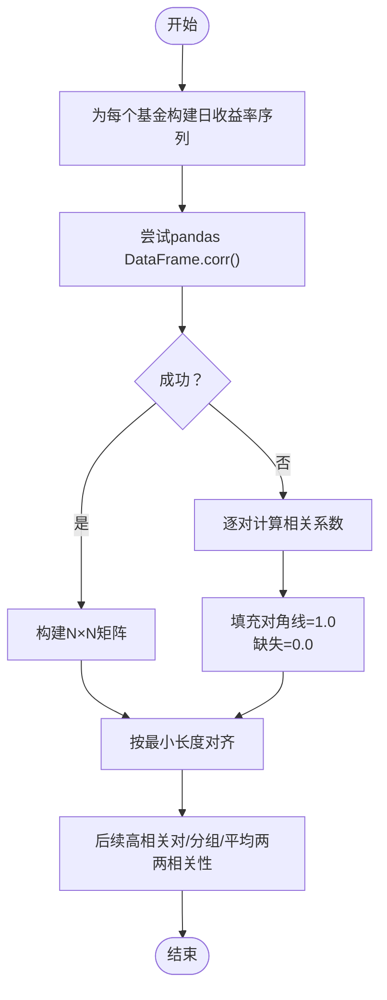
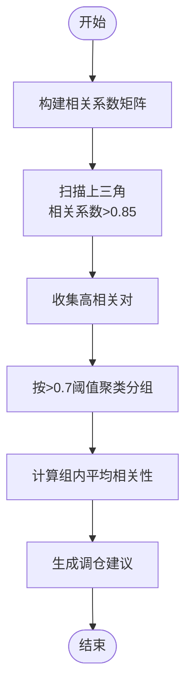
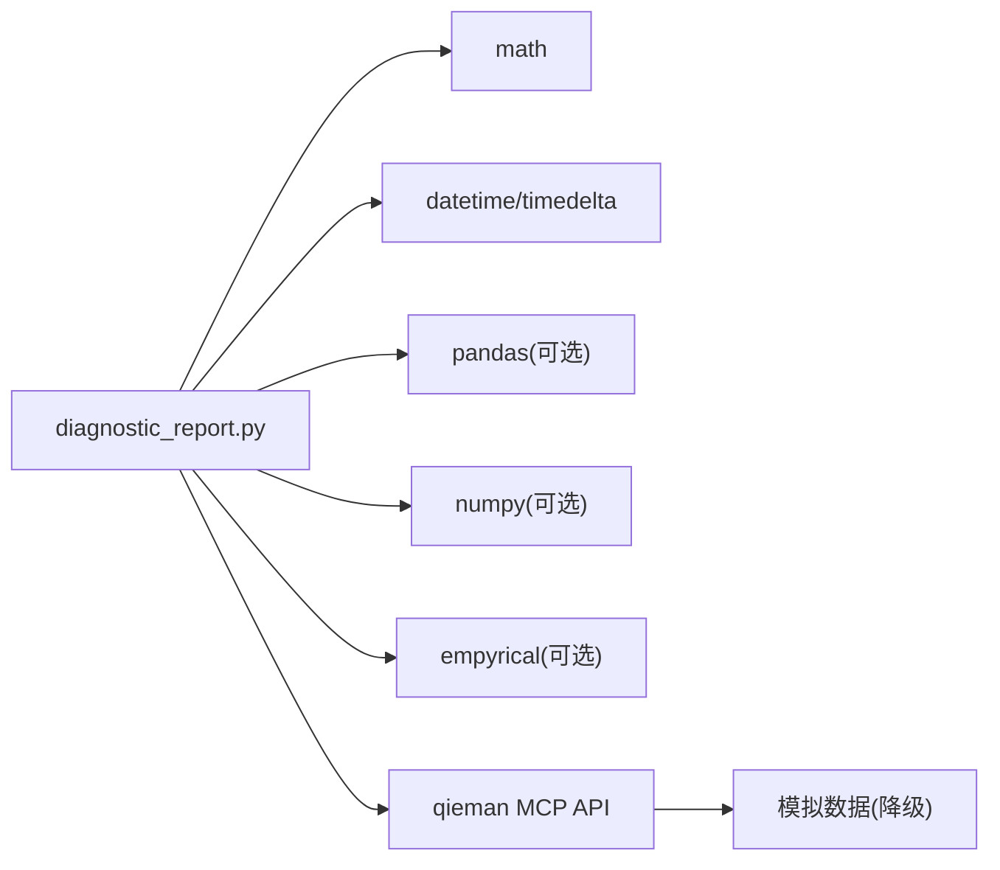

# 相关性分析

<cite>
**本文引用的文件**
- [diagnostic_report.py](file://fund-account-diagnostic/scripts/diagnostic_report.py)
- [generate_html_report.py](file://fund-account-diagnostic/scripts/generate_html_report.py)
- [SKILL.md](file://fund-account-diagnostic/SKILL.md)
- [output_format.md](file://fund-account-diagnostic/references/output_format.md)
</cite>

## 目录
1. [简介](#简介)
2. [项目结构](#项目结构)
3. [核心组件](#核心组件)
4. [架构总览](#架构总览)
5. [详细组件分析](#详细组件分析)
6. [依赖分析](#依赖分析)
7. [性能考量](#性能考量)
8. [故障排查指南](#故障排查指南)
9. [结论](#结论)
10. [附录](#附录)

## 简介
本文件针对基金账户诊断系统中的“相关性分析”功能进行深入技术文档化，涵盖算法实现、阈值设定、结果解读与优化建议。相关性分析以基金日收益率为输入，计算两两之间的皮尔逊相关系数，构建相关系数矩阵，并据此识别高相关对与相关性分组，最终给出调仓建议与可视化呈现。本文还讨论了相关性分析在投资组合风险管理中的作用、动态分析思路、局限性与适用范围。

## 项目结构
- 核心脚本
  - 诊断与分析主程序：scripts/diagnostic_report.py
  - HTML可视化报告生成：scripts/generate_html_report.py
- 参考规范
  - 报告输出格式定义：references/output_format.md
  - 技能说明与依赖：SKILL.md

图表来源
- [generators.py](file://fund-account-diagnostic/scripts/generators.py)
- [generate_html_report.py:938-1046](file://fund-account-diagnostic/scripts/generate_html_report.py#L938-L1046)
- [output_format.md:577-651](file://fund-account-diagnostic/references/output_format.md#L577-L651)
- [SKILL.md:1-385](file://fund-account-diagnostic/SKILL.md#L1-L385)

章节来源
- [constants.py](file://fund-account-diagnostic/scripts/constants.py)
- [SKILL.md:1-385](file://fund-account-diagnostic/SKILL.md#L1-L385)

## 核心组件
- 相关系数计算
  - 使用皮尔逊相关系数衡量两组日收益率的线性相关程度
  - 优先使用NumPy的corrcoef，回退到纯Python实现
- 相关系数矩阵构建
  - 基于所有基金的日收益率序列，构建N×N相关系数矩阵
  - 使用pandas DataFrame.corr()进行向量化计算，失败时回退到逐对计算
- 高相关对识别
  - 阈值：>0.85
  - 输出：高相关对列表，包含基金代码、名称与相关系数
- 相关性分组
  - 阈值：>0.7
  - 输出：相关性分组列表，包含组内基金、组内平均相关性与组内高相关对
- 平均两两相关性
  - 上三角非对角线元素均值，用于整体相关性水平评估
- 调仓建议
  - 基于高相关对与分组情况生成建议文本

章节来源
- [calculations.py](file://fund-account-diagnostic/scripts/calculations.py)
- [generators.py](file://fund-account-diagnostic/scripts/generators.py)
- [output_format.md:577-651](file://fund-account-diagnostic/references/output_format.md#L577-L651)

## 架构总览
相关性分析在诊断流程中的位置与数据流如下：

图表来源
- [generators.py](file://fund-account-diagnostic/scripts/generators.py)
- [calculations.py](file://fund-account-diagnostic/scripts/calculations.py)

章节来源
- [calculations.py](file://fund-account-diagnostic/scripts/calculations.py)
- [generators.py](file://fund-account-diagnostic/scripts/generators.py)

## 详细组件分析

### 相关系数计算（Pearson）
- 输入：两组等长的日收益率序列
- 输出：[-1, 1]范围内的相关系数，保留4位小数
- 实现要点
  - 优先使用NumPy的corrcoef
  - 异常或缺失时回退到手动实现（均值、标准差、乘积和）
  - 对异常值（NaN/Inf）进行保护处理

图表来源
- [calculations.py](file://fund-account-diagnostic/scripts/calculations.py)

章节来源
- [calculations.py](file://fund-account-diagnostic/scripts/calculations.py)

### 相关系数矩阵构建
- 步骤
  - 为每个基金计算日收益率序列
  - 使用pandas DataFrame.corr()构建N×N矩阵
  - 若pandas不可用或异常，则逐对调用相关系数计算函数
- 对齐策略
  - 以所有序列的最小长度对齐，确保矩阵对称且有效
- 对角线与缺失值
  - 对角线为1.0
  - 缺失或异常时填充为1.0或0.0

图表来源
- [generators.py](file://fund-account-diagnostic/scripts/generators.py)

章节来源
- [generators.py](file://fund-account-diagnostic/scripts/generators.py)

### 高相关对识别与分组
- 高相关对阈值：>0.85
  - 输出包含：基金1/2代码、名称、相关系数
- 相关性分组阈值：>0.7
  - 采用贪心聚类：遍历未使用的基金，若与其他未使用基金相关系数>0.7则加入同一组
  - 组内平均相关性 = 组内所有非对角线元素的均值
- 调仓建议
  - 存在高相关对：建议合并或选择差异化产品
  - 存在中等相关组：可考虑优化配置
  - 否则：相关性整体可控

图表来源
- [generators.py](file://fund-account-diagnostic/scripts/generators.py)

章节来源
- [generators.py](file://fund-account-diagnostic/scripts/generators.py)

### 平均两两相关性
- 定义：相关系数矩阵上三角非对角线元素的均值
- 用途：整体相关性水平评估
- 计算：对所有i<j的矩阵元素求和再除以元素数量

章节来源
- [generators.py](file://fund-account-diagnostic/scripts/generators.py)

### HTML可视化与报告输出
- 相关系数热力图
  - X/Y轴为基金名称（短名/全名）
  - 颜色映射：负相关（红色）→中性（白色）→正相关（绿色）
  - 标签显示：基金A vs 基金B 的相关系数
- 高相关对与分组卡片
  - 展示高相关对与相关性分组及其组内平均相关性
- 文本建议
  - 基于高相关对/分组情况生成调仓建议

章节来源
- [generate_html_report.py:938-1046](file://fund-account-diagnostic/scripts/generate_html_report.py#L938-L1046)
- [output_format.md:577-651](file://fund-account-diagnostic/references/output_format.md#L577-L651)

## 依赖分析
- 内置依赖
  - math：数学运算（平方根、幂等）
  - datetime/timedelta：日期与时间处理（模拟数据）
- 可选依赖（提升性能与精度）
  - pandas：向量化计算、DataFrame.corr()
  - numpy：向量化相关系数计算、数组操作
  - empyrical：高级风险指标（本模块未直接使用）
- API与数据源
  - qieman MCP服务器：获取基金净值、行业配置、重仓股等
  - 降级机制：API不可用时使用模拟数据

图表来源
- [constants.py](file://fund-account-diagnostic/scripts/constants.py)
- [SKILL.md:4-10](file://fund-account-diagnostic/SKILL.md#L4-L10)

章节来源
- [constants.py](file://fund-account-diagnostic/scripts/constants.py)
- [SKILL.md:4-10](file://fund-account-diagnostic/SKILL.md#L4-L10)

## 性能考量
- 向量化优先
  - pandas DataFrame.corr()与numpy corrcoef显著优于纯Python循环
- 时间复杂度
  - 矩阵构建：O(N^2·T)，其中N为基金数，T为交易日数
  - 逐对计算：在pandas不可用时启用，复杂度同上
- 内存占用
  - 需要存储所有基金的收益率序列与N×N矩阵
  - 对齐策略使用最小长度，避免过长序列导致内存压力
- 降级策略
  - API不可用时使用模拟数据，保证流程连续性

[本节为通用性能讨论，不直接分析具体文件]

## 故障排查指南
- 相关系数为0或异常
  - 检查输入序列长度是否一致且非空
  - 检查是否存在标准差为0的情况（单一收益或常数序列）
- pandas不可用导致矩阵为空
  - 确认可选依赖安装
  - 系统将自动回退到逐对计算
- API不可用
  - 检查环境变量COZE_QIEMAN_API_{SKILL_ID}
  - 系统将使用模拟数据，报告头会标注数据来源
- 高相关对为空
  - 基金数量不足（<2）或相关性普遍较低
  - 检查分析期长度与数据质量

章节来源
- [generators.py](file://fund-account-diagnostic/scripts/generators.py)
- [generators.py](file://fund-account-diagnostic/scripts/generators.py)
- [SKILL.md:76-98](file://fund-account-diagnostic/SKILL.md#L76-L98)

## 结论
相关性分析通过皮尔逊相关系数与矩阵构建，实现了对基金间联动关系的量化评估。结合高相关对阈值（>0.85）与分组阈值（>0.7），系统能够识别分散化不足的组合，并提供调仓建议。平均两两相关性用于整体水平评估，有助于判断组合系统性风险。在实际应用中，建议结合行业/地区/风格等维度进行动态分析，并定期滚动更新以捕捉市场结构变化。

[本节为总结性内容，不直接分析具体文件]

## 附录

### 相关性分析在投资组合风险管理中的作用
- 分散化效果评估
  - 平均两两相关性越低，组合分散化效果越好
  - 高相关对与高相关组意味着潜在的系统性风险集中
- 潜在风险识别
  - 高相关对可能在市场下跌时同步承压
  - 相关性分组提示组合在某些板块/主题上的集中暴露
- 风险提示与建议
  - 建议降低高相关对权重或替换为低相关产品
  - 对相关性分组进行再平衡，引入差异化资产

[本节为概念性说明，不直接分析具体文件]

### 高相关对识别的判断标准
- 高相关对：相关系数 > 0.85
- 相关性分组：相关系数 > 0.7
- 调仓建议：基于高相关对数量与分组情况生成

章节来源
- [generators.py](file://fund-account-diagnostic/scripts/generators.py)
- [output_format.md:607-621](file://fund-account-diagnostic/references/output_format.md#L607-L621)

### 相关性随时间变化的动态分析方法
- 滚动窗口分析
  - 使用不同回溯期（如21/63/126/252交易日）分别计算相关系数矩阵
  - 观察高相关对数量与平均两两相关性的变化趋势
- 分阶段对比
  - 将分析期分为牛市/熊市/震荡期，比较各阶段相关性差异
- 可视化
  - 使用热力图展示时间序列上的相关性变化
  - 使用折线图展示平均两两相关性的时间序列

[本节为方法论说明，不直接分析具体文件]

### 相关性分析结果的解读指南
- 热力图
  - 对角线为1.0，颜色越红代表负相关，越绿代表正相关
  - 重点关注高相关区域（>0.85）与中等相关区域（>0.7）
- 高相关对
  - 数量越多，组合系统性风险越高
  - 建议优先处理高相关对
- 相关性分组
  - 组内平均相关性越高，组内协同效应越强
  - 建议在组内引入差异化资产或跨组配置
- 平均两两相关性
  - 数值越低，分散化效果越好
  - 可与历史均值对比，判断当前相关性水平

章节来源
- [generate_html_report.py:938-1046](file://fund-account-diagnostic/scripts/generate_html_report.py#L938-L1046)
- [output_format.md:577-651](file://fund-account-diagnostic/references/output_format.md#L577-L651)

### 如何利用相关性分析优化投资组合
- 降低系统性风险
  - 减少高相关对，引入低相关或负相关的资产
  - 通过相关性分组识别集中暴露，进行再平衡
- 提升分散化效果
  - 引入不同行业/地区/风格的资产
  - 降低平均两两相关性
- 动态调整
  - 根据市场周期调整相关性阈值与权重
  - 定期滚动更新相关性矩阵，及时发现新的高相关对

[本节为实践建议，不直接分析具体文件]

### 相关性分析的局限性与适用范围
- 局限性
  - 仅衡量线性相关，无法捕捉非线性关系
  - 对极端值敏感，可能受异常收益率影响
  - 历史相关性不代表未来相关性
  - 基金类型/市场环境变化可能导致相关性结构改变
- 适用范围
  - 适用于同市场/同币种的基金组合
  - 对于QDII/跨境产品，需结合汇率与宏观因素分析
  - 建议与行业/地区/风格等维度结合使用

[本节为通用说明，不直接分析具体文件]