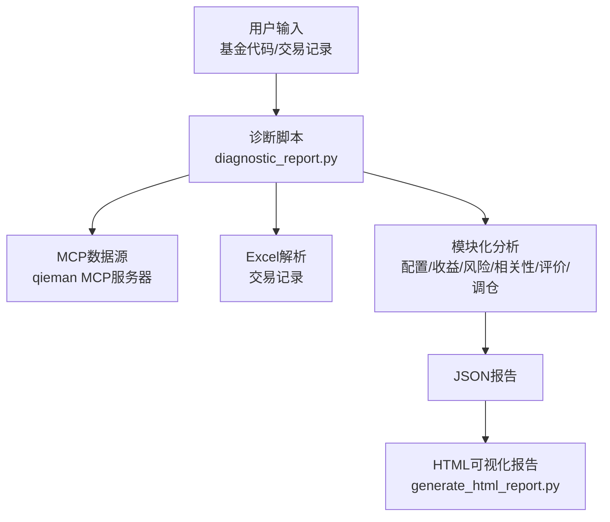
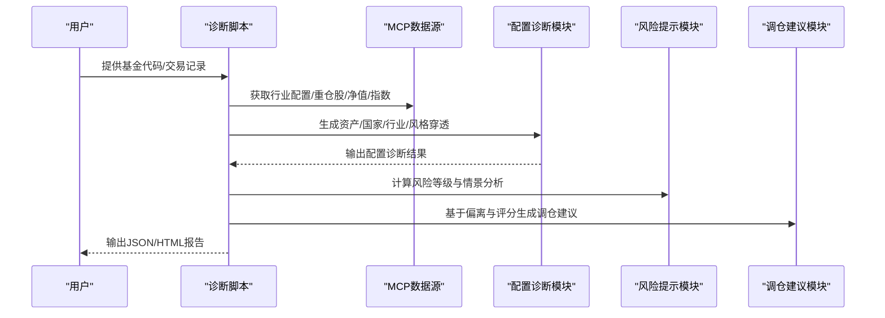
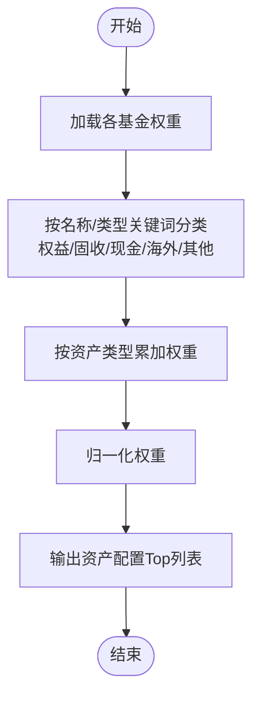
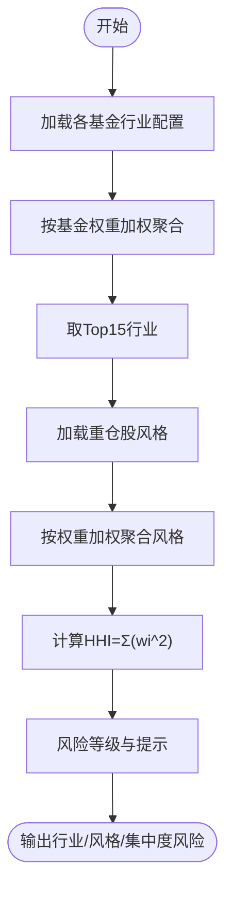
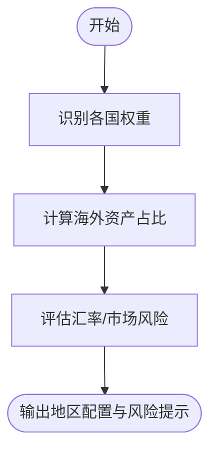
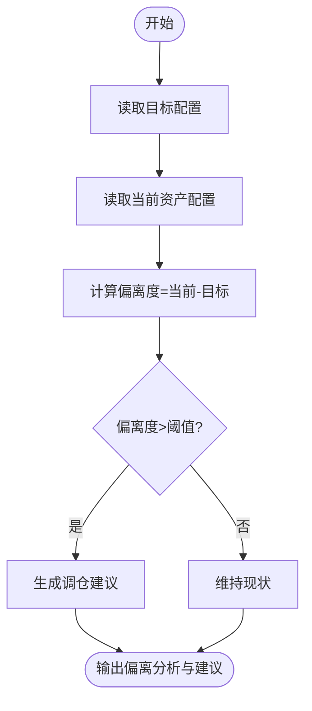
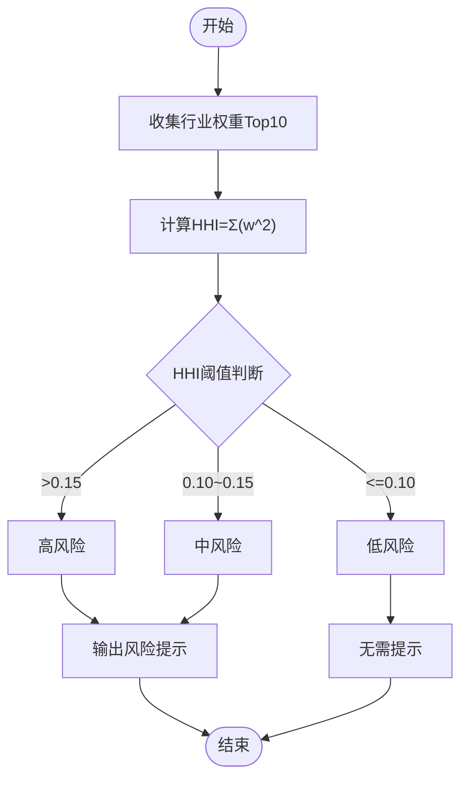
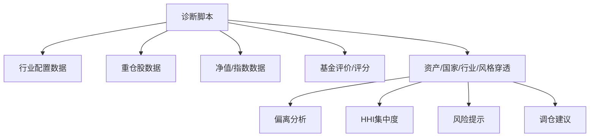

# 组合配置诊断

<cite>
**本文引用的文件**
- [SKILL.md](file://fund-account-diagnostic/SKILL.md)
- [diagnostic_report.py](file://fund-account-diagnostic/scripts/diagnostic_report.py)
- [generate_html_report.py](file://fund-account-diagnostic/scripts/generate_html_report.py)
- [output_format.md](file://fund-account-diagnostic/references/output_format.md)
</cite>

## 目录
1. [简介](#简介)
2. [项目结构](#项目结构)
3. [核心组件](#核心组件)
4. [架构总览](#架构总览)
5. [详细组件分析](#详细组件分析)
6. [依赖关系分析](#依赖关系分析)
7. [性能考量](#性能考量)
8. [故障排查指南](#故障排查指南)
9. [结论](#结论)
10. [附录](#附录)

## 简介
本文件面向“组合配置诊断”功能，系统化阐述资产配置分析的维度与方法，包括大类资产配置（权益、固收、现金）、行业分布诊断、地区配置分析与风格标签识别；解释目标配置与实际配置的偏离分析（偏离程度、风险影响、调整建议）；详述行业集中度指数（HHI）的计算与风险评估标准；说明地区配置的风险考量与分散化策略；给出资产配置优化的理论基础与实践指导（现代投资组合理论应用）；并说明不同投资目标与风险承受能力下的最优配置策略，以及诊断结果对投资决策的具体指导意义。

## 项目结构
- 脚本入口与核心逻辑：scripts/diagnostic_report.py
- HTML可视化报告生成：scripts/generate_html_report.py
- 报告输出格式参考：references/output_format.md
- 技能说明与使用指引：SKILL.md

图表来源
- [constants.py](file://fund-account-diagnostic/scripts/constants.py)
- [generate_html_report.py:1-60](file://fund-account-diagnostic/scripts/generate_html_report.py#L1-L60)

章节来源
- [SKILL.md:12-385](file://fund-account-diagnostic/SKILL.md#L12-L385)
- [constants.py](file://fund-account-diagnostic/scripts/constants.py)

## 核心组件
- 配置诊断模块：负责大类资产、国家/地区、行业穿透、重仓股风格与集中度风险评估。
- 偏离分析：比较目标配置与实际配置，计算偏离度并生成调整建议。
- HHI集中度指数：衡量行业集中程度，提供风险等级与提示。
- 地区配置与分散化：识别海外资产占比与汇率风险，提出分散化策略。
- 理论基础与实践：结合现代投资组合理论，给出不同风险偏好下的最优配置策略与调仓建议。

章节来源
- [generators.py](file://fund-account-diagnostic/scripts/generators.py)
- [generators.py](file://fund-account-diagnostic/scripts/generators.py)
- [calculations.py](file://fund-account-diagnostic/scripts/calculations.py)

## 架构总览
组合配置诊断贯穿于“诊断总览—持仓概览—收益风险—配置诊断—相关性—单只评价—调仓建议—总结”的模块链路，其中配置诊断模块依赖于：
- 基金行业配置与重仓股数据
- 基金类型/名称推断资产类别与国家分布
- 目标配置与基准配置参数
- HHI计算与集中度风险评估
- 风险提示与调仓建议联动

图表来源
- [generators.py](file://fund-account-diagnostic/scripts/generators.py)
- [generators.py](file://fund-account-diagnostic/scripts/generators.py)
- [generators.py](file://fund-account-diagnostic/scripts/generators.py)
- [generators.py](file://fund-account-diagnostic/scripts/generators.py)

## 详细组件分析

### 大类资产配置（权益/固收/现金/海外/商品/其他）
- 推断逻辑：根据基金名称与类型关键字识别资产类别与国家分布，累加各基金权重形成资产与国家分布。
- 关键实现：
  - 资产类别识别关键词：海外/QDII、债券/纯债、货币/活钱等。
  - 国家/地区识别：美国、日本、欧洲、印度、中国香港、其他。
  - 归一化权重，输出Top资产与Top国家分布。

图表来源
- [generators.py](file://fund-account-diagnostic/scripts/generators.py)

章节来源
- [generators.py](file://fund-account-diagnostic/scripts/generators.py)

### 行业分布诊断与风格标签识别
- 行业穿透：对各基金行业配置按基金权重加权聚合，输出Top15行业及其环比变化。
- 风格标签：对重仓股风格（价值/成长/防御）进行加权统计，输出风格分布。
- 风险评估：基于行业权重计算HHI，给出集中度等级与风险提示。

图表来源
- [generators.py](file://fund-account-diagnostic/scripts/generators.py)
- [generators.py](file://fund-account-diagnostic/scripts/generators.py)
- [calculations.py](file://fund-account-diagnostic/scripts/calculations.py)

章节来源
- [generators.py](file://fund-account-diagnostic/scripts/generators.py)
- [generators.py](file://fund-account-diagnostic/scripts/generators.py)
- [calculations.py](file://fund-account-diagnostic/scripts/calculations.py)

### 地区配置分析与风险考量
- 地区识别：基于国家关键词识别（美国、日本、欧洲、印度、中国香港、其他）。
- 风险考量：
  - 海外资产占比偏高带来汇率风险；
  - 权益仓位偏高导致市场下跌时回撤风险增大；
  - 基金数量过多会提升管理复杂度与流动性风险。

图表来源
- [generators.py](file://fund-account-diagnostic/scripts/generators.py)
- [generators.py](file://fund-account-diagnostic/scripts/generators.py)

章节来源
- [generators.py](file://fund-account-diagnostic/scripts/generators.py)
- [generators.py](file://fund-account-diagnostic/scripts/generators.py)

### 目标配置与实际配置的偏离分析
- 目标配置：通过环境变量可配置权益/固收/现金的目标比例。
- 偏离计算：对权益、固收、现金分别计算当前权重与目标权重的差值（偏离度）。
- 风险影响：偏离度越大，组合偏离目标越远，潜在风险与收益偏离目标配置的风险收益比。
- 调整建议：根据偏离度阈值生成减配/加配建议与替换建议。

图表来源
- [generators.py](file://fund-account-diagnostic/scripts/generators.py)
- [generators.py](file://fund-account-diagnostic/scripts/generators.py)

章节来源
- [generators.py](file://fund-account-diagnostic/scripts/generators.py)
- [generators.py](file://fund-account-diagnostic/scripts/generators.py)

### 行业集中度指数（HHI）计算与风险评估
- 计算公式：HHI = Σ(行业权重^2)。
- 风险评估标准：
  - HHI > 0.15：高风险
  - 0.10 < HHI ≤ 0.15：中风险
  - HHI ≤ 0.10：低风险
- 风险提示：集中度过高建议适当分散。

图表来源
- [calculations.py](file://fund-account-diagnostic/scripts/calculations.py)
- [generators.py](file://fund-account-diagnostic/scripts/generators.py)

章节来源
- [calculations.py](file://fund-account-diagnostic/scripts/calculations.py)
- [generators.py](file://fund-account-diagnostic/scripts/generators.py)

### 现代投资组合理论（MPT）应用与优化策略
- 理论基础：通过分散化降低非系统性风险，追求相同风险下的更高收益或相同收益下的更低风险。
- 实践指导：
  - 不同投资目标与风险承受能力下的最优配置策略（通过目标配置与基准配置参数体现）。
  - 通过相关性分析与调仓建议，优化组合风险收益比。
  - 基于目标配置与实际配置的偏离度，制定再平衡策略。

章节来源
- [constants.py](file://fund-account-diagnostic/scripts/constants.py)
- [generators.py](file://fund-account-diagnostic/scripts/generators.py)
- [generators.py](file://fund-account-diagnostic/scripts/generators.py)

### 配置诊断结果对投资决策的指导意义
- 综合评分与等级：反映整体配置健康度与稳定性。
- 偏离分析：明确超配/低配资产与调整方向。
- 风险提示：识别权益/海外/流动性等风险点。
- 调仓建议：提供减配/加配与替换建议，支持分批执行。
- 可视化呈现：HTML报告直观展示配置偏离、资产分布、风格分布与集中度风险。

章节来源
- [generators.py](file://fund-account-diagnostic/scripts/generators.py)
- [generators.py](file://fund-account-diagnostic/scripts/generators.py)
- [generate_html_report.py:429-621](file://fund-account-diagnostic/scripts/generate_html_report.py#L429-L621)

## 依赖关系分析
- 外部数据源：qieman MCP服务器（基金信息、净值、行业配置、重仓股、指数、基金经理评分、评分子维度、公告舆情）。
- 内部模块耦合：
  - 配置诊断模块依赖行业配置与重仓股数据。
  - 偏离分析模块依赖目标配置与资产配置结果。
  - 风险提示模块依赖收益序列与资产配置。
  - 调仓建议模块依赖评分、相关性与偏离分析结果。

图表来源
- [generators.py](file://fund-account-diagnostic/scripts/generators.py)
- [generators.py](file://fund-account-diagnostic/scripts/generators.py)
- [generators.py](file://fund-account-diagnostic/scripts/generators.py)

章节来源
- [generators.py](file://fund-account-diagnostic/scripts/generators.py)
- [generators.py](file://fund-account-diagnostic/scripts/generators.py)
- [generators.py](file://fund-account-diagnostic/scripts/generators.py)

## 性能考量
- 向量化计算：优先使用pandas/numpy进行序列运算（净值、收益、相关性、风险指标），在不可用时回退到纯Python实现。
- 数据对齐与填充：组合净值计算采用对齐与前向填充策略，保证不同长度序列的稳定加权。
- 可选依赖：empyrical用于高级风险指标（索提诺比率、卡玛比率、下行风险、尾部比率、Alpha/Beta），在不可用时不影响基础指标。

章节来源
- [calculations.py](file://fund-account-diagnostic/scripts/calculations.py)
- [calculations.py](file://fund-account-diagnostic/scripts/calculations.py)
- [generators.py](file://fund-account-diagnostic/scripts/generators.py)

## 故障排查指南
- API不可用：自动降级为模拟数据，报告头部标注数据来源与可用性。
- Excel解析失败：输出详细错误信息（行号、列名），终止执行。
- 列名不匹配：尝试模糊匹配，匹配失败输出可用列名列表。
- 基金代码无效：跳过该基金并在报告中标注，继续处理其他基金。
- 相关性分析：当基金数量不足或序列长度不一致时，返回相应提示与建议。

章节来源
- [SKILL.md:82-98](file://fund-account-diagnostic/SKILL.md#L82-L98)
- [generators.py](file://fund-account-diagnostic/scripts/generators.py)
- [generators.py](file://fund-account-diagnostic/scripts/generators.py)

## 结论
组合配置诊断以“穿透式”视角整合行业、地区、风格与集中度等多维信息，结合目标配置与实际配置的偏离分析，提供可执行的调仓建议与风险提示。通过HHI集中度指数与相关性分析，系统化评估行业与组合内部联动风险，辅以现代投资组合理论指导，帮助用户在不同风险偏好下实现更稳健的资产配置与持续优化。

## 附录
- 报告输出字段与结构参考：见 output_format.md。
- HTML可视化报告特性：ECharts交互图表、品牌色与响应式布局。

章节来源
- [output_format.md:476-573](file://fund-account-diagnostic/references/output_format.md#L476-L573)
- [generate_html_report.py:148-154](file://fund-account-diagnostic/scripts/generate_html_report.py#L148-L154)