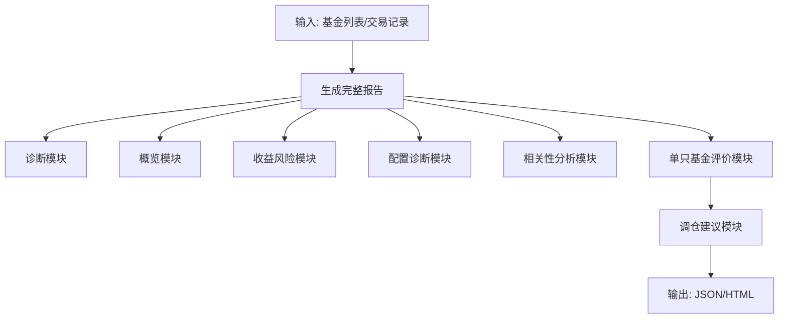
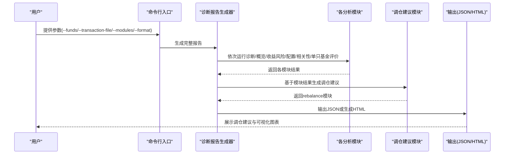
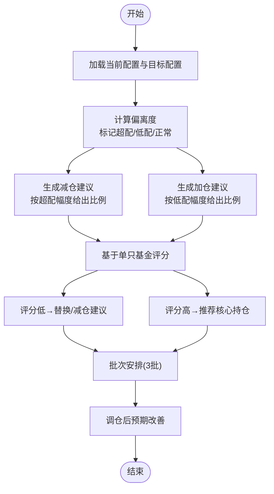
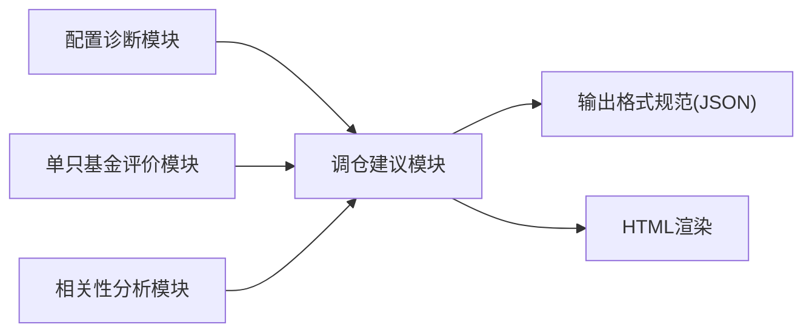

# 调仓建议

<cite>
**本文引用的文件**
- [SKILL.md](file://fund-account-diagnostic/SKILL.md)
- [diagnostic_report.py](file://fund-account-diagnostic/scripts/diagnostic_report.py)
- [output_format.md](file://fund-account-diagnostic/references/output_format.md)
- [generate_html_report.py](file://fund-account-diagnostic/scripts/generate_html_report.py)
</cite>

## 目录
1. [简介](#简介)
2. [项目结构](#项目结构)
3. [核心组件](#核心组件)
4. [架构总览](#架构总览)
5. [详细组件分析](#详细组件分析)
6. [依赖关系分析](#依赖关系分析)
7. [性能考量](#性能考量)
8. [故障排查指南](#故障排查指南)
9. [结论](#结论)
10. [附录](#附录)

## 简介
本文件围绕“调仓建议”功能，系统阐述基于目标配置的资产再平衡建议与基于风险调整的组合优化建议的生成机制、规则体系、策略类型、成本考虑、实务执行要点，以及与市场环境的关系与实施跟踪评估方法。调仓建议模块位于完整的诊断报告流水线末端，依赖前述模块的分析结果，最终输出“调仓建议”模块的结构化 JSON 与 HTML 可视化。

## 项目结构
- 调仓建议模块位于诊断报告生成脚本中，负责在完成诊断、概览、收益风险、配置、相关性、单只基金评价等模块之后，基于这些结果生成调仓建议。
- 输出格式由参考文档定义，确保“rebalance”模块字段规范一致。
- HTML 报告渲染脚本负责将“rebalance”模块以可视化卡片、表格、图表等形式呈现。

图表来源
- [generators.py](file://fund-account-diagnostic/scripts/generators.py)

章节来源
- [SKILL.md:100-170](file://fund-account-diagnostic/SKILL.md#L100-L170)
- [generators.py](file://fund-account-diagnostic/scripts/generators.py)

## 核心组件
- 调仓建议生成函数：根据当前资产配置与目标配置的偏离，生成减仓/加仓建议，并结合单只基金评分给出替换建议与批次安排。
- 输出格式规范：严格遵循参考文档定义的字段，包括配置对比、减仓/加仓建议、替换建议、推荐核心持仓、批次安排、调仓后预期改善等。
- HTML 渲染：将调仓建议以卡片、表格、图表形式可视化展示，便于用户理解与执行。

章节来源
- [generators.py](file://fund-account-diagnostic/scripts/generators.py)
- [output_format.md:754-865](file://fund-account-diagnostic/references/output_format.md#L754-L865)
- [generate_html_report.py:1200-1352](file://fund-account-diagnostic/scripts/generate_html_report.py#L1200-L1352)

## 架构总览
调仓建议模块在完整报告生成流程中的位置如下：

图表来源
- [generators.py](file://fund-account-diagnostic/scripts/generators.py)
- [generators.py](file://fund-account-diagnostic/scripts/generators.py)

## 详细组件分析

### 1. 调仓建议生成机制
- 输入：当前资产配置（权益/固收/现金）与目标配置（可从环境变量覆盖），以及单只基金评分与评价结果。
- 处理：
  - 计算当前配置与目标配置的偏离，标记“超配/低配/正常”，并给出建议比例。
  - 基于单只基金评分，筛选评分低于阈值的基金，给出“替换/减仓”建议，并说明理由。
  - 识别评分较高的基金，作为“推荐核心持仓”。
  - 将替换建议按批次安排，分3批，每批约相等数量，时间跨度约1个月一批。
  - 预估调仓后预期：最大配置偏离度下降、相关性结构改善、风险收益比优化。
- 输出：包含配置对比、减仓/加仓建议、替换建议、推荐核心持仓、批次安排、调仓后预期改善等字段。

图表来源
- [generators.py](file://fund-account-diagnostic/scripts/generators.py)

章节来源
- [generators.py](file://fund-account-diagnostic/scripts/generators.py)
- [output_format.md:754-865](file://fund-account-diagnostic/references/output_format.md#L754-L865)

### 2. 规则体系与阈值
- 偏离程度判断：
  - 超配/低配阈值：0.01（即1%）作为判断边界，超过此幅度才生成建议。
  - 配置偏离度阈值：在诊断模块中，若最大偏离度>15%则建议再平衡调整，>5%则建议择机调整。
- 评分阈值与建议级别：
  - 单只基金评分<60：建议“替换”
  - 单只基金评分60-69：建议“减仓”（或“部分替换”，视基金经理评分）
  - 单只基金评分≥80：作为“推荐核心持仓”
- 建议级别划分：
  - 减仓/加仓建议：按偏离幅度给出“建议赎回比例/建议增持比例”。
  - 替换建议：按评分给出“替换/减仓”动作与理由。
  - 推荐核心持仓：按评分排序取前3。

章节来源
- [generators.py](file://fund-account-diagnostic/scripts/generators.py)
- [generators.py](file://fund-account-diagnostic/scripts/generators.py)
- [generators.py](file://fund-account-diagnostic/scripts/generators.py)

### 3. 不同类型调仓策略的适用场景
- 完全再平衡：
  - 适用：当前配置偏离目标显著（>15%），且市场波动较大或策略目标发生重大变化。
  - 特征：一次性调整至目标配置，可能产生较大交易成本与税务影响。
- 部分再平衡：
  - 适用：偏离度中等（5%-15%），市场不确定性较高。
  - 特征：按偏离幅度给出建议比例，逐步调整，兼顾成本与效果。
- 渐进式调整：
  - 适用：偏离度较小（<5%），或市场处于震荡阶段。
  - 特征：通过批次安排分批执行，降低冲击成本与择时风险。

章节来源
- [generators.py](file://fund-account-diagnostic/scripts/generators.py)
- [generators.py](file://fund-account-diagnostic/scripts/generators.py)

### 4. 调仓成本考虑因素
- 交易费用：
  - 调仓涉及大量买卖操作，需考虑交易佣金、印花税等成本。
  - 建议在批次安排中尽量合并同类操作，减少交易频次。
- 税收影响：
  - 赎回/转换可能产生所得税或增值税，需结合个人税务状况评估。
- 流动性风险：
  - 部分基金可能存在流动性不足，导致大额赎回困难或滑点扩大。
  - 建议优先选择流动性较好的基金进行大规模调仓。

章节来源
- [generate_html_report.py:1200-1352](file://fund-account-diagnostic/scripts/generate_html_report.py#L1200-L1352)

### 5. 调仓执行实务指导
- 分批操作：
  - 将替换建议按3批安排，每批约相等数量，时间间隔约1个月，降低市场冲击。
- 时间选择：
  - 避开重要公告披露期、季度末、月末等高波动时段。
  - 结合市场趋势与流动性状况，选择合适的执行窗口。
- 风险控制：
  - 设置止损与止盈阈值，防止极端行情下的损失扩大。
  - 控制单日/单批调仓规模，避免对市场造成过大冲击。

章节来源
- [generators.py](file://fund-account-diagnostic/scripts/generators.py)

### 6. 调仓建议与市场环境的关系
- 牛市：
  - 建议适度减配权益，加配固收或现金，锁定收益，降低回撤风险。
- 熊市：
  - 建议维持或适度提高固收配置，降低权益暴露，控制回撤。
- 震荡市：
  - 建议维持目标配置，通过相关性分析与替换建议优化组合，提升风险收益比。

章节来源
- [generators.py](file://fund-account-diagnostic/scripts/generators.py)

### 7. 调仓建议的实施跟踪与效果评估
- 实施跟踪：
  - 按批次执行后，记录实际调仓比例、执行时间、成本与滑点。
  - 对照“调仓后预期改善”，评估最大配置偏离度下降、相关性改善情况。
- 效果评估：
  - 对比调仓前后组合的波动率、最大回撤、夏普比率等指标。
  - 结合市场环境变化，评估策略的有效性与适应性。

章节来源
- [generators.py](file://fund-account-diagnostic/scripts/generators.py)
- [output_format.md:830-839](file://fund-account-diagnostic/references/output_format.md#L830-L839)

## 依赖关系分析
- 调仓建议模块依赖：
  - 配置诊断模块：提供当前资产配置（权益/固收/现金）。
  - 单只基金评价模块：提供评分与建议，用于替换与推荐核心持仓。
  - 相关性分析模块：辅助判断是否需要通过替换改善相关性结构。
- 输出依赖：
  - 输出格式规范：严格遵循“rebalance”模块字段定义，确保 JSON 一致性。
  - HTML 渲染：将“rebalance”模块以可视化形式呈现，便于用户理解。

图表来源
- [generators.py](file://fund-account-diagnostic/scripts/generators.py)
- [output_format.md:754-865](file://fund-account-diagnostic/references/output_format.md#L754-L865)
- [generate_html_report.py:1200-1352](file://fund-account-diagnostic/scripts/generate_html_report.py#L1200-L1352)

章节来源
- [generators.py](file://fund-account-diagnostic/scripts/generators.py)
- [output_format.md:754-865](file://fund-account-diagnostic/references/output_format.md#L754-L865)
- [generate_html_report.py:1200-1352](file://fund-account-diagnostic/scripts/generate_html_report.py#L1200-L1352)

## 性能考量
- 计算复杂度：
  - 调仓建议主要为常数级遍历与排序，时间复杂度 O(N log N)，其中 N 为基金数量。
- 内存占用：
  - 以字典与列表存储中间结果，空间复杂度 O(N)。
- 可扩展性：
  - 通过环境变量可灵活调整目标配置与分析期，便于不同用户场景复用。

章节来源
- [generators.py](file://fund-account-diagnostic/scripts/generators.py)

## 故障排查指南
- 未生成调仓建议：
  - 检查是否选择了“rebalance”模块；确认前序模块已正确生成并传入。
- 配置偏离度异常：
  - 检查当前资产配置是否为空或权重异常；确认目标配置环境变量是否正确。
- 替换建议为空：
  - 检查单只基金评分是否全部高于阈值；确认评分数据是否可用。
- HTML 渲染异常：
  - 检查“rebalance”模块字段是否符合输出格式规范；确认 HTML 渲染脚本依赖是否齐全。

章节来源
- [generators.py](file://fund-account-diagnostic/scripts/generators.py)
- [output_format.md:754-865](file://fund-account-diagnostic/references/output_format.md#L754-L865)
- [generate_html_report.py:1200-1352](file://fund-account-diagnostic/scripts/generate_html_report.py#L1200-L1352)

## 结论
调仓建议模块以目标配置与单只基金评分为核心输入，结合相关性分析与预期改善，形成“减配/加配—替换/减仓—推荐核心持仓—批次安排—预期改善”的完整建议链路。通过严格的阈值与规则体系，既能应对不同市场环境，又能兼顾成本与风险控制，为用户提供可执行、可跟踪、可评估的调仓方案。

## 附录
- 调仓建议模块字段定义与示例，请参阅输出格式参考文档。
- HTML 报告中“调仓建议”模块的可视化展示方式，请参阅 HTML 报告生成脚本。

章节来源
- [output_format.md:754-865](file://fund-account-diagnostic/references/output_format.md#L754-L865)
- [generate_html_report.py:1200-1352](file://fund-account-diagnostic/scripts/generate_html_report.py#L1200-L1352)