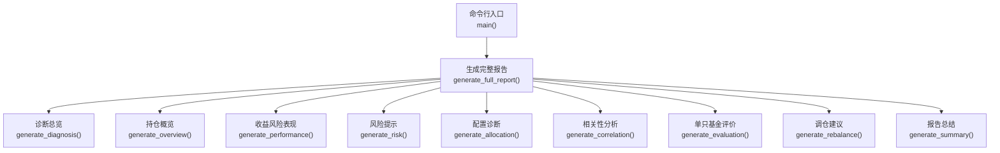
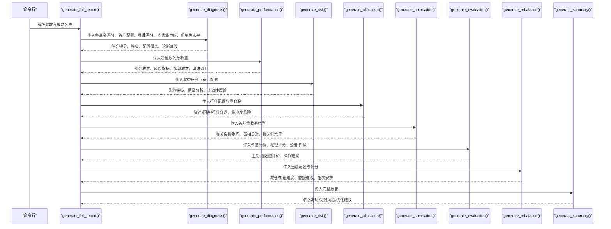
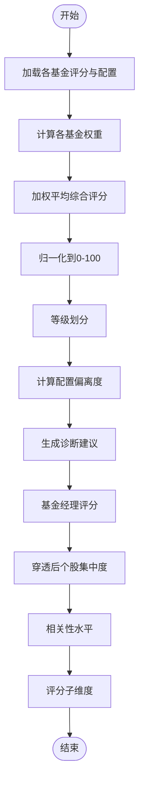
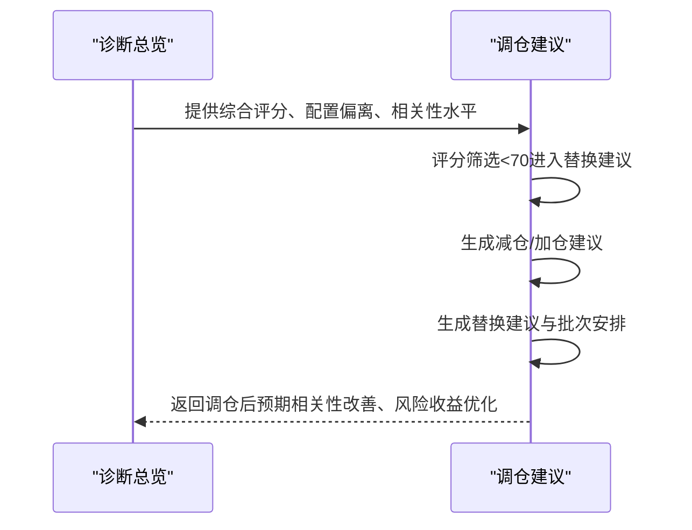
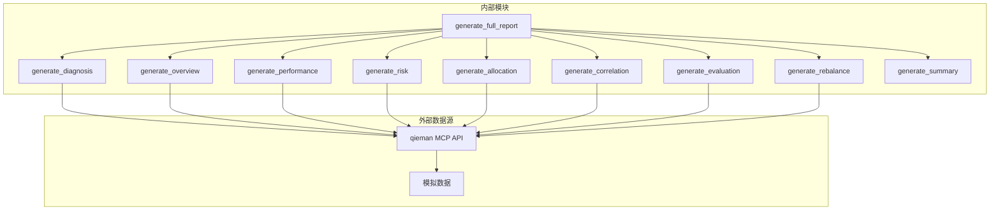

# 账户诊断总览

<cite>
**本文引用的文件**
- [SKILL.md](file://fund-account-diagnostic/SKILL.md)
- [output_format.md](file://fund-account-diagnostic/references/output_format.md)
- [diagnostic_report.py](file://fund-account-diagnostic/scripts/diagnostic_report.py)
- [generate_html_report.py](file://fund-account-diagnostic/scripts/generate_html_report.py)
</cite>

## 目录
1. [简介](#简介)
2. [项目结构](#项目结构)
3. [核心组件](#核心组件)
4. [架构总览](#架构总览)
5. [详细组件分析](#详细组件分析)
6. [依赖关系分析](#依赖关系分析)
7. [性能考量](#性能考量)
8. [故障排查指南](#故障排查指南)
9. [结论](#结论)
10. [附录](#附录)

## 简介
本文件聚焦“账户诊断总览”模块，系统阐述其如何整合各分析模块结果，生成综合评分与等级体系，并据此给出诊断建议与报告总结。文档覆盖综合评分计算方法（权重、归一化、等级划分）、诊断建议生成逻辑（保留/观察/替换等）、报告结构化输出（核心发现/关键风险/优化建议）以及与调仓建议模块的衔接关系与数据流。

## 项目结构
- 核心脚本
  - 诊断报告生成器：scripts/diagnostic_report.py
  - HTML可视化报告生成器：scripts/generate_html_report.py
- 参考规范
  - 报告输出格式定义：references/output_format.md
  - 技能说明与使用指南：SKILL.md

图表来源
- [generators.py](file://fund-account-diagnostic/scripts/generators.py)

章节来源
- [SKILL.md:12-385](file://fund-account-diagnostic/SKILL.md#L12-L385)
- [output_format.md:1-1104](file://fund-account-diagnostic/references/output_format.md#L1-L1104)

## 核心组件
- 诊断总览模块（diagnosis）
  - 输入：各基金的综合评分、收益/风险子评分、资产配置偏离、基金经理加权评分、穿透后个股集中度、相关性水平、评分子维度
  - 输出：综合得分、等级、配置偏离度、诊断建议、基金经理评分、穿透集中度、评分子维度
- 诊断建议生成
  - 基于配置偏离度与组合相关性水平动态生成建议
- 与调仓建议模块衔接
  - 诊断总览提供综合评分与偏离度，调仓建议模块据此生成减仓/加仓与替换建议

章节来源
- [output_format.md:359-472](file://fund-account-diagnostic/references/output_format.md#L359-L472)
- [generators.py](file://fund-account-diagnostic/scripts/generators.py)

## 架构总览
诊断总览模块位于报告生成流程的首位，先于其他模块，以便用户首先获得整体健康度与等级判断。随后按“总览→概览→收益→风险→配置→相关→评价→建议→总结”的顺序生成完整报告。

图表来源
- [generators.py](file://fund-account-diagnostic/scripts/generators.py)

## 详细组件分析

### 诊断总览模块（diagnosis）
- 综合评分计算
  - 权重来源：各基金在组合中的权重（基于市值）
  - 计算公式：加权平均综合评分，再归一化到0-100区间
  - 等级划分：A+（≥90）、A（80-89）、B+（70-79）、B（60-69）、C（<60）
- 配置偏离度
  - 当前配置与目标配置（可环境变量覆盖）对比，输出偏离度
  - 建议生成：基于最大偏离度阈值（如>15%、>5%）动态生成
- 经理评分
  - 提供基金经理加权评分（1/2/3年）与明细
- 穿透集中度
  - 基于穿透后个股权重，给出最高集中度、Top5与等级
- 相关性水平
  - 基于平均两两相关性，给出低/中/高等级
- 评分子维度
  - 创新高/择股/择时/规模四个维度的近1年评分

图表来源
- [generators.py](file://fund-account-diagnostic/scripts/generators.py)

章节来源
- [output_format.md:359-472](file://fund-account-diagnostic/references/output_format.md#L359-L472)
- [generators.py](file://fund-account-diagnostic/scripts/generators.py)

### 诊断建议生成逻辑
- 配置偏离度驱动
  - 偏离度>15%：建议再平衡调整
  - 偏离度>5%：建议择机调整
  - 否则：配置合理，保持现状
- 相关性水平补充
  - 若组合相关性为“高”，在建议中强调分散化重要性

章节来源
- [generators.py](file://fund-account-diagnostic/scripts/generators.py)

### 与调仓建议模块的衔接
- 数据来源
  - 诊断总览提供：综合评分、配置偏离、相关性水平、穿透集中度
  - 调仓建议模块在此基础上生成：减仓/加仓建议、替换建议、推荐基金、批次安排、调仓后预期
- 评分驱动的替换建议
  - 评分低于阈值（如<70）的基金进入替换建议清单
  - 评分<60进一步明确为“替换”，评分60-69为“减仓”

图表来源
- [generators.py](file://fund-account-diagnostic/scripts/generators.py)

章节来源
- [generators.py](file://fund-account-diagnostic/scripts/generators.py)

### 报告结构化输出（核心发现/关键风险/优化建议）
- 核心发现
  - 综合诊断得分与等级、持有基金数量、总市值/成本/盈亏、累计收益/最大回撤/夏普比率、平均两两相关性、投资年限
- 关键风险
  - 集中度预警、整体风险等级、市场风险（权益/海外/数量过多）、流动性风险（低权重基金较多）、最大回撤时间区间
- 优化建议
  - 配置偏离调整建议、相关性优化建议、替换/减仓建议、推荐基金、批次安排

章节来源
- [calculations.py](file://fund-account-diagnostic/scripts/calculations.py)

## 依赖关系分析
- 内部依赖
  - generate_full_report按顺序调用各模块，先生成诊断总览，再依次生成其他模块
  - 诊断总览依赖：各基金评分、资产配置、经理评分、穿透集中度、相关性水平、评分子维度
  - 调仓建议依赖：当前配置、评分、相关性分析
- 外部依赖
  - MCP API（qieman）：用于获取基金信息、净值、行业配置、重仓股、评价、指数净值、经理评分、评分子维度、公告/舆情
  - 降级机制：API不可用时使用模拟数据，报告头部标注数据来源

图表来源
- [generators.py](file://fund-account-diagnostic/scripts/generators.py)
- [SKILL.md:76-98](file://fund-account-diagnostic/SKILL.md#L76-L98)

章节来源
- [SKILL.md:76-98](file://fund-account-diagnostic/SKILL.md#L76-L98)
- [generators.py](file://fund-account-diagnostic/scripts/generators.py)

## 性能考量
- 计算复杂度
  - 综合评分：O(N)（N为基金数量）
  - 相关系数矩阵：O(N^2·T)（T为交易日长度）
  - 平均两两相关性：O(N^2)
- 降级策略
  - API不可用时，使用模拟净值序列与模拟数据，保证报告可用性
- 可选依赖
  - pandas/numPy/empyrical：提升向量化与高级指标计算效率，未安装时采用回退实现

## 故障排查指南
- API不可用
  - 现象：报告头部标注“API不可用”，使用模拟数据
  - 处理：检查环境变量与网络，或改用交易记录Excel解析
- Excel解析失败
  - 现象：列名不匹配、文件为空、无确认成功记录
  - 处理：核对列名映射、确认交易记录状态为“确认成功”
- 基金代码无效
  - 现象：跳过无效基金，继续处理其他基金
  - 处理：修正基金代码或更换数据源

章节来源
- [SKILL.md:82-98](file://fund-account-diagnostic/SKILL.md#L82-L98)
- [generators.py](file://fund-account-diagnostic/scripts/generators.py)

## 结论
诊断总览模块以“综合评分+等级”为核心，结合配置偏离度、相关性水平、穿透集中度与基金经理评分，形成可读性强、可操作的诊断建议。其与调仓建议模块紧密衔接，既提供宏观视角，又给出微观层面的替换与批次安排建议，最终通过报告总结将核心发现、关键风险与优化建议串联，帮助用户做出稳健的投资决策。

## 附录
- 报告输出格式要点
  - diagnosis：综合得分、等级、配置偏离、诊断建议、经理评分、穿透集中度、相关性水平、评分子维度
  - summary：核心发现、关键风险、优化建议、总体评价
- HTML可视化
  - generate_html_report.py将JSON报告转换为包含ECharts图表的HTML报告，便于直观呈现诊断总览与各模块结果

章节来源
- [output_format.md:359-472](file://fund-account-diagnostic/references/output_format.md#L359-L472)
- [generate_html_report.py:286-621](file://fund-account-diagnostic/scripts/generate_html_report.py#L286-L621)