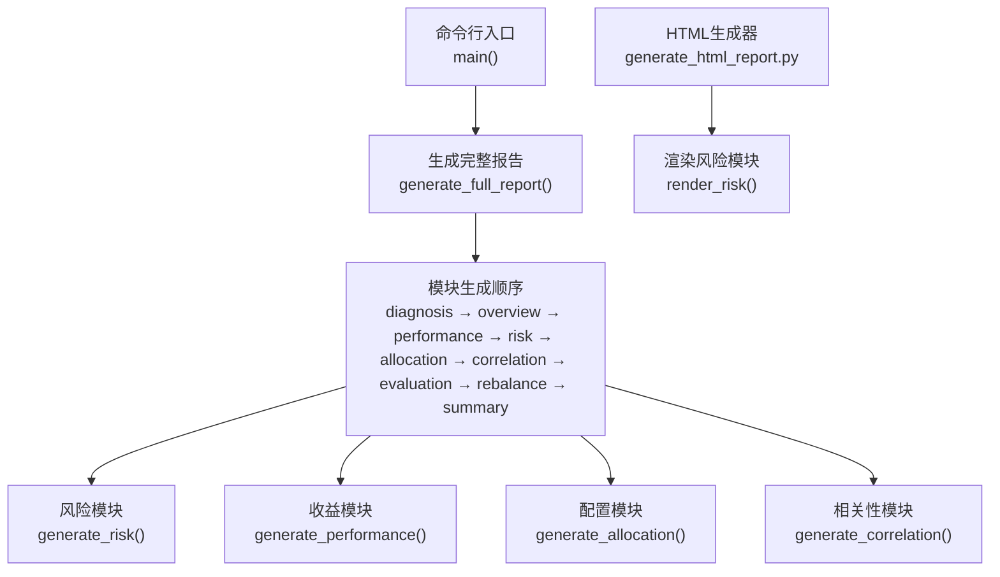
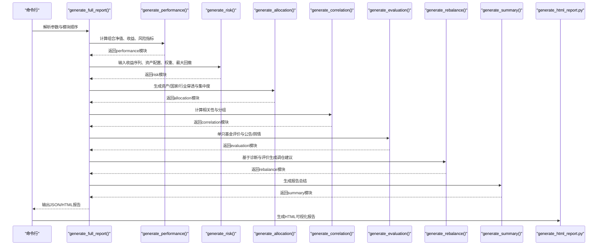
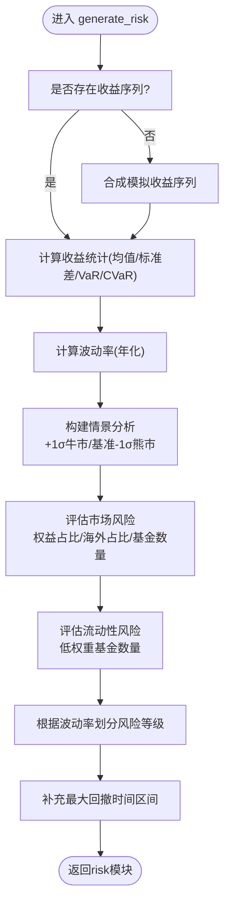
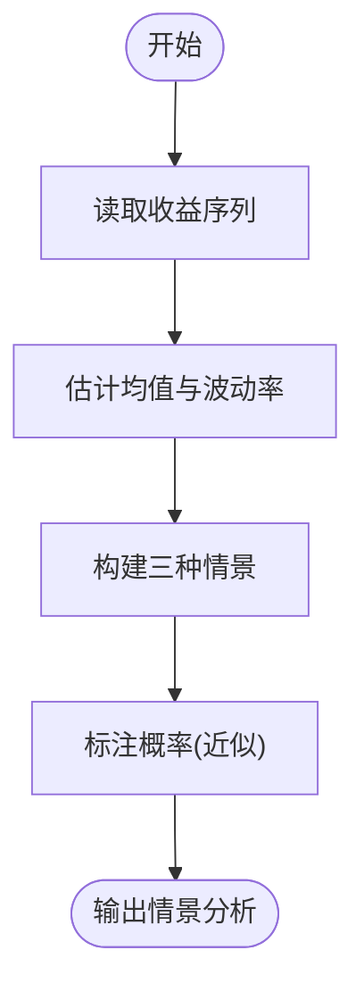
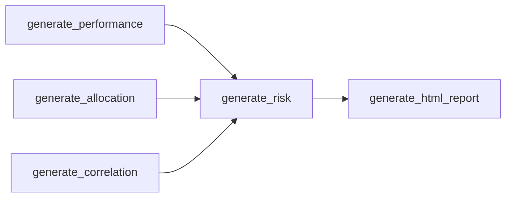

# 风险提示

<cite>
**本文引用的文件**
- [SKILL.md](file://fund-account-diagnostic/SKILL.md)
- [diagnostic_report.py](file://fund-account-diagnostic/scripts/diagnostic_report.py)
- [generate_html_report.py](file://fund-account-diagnostic/scripts/generate_html_report.py)
- [output_format.md](file://fund-account-diagnostic/references/output_format.md)
</cite>

## 目录
1. [简介](#简介)
2. [项目结构](#项目结构)
3. [核心组件](#核心组件)
4. [架构总览](#架构总览)
5. [详细组件分析](#详细组件分析)
6. [依赖关系分析](#依赖关系分析)
7. [性能考量](#性能考量)
8. [故障排查指南](#故障排查指南)
9. [结论](#结论)
10. [附录](#附录)

## 简介
本文件围绕“基金账户诊断系统”的风险提示功能，系统阐述其设计理念、风险识别方法、情景分析与压力测试、风险等级划分与预警机制、动态评估生成逻辑、风险应对策略与缓解措施，以及风险提示与投资决策的关系与时效性更新机制。文档面向不同技术背景的读者，既提供代码级细节，也给出可操作的实践建议。

## 项目结构
- 脚本入口与主流程：scripts/diagnostic_report.py
- HTML可视化报告生成：scripts/generate_html_report.py
- 报告输出格式规范：references/output_format.md
- 技能说明与使用指引：SKILL.md

**图表来源**
- [generators.py](file://fund-account-diagnostic/scripts/generators.py)
- [generators.py](file://fund-account-diagnostic/scripts/generators.py)
- [generate_html_report.py:1354-1370](file://fund-account-diagnostic/scripts/generate_html_report.py#L1354-L1370)

**章节来源**
- [SKILL.md:12-385](file://fund-account-diagnostic/SKILL.md#L12-L385)
- [generators.py](file://fund-account-diagnostic/scripts/generators.py)

## 核心组件
- 风险提示模块：负责基于组合收益序列与资产配置，生成风险等级、情景分析、市场风险与流动性风险提示，并补充最大回撤时间区间。
- 收益与风险指标：提供波动率、最大回撤、VaR/CVaR、夏普比率、索提诺比率、卡玛比率等指标，支撑风险评估与情景分析。
- 情景分析：以正态分布假设下的±1σ波动构建牛市、基准、熊市三种情景，估计预期收益与回撤概率。
- 风险等级划分：依据波动率阈值将风险等级划分为低/中/高三级。
- 风险应对与缓解：结合集中度、相关性、流动性与公告/舆情等维度，提出调仓建议与优化方向。

**章节来源**
- [generators.py](file://fund-account-diagnostic/scripts/generators.py)
- [generators.py](file://fund-account-diagnostic/scripts/generators.py)
- [generators.py](file://fund-account-diagnostic/scripts/generators.py)
- [output_format.md:143-274](file://fund-account-diagnostic/references/output_format.md#L143-L274)

## 架构总览
风险提示模块在完整报告生成流程中位于收益分析之后、配置与相关性之前，确保以稳健的收益序列与资产配置为基础，输出风险提示与建议。

**图表来源**
- [generators.py](file://fund-account-diagnostic/scripts/generators.py)
- [generate_html_report.py:1354-1370](file://fund-account-diagnostic/scripts/generate_html_report.py#L1354-L1370)

## 详细组件分析

### 风险提示模块设计与实现
- 输入
  - 组合收益序列（由收益模块提供）
  - 资产配置（来自配置模块）
  - 当前权重（用于流动性风险识别）
  - 最大回撤详情（用于补充最大回撤时间区间）
- 输出
  - 风险等级（低/中/高）
  - 情景分析（牛市/基准/熊市）
  - 市场风险提示
  - 流动性风险提示
  - 最大回撤时间区间

**图表来源**
- [generators.py](file://fund-account-diagnostic/scripts/generators.py)

**章节来源**
- [generators.py](file://fund-account-diagnostic/scripts/generators.py)
- [output_format.md:143-274](file://fund-account-diagnostic/references/output_format.md#L143-L274)

### 风险识别与评估方法
- 波动率与回撤
  - 年化波动率：基于日收益序列的标准差乘以√252
  - 最大回撤：净值序列的峰值到谷值的最大跌幅及其起止日期
- 风险指标
  - VaR(95%)与CVaR(95%)：基于分位数与尾部均值
  - 夏普比率、索提诺比率、卡玛比率等（依赖empyrical库）
- 情景分析
  - 正态分布假设下，以均值±1σ构建牛市/基准/熊市情景，估计预期收益与回撤概率
- 集中度与相关性
  - 穿透后个股集中度（Top5与等级）
  - 平均两两相关系数与高相关对，辅助判断分散化效果

**章节来源**
- [calculations.py](file://fund-account-diagnostic/scripts/calculations.py)
- [generators.py](file://fund-account-diagnostic/scripts/generators.py)
- [calculations.py](file://fund-account-diagnostic/scripts/calculations.py)
- [constants.py](file://fund-account-diagnostic/scripts/constants.py)

### 情景分析与压力测试
- 基于收益序列的统计特征，构建三种典型市场情景：
  - 牛市：均值+1σ，预期收益较高，回撤较小
  - 基准：均值，概率最高（约68%）
  - 熊市：均值-1σ，预期收益较低，回撤较大
- 概率说明：基于正态分布的1σ近似概率（约16%/68%/16%）

**图表来源**
- [generators.py](file://fund-account-diagnostic/scripts/generators.py)

**章节来源**
- [generators.py](file://fund-account-diagnostic/scripts/generators.py)

### 风险等级划分与预警机制
- 风险等级
  - 低：波动率 ≤ 15%
  - 中：15% < 波动率 ≤ 25%
  - 高：波动率 > 25%
- 预警提示
  - 市场风险：权益占比过高、海外资产占比过高、基金数量过多
  - 流动性风险：低权重基金数量较多，影响组合灵活性
- 最大回撤时间区间
  - 若收益模块提供最大回撤起止日期，则在风险模块补充该区间

**章节来源**
- [generators.py](file://fund-account-diagnostic/scripts/generators.py)
- [generators.py](file://fund-account-diagnostic/scripts/generators.py)
- [generators.py](file://fund-account-diagnostic/scripts/generators.py)

### 风险提示生成逻辑与动态评估
- 动态评估
  - 以组合净值序列与权重为基础，计算收益统计与波动率
  - 若API不可用，采用模拟净值序列与收益序列进行评估
- 生成流程
  - 从收益模块获取组合净值与收益序列
  - 计算波动率与情景分析
  - 结合资产配置与权重，生成市场与流动性风险提示
  - 补充最大回撤时间区间

**章节来源**
- [generators.py](file://fund-account-diagnostic/scripts/generators.py)
- [generators.py](file://fund-account-diagnostic/scripts/generators.py)

### 风险应对策略与缓解措施
- 风险对冲
  - 降低权益占比，引入固收与现金类资产，平滑波动
  - 适度降低海外资产占比，减少汇率风险
- 资产配置调整
  - 通过调仓建议模块识别超配/低配资产，逐步回归目标配置
  - 基于相关性分析，剔除高相关对中的重复暴露
- 头寸控制
  - 控制单只基金权重，避免集中度风险
  - 精简组合规模，减少管理复杂度与流动性摩擦
- 公告与舆情
  - 关注负面公告与基金经理变动，必要时替换或部分替换

**章节来源**
- [generators.py](file://fund-account-diagnostic/scripts/generators.py)
- [generators.py](file://fund-account-diagnostic/scripts/generators.py)
- [output_format.md:754-750](file://fund-account-diagnostic/references/output_format.md#L754-L750)

### 风险提示与投资决策的关系
- 风险提示服务于“收益-风险”平衡：在不同风险等级下，建议调整资产配置与头寸，以匹配个人风险承受能力
- 情景分析帮助理解极端市场条件下的潜在损失，辅助制定止损与再平衡策略
- 结合基金经理评分、公告/舆情与调仓建议，形成更全面的投资决策依据

**章节来源**
- [generators.py](file://fund-account-diagnostic/scripts/generators.py)
- [output_format.md:654-750](file://fund-account-diagnostic/references/output_format.md#L654-L750)

### 风险提示的时效性与更新机制
- 时效性
  - 报告头部包含生成时间与分析基准期（如近252个交易日）
  - 若API不可用，报告头部标注数据来源为模拟数据，提醒用户注意差异
- 更新机制
  - 基于新的交易记录或净值数据重新运行诊断脚本
  - HTML报告可由JSON报告二次生成，便于快速迭代

**章节来源**
- [SKILL.md:28-31](file://fund-account-diagnostic/SKILL.md#L28-L31)
- [SKILL.md:82-88](file://fund-account-diagnostic/SKILL.md#L82-L88)
- [generators.py](file://fund-account-diagnostic/scripts/generators.py)

## 依赖关系分析
- 内部依赖
  - generate_risk依赖收益模块提供的组合净值与收益序列
  - generate_risk依赖配置模块提供的资产配置与穿透集中度
  - generate_risk依赖收益模块提供的最大回撤详情
- 外部依赖
  - empyrical库用于高级风险指标（索提诺、卡玛、下行风险、尾部比率、Alpha/Beta）
  - pandas/numpy用于向量化计算与高效统计

**图表来源**
- [generators.py](file://fund-account-diagnostic/scripts/generators.py)
- [generate_html_report.py:1354-1370](file://fund-account-diagnostic/scripts/generate_html_report.py#L1354-L1370)

**章节来源**
- [generators.py](file://fund-account-diagnostic/scripts/generators.py)

## 性能考量
- 向量化计算：优先使用pandas/numpy进行统计与运算，显著提升大规模收益序列的处理效率
- 降级策略：当外部API不可用时，采用模拟数据生成，保证报告可用性
- 指标选择：在未安装empyrical库时，使用基础统计指标，避免阻塞流程

[本节为通用指导，不涉及具体文件分析]

## 故障排查指南
- API不可用
  - 现象：报告头部标注API不可用，数据来源为模拟数据
  - 处理：确认COZE_QIEMAN_API_{SKILL_ID}环境变量配置；若仍失败，系统自动降级
- Excel解析失败
  - 现象：列名不匹配或文件为空
  - 处理：检查列名映射与数据有效性；必要时使用备用列名
- 基金代码无效
  - 现象：跳过该基金并在报告中标注
  - 处理：修正基金代码或更换数据源

**章节来源**
- [SKILL.md:90-98](file://fund-account-diagnostic/SKILL.md#L90-L98)
- [generators.py](file://fund-account-diagnostic/scripts/generators.py)

## 结论
风险提示模块以稳健的收益序列与资产配置为基础，结合波动率、最大回撤、情景分析与集中度/相关性等维度，形成低/中/高三级风险等级与相应的市场与流动性风险提示。通过与调仓建议、基金经理评分与公告/舆情相结合，帮助用户在不同风险等级下做出更审慎的投资决策。系统具备良好的降级与可视化能力，确保在不同数据条件下仍能生成高质量的诊断报告。

[本节为总结性内容，不涉及具体文件分析]

## 附录
- 报告输出格式与字段定义详见references/output_format.md
- HTML可视化报告由generate_html_report.py生成，包含风险模块的可视化展示

**章节来源**
- [output_format.md:1-800](file://fund-account-diagnostic/references/output_format.md#L1-L800)
- [generate_html_report.py:1354-1370](file://fund-account-diagnostic/scripts/generate_html_report.py#L1354-L1370)