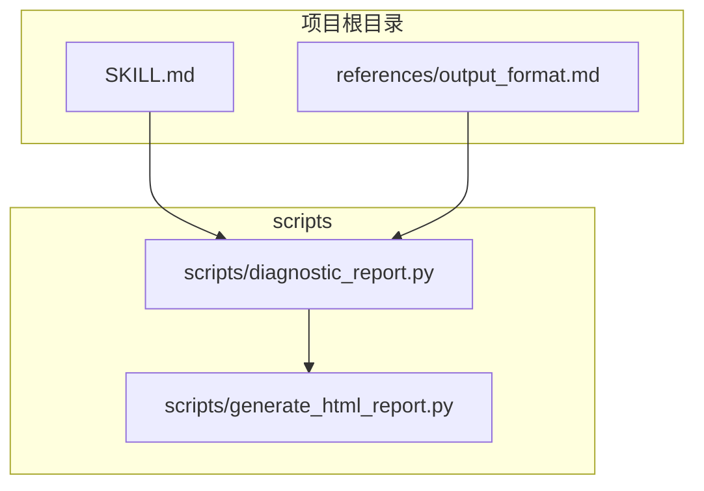
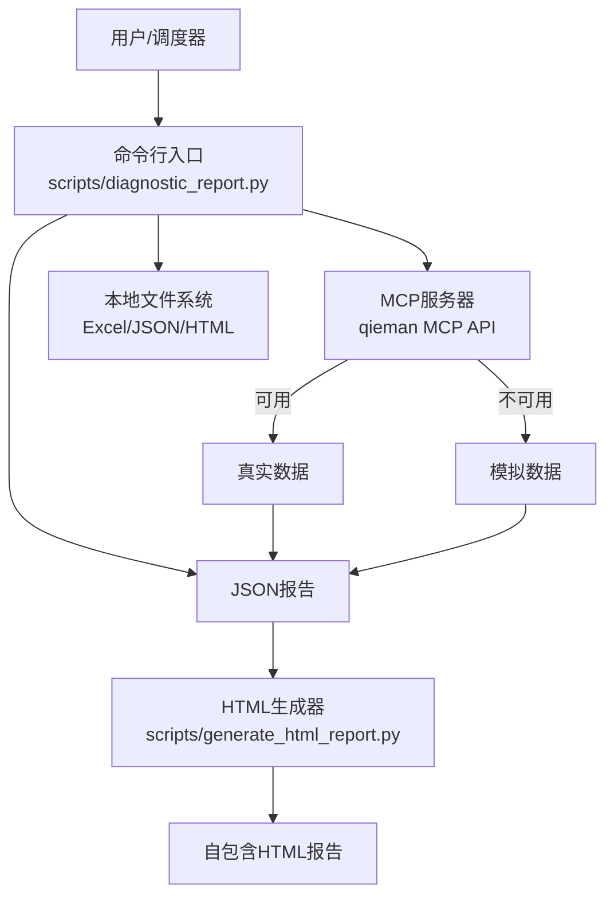
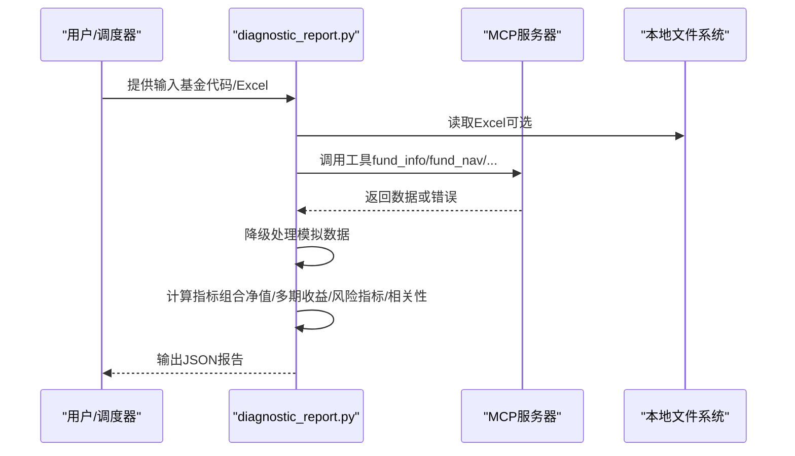
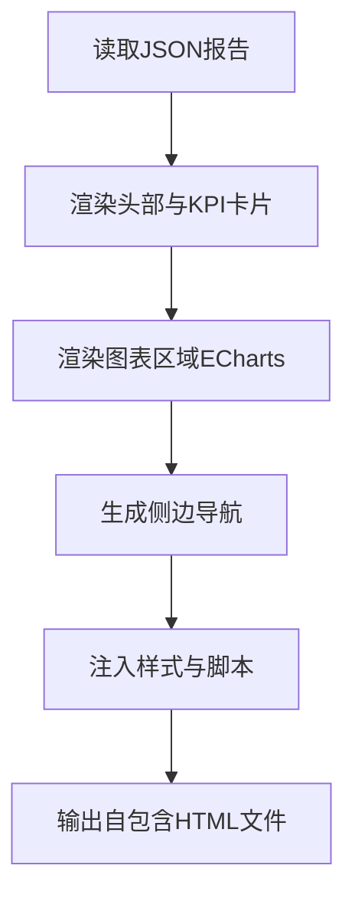
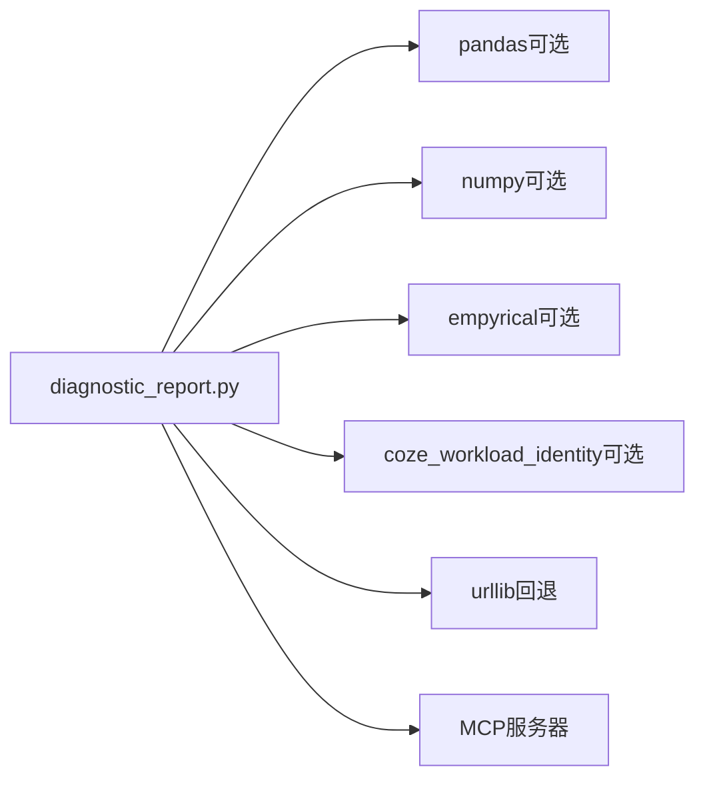

# 部署与运维

<cite>
**本文引用的文件**
- [SKILL.md](file://fund-account-diagnostic/SKILL.md)
- [output_format.md](file://fund-account-diagnostic/references/output_format.md)
- [diagnostic_report.py](file://fund-account-diagnostic/scripts/diagnostic_report.py)
- [generate_html_report.py](file://fund-account-diagnostic/scripts/generate_html_report.py)
</cite>

## 目录
1. [简介](#简介)
2. [项目结构](#项目结构)
3. [核心组件](#核心组件)
4. [架构总览](#架构总览)
5. [详细组件分析](#详细组件分析)
6. [依赖分析](#依赖分析)
7. [性能考虑](#性能考虑)
8. [故障排查指南](#故障排查指南)
9. [结论](#结论)
10. [附录](#附录)

## 简介
本项目为“基金账户诊断技能”的部署与运维文档，面向生产环境的部署配置、MCP数据源配置与监控、日志管理、性能监控与优化、备份与恢复、常见运维问题排查、自动化部署与CI/CD配置示例以及安全配置与访问控制建议。文档基于仓库中的技能定义、脚本实现与输出格式规范进行整理，帮助运维人员与开发人员快速落地与稳定运行该诊断系统。

## 项目结构
项目采用脚本驱动的命令行工具形式，核心文件位于 scripts 目录，参考输出格式位于 references 目录，技能元信息位于根目录 SKILL.md。

**图表来源**
- [SKILL.md](file://fund-account-diagnostic/SKILL.md)
- [output_format.md](file://fund-account-diagnostic/references/output_format.md)
- [diagnostic_report.py](file://fund-account-diagnostic/scripts/diagnostic_report.py)
- [generate_html_report.py](file://fund-account-diagnostic/scripts/generate_html_report.py)

**章节来源**
- [SKILL.md](file://fund-account-diagnostic/SKILL.md)
- [output_format.md](file://fund-account-diagnostic/references/output_format.md)
- [diagnostic_report.py](file://fund-account-diagnostic/scripts/diagnostic_report.py)
- [generate_html_report.py](file://fund-account-diagnostic/scripts/generate_html_report.py)

## 核心组件
- 命令行入口与诊断主流程：scripts/diagnostic_report.py
- HTML可视化报告生成：scripts/generate_html_report.py
- 报告输出格式规范：references/output_format.md
- 技能元信息与使用说明：SKILL.md

关键职责划分：
- 诊断主流程负责解析输入（基金代码或交易记录Excel）、调用MCP数据源、计算指标、生成JSON报告与摘要。
- HTML生成器负责将JSON报告渲染为自包含HTML文件，内置ECharts可视化图表。
- 输出格式规范定义了报告结构、字段与层级，便于前端或下游系统消费。

**章节来源**
- [diagnostic_report.py](file://fund-account-diagnostic/scripts/diagnostic_report.py)
- [generate_html_report.py](file://fund-account-diagnostic/scripts/generate_html_report.py)
- [output_format.md](file://fund-account-diagnostic/references/output_format.md)
- [SKILL.md](file://fund-account-diagnostic/SKILL.md)

## 架构总览
系统采用“本地脚本 + 外部MCP服务”的架构。本地脚本负责数据解析、指标计算与报告生成；MCP服务提供实时数据（净值、行业配置、基金经理评分等）。若MCP不可用，系统自动降级为模拟数据模式，保证可用性。

**图表来源**
- [diagnostic_report.py](file://fund-account-diagnostic/scripts/diagnostic_report.py)
- [generate_html_report.py](file://fund-account-diagnostic/scripts/generate_html_report.py)

## 详细组件分析

### 诊断主流程（scripts/diagnostic_report.py）
- 输入解析：支持基金代码列表与交易记录Excel两种输入方式；Excel解析具备列名映射与模糊匹配能力。
- MCP数据源：封装MCP请求与工具调用，支持 fund_info、fund_nav、fund_industry_allocation、fund_holdings、fund_evaluate、index_nav、fund_manager_rating、fund_subscores、fund_announcement 等工具。
- 降级策略：当MCP不可用时，自动切换为模拟数据，报告头包含 api_available 标识与数据来源说明。
- 指标计算：组合净值、多期收益、最大回撤、夏普比率、相关性、集中度等，优先使用pandas/numpy/empyrical加速，回退到纯Python实现。
- 报告生成：输出标准JSON结构，包含 diagnosis、overview、performance、risk、allocation、correlation、evaluation、rebalance、summary 等模块。

**图表来源**
- [diagnostic_report.py](file://fund-account-diagnostic/scripts/diagnostic_report.py)

**章节来源**
- [diagnostic_report.py](file://fund-account-diagnostic/scripts/diagnostic_report.py)

### HTML可视化报告生成（scripts/generate_html_report.py）
- 输入：JSON诊断报告文件
- 输出：自包含HTML文件，内嵌ECharts图表，无需额外依赖（仅需网络加载ECharts CDN）
- 特性：品牌色#0052D9，红涨绿跌，响应式布局，侧边导航，交互式图表（饼图、柱状图、仪表盘、热力图、矩形树图等）

**图表来源**
- [generate_html_report.py](file://fund-account-diagnostic/scripts/generate_html_report.py)

**章节来源**
- [generate_html_report.py](file://fund-account-diagnostic/scripts/generate_html_report.py)

### 报告输出格式（references/output_format.md）
- 报告结构：report_header + 各分析模块 + report_footer
- 模块字段：overview、performance、risk、allocation、correlation、evaluation、rebalance、summary 等
- 关键字段：api_available、mcp_url、tool_version、analysis_period 等

**章节来源**
- [output_format.md](file://fund-account-diagnostic/references/output_format.md)

## 依赖分析
- Python运行时：Python 3.8+（技能定义）
- 可选依赖：pandas、numpy、empyrical（用于向量化与金融指标计算）
- HTTP客户端：coze_workload_identity（优先）或标准库urllib（回退）
- MCP服务器：qieman MCP API（https://stargate.yingmi.com/mcp/v2），认证头 x-api-key

**图表来源**
- [diagnostic_report.py](file://fund-account-diagnostic/scripts/diagnostic_report.py)

**章节来源**
- [diagnostic_report.py](file://fund-account-diagnostic/scripts/diagnostic_report.py)
- [SKILL.md](file://fund-account-diagnostic/SKILL.md)

## 性能考虑
- 向量化加速：优先使用pandas/numpy进行序列计算（净值归一化、收益率、协方差、相关性、波动率等），empyrical用于Sharpe等指标。
- 内存与CPU：多期收益与相关性矩阵计算可能产生较大中间数组，建议在资源充足的环境中运行；对超大规模组合，可考虑分批处理或限制分析窗口。
- I/O：Excel解析依赖pandas，建议使用SSD与合理并发；HTML生成器为纯Python，I/O开销较小。
- 网络延迟：MCP请求默认超时30秒，建议在内网或边缘节点部署以降低延迟；必要时可增加重试与熔断策略。

[本节为通用性能建议，不直接分析具体文件]

## 故障排查指南
- MCP不可用
  - 现象：报告头 api_available 为false，数据来源标注为模拟数据
  - 处理：检查 x-api-key 环境变量、MCP可达性与限流策略
- Excel解析失败
  - 现象：报错提示列名不匹配或文件为空
  - 处理：核对列名映射、确认Excel Sheet与数据有效性
- 基金代码无效
  - 现象：跳过该基金并在报告中标注
  - 处理：修正基金代码或删除无效条目
- 认证失败
  - 现象：API返回错误或降级
  - 处理：检查 COZE_QIEMAN_API_{SKILL_ID} 环境变量

**章节来源**
- [diagnostic_report.py](file://fund-account-diagnostic/scripts/diagnostic_report.py)
- [SKILL.md](file://fund-account-diagnostic/SKILL.md)

## 结论
本项目通过清晰的脚本化架构与完善的降级策略，实现了在MCP可用与不可用场景下的稳定运行。结合标准输出格式与HTML可视化能力，既满足技术团队的自动化集成需求，也便于业务用户阅读与传播。建议在生产环境中完善MCP监控、日志与备份策略，并制定CI/CD流水线以保障发布质量与可追溯性。

[本节为总结性内容，不直接分析具体文件]

## 附录

### 生产环境部署配置清单
- 系统要求
  - Python 3.8+
  - 可选：pandas、numpy、empyrical
- 依赖管理
  - 使用虚拟环境隔离依赖
  - 在容器镜像中预装依赖，或通过requirements.txt/conda/yum等包管理器安装
- 环境变量
  - COZE_QIEMAN_API_{SKILL_ID}：MCP认证密钥
  - FUND_DIAG_TARGET_EQUITY/FUND_DIAG_TARGET_FIXED_INCOME/FUND_DIAG_TARGET_CASH：目标配置比例
  - FUND_DIAG_BENCHMARK_EQUITY/FUND_DIAG_BENCHMARK_FIXED_INCOME：基准配置比例
  - FUND_DIAG_ANALYSIS_DAYS：分析基准期（交易日）
- 数据源
  - MCP服务器：https://stargate.yingmi.com/mcp/v2
  - 认证头：x-api-key
  - 工具：fund_info、fund_nav、fund_industry_allocation、fund_holdings、fund_evaluate、index_nav、fund_manager_rating、fund_subscores、fund_announcement

**章节来源**
- [SKILL.md](file://fund-account-diagnostic/SKILL.md)
- [diagnostic_report.py](file://fund-account-diagnostic/scripts/diagnostic_report.py)

### MCP数据源配置与监控
- 凭证管理
  - 通过环境变量注入 x-api-key，避免硬编码
  - 建议使用密钥管理服务（如KMS/Vault）进行轮换与审计
- 连接池与超时
  - 默认HTTP超时30秒；建议在容器/服务层增加连接池与重试
- 故障转移
  - 代码已内置降级为模拟数据；建议在监控中告警MCP不可用并记录降级原因
- 监控指标
  - 请求成功率、P95/P99延迟、错误码分布、降级触发次数

**章节来源**
- [diagnostic_report.py](file://fund-account-diagnostic/scripts/diagnostic_report.py)
- [SKILL.md](file://fund-account-diagnostic/SKILL.md)

### 日志管理最佳实践
- 日志级别
  - 严重：认证失败、MCP不可用、Excel解析异常
  - 警告：降级模式、部分数据不可用
  - 信息：报告生成完成、模块计算进度
- 输出格式
  - JSON结构化日志，包含时间戳、级别、模块、消息、上下文字段
- 存储策略
  - 本地落盘 + 远程聚合（ELK/Cloud Logging）
  - 按天滚动、压缩与保留策略（如30天）

[本节为通用实践建议，不直接分析具体文件]

### 性能监控与优化建议
- 指标采集
  - CPU使用率、内存占用、GC频率（如启用empyrical）
  - MCP请求延迟、重试次数、降级次数
- 优化方向
  - 启用pandas/numpy加速；对大矩阵计算分块处理
  - 缓存热点数据（如指数序列、基金经理评分）
  - 限制同时分析的基金数量，控制内存峰值

[本节为通用性能建议，不直接分析具体文件]

### 备份与恢复策略
- 数据备份
  - JSON报告与HTML报告定期归档
  - 交易记录Excel版本控制（Git LFS或对象存储）
- 恢复演练
  - 定期验证报告生成与HTML渲染一致性
  - 验证降级模式下的模拟数据可用性

[本节为通用策略建议，不直接分析具体文件]

### 常见运维问题排查
- 无法生成HTML
  - 检查JSON报告完整性与字段一致性
  - 确认ECharts CDN可达
- 报告指标异常
  - 核对MCP返回数据与降级标记
  - 检查Excel列名映射与数据清洗逻辑
- 性能瓶颈
  - 分析pandas/numpy使用情况，必要时限制分析窗口

**章节来源**
- [generate_html_report.py](file://fund-account-diagnostic/scripts/generate_html_report.py)
- [diagnostic_report.py](file://fund-account-diagnostic/scripts/diagnostic_report.py)

### 自动化部署与CI/CD配置示例
- 构建阶段
  - 安装Python与依赖（pandas、numpy、empyrical）
  - 运行单元测试与静态检查
- 测试阶段
  - 单元测试：覆盖核心计算函数（收益率、相关性、最大回撤）
  - 集成测试：MCP降级路径与HTML生成
- 发布阶段
  - 容器镜像构建（Alpine/Debian）
  - 镜像推送与版本标签
- 运行阶段
  - 通过环境变量注入MCP密钥
  - 定时任务或事件触发执行诊断脚本

[本节为通用CI/CD建议，不直接分析具体文件]

### 安全配置与访问控制
- 密钥管理
  - 使用密钥管理服务轮换 x-api-key
  - 限制密钥权限与可见范围
- 网络隔离
  - MCP访问走内网或专用VPC
  - 限制对外出站访问
- 访问控制
  - 仅授权服务账号访问MCP
  - 对外暴露的HTML报告需注意敏感信息脱敏

[本节为通用安全建议，不直接分析具体文件]