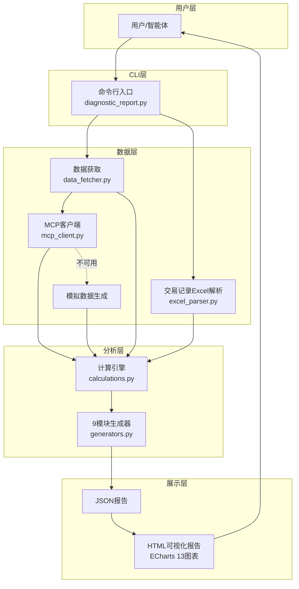

# 项目概述

<cite>
**本文档引用的文件**
- [SKILL.md](file://fund-account-diagnostic/SKILL.md)
- [diagnostic_report.py](file://fund-account-diagnostic/scripts/diagnostic_report.py)
- [generators.py](file://fund-account-diagnostic/scripts/generators.py)
- [calculations.py](file://fund-account-diagnostic/scripts/calculations.py)
- [data_fetcher.py](file://fund-account-diagnostic/scripts/data_fetcher.py)
- [excel_parser.py](file://fund-account-diagnostic/scripts/excel_parser.py)
- [generate_html_report.py](file://fund-account-diagnostic/scripts/generate_html_report.py)
- [output_format.md](file://fund-account-diagnostic/references/output_format.md)
- [indicator_spec.md](file://fund-account-diagnostic/references/indicator_spec.md)
</cite>

## 目录
1. [项目简介](#项目简介)
2. [项目结构](#项目结构)
3. [核心组件](#核心组件)
4. [架构总览](#架构总览)
5. [分析模块详情](#分析模块详情)
6. [技术栈](#技术栈)
7. [数据源](#数据源)

## 项目简介

本项目是一个面向中国市场的基金账户综合诊断分析技能（v1.5.0），旨在帮助投资者全面评估个人或家庭的基金投资组合健康状况。项目通过CLI工具与MCP协议集成，结合多模块分析框架，提供从持仓概览、收益风险表现、配置诊断、相关性分析到调仓建议与风险提示的全链路诊断能力。

- **核心价值**：将复杂的金融数据分析转化为直观、可执行的诊断报告，辅助用户做出更明智的投资决策。
- **目标用户**：个人投资者、理财顾问、智能体应用开发者。
- **定位与作用**：在金融投资组合分析领域，提供标准化、可扩展、可可视化的诊断工具，支持从交易记录Excel与基金代码两种输入方式生成报告。

## 项目结构

项目采用"脚本驱动 + 模块化分析"的组织方式，核心文件位于 `scripts/` 目录（8个Python模块+1个HTML生成器），参考文档位于 `references/` 目录。

```
fund-account-diagnostic/
├── scripts/
│   ├── diagnostic_report.py      # 主入口CLI (341行)
│   ├── generators.py             # 9模块报告生成器 (1573行)
│   ├── calculations.py           # 纯计算函数 (790行)
│   ├── data_fetcher.py           # MCP数据获取+降级 (373行)
│   ├── excel_parser.py           # Excel交易解析 (418行)
│   ├── generate_html_report.py   # HTML可视化 (1902行)
│   ├── constants.py              # 常量/配置 (88行)
│   ├── utils.py                  # 工具函数 (78行)
│   ├── mcp_client.py             # MCP协议客户端 (104行)
│   └── tests/
│       ├── test_calculations.py  # 计算引擎测试 (563行)
│       └── test_utils.py         # 工具函数测试 (207行)
├── references/
│   ├── output_format.md          # JSON输出格式 (1104行)
│   └── indicator_spec.md         # 指标规格说明书 (567行)
├── SKILL.md                      # 技能说明 (385行)
├── requirements.txt              # 依赖声明
└── qa_check.py                   # QA检查脚本
```

## 核心组件

### 8+1模块架构
| 模块 | 文件 | 职责 |
|------|------|------|
| 配置层 | constants.py | 全局常量、可选依赖检测、环境变量 |
| 协议层 | mcp_client.py | MCP JSON-RPC 2.0客户端 |
| 数据获取 | data_fetcher.py | 9个MCP数据获取函数+模拟降级 |
| 数据解析 | excel_parser.py | 交易记录Excel解析 |
| 计算引擎 | calculations.py | 13个纯计算函数 |
| 报告生成 | generators.py | 9个分析模块生成器 |
| 主入口 | diagnostic_report.py | CLI参数解析+报告编排 |
| HTML可视化 | generate_html_report.py | JSON→HTML转换 |
| 工具函数 | utils.py | 金额解析/业务类型/列名查找 |

## 架构总览

项目采用"CLI入口 → 数据获取 → 多模块分析 → 报告生成"的分层架构，支持MCP协议与本地Excel解析两种数据源，具备API不可用时的模拟数据降级能力。



## 分析模块详情

项目提供9大分析模块，按用户阅读习惯排列：

| 模块 | 说明 | 关键指标 |
|------|------|----------|
| diagnosis | 账户诊断总览 | 综合得分、等级、配置偏离度、经理评分、穿透集中度、子维度 |
| overview | 持仓概览 | 基金数量、总市值、总成本、盈亏、交易统计、集中度预警、已清仓基金 |
| performance | 收益风险表现 | 累计收益、CAGR、波动率、最大回撤、夏普比率、多期收益(1M/3M/6M/1Y/2Y/3Y)、基准对比 |
| risk | 风险提示 | 情景分析(牛市/基准/熊市)、市场风险、流动性风险、最大回撤时间区间 |
| allocation | 组合配置诊断 | 大类资产、国家地区、行业穿透(Top15)、重仓股(Top15)、基金公司穿透、QDII行业穿透 |
| correlation | 相关性分析 | 相关系数矩阵、高相关对、分组分析、平均两两相关性、相关性水平 |
| evaluation | 单只基金评价 | 主动型/指数型双轨评价、子维度、经理评分、公告舆情、操作建议 |
| rebalance | 调仓建议 | 超配/低配资产、加减仓建议、替换建议、推荐基金、批次安排、调仓后预期 |
| summary | 报告总结 | 核心发现、关键风险、优化建议、总体评价 |

## 技术栈

- **语言**：Python 3.8+
- **数据处理**：pandas>=1.3.0、numpy>=1.20.0（可选，缺失时自动降级）
- **金融指标**：empyrical>=0.5.5（可选，提供Sortino/Calmar/Alpha/Beta等高级指标）
- **HTTP客户端**：coze_workload_identity（可选）或 urllib标准库
- **可视化**：ECharts 5（CDN引入）
- **测试**：pytest

## 数据源

### qieman MCP服务器
- URL：https://stargate.yingmi.com/mcp/v2
- 协议：JSON-RPC 2.0
- 认证：x-api-key header

**可用工具（9种）**：

| 工具名称 | 说明 |
|----------|------|
| fund_info | 基金基础信息（名称/类型/净值/经理/公司） |
| fund_nav | 基金净值序列数据 |
| fund_industry_allocation | 行业配置数据 |
| fund_holdings | 重仓股数据 |
| fund_evaluate | 基金评价（主动型/指数型） |
| index_nav | 指数净值数据 |
| fund_manager_rating | 基金经理评分（1Y/2Y/3Y） |
| fund_subscores | 基金评分子维度（创新高/择股/择时/规模） |
| fund_announcement | 基金公告/舆情 |

### 降级机制
当MCP API不可用时，系统自动切换为基于基金代码哈希的确定性模拟数据，保证报告可正常生成且结果可重复。
